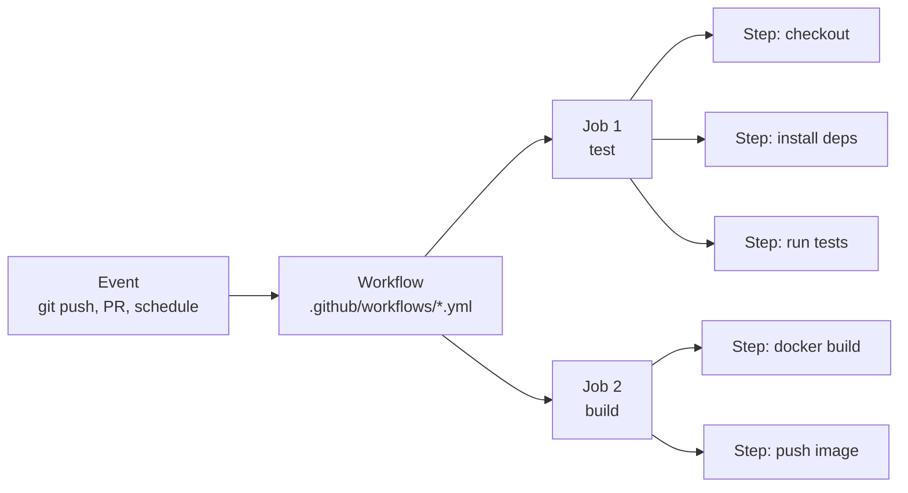

# GitHub Actions — Fundamentals

## The Factory Assembly Line Analogy

GitHub Actions is like an automated factory assembly line triggered by events. When a car part arrives (code push), the assembly line automatically starts: first it's checked for defects (linting), then tested for strength (unit tests), then quality-certified (integration tests), and finally packaged for shipping (build artifact). Each station on the line is a "step," each section is a "job," and the whole assembly plan is a "workflow." The factory runs automatically — no engineer has to manually start the line every time a part arrives.

---

## Core Concepts



- **Workflow**: YAML file in `.github/workflows/`
- **Event**: What triggers it (`push`, `pull_request`, `schedule`, `workflow_dispatch`)
- **Job**: A set of steps that run on one runner (VM)
- **Step**: A single command or reusable Action
- **Runner**: The VM that executes jobs (`ubuntu-latest`, `macos-latest`, `windows-latest`)

---

## Your First DE Workflow

```yaml
# .github/workflows/ci.yml
name: Data Pipeline CI

on:
  push:
    branches: [main]
  pull_request:
    branches: [main]

jobs:
  test:
    runs-on: ubuntu-latest
    
    steps:
      - name: Checkout code
        uses: actions/checkout@v4

      - name: Set up Python
        uses: actions/setup-python@v5
        with:
          python-version: "3.11"

      - name: Install dependencies
        run: |
          pip install -r requirements.txt
          pip install -r requirements-dev.txt

      - name: Run linter
        run: flake8 pipelines/ tests/

      - name: Run unit tests
        run: pytest tests/ -v --tb=short

      - name: Run dbt compile
        run: dbt compile --profiles-dir profiles/
        env:
          DBT_PROFILES_DIR: profiles/
```

---

## Triggers (Events)

```yaml
on:
  # On push to main or develop
  push:
    branches: [main, develop]
    paths: ["pipelines/**", "dbt/**"]  # only if these paths changed

  # On any PR targeting main
  pull_request:
    branches: [main]

  # Scheduled (cron) — run nightly
  schedule:
    - cron: "0 2 * * *"  # 2 AM UTC daily

  # Manual trigger
  workflow_dispatch:
    inputs:
      environment:
        description: "Target environment"
        required: true
        default: "staging"
```

---

## Secrets and Environment Variables

```yaml
jobs:
  deploy:
    runs-on: ubuntu-latest
    env:
      # Public config — fine in workflow file
      DBT_PROJECT_DIR: /home/runner/work/repo/dbt
      ENVIRONMENT: production

    steps:
      - name: Run pipeline
        run: python pipelines/revenue.py
        env:
          # Secrets from GitHub → Settings → Secrets
          DB_PASSWORD: ${{ secrets.DB_PASSWORD }}
          AWS_ACCESS_KEY_ID: ${{ secrets.AWS_ACCESS_KEY_ID }}
          AWS_SECRET_ACCESS_KEY: ${{ secrets.AWS_SECRET_ACCESS_KEY }}
```

Add secrets in: **GitHub repo → Settings → Secrets and variables → Actions**

---

## Job Dependencies

```yaml
jobs:
  test:
    runs-on: ubuntu-latest
    steps:
      - run: pytest tests/

  build:
    runs-on: ubuntu-latest
    needs: test    # only runs if test passes
    steps:
      - run: docker build -t my-pipeline:${{ github.sha }} .

  deploy:
    runs-on: ubuntu-latest
    needs: [test, build]   # waits for both
    if: github.ref == 'refs/heads/main'   # only on main branch
    steps:
      - run: kubectl apply -f k8s/
```

---

## Useful Built-in Actions

```yaml
# Checkout your repository
- uses: actions/checkout@v4

# Setup language runtimes
- uses: actions/setup-python@v5
  with:
    python-version: "3.11"

# Cache dependencies (speeds up CI significantly)
- uses: actions/cache@v4
  with:
    path: ~/.cache/pip
    key: ${{ runner.os }}-pip-${{ hashFiles('requirements.txt') }}

# Upload test artifacts
- uses: actions/upload-artifact@v4
  with:
    name: test-results
    path: test-results.xml
```
