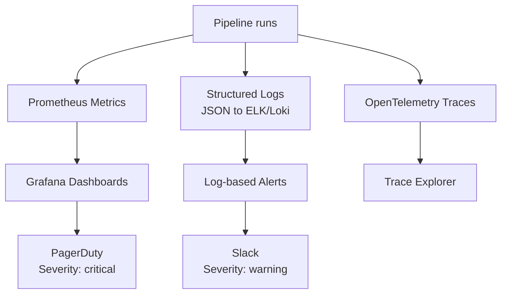

# Monitoring and Alerting — Senior Deep Dive

## Observability Stack for DE Platforms



## SLO-Based Alerting (Burn Rate)

```yaml
# Alert when error budget burning too fast
groups:
  - name: slo-burn-rate
    rules:
      # Fast burn: page immediately
      - alert: RevenuePipelineFastBurn
        expr: |
          rate(pipeline_failures_total[1h]) / rate(pipeline_runs_total[1h]) > 0.14
        labels:
          severity: page
        annotations:
          summary: "Revenue pipeline burning error budget 14× — investigate now"
      
      # Slow burn: ticket during business hours
      - alert: RevenuePipelineSlowBurn
        expr: |
          rate(pipeline_failures_total[6h]) / rate(pipeline_runs_total[6h]) > 0.02
        labels:
          severity: ticket
```

## ⚡ Cheat Sheet

```python
# Prometheus client
from prometheus_client import Counter, Histogram, Gauge, start_http_server

# Counters (only go up)
errors = Counter('pipeline_errors_total', 'Errors', ['pipeline', 'error_type'])
rows = Counter('pipeline_rows_total', 'Rows processed', ['pipeline'])

# Histograms (distribution of values)
duration = Histogram('pipeline_duration_seconds', 'Duration', ['pipeline'],
                     buckets=[30, 60, 120, 300, 600])

# Gauges (can go up or down)
freshness = Gauge('table_freshness_hours', 'Hours since last update', ['table'])

# Usage
errors.labels(pipeline='revenue', error_type='null_value').inc()
with duration.labels(pipeline='revenue').time():
    run_pipeline()
freshness.labels(table='fct_revenue').set(hours_since_update)

start_http_server(9090)  # Prometheus scrapes :9090/metrics
```
