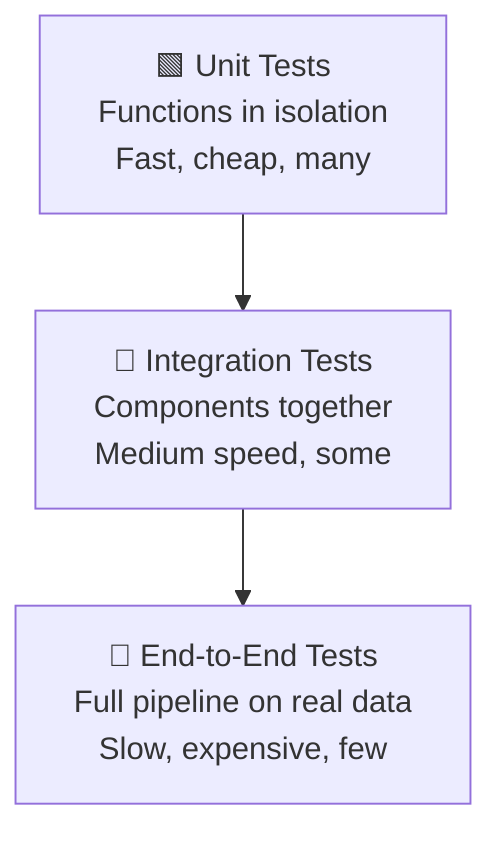

# Pipeline Testing — Fundamentals

## The Building Inspector Analogy

Testing a data pipeline is like a building inspector checking a construction site. You don't wait until the skyscraper is finished to discover the foundation is cracked. Inspectors check at every stage — foundation, framing, plumbing, electrical — before the next layer goes on top. Pipeline testing works the same way: catch bugs at the unit level (does this function transform data correctly?), then integration level (do these two components talk correctly?), then end-to-end (does the full pipeline produce the right output?). Waiting until production to find bugs is the data equivalent of discovering the foundation problem after moving in.

---

## Why Pipeline Testing Matters

| Without Tests | With Tests |
|---|---|
| Bugs discovered by angry stakeholders | Bugs caught before merge |
| Silent data corruption | Assertion failures fail fast |
| "Works on my machine" | Reproducible CI runs |
| Fear of refactoring | Confidence to change code |
| Unknown regressions | Automated regression detection |

---

## The Test Pyramid for Data Pipelines



**Unit tests** (70%): Test individual transformation functions.
**Integration tests** (20%): Test that DAG tasks connect correctly, SQL queries run against a test DB.
**End-to-end tests** (10%): Run the full pipeline on a small dataset.

---

## Unit Testing Transformation Functions

```python
# transform.py
def calculate_revenue(amount: float, discount: float, tax_rate: float) -> float:
    """Calculate net revenue after discount and tax."""
    if amount < 0:
        raise ValueError(f"Amount cannot be negative: {amount}")
    discounted = amount * (1 - discount)
    return round(discounted * (1 + tax_rate), 2)


# test_transform.py
import pytest
from transform import calculate_revenue

def test_revenue_no_discount():
    assert calculate_revenue(100.0, 0.0, 0.1) == 110.0

def test_revenue_with_discount():
    assert calculate_revenue(100.0, 0.1, 0.0) == 90.0

def test_revenue_combined():
    assert calculate_revenue(200.0, 0.25, 0.1) == 165.0

def test_negative_amount_raises():
    with pytest.raises(ValueError, match="negative"):
        calculate_revenue(-50.0, 0.0, 0.1)

@pytest.mark.parametrize("amount,discount,tax,expected", [
    (100, 0, 0, 100.0),
    (100, 0.5, 0, 50.0),
    (1000, 0.1, 0.2, 1080.0),
])
def test_revenue_parametrized(amount, discount, tax, expected):
    assert calculate_revenue(amount, discount, tax) == expected
```

---

## Testing Airflow DAGs

```python
# dags/orders_pipeline.py
from airflow import DAG
from airflow.operators.python import PythonOperator
from datetime import datetime

with DAG("orders_pipeline", start_date=datetime(2024, 1, 1), schedule="@daily") as dag:
    extract = PythonOperator(task_id="extract", python_callable=extract_orders)
    transform = PythonOperator(task_id="transform", python_callable=transform_orders)
    load = PythonOperator(task_id="load", python_callable=load_orders)
    extract >> transform >> load


# test_orders_dag.py
from airflow.models import DagBag

def test_dag_loads_without_errors():
    dagbag = DagBag(dag_folder="dags/", include_examples=False)
    assert "orders_pipeline" in dagbag.dags
    assert len(dagbag.import_errors) == 0

def test_dag_task_count():
    dagbag = DagBag(dag_folder="dags/", include_examples=False)
    dag = dagbag.dags["orders_pipeline"]
    assert len(dag.tasks) == 3

def test_dag_dependencies():
    dagbag = DagBag(dag_folder="dags/", include_examples=False)
    dag = dagbag.dags["orders_pipeline"]
    extract = dag.get_task("extract")
    transform = dag.get_task("transform")
    load = dag.get_task("load")
    assert transform in extract.downstream_list
    assert load in transform.downstream_list
```

---

## Testing SQL Transformations with dbt

```yaml
# models/schema.yml
models:
  - name: orders_daily
    description: Daily order aggregates
    columns:
      - name: order_date
        tests:
          - not_null
          - unique
      - name: total_revenue
        tests:
          - not_null
          - dbt_utils.accepted_range:
              min_value: 0
      - name: order_count
        tests:
          - not_null
          - dbt_utils.accepted_range:
              min_value: 1
```

Run: `dbt test --select orders_daily`

---

## Key Tools

| Tool | Use Case |
|---|---|
| `pytest` | Python function/class testing |
| `pytest-airflow` | DAG structure tests |
| `dbt test` | SQL model tests |
| `great_expectations` | Data quality assertions |
| `pandera` | DataFrame schema validation |

---

## Quick Start: Running Tests in CI

```yaml
# .github/workflows/test.yml
- name: Run unit tests
  run: pytest tests/ -v --tb=short

- name: Run dbt tests
  run: dbt test --profiles-dir profiles/
```

The goal: **every PR runs tests automatically, and failing tests block merge**.
