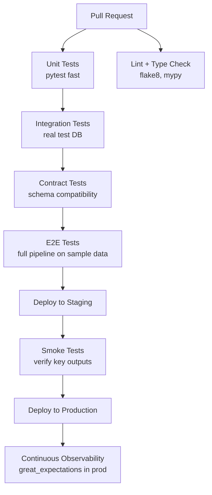

# Pipeline Testing — Senior Deep Dive

## Production-Grade Testing Architecture



---

## Contract Testing for Pipeline Interfaces

Contract tests verify that the shape of data flowing between components is compatible — preventing integration failures when teams change schemas independently.

```python
# contract.py — shared schema contract
import pandera as pa

RAW_ORDERS_CONTRACT = pa.DataFrameSchema({
    "order_id": pa.Column(int, nullable=False, unique=True),
    "customer_id": pa.Column(int, nullable=False),
    "amount": pa.Column(float, pa.Check.greater_than_or_equal_to(0)),
    "status": pa.Column(str, pa.Check.isin(["completed", "pending", "cancelled", "refunded"])),
    "order_date": pa.Column(pa.DateTime),
})

GOLD_REVENUE_CONTRACT = pa.DataFrameSchema({
    "date": pa.Column(pa.DateTime, nullable=False, unique=True),
    "total_revenue": pa.Column(float, pa.Check.greater_than_or_equal_to(0)),
    "order_count": pa.Column(int, pa.Check.greater_than(0)),
    "avg_order_value": pa.Column(float),
})

# Producer test: extraction layer produces valid contract
def test_extract_produces_valid_orders(test_engine):
    df = extract_orders(test_engine, date="2024-01-01")
    RAW_ORDERS_CONTRACT.validate(df)  # raises if contract violated

# Consumer test: transform accepts the contract
def test_transform_accepts_raw_contract():
    sample = pd.DataFrame({...})  # minimal valid contract data
    RAW_ORDERS_CONTRACT.validate(sample)  # validate input
    result = transform_orders(sample)
    GOLD_REVENUE_CONTRACT.validate(result)  # validate output
```

---

## Mutation Testing

Mutation testing verifies your tests actually catch bugs by introducing artificial defects:

```bash
# Install
pip install mutmut

# Run mutation tests on transform module
mutmut run --paths-to-mutate=pipelines/transform.py

# View results
mutmut results
# ✓ Killed: 45/50 mutants (90% mutation score)
# ✗ Survived: 5 mutants — add tests to catch these

mutmut show 7  # see what mutation survived
```

Target: >80% mutation score on critical transformation code.

---

## Property-Based Testing with Hypothesis

```python
from hypothesis import given, strategies as st
from hypothesis.extra.pandas import column, data_frames
import pandas as pd

@given(
    data_frames(columns=[
        column("amount", dtype=float, elements=st.floats(min_value=0, max_value=1e6)),
        column("discount", dtype=float, elements=st.floats(min_value=0, max_value=1)),
        column("tax_rate", dtype=float, elements=st.floats(min_value=0, max_value=0.5)),
    ])
)
def test_revenue_always_non_negative(df):
    """Revenue can never be negative for valid inputs."""
    result = calculate_revenue_df(df)
    assert (result["net_revenue"] >= 0).all()

@given(st.floats(min_value=0), st.floats(min_value=0, max_value=1))
def test_revenue_monotone_with_amount(amount, discount):
    """Higher amount → higher or equal revenue."""
    r1 = calculate_revenue(amount, discount, 0.1)
    r2 = calculate_revenue(amount * 1.5, discount, 0.1)
    assert r2 >= r1
```

---

## Testing Data Pipelines in Production (Observability)

```python
# Great Expectations checkpoint on every pipeline run
from great_expectations.checkpoint import SimpleCheckpoint

class PipelineQualityGate:
    def __init__(self, context, checkpoint_name: str, fail_on_error: bool = True):
        self.context = context
        self.checkpoint_name = checkpoint_name
        self.fail_on_error = fail_on_error

    def run(self, batch_request) -> bool:
        result = self.context.run_checkpoint(
            checkpoint_name=self.checkpoint_name,
            validations=[{"batch_request": batch_request}],
        )
        if not result["success"]:
            if self.fail_on_error:
                raise DataQualityError(
                    f"Quality gate failed: {result['statistics']}"
                )
            else:
                alert_slack(
                    channel="#data-quality",
                    message=f"Quality warning: {result['statistics']}",
                )
        return result["success"]
```

---

## Test Performance Optimization

```ini
# pytest.ini
addopts = -n auto  # parallel execution (pytest-xdist)

# Mark slow tests
[pytest]
markers =
    unit: <1s
    integration: <30s
    e2e: full pipeline, >1min
```

```yaml
# GitHub Actions: run fast tests first, gate expensive ones
jobs:
  unit-tests:
    runs-on: ubuntu-latest
    steps:
      - run: pytest -m unit --tb=short

  integration-tests:
    needs: unit-tests
    runs-on: ubuntu-latest
    steps:
      - run: pytest -m integration

  e2e-tests:
    needs: integration-tests
    if: github.ref == 'refs/heads/main'  # only on main
    steps:
      - run: pytest -m e2e
```

---

## ⚡ Cheat Sheet

```bash
# Run tests
pytest                              # all tests
pytest -m unit                      # only unit tests
pytest -k "test_revenue"            # by name pattern
pytest -x                           # stop on first failure
pytest --tb=short                   # compact tracebacks
pytest -n auto                      # parallel (xdist)
pytest --cov=pipelines --cov-report=html  # coverage

# dbt tests
dbt test                            # all models
dbt test --select orders_daily      # one model
dbt test --select tag:pii           # by tag

# Great Expectations
great_expectations checkpoint run orders_checkpoint

# pandera validation
schema.validate(df)                 # raises SchemaError if invalid
schema.validate(df, lazy=True)      # collect all errors, not just first

# hypothesis
@given(st.integers())               # property-based test
@settings(max_examples=200)         # more examples = stronger test
```

**Key mental models:**
- Test pyramid: many unit, some integration, few E2E
- Contract tests = interface guarantees between teams
- Mutation score > 80% = tests are actually catching bugs
- Data quality gates in prod = tests that never stop running
