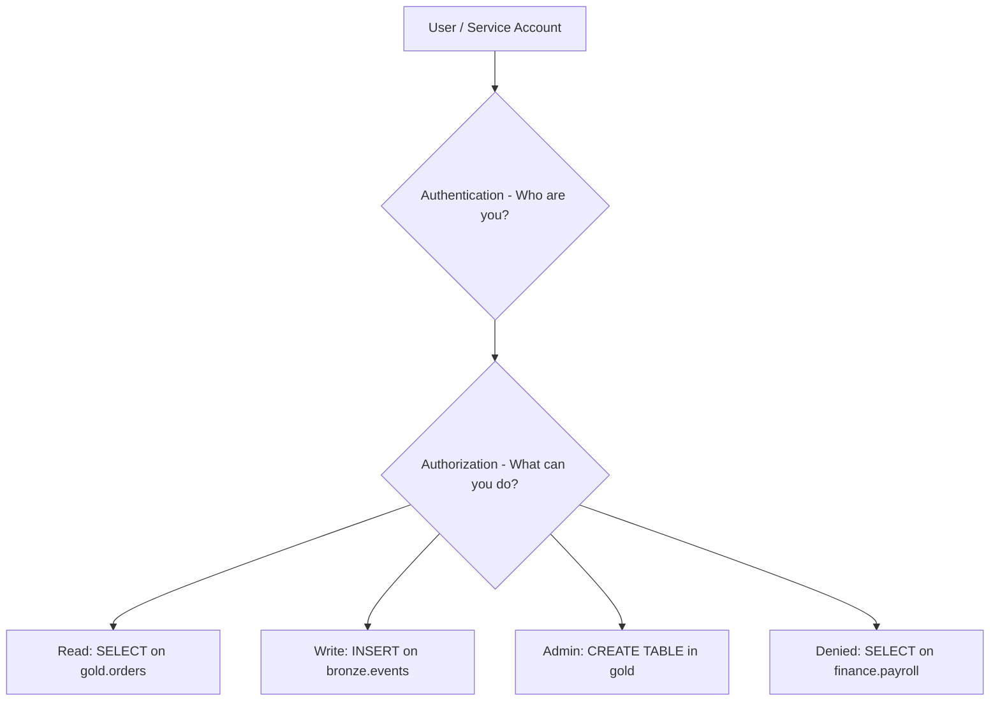

# Access Control & RBAC — Fundamentals


## 🎯 Analogy

Think of access control like a building key card system: each identity gets a card (role), doors are labeled (tables, columns, rows), and the access control system checks the card before opening any door — least privilege means the fewest doors possible.

---
## What Is Data Access Control?

Access control determines who can read, write, or modify data assets. In data engineering, this covers: databases, data warehouses, S3 buckets, Kafka topics, and dashboards.



---

## Access Control Models

### RBAC — Role-Based Access Control
Assign permissions to *roles*, then assign roles to *users*:
```
Role: analyst_revenue
  - SELECT on gold.orders
  - SELECT on gold.revenue_daily
  - SELECT on gold.customers (masked PII columns)

User: john.doe@company.com → assigned role: analyst_revenue
```

### ABAC — Attribute-Based Access Control
Grant access based on attributes (user department, data sensitivity, time):
```
IF user.department = 'Finance' AND data.sensitivity = 'internal'
THEN ALLOW SELECT
```

### DAC — Discretionary Access Control
Data owners grant access directly:
```
Table owner grants SELECT to specific users
```

---

## Snowflake RBAC

Snowflake uses a hierarchical role model:

```sql
-- Create roles for different access tiers
CREATE ROLE analyst_revenue;
CREATE ROLE analyst_finance;
CREATE ROLE data_engineer;
CREATE ROLE data_admin;

-- Role hierarchy (GRANT one role to another)
GRANT ROLE analyst_revenue TO ROLE analyst_finance;  -- finance inherits revenue access
GRANT ROLE analyst_finance TO ROLE data_engineer;    -- DEs can see what analysts see
GRANT ROLE data_engineer TO ROLE data_admin;         -- admins have full access

-- Grant privileges on database objects
GRANT USAGE ON DATABASE PROD TO ROLE analyst_revenue;
GRANT USAGE ON SCHEMA PROD.GOLD TO ROLE analyst_revenue;
GRANT SELECT ON TABLE PROD.GOLD.ORDERS TO ROLE analyst_revenue;
GRANT SELECT ON ALL TABLES IN SCHEMA PROD.GOLD TO ROLE analyst_revenue;
-- Future tables too
GRANT SELECT ON FUTURE TABLES IN SCHEMA PROD.GOLD TO ROLE analyst_revenue;

-- Assign roles to users
GRANT ROLE analyst_revenue TO USER john.doe;

-- Create service account for pipeline
CREATE USER airflow_svc_account PASSWORD='...' DEFAULT_ROLE=data_engineer;
GRANT ROLE data_engineer TO USER airflow_svc_account;
```

---

## AWS IAM for Data Lakes (S3)

```python
# boto3: create an IAM policy for read-only S3 access
import boto3
import json

iam = boto3.client("iam")

# Policy: read-only access to gold layer
gold_read_policy = {
    "Version": "2012-10-17",
    "Statement": [
        {
            "Effect": "Allow",
            "Action": ["s3:GetObject", "s3:ListBucket"],
            "Resource": [
                "arn:aws:s3:::company-data-lake/gold/*",
                "arn:aws:s3:::company-data-lake",
            ],
            "Condition": {
                "StringEquals": {"s3:prefix": ["gold/"]}
            }
        },
        {
            # Deny access to PII tables unless user is in pii-approved group
            "Effect": "Deny",
            "Action": ["s3:GetObject"],
            "Resource": "arn:aws:s3:::company-data-lake/gold/customers/*",
            "Condition": {
                "StringNotEquals": {
                    "aws:PrincipalTag/group": "data-pii-approved"
                }
            }
        }
    ]
}

iam.create_policy(
    PolicyName="GoldLayerReadOnly",
    PolicyDocument=json.dumps(gold_read_policy),
    Description="Read-only access to gold layer data, PII tables restricted",
)
```

---

## Principle of Least Privilege

**Key rule:** Grant the minimum access needed to do the job.

```python
# Bad: granting full access
GRANT ALL PRIVILEGES ON ALL TABLES IN SCHEMA gold TO ROLE analyst;

# Good: grant only what's needed
GRANT SELECT ON TABLE gold.orders TO ROLE analyst_revenue;
GRANT SELECT ON TABLE gold.revenue_daily TO ROLE analyst_revenue;
# Don't grant gold.payroll to revenue analysts

# Review: who has access to sensitive tables?
def audit_table_access(engine, table_name: str) -> list[dict]:
    import sqlalchemy as sa
    with engine.connect() as conn:
        # Snowflake: query access history
        rows = conn.execute(sa.text("""
            SELECT grantee_name, privilege_type, granted_by, created_on
            FROM information_schema.object_privileges
            WHERE object_name = :table
              AND object_schema = 'GOLD'
            ORDER BY created_on DESC
        """), {"table": table_name.upper()}).fetchall()
    return [{"grantee": r.grantee_name, "privilege": r.privilege_type} for r in rows]
```

---


## ▶️ Try It Yourself

```sql
-- Role-based access control (RBAC) in Snowflake
-- Create roles for different access levels
CREATE ROLE data_consumer;   -- Read-only analyst
CREATE ROLE data_engineer;   -- Read + write to staging
CREATE ROLE data_admin;      -- Full access

-- Grant hierarchy: consumer < engineer < admin
GRANT ROLE data_consumer TO ROLE data_engineer;
GRANT ROLE data_engineer TO ROLE data_admin;

-- Grant column-level access (mask PII for consumers)
CREATE MASKING POLICY email_mask AS (val STRING) RETURNS STRING ->
    CASE
        WHEN CURRENT_ROLE() IN ('data_admin') THEN val
        ELSE '***@***.***'  -- Masked for non-admins
    END;

ALTER TABLE customers MODIFY COLUMN email SET MASKING POLICY email_mask;

-- Grant SELECT on gold schema to consumer role
GRANT USAGE ON DATABASE prod TO ROLE data_consumer;
GRANT USAGE ON SCHEMA prod.gold TO ROLE data_consumer;
GRANT SELECT ON ALL TABLES IN SCHEMA prod.gold TO ROLE data_consumer;
```

> **Run it:** Copy the snippet into a REPL or file — no external services needed for the basic example.

---
## Interview Tips

> **Tip 1:** "What is RBAC?" — Role-Based Access Control assigns permissions to roles, not individual users. Users are assigned roles. Easier to manage at scale: when a new analyst joins, assign them the analyst role rather than granting table-by-table. When they leave, revoke the role.

> **Tip 2:** "What is the principle of least privilege?" — Grant users only the minimum permissions they need. A revenue analyst shouldn't have SELECT on finance.payroll. A read-only service account shouldn't have DROP TABLE. Limits blast radius if credentials are compromised.

> **Tip 3:** "How do you handle service account access?" — Create dedicated service accounts per pipeline (not shared). Grant minimum privileges needed for that pipeline only. Rotate credentials regularly. Use role assumption (AWS STS) or OAuth tokens rather than static passwords where possible.
