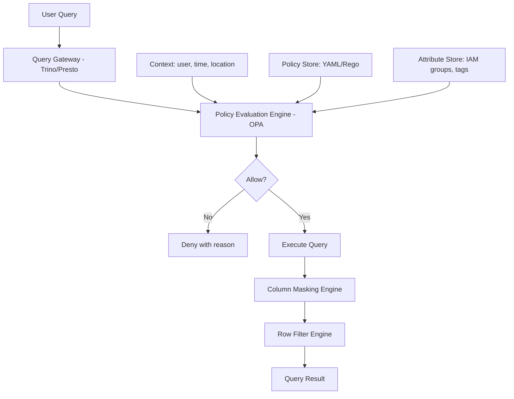

# Access Control & RBAC — Senior Deep Dive

## Zero Trust Data Access Architecture

Never trust, always verify — access is evaluated at query time, not granted statically:



---

## OPA-Based Query Authorization

Integrate OPA as a policy engine for SQL query authorization:

```rego
# policies/data_query.rego
package data.query

import future.keywords.if
import future.keywords.in

default allow := false

# Full access for data admins
allow if {
    "data_admin" in input.user.roles
}

# Allow read if user has role matching table's required role
allow if {
    input.action == "SELECT"
    required_role := data.table_policies[input.table].read_role
    required_role in input.user.roles
}

# Deny PII tables unless user is PII-approved AND request is from corporate network
deny_pii if {
    "pii" in data.catalog[input.table].tags
    not "pii_approved" in input.user.roles
}

deny_external_pii if {
    "pii" in data.catalog[input.table].tags
    not startswith(input.user.ip_address, "10.")  # Not corporate network
}

# Time-based access: no access to financial data outside business hours UTC
deny_off_hours if {
    "financial" in data.catalog[input.table].tags
    hour := time.clock(time.now_ns())[0]
    hour < 6
}

deny_off_hours if {
    "financial" in data.catalog[input.table].tags
    hour := time.clock(time.now_ns())[0]
    hour >= 22
}

# Final decision: allow only if allowed AND no deny rules triggered
final_allow := allow if {
    not deny_pii
    not deny_external_pii
    not deny_off_hours
}
```

```python
import requests
from functools import lru_cache

class DataAccessPolicyEngine:
    """Evaluate access policies via OPA before executing queries."""
    
    def __init__(self, opa_url: str):
        self.opa_url = opa_url
    
    def evaluate(self, user: dict, table: str, action: str, columns: list[str] = None) -> dict:
        """
        Evaluate whether user can perform action on table.
        Returns: {allowed: bool, masked_columns: list, filtered_rows: str, reason: str}
        """
        payload = {
            "input": {
                "user": user,  # {email, roles, department, ip_address}
                "table": table,
                "action": action,
                "columns": columns or [],
                "timestamp": __import__("time").time(),
            }
        }
        
        resp = requests.post(
            f"{self.opa_url}/v1/data/data/query",
            json=payload,
            timeout=0.1,  # 100ms SLA for policy evaluation
        )
        resp.raise_for_status()
        result = resp.json()["result"]
        
        return {
            "allowed": result.get("final_allow", False),
            "masked_columns": result.get("masked_columns", []),
            "row_filter": result.get("row_filter"),
            "reason": result.get("reason", "policy evaluation"),
        }
    
    def audit_log(self, user: str, table: str, action: str, allowed: bool, reason: str):
        """Persist every access decision for audit purposes."""
        import sqlalchemy as sa
        # ... write to audit_log table
```

---

## Attribute-Based Access Control (ABAC) at Scale

Move beyond roles to dynamic, context-aware access:

```python
from dataclasses import dataclass
from typing import Callable, List

@dataclass
class AccessPolicy:
    policy_id: str
    name: str
    condition: Callable[[dict, dict], bool]  # (user_context, resource_context) → bool
    effect: str  # "allow" | "deny"
    priority: int  # Higher = evaluated first

class ABACEngine:
    """
    Attribute-Based Access Control engine.
    Evaluates a set of ordered policies and returns a decision.
    """
    
    def __init__(self):
        self.policies: List[AccessPolicy] = []
    
    def add_policy(self, policy: AccessPolicy):
        self.policies.append(policy)
        self.policies.sort(key=lambda p: p.priority, reverse=True)
    
    def decide(self, user_context: dict, resource_context: dict) -> tuple[bool, str]:
        """
        Returns (allowed, reason).
        Deny wins: any DENY policy blocks access regardless of ALLOW policies.
        """
        for policy in self.policies:
            if policy.condition(user_context, resource_context):
                if policy.effect == "deny":
                    return False, f"Denied by policy '{policy.name}'"
        
        for policy in self.policies:
            if policy.condition(user_context, resource_context) and policy.effect == "allow":
                return True, f"Allowed by policy '{policy.name}'"
        
        return False, "No matching allow policy (default deny)"

# Configure policies
engine = ABACEngine()

engine.add_policy(AccessPolicy(
    policy_id="POL-001",
    name="PII requires PII role",
    condition=lambda u, r: "pii" in r.get("tags", []) and "pii_approved" not in u.get("roles", []),
    effect="deny",
    priority=100,
))

engine.add_policy(AccessPolicy(
    policy_id="POL-002",
    name="Region restriction for GDPR data",
    condition=lambda u, r: r.get("region") == "EU" and u.get("location") not in ("EU", "admin"),
    effect="deny",
    priority=90,
))

engine.add_policy(AccessPolicy(
    policy_id="POL-010",
    name="Allow analysts to read gold layer",
    condition=lambda u, r: "analyst" in u.get("roles", []) and r.get("layer") == "gold",
    effect="allow",
    priority=10,
))

# Evaluate
user = {"email": "bob@company.com", "roles": ["analyst_revenue"], "location": "US"}
resource = {"table": "gold.customers", "tags": ["pii"], "layer": "gold"}

allowed, reason = engine.decide(user, resource)
print(f"Access: {'ALLOWED' if allowed else 'DENIED'} — {reason}")
# → Access: DENIED — Denied by policy 'PII requires PII role'
```

---

## Data Perimeter (AWS)

Prevent data exfiltration at the AWS organization level:

```json
{
  "Version": "2012-10-17",
  "Statement": [
    {
      "Sid": "DenyDataExfiltration",
      "Effect": "Deny",
      "Action": ["s3:PutObject", "s3:CopyObject"],
      "Resource": "*",
      "Condition": {
        "StringNotEquals": {
          "s3:ResourceAccount": "${aws:PrincipalAccount}"
        },
        "BoolIfExists": {
          "aws:PrincipalIsAWSService": "false"
        }
      }
    },
    {
      "Sid": "DenyUnencryptedData",
      "Effect": "Deny",
      "Action": "s3:PutObject",
      "Resource": "arn:aws:s3:::company-data-lake/*",
      "Condition": {
        "StringNotEquals": {
          "s3:x-amz-server-side-encryption": "aws:kms"
        }
      }
    }
  ]
}
```

---

## Interview Tips

> **Tip 1:** "What is the difference between RBAC and ABAC?" — RBAC is static: roles are pre-defined, access is based on role membership. ABAC is dynamic: access decisions use multiple attributes (user department, data sensitivity, time, location, purpose). ABAC is more expressive but harder to reason about. Most orgs use RBAC as the foundation with ABAC policies for special cases (time-based, region-based).

> **Tip 2:** "What is a data perimeter?" — AWS organization-level controls that prevent data from leaving your org boundary. SCP (Service Control Policy) denies cross-account S3 writes, denies resource-based policies that allow external access. Prevents credential compromise from being used to exfiltrate data to attacker-controlled S3 buckets.

> **Tip 3:** "How do you design access control for a multi-tenant data platform?" — Row-level security with tenant_id column. Each tenant is isolated at the row level. Service accounts per tenant, not shared. Separate encryption keys per tenant in KMS. Audit log partitioned by tenant_id. Test isolation regularly: verify tenant A cannot see tenant B's data, even if they construct adversarial queries.

## ⚡ Cheat Sheet

**RBAC hierarchy**: Privilege → Role → User/Group (never grant directly to users)

**Snowflake RBAC**
```sql
CREATE ROLE analyst_revenue;
GRANT SELECT ON SCHEMA gold TO ROLE analyst_revenue;
GRANT ROLE analyst_revenue TO USER jane_doe;
SHOW GRANTS TO USER jane_doe;
```

**Row-level security**
```sql
CREATE ROW ACCESS POLICY region_filter AS (region_col VARCHAR) RETURNS BOOLEAN ->
  CURRENT_ROLE() IN ('GLOBAL_ADMIN')
  OR region_col = (SELECT user_region FROM user_region_map WHERE username = CURRENT_USER());
ALTER TABLE gold.sales ADD ROW ACCESS POLICY region_filter ON (region);
```

**Column masking**
```sql
CREATE MASKING POLICY email_mask AS (val STRING) RETURNS STRING ->
  CASE WHEN IS_ROLE_IN_SESSION('PII_APPROVED') THEN val ELSE SHA2(val, 256) END;
ALTER TABLE gold.customers MODIFY COLUMN email SET MASKING POLICY email_mask;
```

**Key rules**
- Principle of least privilege: grant minimum needed; revoke after use
- RBAC = who you are; ABAC = attribute-based (team/function/pii_approved)
- OAuth/OIDC for SSO — no native DB passwords in prod
- Terraform for role management — grants reviewed via PR
- Quarterly review: remove unused grants
