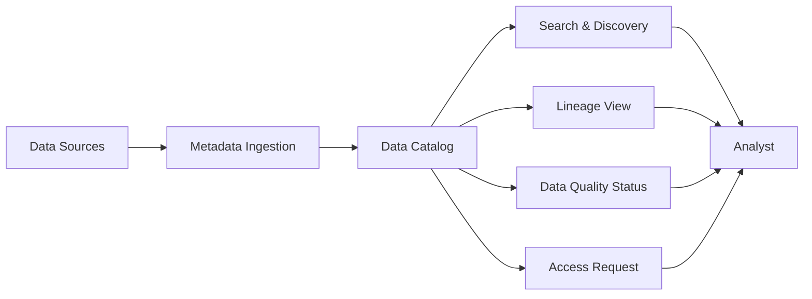

# Data Catalog — Fundamentals


## 🎯 Analogy

Think of a data catalog like a library card catalog for your data: it tells you where each dataset lives, what it contains, who owns it, and how fresh it is — so analysts can find trustworthy data without asking a data engineer.

---
## What Is a Data Catalog?

A data catalog is a searchable inventory of all data assets in an organization — tables, dashboards, pipelines, ML models — enriched with metadata (descriptions, owners, tags, lineage).



---

## Why Catalogs Matter

| Problem Without Catalog | How Catalog Solves It |
|---|---|
| "Who owns this table?" | Owner shown on every asset |
| "What does this column mean?" | Column descriptions from dbt/catalog |
| "Is this the right table to use?" | Usage stats, description, related assets |
| "Is there already a dataset for X?" | Full-text search across all assets |
| "Who uses this table?" — before deleting | Downstream lineage, active users shown |

---

## Popular Data Catalog Tools

| Tool | Type | Best For |
|---|---|---|
| **DataHub** (LinkedIn) | Open source | Large orgs, strong lineage, REST + GraphQL API |
| **Amundsen** (Lyft) | Open source | Search-first UX, collaborative annotations |
| **Apache Atlas** | Open source | Hadoop ecosystems, policy enforcement |
| **Alation** | Commercial | Enterprise, strong ML-based recommendations |
| **Collibra** | Commercial | Governance-heavy orgs, policy & workflow engine |
| **AWS Glue Data Catalog** | Managed | AWS-native, auto-discovery from S3/Redshift |
| **dbt docs** | Lightweight | dbt teams, auto-generated from schema.yml |

---

## Core Metadata Types

```python
# A fully-enriched catalog asset
asset = {
    # Business metadata (human-provided)
    "name": "gold.orders",
    "display_name": "Orders (Gold)",
    "description": "Cleaned and deduped orders from all channels. Source of truth for revenue.",
    "owner": "revenue-team",
    "steward": "jane.smith@company.com",
    "domain": "sales",
    "tags": ["core", "revenue", "sot", "internal"],
    "glossary_terms": ["Order", "Revenue", "Customer"],
    
    # Technical metadata (auto-ingested)
    "schema": "gold",
    "row_count": 1_250_000,
    "column_count": 42,
    "size_bytes": 4_200_000_000,
    "created_at": "2023-06-01",
    "last_updated": "2024-01-15T08:22:11Z",
    "update_frequency": "daily",
    "platform": "snowflake",
    
    # Operational metadata (from pipelines)
    "upstream_tables": ["silver.orders", "silver.customers"],
    "downstream_tables": ["gold.revenue_daily", "gold.customer_ltv"],
    "downstream_dashboards": ["Revenue Dashboard", "Finance Weekly"],
    "pipeline": "orders_pipeline",
    "dq_pass_rate": 0.987,
    "sla": "09:00 UTC daily",
    
    # Usage metadata (from query logs)
    "monthly_queries": 4200,
    "unique_users_30d": 87,
    "top_users": ["finance-analyst@co.com", "data-scientist@co.com"],
}
```

---

## Interacting with DataHub via REST API

```python
import requests

DATAHUB_URL = "http://datahub-gms:8080"

def get_dataset(urn: str) -> dict:
    """Fetch a dataset from DataHub by URN."""
    # URN format: urn:li:dataset:(urn:li:dataPlatform:snowflake,gold.orders,PROD)
    resp = requests.get(
        f"{DATAHUB_URL}/entities/{urn}",
        headers={"Authorization": f"Bearer {DATAHUB_TOKEN}"},
    )
    resp.raise_for_status()
    return resp.json()

def search_datasets(query: str, platform: str = None) -> list[dict]:
    """Search catalog for datasets matching a query."""
    filters = {}
    if platform:
        filters["platform"] = f"urn:li:dataPlatform:{platform}"
    
    payload = {
        "input": query,
        "type": "DATASET",
        "count": 20,
        "filter": {"or": [{"and": [{"field": k, "value": v} for k, v in filters.items()]}]} if filters else None,
    }
    resp = requests.post(
        f"{DATAHUB_URL}/entities?action=search",
        json=payload,
        headers={"Authorization": f"Bearer {DATAHUB_TOKEN}"},
    )
    return resp.json().get("value", {}).get("entities", [])

def add_tag_to_dataset(urn: str, tag: str):
    """Add a tag to a dataset in DataHub."""
    tag_urn = f"urn:li:tag:{tag}"
    payload = {
        "proposal": {
            "entityType": "dataset",
            "entityUrn": urn,
            "aspectName": "globalTags",
            "changeType": "UPSERT",
            "aspect": {
                "tags": [{"tag": tag_urn}]
            }
        }
    }
    resp = requests.post(
        f"{DATAHUB_URL}/aspects?action=ingestProposal",
        json=payload,
        headers={"Authorization": f"Bearer {DATAHUB_TOKEN}"},
    )
    resp.raise_for_status()
    print(f"Tagged {urn} with '{tag}'")
```

---


## ▶️ Try It Yourself

```python
# Simulate a simple catalog entry
catalog = {}

def register_dataset(name: str, location: str, owner: str,
                      description: str, schema: dict):
    catalog[name] = {
        "location": location,
        "owner": owner,
        "description": description,
        "schema": schema,
        "registered_at": "2024-01-15",
    }

def search_catalog(query: str) -> list:
    return [
        {"name": k, **v}
        for k, v in catalog.items()
        if query.lower() in k.lower() or query.lower() in v["description"].lower()
    ]

register_dataset(
    "gold.orders",
    "s3://data-lake/gold/orders/",
    "data-platform@company.com",
    "Cleaned, deduplicated order records from POS system",
    {"order_id": "BIGINT", "amount": "DECIMAL", "region": "VARCHAR"},
)

results = search_catalog("orders")
for r in results:
    print(r["name"], "→", r["description"])
```

> **Run it:** Copy the snippet into a REPL or file and run it — no external services needed for the basic example.

---
## Interview Tips

> **Tip 1:** "What is a data catalog and why do you need one?" — A searchable inventory of all data assets with metadata (descriptions, owners, lineage, quality). Needed because without it, analysts waste time re-discovering existing tables, duplicating work, or using wrong/stale data.

> **Tip 2:** "What's the difference between a data catalog and a data dictionary?" — A data dictionary is a static document (spreadsheet) defining column names and types. A data catalog is a living, searchable system with lineage, usage stats, quality scores, and user collaboration. Think Wikipedia vs. encyclopedia.

> **Tip 3:** "What is a dataset URN?" — Uniform Resource Name uniquely identifies an asset in the catalog. In DataHub: `urn:li:dataset:(urn:li:dataPlatform:snowflake,gold.orders,PROD)`. Used for lineage edges (upstream/downstream relationships).
