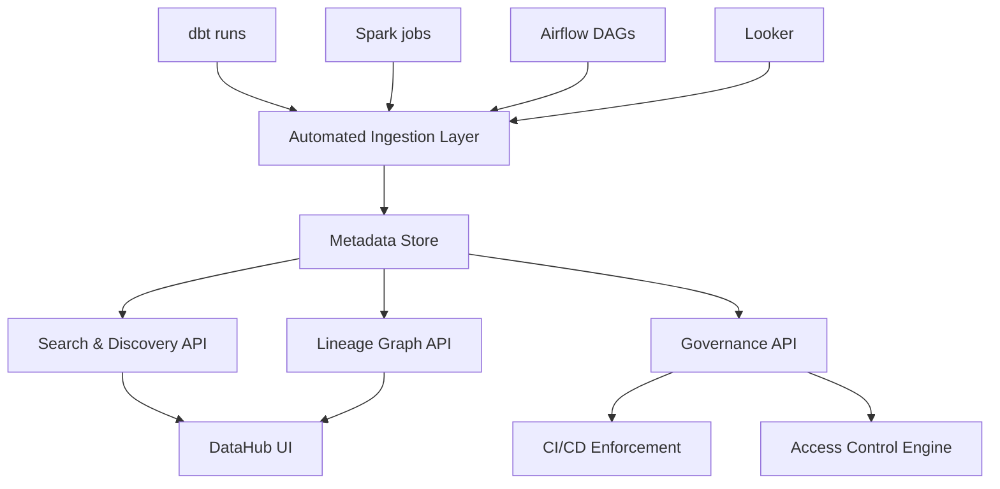

# Data Catalog — Interview Scenarios

## Scenario 1 (Junior): Finding the Right Table

**Question:** An analyst messages you: "I need order data, but I found 6 different 'orders' tables. Which one should I use?" How do you handle this and what catalog feature fixes this long-term?

**Answer:**

**Immediate answer:**
```
gold.orders — this is the source-of-truth table:
- Cleaned and deduped from all sales channels
- Updated daily by 9 AM UTC
- Owned by the revenue team
- Used by the Finance dashboard

Other "orders" tables you might see:
- bronze.orders_raw       → raw, not cleaned. Don't use for reporting.
- silver.orders           → cleaned but not aggregated. Use for row-level analysis.
- legacy.orders_v1        → deprecated 2023-06-01. Do not use.
- staging.orders_test     → test data. Never use in production.
- analytics.orders_view   → view on top of gold.orders for BI tool compatibility.
```

**Long-term catalog fix:**
1. Tag `gold.orders` with `source-of-truth` tag — visible in search results
2. Add "Deprecated" badge to legacy tables with migration instructions
3. Add a dataset description that explicitly says "Use this table for..."
4. Set up "certified" badge for the 20 core datasets (gold-tier tables)

```yaml
# In DataHub: add certification and deprecation
gold.orders:
  tags: [source-of-truth, certified, revenue]
  status: ACTIVE

legacy.orders_v1:
  tags: [deprecated]
  deprecation:
    deprecated: true
    note: "Replaced by gold.orders on 2023-06-01. Migrate by 2024-01-01."
    decommissionTime: 1704067200000
```

---

## Scenario 2 (Mid-level): Catalog Adoption Problem

**Question:** You've deployed DataHub six months ago, but only 20% of the team uses it. How do you drive adoption?

**Answer:**

**Root cause diagnosis:**
- Search doesn't return useful results → improve metadata quality
- Teams don't know it exists → awareness problem
- No incentive to update metadata → motivation problem
- Catalog is inaccurate → trust problem (chicken-and-egg)

**Action plan:**

**Week 1-2: Fix trust**
```
- Run ingestion daily (not weekly) — stale catalog = low trust
- Fix top 20 most-queried tables: good descriptions, clear ownership
- Remove or mark deprecated tables clearly
```

**Week 3-4: Drive discovery value**
```
- "Find before you build" workshop: show how catalog prevents duplicate work
- Demo: "This table exists and saves you 2 weeks of pipeline work"
- Add direct catalog links to Slack channel topic for #data-questions
```

**Month 2: Make it required**
```
- CI check: new dbt models must have description + owner in schema.yml
- Onboarding checklist for new hires: "Register your first table in DataHub"
- Team KPI: catalog coverage by domain, reviewed monthly
```

**Month 3+: Measure impact**
```
- Track: % queries run after catalog search vs blind SQL
- Survey: "Did you find what you needed in DataHub?" (weekly NPS)
- Success story: "The analytics team saved 3 weeks using catalog search"
```

---

## Scenario 3 (Senior): Designing a Catalog for 50 Teams

**Question:** Your company has 50 domain teams and 10,000+ tables. Design a catalog system that scales without becoming a maintenance burden.

**Answer:**



**Key design decisions:**

**1. Tiered ingestion frequency**
```
Tier 1 (core, 200 tables): daily ingestion + profiling
Tier 2 (important, 2000 tables): daily ingestion, weekly profiling
Tier 3 (all others, 8000 tables): weekly ingestion, no profiling
```

**2. Federated ownership model**
```
- Central platform: maintains catalog infrastructure, defines standards
- Domain teams: responsible for their table metadata quality
- Governance score per domain: publicly visible, reviewed quarterly
```

**3. Self-service registration API**
```python
# Teams call this SDK to register custom tables (outside dbt)
from data_catalog_sdk import register_table

register_table(
    table_name="marketing.campaign_attribution",
    platform="snowflake",
    description="Multi-touch attribution model output. Last-touch by default.",
    owner_email="marketing-analytics@company.com",
    tags=["marketing", "attribution"],
)
```

**4. Automated enforcement (not optional)**
```
- PR CI: schema.yml must have description + meta.owner (blocks merge)
- Weekly digest: each owner receives their catalog health score
- Quarterly review: bottom 10% domains get platform team support
```

**Scaling challenges:**
- Search performance: Elasticsearch needs tuning as corpus grows — weight recency and usage
- Lineage graph: prune edges for deprecated tables, limit graph traversal depth
- Schema sync: use Kafka/event-driven ingestion rather than polling for large orgs
