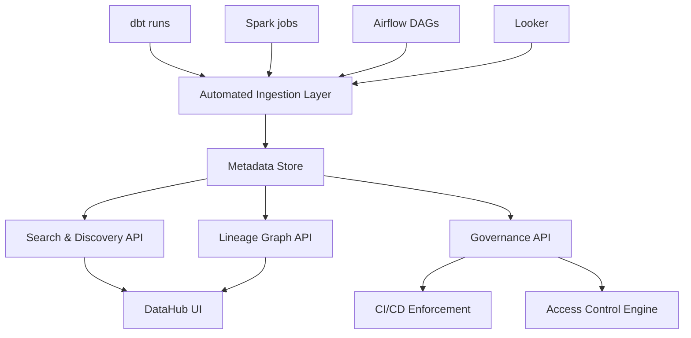

# Data Catalog — Interview Scenarios


<article data-difficulty="junior">

## 🟢 Junior: Finding the Right Table

**Scenario:** An analyst messages you: "I need order data, but I found 6 different 'orders' tables. Which one should I use?" How do you handle this and what catalog feature fixes this long-term?

<details>
<summary>💡 Hint</summary>

The immediate answer is "always use the gold/curated layer for reporting" — explain what each layer is for (bronze=raw, silver=cleaned, gold=source-of-truth). The long-term fix is a *certified table* tag in the data catalog: one table per domain gets a "Certified" badge, clearly marked as the authoritative source, with owner and freshness SLA. That eliminates the "which one?" question for every new analyst.

</details>

<details>
<summary>✅ Solution</summary>

**Immediate answer:**
```
gold.orders — this is the source-of-truth table:
- Cleaned and deduped from all sales channels
- Updated daily by 9 AM UTC
- Owned by the revenue team
- Used by the Finance dashboard

Other "orders" tables you might see:
- bronze.orders_raw       → raw, not cleaned. Don't use for reporting.
- silver.orders           → cleaned but not aggregated. Use for row-level analysis.
- legacy.orders_v1        → deprecated 2023-06-01. Do not use.
- staging.orders_test     → test data. Never use in production.
- analytics.orders_view   → view on top of gold.orders for BI tool compatibility.
```

**Long-term catalog fix:**
1. Tag `gold.orders` with `source-of-truth` tag — visible in search results
2. Add "Deprecated" badge to legacy tables with migration instructions
3. Add a dataset description that explicitly says "Use this table for..."
4. Set up "certified" badge for the 20 core datasets (gold-tier tables)

```yaml
# In DataHub: add certification and deprecation
gold.orders:
  tags: [source-of-truth, certified, revenue]
  status: ACTIVE

legacy.orders_v1:
  tags: [deprecated]
  deprecation:
    deprecated: true
    note: "Replaced by gold.orders on 2023-06-01. Migrate by 2024-01-01."
    decommissionTime: 1704067200000
```

</details>

</article>

<article data-difficulty="mid-level">

## 🟡 Mid-Level: Catalog Adoption Problem

**Scenario:** You've deployed DataHub six months ago, but only 20% of the team uses it. How do you drive adoption?

<details>
<summary>💡 Hint</summary>

**Root cause diagnosis:** - Search doesn't return useful results → improve metadata quality - Teams don't know it exists → awareness problem - No incentive to update metadata → motivation problem - Catalog is inaccurate → trust problem (chicken-and-egg)

</details>

<details>
<summary>✅ Solution</summary>

**Root cause diagnosis:**
- Search doesn't return useful results → improve metadata quality
- Teams don't know it exists → awareness problem
- No incentive to update metadata → motivation problem
- Catalog is inaccurate → trust problem (chicken-and-egg)

**Action plan:**

**Week 1-2: Fix trust**
```
- Run ingestion daily (not weekly) — stale catalog = low trust
- Fix top 20 most-queried tables: good descriptions, clear ownership
- Remove or mark deprecated tables clearly
```

**Week 3-4: Drive discovery value**
```
- "Find before you build" workshop: show how catalog prevents duplicate work
- Demo: "This table exists and saves you 2 weeks of pipeline work"
- Add direct catalog links to Slack channel topic for #data-questions
```

**Month 2: Make it required**
```
- CI check: new dbt models must have description + owner in schema.yml
- Onboarding checklist for new hires: "Register your first table in DataHub"
- Team KPI: catalog coverage by domain, reviewed monthly
```

**Month 3+: Measure impact**
```
- Track: % queries run after catalog search vs blind SQL
- Survey: "Did you find what you needed in DataHub?" (weekly NPS)
- Success story: "The analytics team saved 3 weeks using catalog search"
```

</details>

</article>

<article data-difficulty="senior">

## 🔴 Senior: Designing a Catalog for 50 Teams

**Scenario:** Your company has 50 domain teams and 10,000+ tables. Design a catalog system that scales without becoming a maintenance burden.

<details>
<summary>💡 Hint</summary>

At 10,000 tables, no team can manually curate metadata for everything — the catalog must be *mostly automated*. Think in layers: automated ingestion (lineage from dbt/Spark/Airflow via OpenLineage, schema from metastore), tiered profiling (daily stats for critical tables, weekly for the rest), and human-supplied metadata (owners, descriptions, certified badge) only for the 200 most-used tables. The governance challenge is ownership: every table needs a registered owner, or metadata rots. Solve with a "publish or perish" policy enforced in CI.

</details>

<details>
<summary>✅ Solution</summary>



**Key design decisions:**

**1. Tiered ingestion frequency**
```
Tier 1 (core, 200 tables): daily ingestion + profiling
Tier 2 (important, 2000 tables): daily ingestion, weekly profiling
Tier 3 (all others, 8000 tables): weekly ingestion, no profiling
```

**2. Federated ownership model**
```
- Central platform: maintains catalog infrastructure, defines standards
- Domain teams: responsible for their table metadata quality
- Governance score per domain: publicly visible, reviewed quarterly
```

**3. Self-service registration API**
```python
# Teams call this SDK to register custom tables (outside dbt)
from data_catalog_sdk import register_table

register_table(
    table_name="marketing.campaign_attribution",
    platform="snowflake",
    description="Multi-touch attribution model output. Last-touch by default.",
    owner_email="marketing-analytics@company.com",
    tags=["marketing", "attribution"],
)
```

**4. Automated enforcement (not optional)**
```
- PR CI: schema.yml must have description + meta.owner (blocks merge)
- Weekly digest: each owner receives their catalog health score
- Quarterly review: bottom 10% domains get platform team support
```

**Scaling challenges:**
- Search performance: Elasticsearch needs tuning as corpus grows — weight recency and usage
- Lineage graph: prune edges for deprecated tables, limit graph traversal depth
- Schema sync: use Kafka/event-driven ingestion rather than polling for large orgs

</details>

</article>
---

## ⚡ Quick-fire Q&A

**Q: What is a data catalog and what problem does it solve?**
A: A data catalog is a centralized inventory of an organization's data assets — tables, files, dashboards, APIs — enriched with metadata like schema, lineage, ownership, and quality metrics. It solves the "where is the data and can I trust it?" problem that plagues organizations as datasets multiply.

**Q: What is the difference between a technical catalog and a business glossary?**
A: A technical catalog stores metadata about physical data assets (table names, column types, row counts, partitions). A business glossary defines business terms and their meanings (e.g., what "active customer" means in your company). A mature catalog links both — business terms are mapped to the physical columns that represent them.

**Q: What metadata should a good catalog entry include?**
A: At minimum: schema/column definitions, data owner, steward, source system, update frequency, row count, data quality score, lineage (upstream and downstream), classification (PII, confidential), and sample queries or documentation. Richer entries include SLAs and known issues.

**Q: What is the difference between passive and active metadata?**
A: Passive metadata is static documentation that humans write and maintain (descriptions, ownership). Active metadata is automatically collected from system activity — query patterns, access frequency, freshness timestamps, data quality scores. Modern catalogs combine both to keep metadata accurate with less manual effort.

**Q: How does a data catalog support data governance?**
A: The catalog is the enforcement point for governance policies — it shows what data is classified as sensitive, who owns it, and who has access. It enables data stewards to review and approve access requests, and provides the lineage needed to assess the impact of upstream changes on downstream consumers.

**Q: Name two popular open-source and two commercial data catalog tools.**
A: Open-source: Apache Atlas and DataHub (LinkedIn). Commercial: Alation and Collibra. Cloud-native options include AWS Glue Data Catalog, Google Dataplex, and Microsoft Purview.

**Q: How do you keep catalog metadata fresh and accurate over time?**
A: Automate metadata ingestion using crawlers that scan sources on a schedule (e.g., Glue crawlers, DataHub ingestion pipelines). Supplement with active metadata from query engines. Assign data stewards who are accountable for accuracy, and surface staleness metrics so users know when entries were last verified.

---

## 💼 Interview Tips

- Frame the data catalog as an enabler of self-service analytics — explain how it reduces the time data consumers spend asking data engineers "where is X and can I use it?"
- Mention DataHub or Apache Atlas by name and describe how ingestion pipelines work — moving beyond buzzwords to implementation signals real experience.
- Connect catalog to data mesh: in a mesh architecture each domain team publishes their data products to the catalog with standardized metadata, making the catalog the central discovery layer across domains.
- Senior interviewers often ask about catalog adoption challenges — discuss cultural and process aspects (getting teams to write descriptions, assigning stewards) alongside technical ones.
- Show awareness of active metadata: query usage patterns and access frequency surfaced in the catalog help identify high-value datasets and orphaned tables, which is a compelling business case.
- Avoid presenting the catalog as a one-time project — emphasize ongoing governance processes, steward accountability, and automation to keep it living and accurate.
