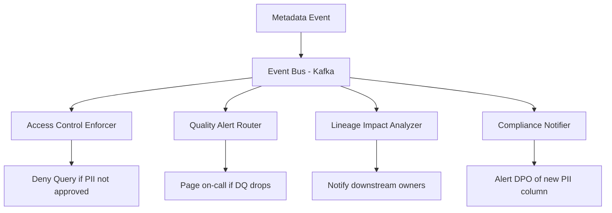

# Data Catalog — Senior Deep Dive

## Active Metadata Platform

Modern catalogs are not passive — they trigger workflows based on metadata events:



---

## DataHub GraphQL for Complex Queries

```python
import requests
from typing import Optional

class DataHubGraphQL:
    def __init__(self, url: str, token: str):
        self.endpoint = f"{url}/api/graphql"
        self.headers = {"Authorization": f"Bearer {token}"}
    
    def query(self, gql: str, variables: dict = None) -> dict:
        resp = requests.post(
            self.endpoint,
            json={"query": gql, "variables": variables or {}},
            headers=self.headers,
        )
        resp.raise_for_status()
        return resp.json()["data"]
    
    def get_upstream_lineage(self, dataset_urn: str, depth: int = 3) -> list[dict]:
        """Get full upstream lineage tree up to N hops."""
        gql = """
        query GetLineage($urn: String!, $direction: LineageDirection!, $start: Int!, $count: Int!) {
          searchAcrossLineage(input: {
            urn: $urn,
            direction: $direction,
            start: $start,
            count: $count,
          }) {
            searchResults {
              degree
              entity {
                urn
                type
                ... on Dataset {
                  name
                  platform { name }
                  lastIngested
                }
              }
            }
          }
        }
        """
        result = self.query(gql, {
            "urn": dataset_urn,
            "direction": "UPSTREAM",
            "start": 0,
            "count": 100,
        })
        return result["searchAcrossLineage"]["searchResults"]
    
    def get_dataset_schema_with_tags(self, dataset_urn: str) -> list[dict]:
        """Get schema fields with their governance tags."""
        gql = """
        query GetSchema($urn: String!) {
          dataset(urn: $urn) {
            schemaMetadata {
              fields {
                fieldPath
                type
                globalTags { tags { tag { name } } }
                glossaryTerms { terms { term { name } } }
              }
            }
          }
        }
        """
        result = self.query(gql, {"urn": dataset_urn})
        return result["dataset"]["schemaMetadata"]["fields"]
    
    def find_pii_datasets_without_access_control(self) -> list[str]:
        """Find datasets tagged PII but missing access control metadata."""
        gql = """
        query FindPIIDatasets {
          search(input: {
            type: DATASET,
            query: "*",
            filters: [{ field: "tags", value: "urn:li:tag:pii" }],
            count: 500
          }) {
            searchResults {
              entity {
                urn
                ... on Dataset {
                  name
                  access { accessPolicy }
                }
              }
            }
          }
        }
        """
        result = self.query(gql)
        uncontrolled = []
        for r in result["search"]["searchResults"]:
            entity = r["entity"]
            if not entity.get("access", {}).get("accessPolicy"):
                uncontrolled.append(entity["urn"])
        return uncontrolled
```

---

## Catalog-Driven Impact Analysis

When a table changes, automatically notify downstream owners:

```python
from dataclasses import dataclass
from typing import List, Set

@dataclass
class ImpactNode:
    urn: str
    name: str
    owner: str
    depth: int  # hops from changed table

class CatalogImpactAnalyzer:
    """
    Use catalog lineage to find all downstream assets affected by a change.
    Use case: before dropping a column, notify all downstream owners.
    """
    
    def __init__(self, catalog: DataHubGraphQL, notification_client):
        self.catalog = catalog
        self.notify = notification_client
    
    def find_impact(self, changed_urn: str, max_depth: int = 5) -> List[ImpactNode]:
        """BFS over downstream lineage."""
        visited: Set[str] = {changed_urn}
        queue = [(changed_urn, 0)]
        impacted = []
        
        while queue:
            current_urn, depth = queue.pop(0)
            if depth >= max_depth:
                continue
            
            # Get downstream assets
            downstream = self._get_downstream(current_urn)
            
            for asset in downstream:
                if asset["urn"] not in visited:
                    visited.add(asset["urn"])
                    node = ImpactNode(
                        urn=asset["urn"],
                        name=asset["name"],
                        owner=asset.get("owner", "unknown"),
                        depth=depth + 1,
                    )
                    impacted.append(node)
                    queue.append((asset["urn"], depth + 1))
        
        return impacted
    
    def notify_downstream_owners(self, changed_urn: str, change_description: str):
        """Send targeted notifications to owners of downstream assets."""
        impacted = self.find_impact(changed_urn)
        
        # Group by owner to send one email per owner
        by_owner = {}
        for node in impacted:
            by_owner.setdefault(node.owner, []).append(node)
        
        for owner, nodes in by_owner.items():
            table_list = "\n".join(f"  - {n.name} (depth: {n.depth})" for n in nodes)
            self.notify.send(
                to=owner,
                subject=f"Upstream change may affect your tables",
                body=f"""
The following upstream table has changed:
  URN: {changed_urn}
  Change: {change_description}

Your tables that may be affected:
{table_list}

Please review and test your pipelines.
                """.strip()
            )
        
        print(f"Notified {len(by_owner)} owners across {len(impacted)} downstream assets")
    
    def _get_downstream(self, urn: str) -> list[dict]:
        # Call DataHub lineage API
        results = self.catalog.query("""
        query($urn: String!) {
          dataset(urn: $urn) {
            downstream: lineage(direction: DOWNSTREAM, start: 0, count: 50) {
              relationships {
                entity {
                  urn
                  ... on Dataset { name }
                  ... on Dashboard { title }
                }
              }
            }
          }
        }
        """, {"urn": urn})
        
        return [
            r["entity"]
            for r in results.get("dataset", {}).get("downstream", {}).get("relationships", [])
        ]
```

---

## Catalog Recommendation Engine

Suggest related datasets based on usage patterns and tags:

```python
from collections import Counter
import numpy as np

class CatalogRecommendationEngine:
    """
    Recommend related datasets using:
    1. Co-usage: users who query A also query B
    2. Tag similarity: A and B share many tags
    3. Lineage proximity: A is upstream/downstream of B
    """
    
    def __init__(self, engine):
        self.engine = engine
    
    def co_usage_recommendations(self, dataset_urn: str, top_k: int = 5) -> list[dict]:
        """Find datasets frequently queried by the same users."""
        import sqlalchemy as sa
        
        with self.engine.connect() as conn:
            # Find users who query this dataset
            users = conn.execute(sa.text("""
                SELECT DISTINCT user_email
                FROM query_logs
                WHERE dataset_urn = :urn
                  AND queried_at >= NOW() - INTERVAL '30 days'
            """), {"urn": dataset_urn}).scalars().all()
            
            if not users:
                return []
            
            # Find other datasets these users query
            other_datasets = conn.execute(sa.text("""
                SELECT dataset_urn, COUNT(DISTINCT user_email) AS user_overlap
                FROM query_logs
                WHERE user_email = ANY(:users)
                  AND dataset_urn != :urn
                  AND queried_at >= NOW() - INTERVAL '30 days'
                GROUP BY dataset_urn
                ORDER BY user_overlap DESC
                LIMIT :k
            """), {"users": list(users), "urn": dataset_urn, "k": top_k}).fetchall()
        
        return [{"urn": r.dataset_urn, "overlap": r.user_overlap} for r in other_datasets]
```

---

## Interview Tips

> **Tip 1:** "What makes a catalog 'active' vs 'passive'?" — Passive catalog: stores metadata, you query it. Active catalog: responds to metadata changes with automated actions (block access if PII detected, notify owners when upstream changes, trigger quality checks on schema drift). Active metadata makes the catalog a control plane for data operations.

> **Tip 2:** "How would you design catalog lineage for a complex org?" — OpenLineage emitters in Spark, Airflow, dbt, and Flink push runtime lineage events to a central broker (Marquez or DataHub Kafka). The catalog assembles these into a graph. Key design choices: granularity (table-level vs column-level), handling failed runs (lineage for partial runs?), cross-system lineage stitching.

> **Tip 3:** "How do you handle catalog scale with 10,000+ tables?" — Paginated GraphQL queries, Elasticsearch-backed search index, precomputed lineage graph snapshots for fast traversal. Catalog freshness tiers: tier-1 tables (core, daily ingestion), tier-2 (weekly), tier-3 (on-demand). Don't profile every table daily — profile based on usage and criticality.

## ⚡ Cheat Sheet

**Metadata layers**
| Layer | Examples | Source |
|---|---|---|
| Technical | Schema, types, row counts | Auto-ingested connector |
| Operational | Freshness, SLA, pipeline runs | Observability tooling |
| Business | Descriptions, owners, glossary terms | Human or LLM-assisted |
| Social | Most-queried tables, search rank | Usage analytics |

**DataHub URN**: `urn:li:dataset:(urn:li:dataPlatform:snowflake,db.schema.table,PROD)`

**Metadata gate**
```python
def metadata_gate(table_name, catalog):
    meta = catalog.get(table_name)
    issues = [k for k in ["description","owner","sensitivity"] if not meta.get(k)]
    if issues: raise ValueError(f"{table_name}: missing {', '.join(issues)}")
```

**DataHub recipe (auto-ingest)**
```yaml
source:
  type: snowflake
  config: {account_id: xy12345, database: PROD}
sink:
  type: datahub-rest
  config: {server: "http://datahub:8080"}
```

**Key points**
- Catalog = discovery; governance tools = policy enforcement (different concerns)
- Column-level lineage is 10x harder to capture, 10x more useful for impact analysis
- Data products: catalog entries with SLA + owner + access request link
