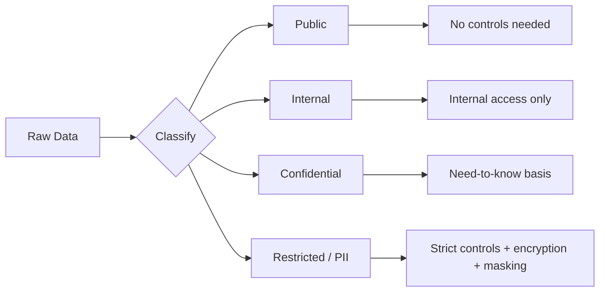

# Data Classification — Fundamentals


## 🎯 Analogy

Think of data classification like a security clearance system: every column gets a label (Public, Internal, Confidential, Restricted/PII), and downstream access controls, masking, and retention policies automatically enforce based on the label.

---
## What Is Data Classification?

Data classification is the process of categorizing data by sensitivity, regulatory requirements, and business value. It determines how data should be stored, accessed, and protected.



---

## Standard Classification Levels

| Level | Description | Examples | Controls |
|---|---|---|---|
| **Public** | Can be freely shared externally | Marketing website data, published reports | None required |
| **Internal** | For employee use only, not for public | Meeting notes, internal dashboards | SSO authentication |
| **Confidential** | Sensitive business data | Revenue figures, strategic plans | Role-based access, encryption at rest |
| **Restricted** | Regulatory or PII data | Customer emails, SSNs, medical records | Strict RBAC, masking, audit logging, encryption |

---

## Classification Taxonomy for Data Engineering

```python
from dataclasses import dataclass
from typing import List

@dataclass
class DataClassification:
    level: str                  # public | internal | confidential | restricted
    sensitivity_tags: List[str] # pii, phi, financial, strategic, etc.
    regulatory_scope: List[str] # gdpr, ccpa, hipaa, sox, pci-dss
    retention_years: int
    encryption_required: bool
    masking_required: bool
    access_approval_required: bool

# Classification registry
CLASSIFICATIONS = {
    "public": DataClassification(
        level="public",
        sensitivity_tags=[],
        regulatory_scope=[],
        retention_years=1,
        encryption_required=False,
        masking_required=False,
        access_approval_required=False,
    ),
    "internal": DataClassification(
        level="internal",
        sensitivity_tags=["internal"],
        regulatory_scope=[],
        retention_years=3,
        encryption_required=True,
        masking_required=False,
        access_approval_required=False,
    ),
    "pii": DataClassification(
        level="restricted",
        sensitivity_tags=["pii", "restricted"],
        regulatory_scope=["gdpr", "ccpa"],
        retention_years=7,
        encryption_required=True,
        masking_required=True,
        access_approval_required=True,
    ),
    "financial": DataClassification(
        level="confidential",
        sensitivity_tags=["financial", "confidential"],
        regulatory_scope=["sox"],
        retention_years=7,
        encryption_required=True,
        masking_required=False,
        access_approval_required=True,
    ),
    "medical": DataClassification(
        level="restricted",
        sensitivity_tags=["phi", "hipaa", "restricted"],
        regulatory_scope=["hipaa"],
        retention_years=6,
        encryption_required=True,
        masking_required=True,
        access_approval_required=True,
    ),
}
```

---

## Tagging Data in Practice

```sql
-- Snowflake: Tag-based classification
-- Create classification tags
CREATE TAG sensitivity ALLOWED_VALUES 'public', 'internal', 'confidential', 'restricted';
CREATE TAG pii_type ALLOWED_VALUES 'email', 'phone', 'ssn', 'name', 'address', 'financial', 'biometric';
CREATE TAG regulatory ALLOWED_VALUES 'gdpr', 'ccpa', 'hipaa', 'sox', 'pci-dss';

-- Apply to a table
ALTER TABLE gold.customers SET TAG sensitivity = 'restricted';
ALTER TABLE gold.customers SET TAG regulatory = 'gdpr';

-- Apply to specific columns
ALTER TABLE gold.customers MODIFY COLUMN email SET TAG pii_type = 'email';
ALTER TABLE gold.customers MODIFY COLUMN phone SET TAG pii_type = 'phone';

-- Query tags (audit what is classified)
SELECT
    table_name,
    column_name,
    tag_name,
    tag_value
FROM TABLE(INFORMATION_SCHEMA.TAG_REFERENCES_ALL_COLUMNS('GOLD.CUSTOMERS', 'TABLE'));
```

---

## Column-Level Classification in dbt

```yaml
# models/gold/schema.yml
models:
  - name: customers
    description: "Customer master data"
    meta:
      sensitivity: restricted
      regulatory: [gdpr, ccpa]
    
    columns:
      - name: customer_id
        description: "Surrogate key — not PII"
        tags: [internal]
      
      - name: email
        description: "Customer email address"
        tags: [pii, restricted]
        meta:
          pii_type: email
          masking: hash_sha256
          regulatory: [gdpr, ccpa]
      
      - name: created_at
        description: "Account creation timestamp"
        tags: [internal]
      
      - name: total_spend_usd
        description: "Lifetime spend — aggregated, not PII"
        tags: [confidential]
```

---


## ▶️ Try It Yourself

```python
import re
from dataclasses import dataclass

# Automated PII classifier (simplified)
PII_PATTERNS = {
    "email":   re.compile(r"[A-Za-z0-9._%+-]+@[A-Za-z0-9.-]+\.[A-Z|a-z]{2,}"),
    "phone":   re.compile(r"\d{3}[-.]?\d{3}[-.]?\d{4}"),
    "ssn":     re.compile(r"\d{3}-\d{2}-\d{4}"),
    "credit_card": re.compile(r"\d{4}[- ]?\d{4}[- ]?\d{4}[- ]?\d{4}"),
}

COLUMN_NAME_HINTS = {
    "Restricted": ["ssn", "social_security", "credit_card", "password", "secret"],
    "Confidential": ["email", "phone", "address", "dob", "birth"],
    "Internal": ["name", "salary", "department"],
}

def classify_column(col_name: str, sample_values: list) -> str:
    col_lower = col_name.lower()
    for level, hints in COLUMN_NAME_HINTS.items():
        if any(h in col_lower for h in hints):
            return level
    sample_str = " ".join(str(v) for v in sample_values)
    for label, pattern in PII_PATTERNS.items():
        if pattern.search(sample_str):
            return "Restricted"
    return "Public"

print(classify_column("customer_email", ["alice@example.com"]))   # Confidential
print(classify_column("revenue", [100, 200, 300]))                # Public
```

> **Run it:** Copy the snippet into a REPL or file — no external services needed for the basic example.

---
## Interview Tips

> **Tip 1:** "Why does data classification matter?" — Classification drives all downstream controls. A 'restricted' label triggers: encryption, masking, access approval workflow, audit logging, shorter retention. Without classification, you can't consistently apply the right controls or know what GDPR scope applies.

> **Tip 2:** "What tags would you put on a table with customer names and purchase history?" — `restricted` (sensitivity), `pii` (has names), `financial` (purchase amounts), `gdpr` and `ccpa` (regulatory scope). Column-level: name columns get `pii:name`, amount columns get `financial`.

> **Tip 3:** "How does classification relate to access control?" — Classification level determines which role can access the data. `public` → anyone. `internal` → SSO required. `confidential` → specific business role. `restricted` → explicit approval + DPO sign-off for PII. Classification is the policy input; RBAC is the enforcement mechanism.
