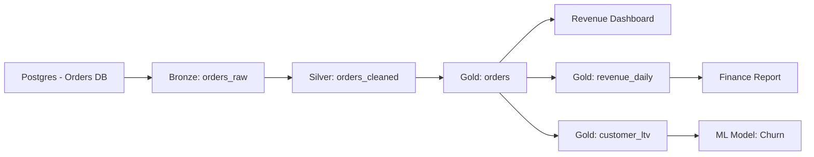

# Data Lineage — Fundamentals

## What Is Data Lineage?

Data lineage tracks the origin of data, how it moves and transforms across systems, and where it is consumed. It answers: "Where did this data come from and what does it affect?"



---

## Why Lineage Matters

| Use Case | How Lineage Helps |
|---|---|
| **Impact analysis** | "If I change silver.orders, what breaks?" |
| **Root cause analysis** | "Where did this bad value come from?" |
| **Compliance / audit** | "Show the full data flow for this PII column" |
| **Deprecation** | "Is anyone using this table before I delete it?" |
| **Debugging** | "Which pipeline produced this row?" |

---

## Lineage Granularity Levels

```
Table-level:  silver.orders → gold.orders
              (coarse-grained, easy to capture)

Column-level: silver.orders.amount → gold.orders.total_usd
              (fine-grained, requires parsing SQL or dbt logic)

Row-level:    gold.orders row 12345 came from bronze.orders_raw row 98765
              (very fine, used in regulated industries)
```

---

## OpenLineage Standard

OpenLineage is an open standard for capturing lineage events at runtime:

```json
{
  "eventType": "COMPLETE",
  "eventTime": "2024-01-15T08:22:11.000Z",
  "run": {
    "runId": "abc-123",
    "facets": {
      "parent": {
        "_producer": "airflow",
        "run": { "runId": "airflow-dag-run-456" },
        "job": { "namespace": "airflow", "name": "orders_pipeline.transform_silver" }
      }
    }
  },
  "job": {
    "namespace": "spark",
    "name": "transform_silver_orders"
  },
  "inputs": [
    {
      "namespace": "snowflake://myaccount",
      "name": "BRONZE.ORDERS_RAW",
      "facets": {
        "schema": {
          "fields": [
            { "name": "order_id", "type": "VARCHAR" },
            { "name": "amount", "type": "NUMBER" }
          ]
        }
      }
    }
  ],
  "outputs": [
    {
      "namespace": "snowflake://myaccount",
      "name": "SILVER.ORDERS_CLEANED"
    }
  ]
}
```

---

## Basic Lineage Tracking

```python
from datetime import datetime
from typing import List, Dict
from dataclasses import dataclass, field
import uuid

@dataclass
class LineageEvent:
    job_name: str
    inputs: List[str]       # table names or URNs
    outputs: List[str]
    run_id: str = field(default_factory=lambda: str(uuid.uuid4()))
    event_time: datetime = field(default_factory=datetime.utcnow)
    status: str = "COMPLETE"  # START | COMPLETE | FAIL

class SimpleLineageTracker:
    """Track table-level lineage in a database."""
    
    def __init__(self, engine):
        self.engine = engine
    
    def record_lineage(self, event: LineageEvent):
        """Persist a lineage event."""
        import sqlalchemy as sa
        
        with self.engine.begin() as conn:
            for input_table in event.inputs:
                for output_table in event.outputs:
                    conn.execute(sa.text("""
                        INSERT INTO lineage_edges
                        (source_table, target_table, job_name, run_id, recorded_at)
                        VALUES (:src, :tgt, :job, :run, :ts)
                        ON CONFLICT (source_table, target_table, job_name)
                        DO UPDATE SET run_id = EXCLUDED.run_id, recorded_at = EXCLUDED.recorded_at
                    """), {
                        "src": input_table, "tgt": output_table,
                        "job": event.job_name, "run": event.run_id, "ts": event.event_time,
                    })
    
    def get_upstream(self, table: str, max_hops: int = 3) -> List[str]:
        """Get all upstream tables up to N hops."""
        import sqlalchemy as sa
        
        with self.engine.connect() as conn:
            result = conn.execute(sa.text("""
                WITH RECURSIVE upstream AS (
                    SELECT source_table, 1 AS depth
                    FROM lineage_edges
                    WHERE target_table = :table
                    UNION ALL
                    SELECT e.source_table, u.depth + 1
                    FROM lineage_edges e
                    JOIN upstream u ON e.target_table = u.source_table
                    WHERE u.depth < :max_hops
                )
                SELECT DISTINCT source_table FROM upstream
            """), {"table": table, "max_hops": max_hops})
        
        return [r[0] for r in result]
    
    def get_downstream(self, table: str, max_hops: int = 3) -> List[str]:
        """Get all downstream tables (impact analysis)."""
        import sqlalchemy as sa
        
        with self.engine.connect() as conn:
            result = conn.execute(sa.text("""
                WITH RECURSIVE downstream AS (
                    SELECT target_table, 1 AS depth
                    FROM lineage_edges
                    WHERE source_table = :table
                    UNION ALL
                    SELECT e.target_table, d.depth + 1
                    FROM lineage_edges e
                    JOIN downstream d ON e.source_table = d.target_table
                    WHERE d.depth < :max_hops
                )
                SELECT DISTINCT target_table FROM downstream
            """), {"table": table, "max_hops": max_hops})
        
        return [r[0] for r in result]

# Usage
tracker = SimpleLineageTracker(engine)
tracker.record_lineage(LineageEvent(
    job_name="transform_silver",
    inputs=["bronze.orders_raw"],
    outputs=["silver.orders_cleaned"],
))

print(tracker.get_downstream("bronze.orders_raw"))
# → ['silver.orders_cleaned', 'gold.orders', 'revenue_dashboard']
```

---

## Interview Tips

> **Tip 1:** "What is data lineage and why does it matter?" — Lineage tracks the data's journey: source → transformations → destination. Matters for: debugging (trace bad data to source), impact analysis (what breaks if I change X), compliance (prove PII flow for GDPR audits), and safe deprecation (is anyone using this table?).

> **Tip 2:** "What is OpenLineage?" — An open standard (spec + SDKs) for emitting lineage events from any data tool. Tools like Spark, Airflow, dbt, and Flink have OpenLineage integrations. Events are sent to a backend like Marquez or DataHub. Enables cross-tool lineage stitching.

> **Tip 3:** "What's the difference between table-level and column-level lineage?" — Table-level says "silver.orders feeds gold.orders." Column-level says "silver.orders.amount → gold.orders.total_usd." Column lineage requires SQL parsing or transformation framework support (dbt provides it). Much harder to capture but needed for precise PII tracking.
