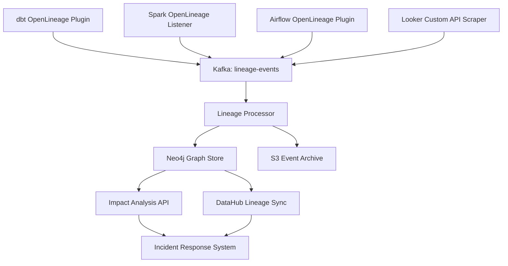

# Data Lineage — Interview Scenarios


<article data-difficulty="junior">

## 🟢 Junior: Safe Table Deletion

**Scenario:** A team wants to delete an old table `legacy.orders_v1`. How do you ensure it's safe to delete?

<details>
<summary>💡 Hint</summary>

**Step 1: Check lineage (does anyone depend on it?)**

</details>

<details>
<summary>✅ Solution</summary>

**Step 1: Check lineage (does anyone depend on it?)**
```python
# Check Marquez or DataHub for downstream tables
downstream = lineage_client.get_downstream("legacy.orders_v1")
print(f"Downstream assets: {downstream}")
# If non-empty: not safe to delete
```

**Step 2: Check recent query logs**
```sql
SELECT COUNT(*) AS query_count, COUNT(DISTINCT user_email) AS unique_users
FROM query_logs
WHERE table_name = 'legacy.orders_v1'
  AND queried_at >= NOW() - INTERVAL '90 days';
-- If > 0: table is actively used
```

**Step 3: Check for views or jobs that reference it**
```sql
-- Snowflake: search view definitions
SELECT table_name, view_definition
FROM information_schema.views
WHERE view_definition ILIKE '%legacy.orders_v1%';
```

**Step 4: If safe — deprecate first, delete later**
```python
# Mark as deprecated in DataHub (shows warning to users)
catalog.deprecate("legacy.orders_v1", 
    message="Replaced by gold.orders. Will be deleted 2024-03-01.")

# Wait 30 days for teams to migrate
# Then delete
```

**Rule of thumb:** Never delete immediately. Deprecate → wait 30 days → confirm no queries → delete.

</details>

</article>

<article data-difficulty="mid-level">

## 🟡 Mid-Level: Root Cause via Lineage

**Scenario:** Your revenue dashboard is showing wrong numbers for 2 days. The dashboard reads from `gold.revenue_daily`. How do you use lineage to find the root cause?

<details>
<summary>💡 Hint</summary>

**Finding:** `gold.revenue_daily` transformation job has a bug — row count normal in silver but wrong in gold → transformation layer issue.

</details>

<details>
<summary>✅ Solution</summary>

```python
# Step 1: Get full upstream lineage of gold.revenue_daily
upstream = lineage_client.get_upstream("gold.revenue_daily", max_hops=5)
print(upstream)
# → ['silver.orders_cleaned', 'bronze.orders_raw', 'source.postgres_orders']

# Step 2: Check each layer for data issues — work backwards
layers = ["gold.revenue_daily", "silver.orders_cleaned", "bronze.orders_raw"]

for table in layers:
    row_count = engine.execute(f"SELECT COUNT(*) FROM {table} WHERE date = '2024-01-14'").scalar()
    print(f"{table}: {row_count:,} rows")

# Output:
# gold.revenue_daily: 1 rows (wrong — should be 365 rows for day-level agg)
# silver.orders_cleaned: 48,000 rows (normal)
# bronze.orders_raw: 48,000 rows (normal)
```

**Finding:** `gold.revenue_daily` transformation job has a bug — row count normal in silver but wrong in gold → transformation layer issue.

```sql
-- Check the transformation job logs
SELECT run_id, started_at, completed_at, status, error_message
FROM job_runs
WHERE job_name = 'gold_revenue_daily_transform'
  AND DATE(started_at) = '2024-01-14';

-- Check the git log for recent changes to the transformation
-- git log --since="2 days ago" -- pipelines/gold/revenue_daily.py
```

**Result:** A recent commit changed the GROUP BY clause — removing `channel` column broke the aggregation logic. Lineage helped identify exactly which transformation was the culprit.

</details>

</article>

<article data-difficulty="senior">

## 🔴 Senior: Designing a Lineage Platform

**Scenario:** Your company processes 500 pipelines daily, uses Spark, Airflow, dbt, and Looker. Design a lineage platform that captures end-to-end lineage from source to dashboard.

<details>
<summary>💡 Hint</summary>

Use OpenLineage as the collection standard — it has native integrations for Spark (SparkListener), dbt (plugin), and Airflow (plugin), emitting structured events at each job start/complete/fail. Route events through Kafka for durability, then store in a graph database (Neo4j) that can answer "what tables does this dashboard depend on?" and "what dashboards break if I change this column?" The hardest part is Looker — no native OpenLineage, so you scrape LookML via API. Think about column-level vs table-level lineage: column-level is 10× more complex to capture but 10× more useful for impact analysis.

</details>

<details>
<summary>✅ Solution</summary>



**Key design decisions:**

**1. Event collection**
```
dbt:      openlineage-dbt plugin emits on dbt run complete
Spark:    SparkListener emits per-job (START + COMPLETE + FAIL)
Airflow:  OpenLineageDAG wraps all tasks automatically
Looker:   No native OpenLineage — scrape LookML explores via API
```

**2. Normalization layer (URN stitching)**
```python
# Different systems use different names for the same table
# Must normalize before storing edges
stitcher = LineageStitcher()
canonical_urn = stitcher.normalize("snowflake", "SILVER.ORDERS_CLEANED")
# → urn:li:dataset:(urn:li:dataPlatform:snowflake,silver.orders_cleaned,PROD)
```

**3. Storage layer**
```
Graph DB (Neo4j):   Fast traversal for impact analysis (sub-100ms for 5-hop queries)
Event archive (S3): Full audit log — replay lineage for any point in time
DataHub sync:       Push enriched lineage to catalog for UI
```

**4. Reliability**
```
- Kafka: buffer events if graph store is down — no lineage loss
- Idempotent upserts: re-emitting same event is safe (MERGE in Neo4j)
- Lineage validation in CI: pipeline PRs must pass lineage emission test
```

**Monitoring:**
```python
# Alert if lineage coverage drops
def check_lineage_coverage(engine) -> float:
    with engine.connect() as conn:
        total_pipeline_runs = conn.execute(sa.text(
            "SELECT COUNT(*) FROM pipeline_runs WHERE started_at >= NOW() - INTERVAL '24 hours'"
        )).scalar()
        
        lineage_events = conn.execute(sa.text(
            "SELECT COUNT(DISTINCT run_id) FROM lineage_events WHERE event_time >= NOW() - INTERVAL '24 hours'"
        )).scalar()
    
    coverage = lineage_events / max(total_pipeline_runs, 1)
    if coverage < 0.95:
        alert(f"Lineage coverage dropped to {coverage:.0%} — check OpenLineage emitters")
    return coverage
```

</details>

</article>
---

## ⚡ Quick-fire Q&A

**Q: What is data lineage and why does it matter for data engineering?**
A: Data lineage tracks the origin, movement, and transformation of data from source systems through pipelines to final consumers. It matters because it enables impact analysis (what breaks if this source changes?), root cause investigation for data quality issues, and compliance auditing.

**Q: What is the difference between column-level and table-level lineage?**
A: Table-level lineage shows which tables feed into which other tables. Column-level lineage goes further, tracking exactly which source columns are used to derive each target column. Column-level lineage is more powerful for impact analysis but harder to capture automatically.

**Q: How do you capture lineage automatically versus manually?**
A: Automatic capture uses SQL parsers (e.g., OpenLineage, SQLLineage), query log analysis, or framework-level instrumentation in orchestrators like Airflow and dbt. Manual lineage requires engineers to document transformations, which is error-prone and goes stale. Modern platforms prefer automatic capture supplemented by manual annotations for business context.

**Q: What is OpenLineage and why is it significant?**
A: OpenLineage is an open standard (now a Linux Foundation project) for collecting and sharing lineage metadata across tools. It provides a common event schema so orchestrators, query engines, and catalogs can exchange lineage data without proprietary integrations, enabling a unified lineage graph across the stack.

**Q: How does lineage support GDPR right-to-erasure (right to be forgotten) requests?**
A: Lineage shows every location where a person's data has been copied or derived — raw tables, aggregates, ML features, and reports. Without complete lineage, erasure requests are incomplete and non-compliant. With lineage, you can systematically identify and delete or mask data in every downstream location.

**Q: What is the difference between forward and backward lineage traversal?**
A: Forward (downstream) lineage asks "what is affected if this dataset changes?" — useful for impact analysis before making schema changes. Backward (upstream) lineage asks "where did this data come from?" — useful for debugging data quality issues and tracing the origin of a value.

**Q: Name two tools that support data lineage tracking in modern data stacks.**
A: dbt exposes SQL-level lineage through its DAG. Apache Atlas and DataHub provide platform-wide lineage graphs. Marquez implements the OpenLineage standard for Airflow and Spark pipelines. Alation and Collibra include lineage in their commercial catalog offerings.

---

## 💼 Interview Tips

- Lead impact analysis when explaining why lineage matters — the "what happens downstream if I change this column?" scenario resonates immediately with interviewers who have been burned by undocumented schema changes.
- Mention OpenLineage by name and explain its role as a standard rather than a product — it shows you follow the ecosystem and think about interoperability.
- For senior roles, discuss lineage in the context of data mesh: explain how lineage graphs must span domain boundaries and how a central catalog aggregates cross-domain lineage.
- Connect lineage to GDPR and data erasure explicitly in compliance-focused interviews — it is the clearest example of why governance tooling has direct regulatory value.
- Demonstrate awareness of the gap between logical lineage (what the code intends) and physical lineage (what actually ran) — runtime failures and conditional branches mean intent and execution can diverge.
- Avoid claiming lineage is easy to maintain manually at scale — acknowledge the operational burden and emphasize automation through OpenLineage-compatible instrumentation.
