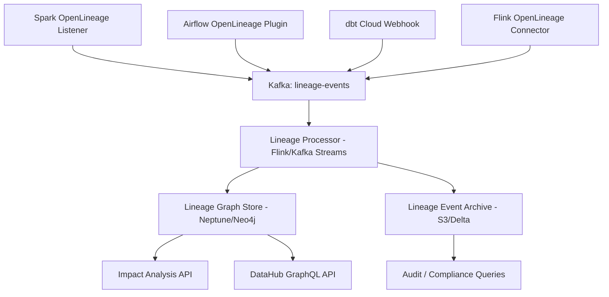

# Data Lineage — Senior Deep Dive

## Designing a Lineage Platform at Scale

A production lineage platform must handle cross-system lineage, handle failures gracefully, and serve sub-second impact analysis queries.



---

## SQL-Based Column Lineage Extraction

For pipelines that don't use dbt, parse SQL to extract column lineage:

```python
import sqlglot
import sqlglot.expressions as exp
from dataclasses import dataclass
from typing import List, Dict, Set

@dataclass
class ColumnRef:
    table: str
    column: str

@dataclass  
class ColumnLineageEdge:
    source: ColumnRef
    target: ColumnRef
    transformation: str  # "direct", "aggregation", "expression"

class SQLColumnLineageExtractor:
    """
    Extract column-level lineage from SQL using sqlglot.
    Supports: SELECT, CTAS, INSERT INTO SELECT.
    """
    
    def extract(self, sql: str, target_table: str) -> List[ColumnLineageEdge]:
        """Parse SQL and return column-level lineage edges."""
        tree = sqlglot.parse_one(sql, dialect="snowflake")
        edges = []
        
        # Walk through SELECT expressions
        for select_expr in tree.find_all(exp.Select):
            for col_expr in select_expr.expressions:
                target_col = self._get_alias_or_name(col_expr)
                if not target_col:
                    continue
                
                # Find source columns referenced in this expression
                source_cols = self._find_source_columns(col_expr)
                transformation = self._classify_transformation(col_expr)
                
                for src in source_cols:
                    edges.append(ColumnLineageEdge(
                        source=src,
                        target=ColumnRef(table=target_table, column=target_col),
                        transformation=transformation,
                    ))
        
        return edges
    
    def _get_alias_or_name(self, expr) -> str:
        if isinstance(expr, exp.Alias):
            return expr.alias
        if isinstance(expr, exp.Column):
            return expr.name
        return None
    
    def _find_source_columns(self, expr) -> List[ColumnRef]:
        """Recursively find all column references in an expression."""
        sources = []
        for col in expr.find_all(exp.Column):
            table = col.table or "unknown"
            sources.append(ColumnRef(table=table, column=col.name))
        return sources
    
    def _classify_transformation(self, expr) -> str:
        if expr.find(exp.AggFunc):
            return "aggregation"
        if expr.find(exp.Case) or expr.find(exp.If):
            return "expression"
        if isinstance(expr, exp.Column) or (isinstance(expr, exp.Alias) and isinstance(expr.this, exp.Column)):
            return "direct"
        return "expression"

# Usage
extractor = SQLColumnLineageExtractor()
sql = """
SELECT
    o.order_id,
    c.email AS customer_email,
    SUM(oi.unit_price * oi.quantity) AS total_amount,
    CASE WHEN o.status = 'cancelled' THEN 0 ELSE 1 END AS is_active
FROM orders o
JOIN customers c ON o.customer_id = c.id
JOIN order_items oi ON o.order_id = oi.order_id
GROUP BY o.order_id, c.email, o.status
"""

edges = extractor.extract(sql, target_table="gold.orders")
for edge in edges:
    print(f"{edge.source.table}.{edge.source.column} → {edge.target.table}.{edge.target.column} [{edge.transformation}]")
```

---

## Graph-Based Lineage Store (Neo4j)

For fast multi-hop lineage queries, use a graph database:

```python
from neo4j import GraphDatabase
from typing import List

class LineageGraphStore:
    """Store and query lineage using Neo4j graph database."""
    
    def __init__(self, uri: str, auth: tuple):
        self.driver = GraphDatabase.driver(uri, auth=auth)
    
    def upsert_lineage(self, source: str, target: str, job: str, run_id: str):
        """Add a lineage edge to the graph."""
        with self.driver.session() as session:
            session.run("""
                MERGE (src:Dataset {name: $source})
                MERGE (tgt:Dataset {name: $target})
                MERGE (j:Job {name: $job})
                MERGE (src)-[r:PRODUCES {via: $job}]->(tgt)
                SET r.last_run_id = $run_id, r.updated_at = datetime()
                MERGE (j)-[:READS]->(src)
                MERGE (j)-[:WRITES]->(tgt)
            """, source=source, target=target, job=job, run_id=run_id)
    
    def get_impact(self, dataset: str, max_hops: int = 5) -> List[dict]:
        """Find all downstream datasets — impact analysis."""
        with self.driver.session() as session:
            result = session.run("""
                MATCH path = (src:Dataset {name: $name})-[:PRODUCES*1..$depth]->(affected:Dataset)
                RETURN DISTINCT
                    affected.name AS dataset,
                    length(path) AS hops,
                    [n IN nodes(path)[1..] | n.name] AS lineage_path
                ORDER BY hops
            """, name=dataset, depth=max_hops)
            
            return [{"dataset": r["dataset"], "hops": r["hops"], "path": r["lineage_path"]} for r in result]
    
    def find_root_sources(self, dataset: str) -> List[str]:
        """Find tables with no upstream (data sources)."""
        with self.driver.session() as session:
            result = session.run("""
                MATCH path = (src:Dataset)-[:PRODUCES*]->(tgt:Dataset {name: $name})
                WHERE NOT ()-[:PRODUCES]->(src)
                RETURN DISTINCT src.name AS source
            """, name=dataset)
            return [r["source"] for r in result]
    
    def get_orphaned_datasets(self) -> List[str]:
        """Find datasets with no downstream consumers — candidates for deletion."""
        with self.driver.session() as session:
            result = session.run("""
                MATCH (d:Dataset)
                WHERE NOT (d)-[:PRODUCES]->()
                  AND NOT d.name STARTS WITH 'gold.'  // gold tables consumed externally
                RETURN d.name AS dataset
            """)
            return [r["dataset"] for r in result]
```

---

## Cross-System Lineage Stitching

Connect lineage across Spark, Airflow, and dashboards:

```python
from dataclasses import dataclass
from typing import Dict, List

@dataclass
class SystemAsset:
    system: str          # "snowflake", "s3", "looker", "airflow"
    identifier: str      # platform-specific identifier
    urn: str             # normalized URN for cross-system matching

class LineageStitcher:
    """
    Stitch lineage across multiple systems using URN normalization.
    
    Problem: Spark emits "s3://bucket/silver/orders", 
             Snowflake references "SILVER.ORDERS",
             Looker references "silver_orders".
    Solution: Normalize all to a canonical URN.
    """
    
    # Mapping rules: (system, pattern) → canonical URN
    NORMALIZATION_RULES = {
        "s3": lambda path: f"urn:li:dataset:(urn:li:dataPlatform:s3,{path.rstrip('/').split('/')[-1]},PROD)",
        "snowflake": lambda name: f"urn:li:dataset:(urn:li:dataPlatform:snowflake,{name.lower()},PROD)",
        "looker": lambda view: f"urn:li:dataset:(urn:li:dataPlatform:looker,{view},PROD)",
    }
    
    def normalize(self, system: str, identifier: str) -> str:
        rule = self.NORMALIZATION_RULES.get(system)
        if rule:
            return rule(identifier)
        return f"urn:li:dataset:(urn:li:dataPlatform:{system},{identifier},PROD)"
    
    def stitch(self, events: List[dict]) -> List[dict]:
        """
        Take raw lineage events from multiple systems and produce unified edges.
        Each event: {"source_system": str, "source": str, "target_system": str, "target": str, "job": str}
        """
        edges = []
        for event in events:
            edges.append({
                "source_urn": self.normalize(event["source_system"], event["source"]),
                "target_urn": self.normalize(event["target_system"], event["target"]),
                "job": event["job"],
            })
        return edges
```

---

## Interview Tips

> **Tip 1:** "How do you handle lineage for streaming pipelines?" — Flink has OpenLineage support via the `flink-connector-openlineage` library. For custom streaming jobs: emit OpenLineage events in the `processElement()` or window close logic. Key challenge: streaming jobs run continuously, so lineage events need to be batched or emitted per-micro-batch with a synthetic run ID.

> **Tip 2:** "How would you design a lineage system for 10,000+ tables?" — Use a graph database (Neo4j or Amazon Neptune) for traversal queries. Separate the event ingestion (Kafka) from the graph store — consumers are decoupled and can replay. Implement lineage tiers: column-level only for PII-tagged columns, table-level for everything else. Cache impact analysis results for hot datasets.

> **Tip 3:** "What is lineage 'stitching' and why is it hard?" — Each system emits lineage with its own naming conventions. S3 paths, Snowflake table names, Looker view names, dbt model names all refer to the same logical asset. Stitching normalizes these to a canonical URN so the lineage graph connects. Hard because naming is inconsistent, renames break existing edges, and external dashboards don't emit OpenLineage events.
