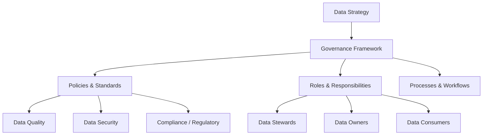

# Data Governance — Fundamentals

## What Is Data Governance?

Data governance is the set of policies, processes, roles, and standards that ensure data is accurate, accessible, consistent, and protected across an organization.



---

## Why Data Governance Matters

| Without Governance | With Governance |
|---|---|
| Multiple definitions of "revenue" | Single agreed metric definition |
| No one knows who owns a dataset | Clear data ownership per domain |
| PII in wrong S3 bucket | PII classified and access-controlled |
| Audit failure — can't prove data lineage | Full lineage to satisfy regulators |
| Bad data reaches dashboards | DQ checks enforced at ingestion |

---

## Core Components

### 1. Policies
Rules about how data should be managed:
```
- Data Retention Policy: raw data retained 7 years, aggregates 3 years
- Access Control Policy: PII access requires DPO approval
- Data Quality Policy: completeness must be ≥ 95% for production tables
```

### 2. Roles
```
Data Owner:       Accountable for a data domain (e.g., Sales VP owns orders data)
Data Steward:     Day-to-day curator — defines, monitors, and documents data
Data Custodian:   Technical keeper — implements policies (usually a DE)
Data Consumer:    Uses data — must comply with usage policies
```

### 3. Metadata
Data about data:
```python
# Business metadata
{
    "table": "gold.orders",
    "owner": "revenue-team",
    "steward": "jane.smith@company.com",
    "description": "Cleaned and deduped orders from all sales channels",
    "update_frequency": "daily at 08:00 UTC",
    "sla": "available by 09:00 UTC",
}

# Technical metadata (populated automatically)
{
    "row_count": 1_250_000,
    "columns": 42,
    "last_updated": "2024-01-15T08:22:11Z",
    "schema_version": "3.2.1",
    "storage_bytes": 4_200_000_000,
}
```

### 4. Data Catalog
A searchable inventory of all data assets (tables, pipelines, dashboards). Enables discovery and reduces shadow IT.

### 5. Data Lineage
Tracking where data comes from and where it goes:
```
Source DB → Bronze (raw) → Silver (cleaned) → Gold (aggregated) → Dashboard
```

---

## Governance Maturity Model

```
Level 1 - Reactive:   No governance, fix issues as they occur
Level 2 - Defined:    Policies exist on paper, some roles assigned
Level 3 - Managed:    Policies enforced, catalog in place, DQ tracked
Level 4 - Optimized:  Automated governance, lineage tracked, cost accountability
```

---

## Data Governance vs. Data Management

| Concept | Focus |
|---|---|
| Data Governance | Policies, roles, accountability — the *what and why* |
| Data Management | Implementation — the *how* (pipelines, storage, tooling) |
| Data Stewardship | Human execution of governance for a specific domain |

---

## Simple Policy Example

```python
from dataclasses import dataclass
from typing import List

@dataclass
class DataPolicy:
    policy_id: str
    name: str
    applies_to: List[str]       # table names or patterns
    rule: str                   # human-readable rule
    enforcement: str            # "automated" | "manual"
    owner: str

# Define policies
policies = [
    DataPolicy(
        policy_id="POL-001",
        name="PII Access Control",
        applies_to=["*.customers", "*.users", "*.payments"],
        rule="Tables containing PII require explicit approval before access.",
        enforcement="automated",
        owner="data-governance-team",
    ),
    DataPolicy(
        policy_id="POL-002",
        name="Data Retention",
        applies_to=["bronze.*"],
        rule="Raw data retained for 7 years. Delete after retention period.",
        enforcement="manual",
        owner="platform-team",
    ),
]

def get_policies_for_table(table: str) -> List[DataPolicy]:
    """Return all policies that apply to a given table."""
    return [
        p for p in policies
        if any(
            table.endswith(pattern.lstrip("*")) or table == pattern
            for pattern in p.applies_to
        )
    ]
```

---

## Interview Tips

> **Tip 1:** "What is data governance?" — It's the framework of policies, roles, and processes that ensure data is trustworthy, secure, and compliant. Key pillars: data quality, access control, metadata, lineage, and compliance. Often confused with data management — governance is the *policy*, management is the *implementation*.

> **Tip 2:** "What's the difference between a data owner and a data steward?" — Owner is accountable (business leader, often VP level). Steward is responsible day-to-day (analyst or DE who defines, documents, and monitors the data). Many organizations confuse these — good governance separates them.

> **Tip 3:** "Why does governance matter for data engineers?" — DEs implement governance: enforcing DQ checks, tagging PII columns, setting up access controls, tracking lineage. Without governance guidance, DEs build pipelines that leak sensitive data or produce metrics that differ from finance's numbers.
