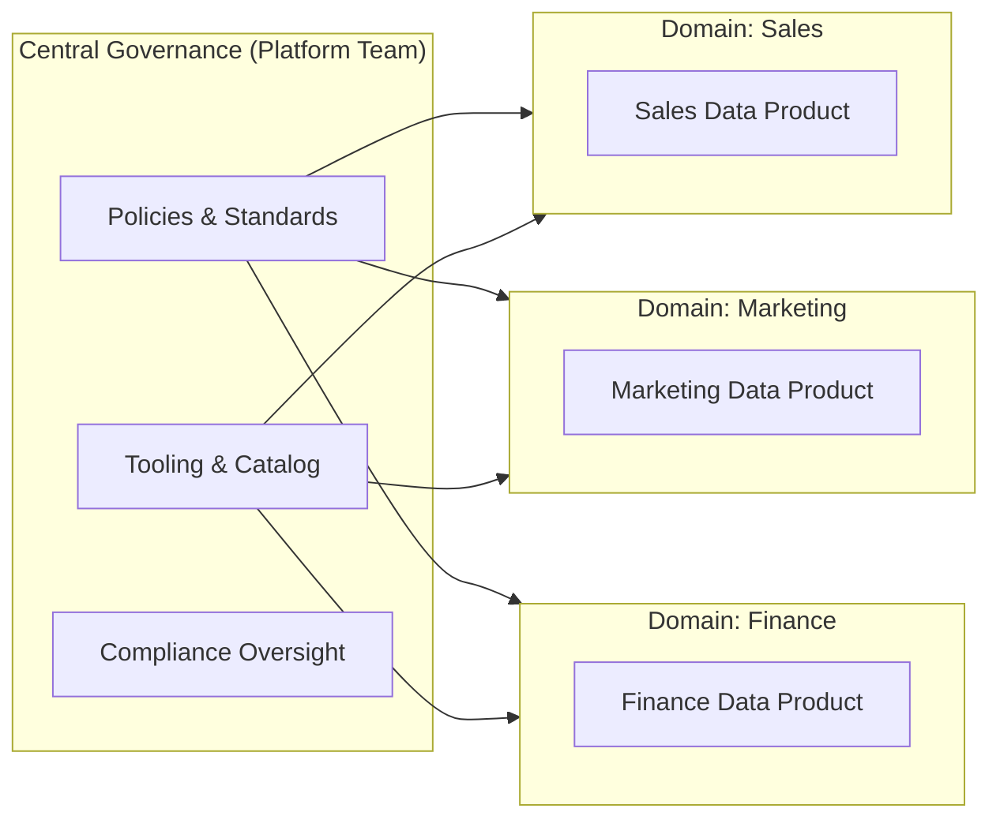

# Governance Fundamentals — Intermediate

## Governance Operating Models

### Centralized vs. Federated vs. Data Mesh

| Model | Pros | Cons | Best For |
|---|---|---|---|
| **Centralized** | Consistent standards, easy compliance | Bottleneck, slow | Regulated industries (finance, healthcare) |
| **Federated** | Domain autonomy, faster iteration | Standards diverge | Mid-size orgs with mature domains |
| **Data Mesh** | Scalable, domain ownership | Needs strong tooling | Large orgs with many independent domains |



---

## Governance KPIs

Measure governance program health:

```python
from dataclasses import dataclass
from typing import Optional
import sqlalchemy as sa

@dataclass
class GovernanceKPI:
    name: str
    value: float
    target: float
    unit: str
    
    @property
    def status(self) -> str:
        return "green" if self.value >= self.target else "red"

def compute_governance_kpis(engine) -> list[GovernanceKPI]:
    with engine.connect() as conn:
        # 1. Catalog coverage: % of prod tables with metadata
        total_tables = conn.execute(sa.text(
            "SELECT COUNT(*) FROM information_schema.tables WHERE table_schema NOT IN ('pg_catalog', 'information_schema')"
        )).scalar()
        
        cataloged = conn.execute(sa.text(
            "SELECT COUNT(DISTINCT table_name) FROM data_catalog.assets WHERE is_documented = TRUE"
        )).scalar()
        
        catalog_coverage = (cataloged / max(total_tables, 1)) * 100
        
        # 2. Ownership coverage: % of tables with an assigned owner
        owned = conn.execute(sa.text(
            "SELECT COUNT(DISTINCT table_name) FROM data_catalog.assets WHERE owner IS NOT NULL"
        )).scalar()
        
        ownership_coverage = (owned / max(total_tables, 1)) * 100
        
        # 3. PII tagging: % of known-PII columns tagged
        pii_tagged = conn.execute(sa.text("""
            SELECT 
                COUNT(CASE WHEN is_tagged_pii THEN 1 END) * 100.0 / COUNT(*) 
            FROM data_catalog.columns 
            WHERE is_known_pii = TRUE
        """)).scalar() or 0

        # 4. Data quality pass rate across monitored tables
        dq_pass_rate = conn.execute(sa.text("""
            SELECT AVG(pass_rate) * 100
            FROM dq_metrics 
            WHERE measured_at >= NOW() - INTERVAL '7 days'
        """)).scalar() or 0

    return [
        GovernanceKPI("Catalog Coverage", catalog_coverage, 90.0, "%"),
        GovernanceKPI("Ownership Coverage", ownership_coverage, 95.0, "%"),
        GovernanceKPI("PII Tagging Rate", pii_tagged, 100.0, "%"),
        GovernanceKPI("DQ Pass Rate (7d)", dq_pass_rate, 95.0, "%"),
    ]
```

---

## Data Stewardship Workflows

```python
from enum import Enum
from datetime import datetime
from typing import Optional

class IssueStatus(Enum):
    OPEN = "open"
    IN_REVIEW = "in_review"
    RESOLVED = "resolved"
    WONT_FIX = "wont_fix"

class DataStewardshipSystem:
    """Track and route data governance issues."""
    
    def __init__(self, db_engine, notification_client):
        self.engine = db_engine
        self.notify = notification_client
    
    def raise_issue(
        self,
        table: str,
        issue_type: str,  # "missing_owner", "undocumented", "pii_untagged", "quality"
        description: str,
        raised_by: str,
    ) -> str:
        """Raise a governance issue and route to the right steward."""
        issue_id = f"GOV-{datetime.utcnow().strftime('%Y%m%d%H%M%S')}"
        
        # Find assigned steward
        steward = self._get_steward(table)
        
        with self.engine.begin() as conn:
            conn.execute(sa.text("""
                INSERT INTO governance_issues
                (issue_id, table_name, issue_type, description, raised_by, assigned_to, status, created_at)
                VALUES (:id, :table, :type, :desc, :by, :to, 'open', NOW())
            """), {
                "id": issue_id, "table": table, "type": issue_type,
                "desc": description, "by": raised_by, "to": steward,
            })
        
        # Notify steward
        if steward:
            self.notify.send(
                to=steward,
                subject=f"[{issue_id}] Governance issue: {issue_type} on {table}",
                body=description,
            )
        
        return issue_id
    
    def _get_steward(self, table: str) -> Optional[str]:
        with self.engine.connect() as conn:
            return conn.execute(sa.text(
                "SELECT steward_email FROM data_catalog.assets WHERE table_name = :t"
            ), {"t": table}).scalar()
    
    def get_open_issues_by_steward(self) -> dict:
        """Dashboard: which steward has the most open issues."""
        with self.engine.connect() as conn:
            rows = conn.execute(sa.text("""
                SELECT assigned_to, COUNT(*) AS open_count
                FROM governance_issues
                WHERE status = 'open'
                GROUP BY assigned_to
                ORDER BY open_count DESC
            """)).fetchall()
        return {r["assigned_to"]: r["open_count"] for r in rows}
```

---

## Governance as Code

Treat governance policies like code — version-controlled, reviewed, testable:

```yaml
# governance/policies/pii-access.yaml
policy_id: POL-001
name: PII Access Control
version: 1.2.0
effective_date: 2024-01-01
owner: data-governance-team

rules:
  - id: RULE-001
    description: Tables tagged 'pii' require explicit IAM role assignment
    applies_to:
      tag: pii
    enforcement:
      type: automated
      action: deny_by_default
      allow_list_source: iam_group_data_pii_approved
  
  - id: RULE-002
    description: PII data must not appear in non-production environments without masking
    applies_to:
      environment: [dev, staging]
      tag: pii
    enforcement:
      type: automated
      action: mask_on_read
      masking_strategy: hash_sha256
```

```python
import yaml

def validate_policy_file(path: str) -> list[str]:
    """Validate a governance policy YAML file."""
    errors = []
    with open(path) as f:
        policy = yaml.safe_load(f)
    
    required_fields = ["policy_id", "name", "version", "owner", "rules"]
    for field in required_fields:
        if field not in policy:
            errors.append(f"Missing required field: {field}")
    
    for rule in policy.get("rules", []):
        if "enforcement" not in rule:
            errors.append(f"Rule {rule.get('id', '?')} missing enforcement block")
    
    return errors
```

---

## Interview Tips

> **Tip 1:** "What governance model would you recommend?" — Depends on org size and maturity. Small/regulated: centralized for consistency. Large orgs with autonomous teams: federated or data mesh with a central standards body. Key: define which decisions are centralized (security, compliance) vs. federated (domain schemas, quality thresholds).

> **Tip 2:** "How do you measure governance program success?" — Catalog coverage (% of tables documented), ownership coverage (% with assigned owner), PII tagging rate (must be 100%), DQ pass rate, time-to-resolve governance issues. Present as a governance scorecard to leadership.

> **Tip 3:** "What is 'governance as code'?" — Defining policies in version-controlled YAML/code, enabling peer review, audit trail, and automated enforcement. Similar to infrastructure-as-code but for data policies. Tools like OPA (Open Policy Agent) can enforce policies programmatically.
