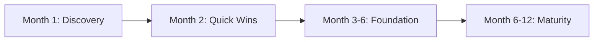

# Governance Fundamentals — Interview Scenarios


<article data-difficulty="junior">

## 🟢 Junior: Missing Data Owner

**Scenario:** A dashboard breaks and no one knows who owns the underlying table. How do you handle this short-term, and what governance fix prevents this in the future?

<details>
<summary>💡 Hint</summary>

**Short-term:** 1. Check the git blame on the dbt model file — the last committer is likely the de-facto owner 2. Check Airflow for who created/last modified the DAG writing to that table 3. Check Slack history for the table name — who talks about it? 4. Escalate to data engineering lead to assign...

</details>

<details>
<summary>✅ Solution</summary>

**Short-term:**
1. Check the git blame on the dbt model file — the last committer is likely the de-facto owner
2. Check Airflow for who created/last modified the DAG writing to that table
3. Check Slack history for the table name — who talks about it?
4. Escalate to data engineering lead to assign a temporary owner

**Long-term governance fix:**
```yaml
# Require in ALL dbt models (enforced via CI check)
models:
  - name: orders
    meta:
      owner: revenue-team          # team Slack handle
      steward: jane.smith@co.com   # individual accountable
      on_call: "@data-revenue-oncall"
```

```python
# CI check that blocks merge if owner is missing
def check_model_ownership(manifest_path: str) -> bool:
    import json
    with open(manifest_path) as f:
        manifest = json.load(f)
    
    failures = []
    for name, node in manifest["nodes"].items():
        if node["resource_type"] == "model" and node.get("config", {}).get("materialized") != "ephemeral":
            if not node.get("meta", {}).get("owner"):
                failures.append(name)
    
    if failures:
        print(f"❌ Missing owner in {len(failures)} models: {failures}")
        return False
    return True
```

**Prevention:** Ownership must be set at deploy time. No owner = no deploy.

</details>

</article>

<article data-difficulty="mid-level">

## 🟡 Mid-Level: Governance Policy Conflict

**Scenario:** The security team wants all PII masked in non-production. The ML team needs real emails for model training in staging. How do you resolve this?

<details>
<summary>💡 Hint</summary>

This is a genuine policy conflict requiring escalation and a structured exception process:

</details>

<details>
<summary>✅ Solution</summary>

This is a genuine policy conflict requiring escalation and a structured exception process:

**Step 1: Escalate to right stakeholders**
- DPO (Data Privacy Officer): legal authority on PII usage
- ML team lead: clarify why real emails are needed (model accuracy? Or habit?)
- Security team: understand exact risk they're mitigating

**Step 2: Evaluate alternatives**
```
Option A: Synthetic data generation
  - Generate realistic fake emails with same distribution
  - Libraries: Faker, SDV (Synthetic Data Vault)
  - No real PII exposure, but may degrade model quality slightly

Option B: Privacy-preserving transforms
  - Hash emails consistently → ML model learns email → outcome mapping
  - Format-preserving pseudonymization: real-looking but not real
  
Option C: Approved exception with controls
  - Specific staging env with strict IAM access
  - Audit logging enabled
  - Data deleted after training run
  - DPO signs off in writing
```

**Step 3: Document the decision**
```yaml
# governance/exceptions/ml-team-staging-pii.yaml
exception_id: EXC-2024-003
policy: POL-001 (PII Masking in Non-Prod)
requestor: ml-team
approved_by: dpo@company.com
scope: staging only, ml_training_* tables
rationale: Synthetic data reduces model accuracy below acceptable threshold
controls:
  - IAM restricted to ml-team group only
  - Audit logging enabled
  - Data purged after 30 days
expires: 2024-06-30
```

</details>

</article>

<article data-difficulty="senior">

## 🔴 Senior: Building a Governance Program from Scratch

**Scenario:** You've joined a 200-person company with no data governance. There are 500 tables, no owners documented, unknown PII, and the CTO wants a governance program. Where do you start?

<details>
<summary>💡 Hint</summary>

**Month 1: Discovery** - Inventory all tables (catalog scan) - Interview domain leads to identify data owners - Run PII scanner to find sensitive columns - Review current access controls - Identify the 20 tables that matter most (used by 80% of queries)

</details>

<details>
<summary>✅ Solution</summary>



**Month 1: Discovery**
- Inventory all tables (catalog scan)
- Interview domain leads to identify data owners
- Run PII scanner to find sensitive columns
- Review current access controls
- Identify the 20 tables that matter most (used by 80% of queries)

**Month 2: Quick wins**
- Assign owners to the top-20 tables
- Tag PII columns found by scanner
- Set up a simple data catalog (DataHub or Amundsen)
- Write and socialize a one-page governance policy

**Month 3-6: Foundation**
```
✓ Governance committee formed (1 rep per domain)
✓ Policy set codified (access, retention, quality)
✓ Catalog deployed with all production tables
✓ PII fully tagged — access-controlled via IAM groups
✓ dbt governance CI checks block undocumented deploys
✓ Governance KPI dashboard (catalog coverage, PII tagging, DQ)
```

**Month 6-12: Maturity**
```
✓ Lineage tracked (OpenLineage → DataHub)
✓ Automated compliance scanner runs nightly
✓ Self-service data access request workflow
✓ Quarterly governance reviews with domain leads
✓ Governance score by domain, publicly visible
```

**Key insight:** Don't boil the ocean. Start with the tables that matter most, assign clear owners, and make compliance easy before making it mandatory.

</details>

</article>
---

## ⚡ Quick-fire Q&A

**Q: What is data governance and what does it encompass?**
A: Data governance is the set of policies, processes, standards, and roles that ensure data is accurate, available, consistent, secure, and used appropriately. It encompasses data quality, access control, lineage, classification, metadata management, and compliance with regulations.

**Q: What is the difference between data governance and data management?**
A: Data management is the technical practice of collecting, storing, and processing data. Data governance defines the policies and accountability structures that guide how data management is done — who owns data, what standards apply, and how compliance is enforced. Governance sets the rules; management executes them.

**Q: What is a data steward and how does the role differ from a data owner?**
A: A data owner is typically a business executive accountable for a data domain's value and compliance (e.g., the VP of Finance owns financial data). A data steward is the operational role — usually a data analyst or engineer — who maintains metadata quality, enforces standards, and acts as the day-to-day custodian of that domain's data.

**Q: What is a data governance council and what does it do?**
A: A data governance council (or committee) is a cross-functional group of data owners, stewards, legal/compliance, and IT leaders who define governance policies, resolve disputes about data definitions and access, and oversee the governance program. It provides the organizational accountability that makes governance stick.

**Q: What are the key components of a data governance framework?**
A: A mature framework includes: policies and standards, organizational roles (owners, stewards, custodians), a data catalog for discovery and metadata, data quality rules and monitoring, access control policies, lineage tracking, classification and sensitivity labels, and a process for handling incidents and exceptions.

**Q: How does data mesh change traditional centralized data governance?**
A: Traditional governance is centralized — a single team sets policies and manages all data. Data mesh distributes data ownership to domain teams while maintaining federated governance: a central platform defines standards and tooling, but domain teams are accountable for their own data products' quality, metadata, and compliance.

**Q: What metrics would you use to measure the health of a data governance program?**
A: Key metrics include: percentage of datasets with a documented owner, catalog coverage (% of assets with complete metadata), data quality score by domain, mean time to resolve data quality incidents, number of policy violations detected, and audit readiness score from compliance reviews.

---

## 💼 Interview Tips

- Show that you understand governance as a socio-technical problem — the organizational and cultural aspects (roles, accountability, incentives) are as important as the tools, and senior interviewers know this.
- Differentiate data owner from data steward clearly and confidently — it is a common interview question and mixing them up signals lack of governance experience.
- Connect governance to business outcomes: reduced regulatory risk, faster data discovery, higher trust in analytics — frame it as a value driver, not a compliance tax.
- For senior or staff-level roles, discuss federated governance and data mesh: explain how you balance domain autonomy with platform-wide standards and interoperability.
- Bring up measurable outcomes — governance programs that cannot show metrics often get defunded; demonstrating that you would track catalog coverage or quality scores signals strategic thinking.
- Avoid presenting governance as purely a tooling problem; interviewers who have run governance programs know that adoption and cultural change are the hard parts.
