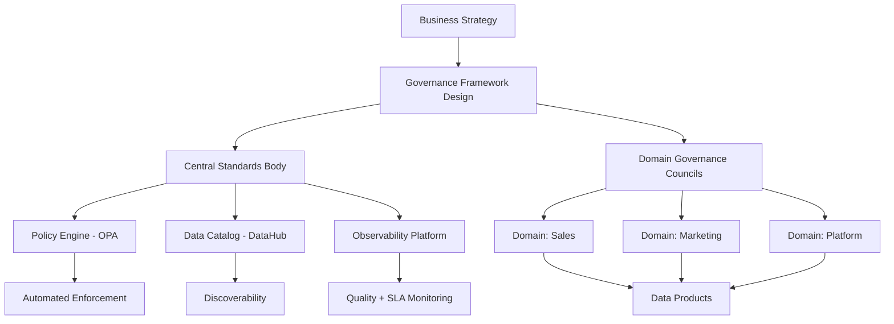

# Governance Fundamentals — Senior Deep Dive

## Designing a Enterprise Governance Framework

Senior engineers design governance systems that scale across hundreds of teams and thousands of tables without becoming a centralized bottleneck.



---

## Open Policy Agent (OPA) for Data Governance

Use OPA to enforce governance policies programmatically:

```rego
# policies/data_access.rego
package data.access

import future.keywords.if
import future.keywords.in

# Default: deny
default allow := false

# Allow if user has explicit table grant
allow if {
    table := input.resource.table
    user := input.principal.user
    grant in data.grants[table]
    grant.user == user
    grant.expires_at > time.now_ns()
}

# Deny PII tables unless user is in pii_approved group
deny if {
    "pii" in data.catalog[input.resource.table].tags
    not user_in_group(input.principal.user, "data_pii_approved")
}

# Deny production data in non-prod environments
deny if {
    input.resource.environment != "production"
    "restricted" in data.catalog[input.resource.table].tags
}

user_in_group(user, group) if {
    user in data.iam_groups[group].members
}
```

```python
import requests

class OPAPolicyEngine:
    """Client for evaluating governance policies via OPA."""
    
    def __init__(self, opa_url: str = "http://localhost:8181"):
        self.opa_url = opa_url
    
    def check_access(self, user: str, table: str, action: str, environment: str = "production") -> dict:
        """Check if a user is allowed to access a table."""
        input_payload = {
            "input": {
                "principal": {"user": user},
                "resource": {"table": table, "action": action, "environment": environment},
            }
        }
        
        resp = requests.post(
            f"{self.opa_url}/v1/data/data/access",
            json=input_payload,
            timeout=2,
        )
        resp.raise_for_status()
        result = resp.json()["result"]
        
        return {
            "allowed": result.get("allow", False),
            "denied": result.get("deny", False),
            "reason": result.get("reason", "No explicit reason"),
        }
    
    def audit_policy_violations(self, engine) -> list[dict]:
        """Scan all active table grants against current policies."""
        violations = []
        
        with engine.connect() as conn:
            grants = conn.execute(sa.text(
                "SELECT user_email, table_name FROM active_grants"
            )).fetchall()
        
        for grant in grants:
            result = self.check_access(grant.user_email, grant.table_name, "read")
            if result["denied"]:
                violations.append({
                    "user": grant.user_email,
                    "table": grant.table_name,
                    "violation": result["reason"],
                })
        
        return violations
```

---

## Federated Governance at Scale

Design a system where central platform sets standards, domains own enforcement:

```python
from abc import ABC, abstractmethod
from typing import Dict, List

class GovernanceStandard(ABC):
    """Abstract base — central team defines standards, domains implement."""
    
    @abstractmethod
    def validate(self, asset_metadata: dict) -> list[str]:
        """Return list of violations. Empty = compliant."""
        ...
    
    @abstractmethod
    def fix_instructions(self) -> str:
        """Human-readable instructions for fixing violations."""
        ...

class DocumentationStandard(GovernanceStandard):
    """Every production table must have description, owner, and steward."""
    
    REQUIRED_FIELDS = ["description", "owner", "steward", "update_frequency"]
    
    def validate(self, asset_metadata: dict) -> list[str]:
        violations = []
        for field in self.REQUIRED_FIELDS:
            if not asset_metadata.get(field):
                violations.append(f"Missing required metadata: {field}")
        if len(asset_metadata.get("description", "")) < 50:
            violations.append("Description must be at least 50 characters")
        return violations
    
    def fix_instructions(self) -> str:
        return "Add metadata to your dbt schema.yml or DataHub UI. See: https://wiki/data-governance/metadata"

class PIITaggingStandard(GovernanceStandard):
    """Known PII columns must be explicitly tagged."""
    
    PII_COLUMN_PATTERNS = ["email", "phone", "ssn", "credit_card", "name", "address", "dob"]
    
    def validate(self, asset_metadata: dict) -> list[str]:
        violations = []
        for col in asset_metadata.get("columns", []):
            col_name = col["name"].lower()
            is_pii_pattern = any(p in col_name for p in self.PII_COLUMN_PATTERNS)
            is_tagged = "pii" in col.get("tags", [])
            
            if is_pii_pattern and not is_tagged:
                violations.append(f"Column '{col['name']}' looks like PII but is not tagged")
        return violations
    
    def fix_instructions(self) -> str:
        return "Tag PII columns with 'pii' tag in dbt schema.yml or DataHub. Requires DPO review."

class GovernanceScanner:
    """Scan all data assets against all governance standards."""
    
    def __init__(self, standards: List[GovernanceStandard], catalog_client):
        self.standards = standards
        self.catalog = catalog_client
    
    def scan_all(self) -> Dict[str, List[str]]:
        """Returns: {table_name: [violations]}"""
        results = {}
        
        for asset in self.catalog.list_all_assets():
            violations = []
            for standard in self.standards:
                violations.extend(standard.validate(asset.metadata))
            
            if violations:
                results[asset.table_name] = violations
        
        return results
    
    def compliance_score(self) -> float:
        """% of assets with zero violations."""
        all_assets = self.catalog.list_all_assets()
        violations = self.scan_all()
        compliant = sum(1 for a in all_assets if a.table_name not in violations)
        return compliant / max(len(all_assets), 1) * 100
```

---

## Governance Automation Pipeline

Run governance checks automatically as part of CI/CD:

```python
# governance_ci.py — runs in GitHub Actions on PR
import sys
from pathlib import Path
import yaml

def check_dbt_models_governance(models_dir: str) -> list[dict]:
    """
    Validate governance requirements for all dbt models.
    Used in CI to block merges with governance violations.
    """
    violations = []
    
    for schema_file in Path(models_dir).rglob("schema.yml"):
        with open(schema_file) as f:
            schema = yaml.safe_load(f)
        
        for model in schema.get("models", []):
            model_violations = []
            
            # Check: description present
            if not model.get("description"):
                model_violations.append("Missing model description")
            
            # Check: owner meta tag
            if not model.get("meta", {}).get("owner"):
                model_violations.append("Missing meta.owner")
            
            # Check: PII columns tagged
            for col in model.get("columns", []):
                col_name = col["name"].lower()
                if any(p in col_name for p in ["email", "phone", "ssn", "name", "address"]):
                    if "pii" not in col.get("tags", []):
                        model_violations.append(f"Column {col['name']} needs 'pii' tag")
            
            if model_violations:
                violations.append({
                    "file": str(schema_file),
                    "model": model["name"],
                    "issues": model_violations,
                })
    
    return violations


if __name__ == "__main__":
    violations = check_dbt_models_governance("models/")
    
    if violations:
        print("❌ Governance violations found:")
        for v in violations:
            print(f"\n  {v['file']} → {v['model']}")
            for issue in v["issues"]:
                print(f"    - {issue}")
        sys.exit(1)
    else:
        print("✅ All dbt models pass governance checks")
        sys.exit(0)
```

---

## Interview Tips

> **Tip 1:** "How do you avoid governance becoming a bottleneck?" — Federate enforcement to domain teams while centralizing standards. Automate compliance checks in CI (fail PRs with governance violations). Self-service tooling: give teams the tools to be compliant without filing tickets with a central team.

> **Tip 2:** "How do you get domain teams to adopt governance?" — Make it easy (pre-built templates, linters), make it visible (compliance dashboard by team), link it to business outcomes (SOC2 passing, GDPR fines avoided), and include team leads in policy design so they have buy-in.

> **Tip 3:** "How does OPA fit into data governance?" — OPA evaluates policies as code at runtime. You define access rules in Rego, then query OPA from your data platform (Trino query engine, API gateway) to allow/deny reads. Enables centralized, auditable, version-controlled policy enforcement without per-tool configuration.

## ⚡ Cheat Sheet

**Governance pillars**
```
Data Quality    — accuracy, completeness, consistency, timeliness
Access Control  — RBAC/ABAC, masking, least privilege
Data Catalog    — discoverability, metadata, glossary
Lineage         — upstream/downstream tracing, impact analysis
Classification  — public/internal/confidential/restricted
Compliance      — GDPR, CCPA, HIPAA, SOC 2, SOX, PCI-DSS
Stewardship     — owners accountable for quality and metadata
```

**RACI**
- **Data Owner**: accountable for quality, access, compliance
- **Data Steward**: day-to-day metadata and quality monitoring
- **Data Consumer**: reads data; responsible for correct usage
- **Data Platform**: builds governance tooling and pipelines

**Maturity model**
```
Level 1: Ad hoc    — no policies, manual everything
Level 2: Reactive  — docs exist, ticket-based access
Level 3: Defined   — catalog deployed, CI checks, owners assigned
Level 4: Managed   — automated enforcement, SLA tracking, lineage complete
Level 5: Optimized — self-service with guardrails, continuous improvement
```

**Key regulations**
| Reg | Key DE obligations |
|---|---|
| GDPR | Erasure (30 days), minimization, 72h breach notification |
| CCPA | Right to know, delete, opt-out of sale |
| HIPAA | PHI controls, audit logs, Business Associate Agreement |
| SOX | Financial data integrity, access logs, change control |
| PCI-DSS | Card data isolation, encryption, quarterly scans |

**CI governance gates**: block deploy if missing owner, description, sensitivity tag, or masking policy on PII columns
