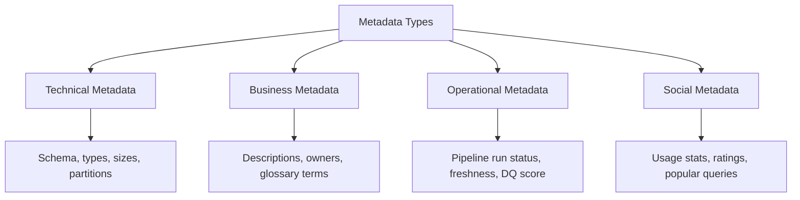

# Metadata Management — Fundamentals

## What Is Metadata?

Metadata is "data about data." It describes the structure, content, quality, and context of data assets. Good metadata makes data discoverable, trustworthy, and governable.



---

## Types of Metadata

| Type | Examples | Source |
|---|---|---|
| **Technical** | Schema, column types, row count, storage size, partitioning | Auto-ingested from databases |
| **Business** | Descriptions, owners, stewards, glossary terms, domain | Human-provided |
| **Operational** | Last updated time, pipeline status, SLA, DQ pass rate | Auto-captured from pipelines |
| **Social** | Query frequency, top users, bookmarks, ratings | Auto-captured from query logs |

---

## Metadata in Practice

```python
# A fully-enriched metadata record for a table
table_metadata = {
    # --- Technical Metadata (auto-captured) ---
    "physical_name": "PROD.GOLD.ORDERS",
    "platform": "snowflake",
    "database": "PROD",
    "schema": "GOLD",
    "table_type": "TABLE",  # vs VIEW, MATERIALIZED_VIEW
    "row_count": 1_250_000,
    "column_count": 42,
    "size_bytes": 4_200_000_000,
    "partitioned_by": ["order_date"],
    "clustered_by": ["customer_id"],
    "created_at": "2023-06-01T00:00:00Z",
    "schema_version": "3.2.1",
    "columns": [
        {"name": "order_id",    "type": "VARCHAR",   "nullable": False, "pii": False},
        {"name": "customer_email", "type": "VARCHAR", "nullable": False, "pii": True, "pii_type": "email"},
        {"name": "amount",      "type": "NUMBER",    "nullable": False, "pii": False},
    ],
    
    # --- Business Metadata (human-provided) ---
    "display_name": "Orders (Gold)",
    "description": "Cleaned and deduped orders from all channels. SOT for revenue reporting.",
    "owner": "revenue-team",
    "steward": "jane.smith@company.com",
    "domain": "sales",
    "sensitivity": "restricted",
    "tags": ["core", "sot", "revenue", "gdpr"],
    "glossary_terms": ["Order", "Revenue", "Customer"],
    "related_dashboards": ["Revenue Dashboard", "Finance Weekly"],
    
    # --- Operational Metadata (pipeline-captured) ---
    "last_updated_at": "2024-01-15T08:22:11Z",
    "update_frequency": "daily",
    "sla": "09:00 UTC daily",
    "last_pipeline_run": "2024-01-15T08:00:00Z",
    "pipeline_status": "success",
    "dq_pass_rate": 0.987,
    "freshness_sla_met": True,
    
    # --- Social Metadata (usage-captured) ---
    "monthly_query_count": 4200,
    "unique_users_30d": 87,
    "top_users": ["finance@co.com", "ml-team@co.com"],
    "bookmarked_by_count": 23,
}
```

---

## Metadata Standards

### Dublin Core (for data assets)
```python
# Dublin Core metadata standard adapted for data
dublin_core = {
    "dc:title":       "Orders (Gold)",
    "dc:description": "Cleaned and deduped orders from all channels",
    "dc:creator":     "revenue-team",
    "dc:subject":     ["orders", "revenue", "sales"],
    "dc:publisher":   "Data Platform Team",
    "dc:date":        "2023-06-01",
    "dc:type":        "dataset",
    "dc:format":      "snowflake/table",
    "dc:identifier":  "urn:li:dataset:(urn:li:dataPlatform:snowflake,PROD.GOLD.ORDERS,PROD)",
    "dc:language":    "en",
    "dc:rights":      "Internal use only — GDPR restricted",
}
```

---

## Capturing Metadata from dbt

dbt is the primary source of business metadata for many teams:

```yaml
# models/gold/schema.yml — this IS metadata
version: 2
models:
  - name: orders
    description: "Cleaned and deduped orders from all channels. Source of truth for revenue."
    
    # Business metadata in meta block
    meta:
      owner: revenue-team
      steward: jane.smith@company.com
      domain: sales
      sensitivity: restricted
      sla: "09:00 UTC daily"
      update_frequency: daily
    
    tags: [core, sot, revenue, gdpr]
    
    columns:
      - name: order_id
        description: "Unique order identifier. Natural key from source system."
        tests: [unique, not_null]
      
      - name: customer_email
        description: "Customer email at time of order."
        tags: [pii, restricted]
        meta:
          pii_type: email
          masking: hash_sha256
```

```python
# Parse dbt manifest for metadata
import json

def extract_metadata_from_dbt(manifest_path: str) -> list[dict]:
    with open(manifest_path) as f:
        manifest = json.load(f)
    
    assets = []
    for node_id, node in manifest["nodes"].items():
        if node.get("resource_type") != "model":
            continue
        
        assets.append({
            "name": node["name"],
            "schema": node["schema"],
            "description": node.get("description", ""),
            "owner": node.get("meta", {}).get("owner"),
            "steward": node.get("meta", {}).get("steward"),
            "domain": node.get("meta", {}).get("domain"),
            "tags": node.get("tags", []),
            "columns": [
                {
                    "name": col_name,
                    "description": col.get("description", ""),
                    "tags": col.get("tags", []),
                    "pii": "pii" in col.get("tags", []),
                }
                for col_name, col in node.get("columns", {}).items()
            ],
        })
    
    return assets
```

---

## Interview Tips

> **Tip 1:** "What is metadata and why does it matter for data engineering?" — Metadata makes data discoverable (search), trustworthy (quality context), and governed (owner, sensitivity). Without metadata, analysts waste time finding and understanding data. DEs build pipelines that capture and maintain metadata automatically — it shouldn't require manual work.

> **Tip 2:** "What is the difference between technical and business metadata?" — Technical metadata (schema, row count, size) is auto-captured from systems — it's always available. Business metadata (descriptions, owners, domain terms) requires human input — it's the hard part. The gap between them is the governance challenge: systems are documented, business meaning is not.

> **Tip 3:** "How does dbt contribute to metadata management?" — dbt schema.yml files are the primary source of business metadata: descriptions, owners, tags, column-level docs. The dbt manifest.json is ingested by catalog tools (DataHub, Alation) to populate the catalog automatically after every dbt run. This makes metadata capture a developer habit rather than a separate process.
