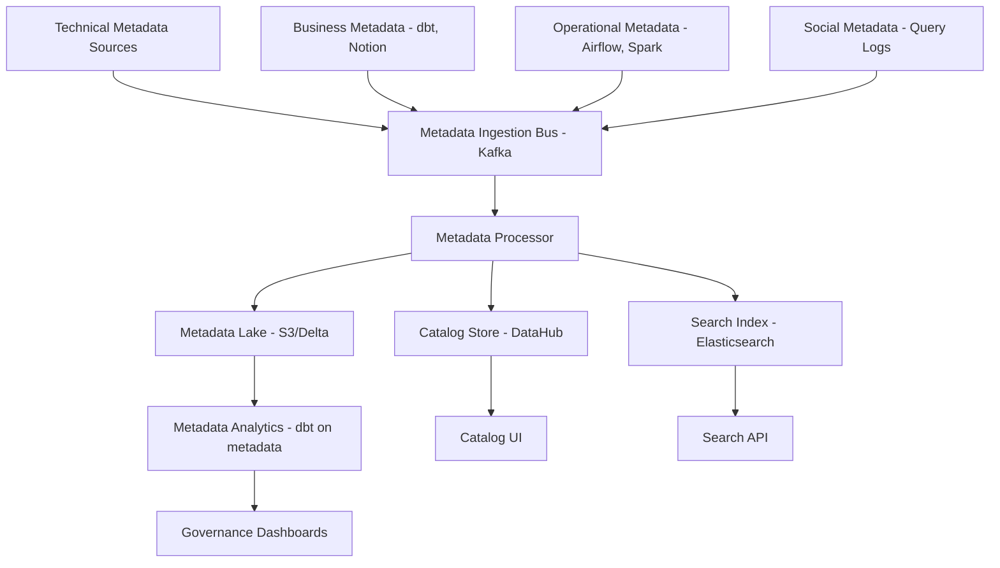

# Metadata Management — Senior Deep Dive

## Metadata Lake Architecture

For large organizations, metadata itself needs to be managed as a first-class data asset:



---

## Event-Driven Metadata System

React to metadata changes with automated workflows:

```python
import json
from dataclasses import dataclass
from typing import Callable, Dict, List
from datetime import datetime

@dataclass
class MetadataEvent:
    event_type: str  # SCHEMA_CHANGE, OWNERSHIP_CHANGE, TAG_ADDED, QUALITY_DEGRADED, etc.
    entity_type: str  # dataset, column, dashboard, pipeline
    entity_urn: str
    actor: str
    payload: dict
    timestamp: datetime

class MetadataEventBus:
    """
    Publish and subscribe to metadata change events.
    Enables: catalog auto-update, policy enforcement, notification workflows.
    """
    
    def __init__(self, kafka_producer, kafka_consumer_factory):
        self.producer = kafka_producer
        self.consumer_factory = kafka_consumer_factory
        self._handlers: Dict[str, List[Callable]] = {}
    
    def publish(self, event: MetadataEvent):
        """Publish a metadata event to Kafka."""
        self.producer.send(
            "metadata-events",
            key=event.entity_urn.encode(),
            value=json.dumps({
                "event_type": event.event_type,
                "entity_type": event.entity_type,
                "entity_urn": event.entity_urn,
                "actor": event.actor,
                "payload": event.payload,
                "timestamp": event.timestamp.isoformat(),
            }).encode(),
        )
    
    def subscribe(self, event_type: str, handler: Callable):
        """Register a handler for a specific event type."""
        self._handlers.setdefault(event_type, []).append(handler)
    
    def process_events(self):
        """Consume and dispatch metadata events."""
        consumer = self.consumer_factory("metadata-events-processor")
        
        for msg in consumer:
            event_data = json.loads(msg.value)
            event = MetadataEvent(**{**event_data, "timestamp": datetime.fromisoformat(event_data["timestamp"])})
            
            for handler in self._handlers.get(event.event_type, []):
                try:
                    handler(event)
                except Exception as e:
                    print(f"Handler error for {event.event_type}: {e}")

# Register event handlers
bus = MetadataEventBus(kafka_producer, kafka_consumer_factory)

@bus.subscribe("SCHEMA_CHANGE")
def on_schema_change(event: MetadataEvent):
    """When schema changes, trigger downstream lineage impact analysis."""
    changed_table = event.entity_urn
    new_schema = event.payload.get("new_schema")
    removed_columns = event.payload.get("removed_columns", [])
    
    if removed_columns:
        # Find and notify downstream owners
        impact_analyzer.notify_downstream_owners(
            changed_urn=changed_table,
            change_description=f"Columns removed: {removed_columns}",
        )
    
    # Re-run classification on new columns
    new_columns = event.payload.get("added_columns", [])
    if new_columns:
        classifier.classify_new_columns(changed_table, new_columns)

@bus.subscribe("TAG_ADDED")
def on_pii_tag_added(event: MetadataEvent):
    """When PII tag is added to a column, enforce masking."""
    if "pii" in event.payload.get("tags", []):
        col_urn = event.entity_urn
        table, column = parse_column_urn(col_urn)
        access_enforcer.apply_masking_policy(table, column)
        dpo_notifier.notify_new_pii_column(table, column, added_by=event.actor)

@bus.subscribe("QUALITY_DEGRADED")
def on_quality_degraded(event: MetadataEvent):
    """When DQ score drops, update catalog and alert owners."""
    table = event.entity_urn
    new_score = event.payload.get("dq_score")
    catalog.update_quality_score(table, new_score)
    
    if new_score < 0.8:
        owner = catalog.get_owner(table)
        alert_system.send(owner, f"DQ score for {table} dropped to {new_score:.0%}")
```

---

## Schema Registry Integration

Manage schema versions as metadata:

```python
from confluent_kafka.schema_registry import SchemaRegistryClient
from confluent_kafka.schema_registry.avro import AvroSerializer
import json

class SchemaMetadataManager:
    """
    Treat schema versions as first-class metadata.
    Integrates Confluent Schema Registry with the data catalog.
    """
    
    def __init__(self, schema_registry_url: str, catalog_client):
        self.registry = SchemaRegistryClient({"url": schema_registry_url})
        self.catalog = catalog_client
    
    def register_and_catalog(self, subject: str, schema_str: str) -> int:
        """Register a schema and sync to the data catalog."""
        from confluent_kafka.schema_registry import Schema
        
        schema = Schema(schema_str, schema_type="AVRO")
        schema_id = self.registry.register_schema(subject, schema)
        version = self.registry.get_latest_version(subject)
        
        # Parse schema to extract column metadata
        schema_json = json.loads(schema_str)
        columns = self._parse_avro_columns(schema_json)
        
        # Sync to catalog
        self.catalog.upsert_schema(
            dataset_name=subject.replace("-value", ""),
            schema_version=version.version,
            schema_id=schema_id,
            columns=columns,
        )
        
        # Emit metadata event
        bus.publish(MetadataEvent(
            event_type="SCHEMA_REGISTERED",
            entity_type="dataset",
            entity_urn=f"urn:li:dataset:kafka:{subject}",
            actor="schema-registry",
            payload={"version": version.version, "schema_id": schema_id},
            timestamp=datetime.utcnow(),
        ))
        
        return schema_id
    
    def get_schema_evolution_history(self, subject: str) -> list[dict]:
        """Get all schema versions with change descriptions."""
        versions = self.registry.get_versions(subject)
        history = []
        
        for v in versions:
            schema = self.registry.get_version(subject, v)
            history.append({
                "version": v,
                "schema_id": schema.schema_id,
                "schema": json.loads(schema.schema.schema_str),
            })
        
        return history
    
    def _parse_avro_columns(self, schema: dict) -> list[dict]:
        return [
            {
                "name": field["name"],
                "type": str(field["type"]),
                "doc": field.get("doc", ""),
                "default": field.get("default"),
            }
            for field in schema.get("fields", [])
        ]
```

---

## Metadata Quality

Metadata itself needs quality checks:

```python
def compute_metadata_quality_score(engine) -> dict:
    """Score the quality of metadata across all catalog assets."""
    import sqlalchemy as sa
    
    with engine.connect() as conn:
        stats = conn.execute(sa.text("""
            SELECT
                COUNT(*) AS total_assets,
                
                -- Description quality
                COUNT(CASE WHEN description IS NOT NULL AND LENGTH(description) > 50 THEN 1 END) AS has_description,
                COUNT(CASE WHEN description IS NOT NULL AND LENGTH(description) > 200 THEN 1 END) AS has_rich_description,
                
                -- Ownership quality
                COUNT(CASE WHEN owner IS NOT NULL THEN 1 END) AS has_owner,
                COUNT(CASE WHEN steward IS NOT NULL THEN 1 END) AS has_steward,
                
                -- Classification quality
                COUNT(CASE WHEN sensitivity IS NOT NULL THEN 1 END) AS is_classified,
                
                -- Freshness quality
                COUNT(CASE WHEN last_ingested_at > NOW() - INTERVAL '24 hours' THEN 1 END) AS metadata_fresh,
                
                -- Column documentation
                (
                    SELECT AVG(col_doc_rate)
                    FROM (
                        SELECT 
                            table_name,
                            COUNT(CASE WHEN description IS NOT NULL THEN 1 END) * 1.0 / COUNT(*) AS col_doc_rate
                        FROM data_catalog.columns
                        GROUP BY table_name
                    ) sub
                ) AS avg_column_doc_rate
            FROM data_catalog.assets
            WHERE is_production = TRUE
        """)).fetchone()._asdict()
    
    total = stats["total_assets"]
    
    scores = {
        "description_coverage": stats["has_description"] / total,
        "rich_description_coverage": stats["has_rich_description"] / total,
        "owner_coverage": stats["has_owner"] / total,
        "steward_coverage": stats["has_steward"] / total,
        "classification_coverage": stats["is_classified"] / total,
        "metadata_freshness": stats["metadata_fresh"] / total,
        "column_doc_rate": stats["avg_column_doc_rate"] or 0,
    }
    
    # Weighted overall score
    weights = {
        "description_coverage": 0.20,
        "owner_coverage": 0.20,
        "steward_coverage": 0.15,
        "classification_coverage": 0.20,
        "metadata_freshness": 0.15,
        "column_doc_rate": 0.10,
    }
    
    overall = sum(scores.get(k, 0) * w for k, w in weights.items())
    
    return {"scores": scores, "overall": overall, "total_assets": total}
```

---

## Interview Tips

> **Tip 1:** "What is 'active metadata'?" — Metadata that drives automated actions, not just passive documentation. Examples: PII tag added → masking policy applied automatically. DQ score drops → owner is paged. Schema changes → downstream owners notified. Active metadata makes the catalog a control plane for data operations.

> **Tip 2:** "How do you measure metadata quality?" — Coverage metrics: % of tables with descriptions >50 chars, % with owner, % classified, % of columns documented. Freshness: % of metadata ingested in last 24 hours. Column doc rate: % of columns with descriptions. Track trends week-over-week — metadata quality degrades without active maintenance.

> **Tip 3:** "What is the relationship between schema registry and metadata management?" — Schema registry manages schema versions for streaming (Avro/Protobuf). Metadata management covers all data assets including batch tables. They should be integrated: schema registry changes should flow to the catalog as metadata events. The schema is technical metadata; the catalog adds business and operational metadata on top.
