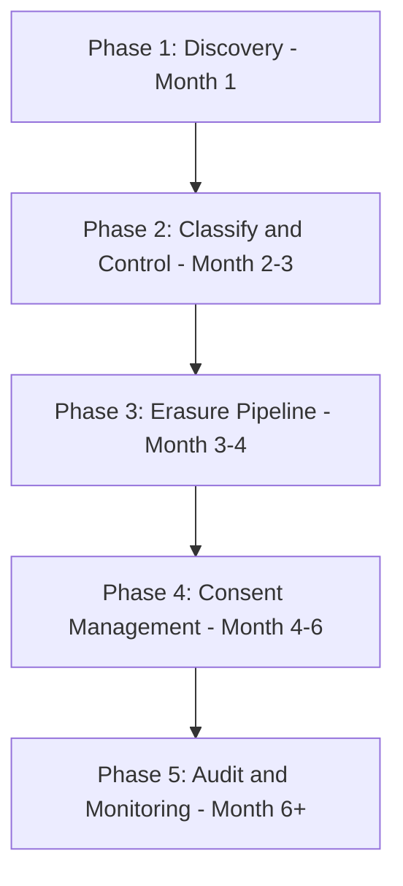

# PII & Compliance — Interview Scenarios


<article data-difficulty="junior">

## 🟢 Junior: PII Found in Wrong Place

**Scenario:** A developer just pushed a dbt model that logs customer emails in a debug table `dev.debug_email_trace`. Anyone on the team can query it. What do you do?

<details>
<summary>💡 Hint</summary>

Two tracks simultaneously: *containment* (revoke public access immediately — this is the highest priority) and *assessment* (how long was it exposed, how many rows, who could have accessed it?). Then fix the root cause in code (remove email from the debug model), add a CI check that scans dbt models for PII column names, and document the incident. Under GDPR, if the exposure was significant, it may need to be reported.

</details>

<details>
<summary>✅ Solution</summary>

**Immediate response (within 1 hour):**
```sql
-- 1. Restrict access immediately
REVOKE SELECT ON TABLE dev.debug_email_trace FROM ROLE PUBLIC;
GRANT SELECT ON TABLE dev.debug_email_trace TO ROLE DATA_ADMIN ONLY;

-- 2. Assess scope: how many records, how long has it been accessible?
SELECT COUNT(*), MIN(created_at), MAX(created_at), COUNT(DISTINCT email)
FROM dev.debug_email_trace;
```

**Short-term (within 24 hours):**
```python
# Drop the table (no legitimate use for debug PII in dev)
# First backup if needed for investigation
engine.execute("DROP TABLE IF EXISTS dev.debug_email_trace")

# Notify DPO — may be a GDPR reportable event
# (unauthorized PII access by large group of users)
notify_dpo(
    incident="PII in accessible debug table",
    scope=f"~{employee_count} employees may have had read access",
    data_type="customer emails",
    duration="estimated X days",
    resolution="Table dropped, access revoked",
)
```

**Prevention:**
```python
# CI check: block models with 'email' in non-PII-approved schemas
def check_pii_in_dev_schemas(manifest_path: str) -> list[str]:
    violations = []
    with open(manifest_path) as f:
        manifest = json.load(f)
    
    for name, node in manifest["nodes"].items():
        if node.get("schema", "").startswith("dev") or node.get("schema", "").startswith("debug"):
            for col in node.get("columns", {}).values():
                if "pii" in col.get("tags", []):
                    violations.append(f"{name}: PII column in dev/debug schema")
    return violations
```

</details>

</article>

<article data-difficulty="mid-level">

## 🟡 Mid-Level: GDPR Erasure Request

**Scenario:** An EU customer emails saying they want all their data deleted under GDPR Article 17. Your CTO asks you to implement this. Walk through your approach.

<details>
<summary>💡 Hint</summary>

GDPR erasure is a *discovery* problem before it's a deletion problem: you must find every copy of the customer's data before you can delete it (raw tables, cleaned tables, aggregates, backups, logs). Start with a DSAR (Data Subject Access Request) query that identifies all tables containing this customer's identifier. Then distinguish between what can be hard-deleted (personal records) vs what can only be pseudonymized (aggregate stats where deletion would alter analytics). Backups are the hardest — most companies don't delete from backups and instead maintain a suppression list.

</details>

<details>
<summary>✅ Solution</summary>

**Step 1: Understand scope (within 24 hours)**
```python
# DSAR first: find all data before deleting
dsar = handle_dsar(engine, subject_email="customer@gmail.com")
print(f"Found data in {dsar['tables_with_data']} tables across {dsar['tables_searched']} searched")
```

**Step 2: Build erasure checklist**
```
Tables to erase (in order):
1. gold.customers — DELETE WHERE email = 'customer@gmail.com'
2. gold.orders — UPDATE: set customer_email = NULL, shipping_address = NULL
3. silver.customers — DELETE WHERE email = 'customer@gmail.com'
4. bronze.customer_raw (Delta) — Rewrite excluding this customer, then VACUUM
5. gold.events — DELETE WHERE user_email = 'customer@gmail.com'

External systems to check:
- Email marketing platform (Mailchimp) — delete contact via API
- Support ticket system (Zendesk) — anonymize tickets
- Analytics (Mixpanel) — delete user profile + events
- Backups — note: coordinate with backup retention policy
```

**Step 3: Execute with audit trail**
```python
processor = RightToErasureProcessor(engine, spark, notification_client)
results = processor.process_erasure("customer@gmail.com", request_id="DSAR-2024-042")

# Log for compliance record
audit_logger.log_erasure("DSAR-2024-042", "customer@gmail.com", results["tables"])
```

**Step 4: Respond to subject within 30 days**
```
"We have completed your erasure request (ID: DSAR-2024-042) received on [date].
All personal data associated with your account has been deleted from our systems.
Note: certain data may be retained as required by law (e.g., financial records for 7 years under tax law)."
```

**Key nuance:** GDPR allows retention of data required for legal compliance (tax, accounting records). Not everything must be deleted — you can retain anonymized or legally required records.

</details>

</article>

<article data-difficulty="senior">

## 🔴 Senior: PII Compliance Architecture

**Scenario:** Your company is expanding to the EU and must become GDPR-compliant. You have 200 tables in Snowflake, PII scattered everywhere, no consent management, and no erasure process. Design the technical architecture.

<details>
<summary>💡 Hint</summary>

Structure this as a 5-phase program: (1) Discovery — run automated PII classifier across all 200 tables, (2) Classify and Control — apply column masking and access controls to discovered PII, (3) Erasure Pipeline — build the DSAR + deletion workflow, (4) Consent Management — connect to a consent database so every pipeline checks consent before processing, (5) Audit and Monitoring — continuous scanning for PII drift, audit logs for all PII access. The critical technical decision is *erasure strategy*: hard delete vs pseudonymization vs suppression list — each has different complexity and backup implications.

</details>

<details>
<summary>✅ Solution</summary>



**Phase 1: Discovery**
```python
# Run PII classifier across all 200 tables
classifier = DistributedPIIClassifier()
for table in catalog.list_all_production_tables():
    df = spark.read.table(table)
    findings = classifier.classify_dataframe(df)
    classifier.emit_findings_to_catalog(table, findings, catalog_client)

# Output: all PII columns tagged in DataHub → governance dashboard
```

**Phase 2: Classify and Control**
```
- Dynamic data masking on all found PII columns (Snowflake masking policies)
- Access restricted: only PII-approved group can see unmasked data
- CI check: no new tables can have PII columns without explicit tagging
- dbt contract: PII columns must be declared in schema.yml
```

**Phase 3: Erasure**
```python
# Build erasure pipeline covering all 200 tables
# Register each table + PII column in RightToErasureProcessor.PII_TABLE_CONFIG
# Deploy Airflow DAG: process_erasure_requests (daily)
# 30-day SLA alert: notify DPO if any request approaching deadline
```

**Phase 4: Consent**
```
- Consent management platform (OneTrust, or custom Redis store)
- Web/mobile frontend sends consent decisions on user action
- Data pipelines query consent store before processing (filter by consented users)
- Consent withdrawal triggers reprocessing: remove from marketing datasets
```

**Phase 5: Audit**
```sql
-- Record of Processing Activities (GDPR Article 30)
-- Must document all PII processing purposes
SELECT purpose, COUNT(DISTINCT subject) AS users_processed, 
       MIN(processed_at) AS first_processed, MAX(processed_at) AS last_processed
FROM compliance_audit_log
WHERE action = 'SELECT' AND queried_at >= CURRENT_DATE - 30
GROUP BY purpose;
```

**Timeline:** 6 months to GDPR compliance. Present to DPO and legal at each phase gate before proceeding.

</details>

</article>
---

## ⚡ Quick-fire Q&A

**Q: What is PII and what are common examples in a data platform?**
A: Personally Identifiable Information (PII) is any data that can identify a specific individual directly or in combination with other data. Common examples include full name, email address, phone number, SSN, IP address, device ID, and biometric data. In a data platform, PII often appears in user event logs, customer tables, and CRM exports.

**Q: What are the key differences between GDPR and CCPA?**
A: GDPR (EU) applies to any organization processing data of EU residents, requires explicit consent, and grants rights including access, erasure, and portability — with fines up to 4% of global revenue. CCPA (California) grants California residents rights to know, delete, and opt out of the sale of their data, with narrower scope and lower penalties but similar erasure obligations.

**Q: How do you implement data minimization in a pipeline?**
A: Collect only the fields necessary for the stated business purpose. Drop or hash unnecessary PII at ingestion before data enters the lake. Avoid copying PII to development or test environments — use synthetic data or anonymized copies instead.

**Q: What is the difference between anonymization and pseudonymization?**
A: Anonymization irreversibly removes the ability to identify an individual — the data no longer falls under GDPR. Pseudonymization replaces identifiers with tokens or hashes but retains a mapping that allows re-identification; pseudonymized data is still personal data under GDPR and must be protected accordingly.

**Q: How do you handle a GDPR right-to-erasure (right to be forgotten) request technically?**
A: Use data lineage to identify every location where the individual's data exists — raw tables, derived tables, ML features, backups, and event streams. Delete or mask the data in each location. For immutable storage like Delta Lake, use GDPR-delete features or rewrite affected partitions. Document the erasure for compliance records.

**Q: What is data retention policy and how is it enforced in a data platform?**
A: A retention policy defines how long each category of data is kept before it must be deleted or anonymized. Enforce it by tagging datasets with their retention period in the catalog, running scheduled jobs to delete expired partitions, and auditing compliance with retention SLAs.

**Q: How do you protect PII in transit and at rest?**
A: In transit: enforce TLS/HTTPS for all data movement and use encrypted Kafka topics for streaming. At rest: enable server-side encryption on S3/GCS/ADLS using KMS-managed keys, use column-level encryption for the most sensitive fields, and manage key access through IAM policies tied to classification labels.

---

## 💼 Interview Tips

- Know GDPR's key rights (access, erasure, portability, restriction) and be able to explain what each means technically — regulators and legal teams will probe these in compliance-focused DE roles.
- Distinguish anonymization from pseudonymization clearly and consistently — conflating them is a red flag to interviewers at companies with serious legal and compliance functions.
- For the erasure scenario, always bring up data lineage as the prerequisite — you cannot erase what you cannot find, and this connection demonstrates architectural thinking.
- Mention synthetic data or anonymized copies for non-production environments proactively; it is a best practice that many candidates miss and it signals maturity around data handling.
- Senior interviewers at regulated companies (fintech, healthtech) will ask about your experience with actual compliance audits — describe what evidence you would provide: audit logs, retention reports, erasure records.
- Avoid framing PII compliance as a legal department problem; own it as an engineering responsibility and describe concrete technical controls you have implemented or would implement.
