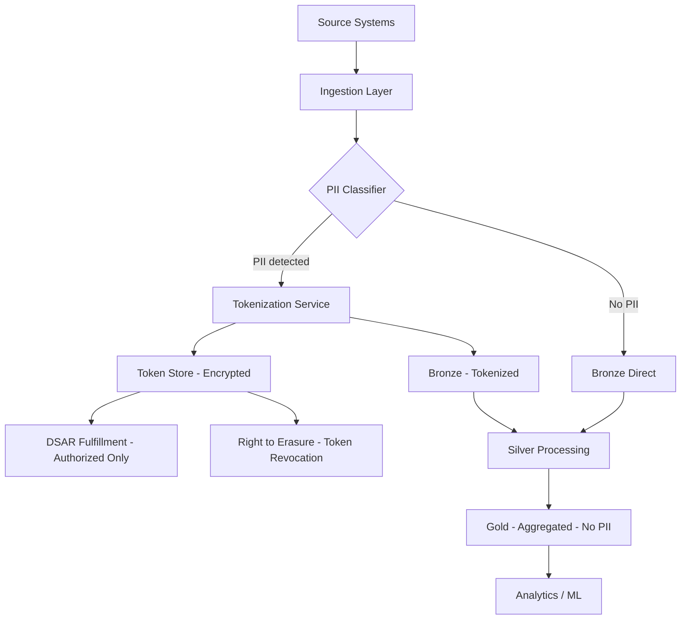

# PII & Compliance — Senior Deep Dive

## Privacy-by-Design Architecture

Build privacy into the data platform architecture from the start:



---

## Automated PII Classification at Scale

```python
import re
from dataclasses import dataclass
from typing import List, Dict, Optional
from pyspark.sql import DataFrame
from pyspark.sql import functions as F
from pyspark.sql.types import StringType

@dataclass
class PIIFinding:
    column: str
    pii_type: str
    confidence: float  # 0-1
    sample_matches: int
    total_sampled: int

class DistributedPIIClassifier:
    """
    PII classification at scale using Spark.
    Combines name-based + pattern-based + ML-based classification.
    """
    
    # Regex patterns for common PII types
    PATTERNS = {
        "email":       re.compile(r"^[a-zA-Z0-9._%+-]+@[a-zA-Z0-9.-]+\.[a-zA-Z]{2,}$"),
        "phone_us":    re.compile(r"^\+?1?[\s.-]?\(?\d{3}\)?[\s.-]?\d{3}[\s.-]?\d{4}$"),
        "ssn":         re.compile(r"^\d{3}-\d{2}-\d{4}$"),
        "credit_card": re.compile(r"^\d{4}[\s-]?\d{4}[\s-]?\d{4}[\s-]?\d{4}$"),
        "ip_v4":       re.compile(r"^\d{1,3}(\.\d{1,3}){3}$"),
        "date_of_birth": re.compile(r"^\d{4}[-/]\d{2}[-/]\d{2}$"),
        "postal_code": re.compile(r"^\d{5}(-\d{4})?$"),
    }
    
    # Column name → PII type mapping
    NAME_SIGNALS = {
        "email": ["email", "e_mail", "electronic_mail"],
        "phone_us": ["phone", "mobile", "cell", "telephone", "contact_number"],
        "ssn": ["ssn", "social_security", "tin", "tax_id"],
        "name": ["first_name", "last_name", "full_name", "given_name", "surname"],
        "address": ["address", "street", "city", "zip", "postal", "location"],
        "date_of_birth": ["dob", "date_of_birth", "birthdate", "birth_date"],
        "credit_card": ["cc_num", "card_number", "credit_card", "pan"],
        "ip_address": ["ip", "ip_address", "client_ip", "remote_addr"],
    }
    
    def classify_dataframe(self, df: DataFrame, sample_fraction: float = 0.01) -> List[PIIFinding]:
        """Classify all string columns in a Spark DataFrame."""
        findings = []
        
        # Sample the DataFrame
        sampled = df.sample(fraction=sample_fraction, seed=42).cache()
        sample_count = sampled.count()
        
        for col in df.columns:
            if dict(df.dtypes)[col] not in ("string", "varchar"):
                continue
            
            # Name-based signal
            name_pii_type = self._name_signal(col)
            
            # Pattern matching on sample
            pattern_results = {}
            col_values = sampled.select(F.col(col).cast(StringType())).filter(F.col(col).isNotNull())
            
            for pii_type, pattern in self.PATTERNS.items():
                pattern_str = pattern.pattern
                match_count = col_values.filter(
                    F.col(col).rlike(pattern_str)
                ).count()
                
                if match_count > 0:
                    pattern_results[pii_type] = match_count / max(sample_count, 1)
            
            # Determine PII type and confidence
            best_pattern = max(pattern_results, key=pattern_results.get) if pattern_results else None
            best_rate = pattern_results.get(best_pattern, 0)
            
            if name_pii_type and best_pattern:
                pii_type = best_pattern
                confidence = min(0.5 + best_rate * 0.5, 1.0)
            elif name_pii_type:
                pii_type = name_pii_type
                confidence = 0.6  # Name-only: medium confidence
            elif best_rate > 0.8:
                pii_type = best_pattern
                confidence = best_rate
            else:
                continue  # Not PII
            
            findings.append(PIIFinding(
                column=col,
                pii_type=pii_type,
                confidence=confidence,
                sample_matches=int(best_rate * sample_count) if best_rate else 0,
                total_sampled=sample_count,
            ))
        
        sampled.unpersist()
        return findings
    
    def _name_signal(self, col_name: str) -> Optional[str]:
        col_lower = col_name.lower()
        for pii_type, signals in self.NAME_SIGNALS.items():
            if any(s in col_lower for s in signals):
                return pii_type
        return None
    
    def emit_findings_to_catalog(self, table_name: str, findings: List[PIIFinding], catalog_client):
        """Persist PII findings to DataHub."""
        for finding in findings:
            if finding.confidence >= 0.7:  # Only tag high-confidence findings
                catalog_client.tag_column(
                    table=table_name,
                    column=finding.column,
                    tags=["pii", f"pii-type:{finding.pii_type}"],
                )
                print(f"Tagged {table_name}.{finding.column} as {finding.pii_type} (confidence: {finding.confidence:.0%})")
```

---

## Consent Management Integration

Track user consent and enforce downstream:

```python
from dataclasses import dataclass, field
from datetime import datetime
from typing import List, Optional, Set
from enum import Enum

class ConsentPurpose(Enum):
    ANALYTICS = "analytics"
    MARKETING = "marketing"
    PERSONALIZATION = "personalization"
    FUNCTIONAL = "functional"
    THIRD_PARTY_SHARING = "third_party_sharing"

@dataclass
class ConsentRecord:
    user_id: str
    consented_purposes: Set[ConsentPurpose]
    consent_timestamp: datetime
    expiry: Optional[datetime] = None
    withdrawn: bool = False
    source: str = "web"  # web | mobile | email

class ConsentEnforcedPipeline:
    """
    Data pipeline that respects user consent decisions.
    Only processes data for purposes user has consented to.
    """
    
    def __init__(self, consent_store, engine):
        self.consent_store = consent_store
        self.engine = engine
    
    def filter_by_consent(
        self, 
        df, 
        user_id_col: str, 
        required_purpose: ConsentPurpose,
    ):
        """Filter DataFrame to only include users who consented to this purpose."""
        
        # Get all users who have consented to this purpose
        consented_users = self.consent_store.get_users_consented_to(required_purpose)
        
        # Filter the DataFrame
        filtered = df.filter(df[user_id_col].isin(consented_users))
        original_count = df.count()
        filtered_count = filtered.count()
        
        print(f"Consent filter [{required_purpose.value}]: {original_count:,} → {filtered_count:,} users ({filtered_count/original_count:.0%} consented)")
        return filtered
    
    def build_marketing_segment(self, df, user_id_col: str):
        """Only include users who consented to marketing."""
        return self.filter_by_consent(df, user_id_col, ConsentPurpose.MARKETING)
    
    def build_analytics_dataset(self, df, user_id_col: str):
        """Analytics dataset: only consented users, then anonymize."""
        filtered = self.filter_by_consent(df, user_id_col, ConsentPurpose.ANALYTICS)
        
        # Further anonymize: remove direct identifiers
        pii_cols_to_drop = ["email", "phone", "name", "address"]
        available_to_drop = [c for c in pii_cols_to_drop if c in filtered.columns]
        return filtered.drop(*available_to_drop)
```

---

## Compliance Audit Trail

```python
import json
from datetime import datetime

class ComplianceAuditLogger:
    """
    Log all PII access and modifications for regulatory compliance.
    Required by GDPR Article 30 (Records of Processing Activities).
    """
    
    def __init__(self, audit_engine):
        self.engine = audit_engine
    
    def log_access(self, user: str, table: str, purpose: str, row_count: int, query_hash: str):
        """Log every access to PII-tagged tables."""
        import sqlalchemy as sa
        
        with self.engine.begin() as conn:
            conn.execute(sa.text("""
                INSERT INTO compliance_audit_log
                (user_email, table_name, action, purpose, row_count, query_hash, accessed_at)
                VALUES (:user, :table, 'SELECT', :purpose, :rows, :hash, NOW())
            """), {"user": user, "table": table, "purpose": purpose, "rows": row_count, "hash": query_hash})
    
    def log_erasure(self, request_id: str, subject: str, tables_affected: dict):
        """Log right-to-erasure completion for GDPR compliance."""
        import sqlalchemy as sa
        
        with self.engine.begin() as conn:
            conn.execute(sa.text("""
                INSERT INTO erasure_log
                (request_id, subject_email, tables_modified, completed_at, audit_detail)
                VALUES (:req, :subject, :tables, NOW(), :detail)
            """), {
                "req": request_id,
                "subject": subject,
                "tables": list(tables_affected.keys()),
                "detail": json.dumps(tables_affected),
            })
```

---

## Interview Tips

> **Tip 1:** "How do you implement privacy-by-design?" — Tokenize PII at ingestion before it enters the data lake. Store tokens in a secure vault, not in the main data lake. Downstream analytics use tokens only — no raw PII. Right-to-erasure is implemented by revoking the token mapping. This prevents PII from proliferating across hundreds of tables.

> **Tip 2:** "What is differential privacy and when would you use it?" — A mathematical framework that adds calibrated noise to query results so individual records can't be inferred. Used for: publishing population statistics publicly, training ML models without memorizing individual records (Apple, Google), sharing datasets with external partners. Hard to implement correctly — use vetted libraries (Google DP library, Apple's DP toolset).

> **Tip 3:** "How would you design a consent management system for a data pipeline?" — Consent decisions are stored in a central consent store (user_id → [consented_purposes]). Pipelines query the consent store before processing and filter to consented users only. Consent changes trigger re-evaluation: if user withdraws marketing consent, their data is removed from the next marketing dataset run. Log all consent checks for audit.
