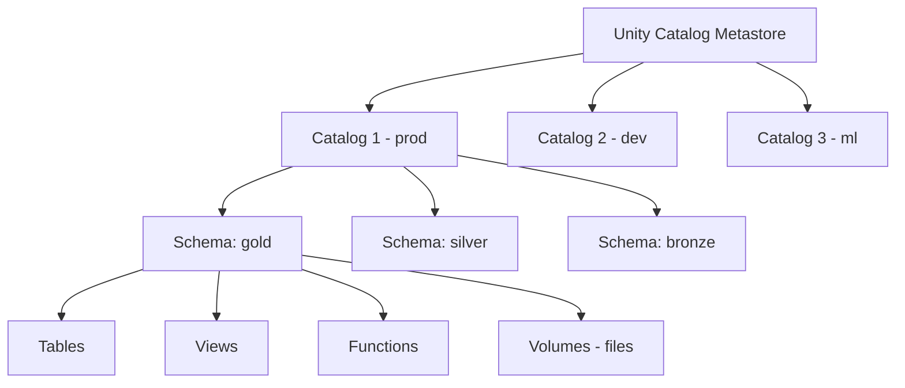

# Unity Catalog Governance — Fundamentals

## What Is Unity Catalog?

Unity Catalog (UC) is Databricks' unified data governance solution. It provides centralized access control, lineage, and auditing across all Databricks workspaces and data assets (tables, views, functions, models).



---

## Unity Catalog Object Hierarchy

```
Metastore
  └── Catalog           (e.g., prod, dev, ml)
        └── Schema      (e.g., gold, silver, bronze)
              └── Table / View / Volume / Function / ML Model
```

```sql
-- Create the hierarchy
CREATE CATALOG prod;
CREATE SCHEMA prod.gold;
CREATE TABLE prod.gold.orders (
  order_id     STRING NOT NULL,
  customer_email STRING,
  amount_usd   DECIMAL(12, 2),
  order_date   DATE
)
COMMENT 'Cleaned and deduped orders from all channels'
TBLPROPERTIES ('owner' = 'revenue-team', 'sensitivity' = 'restricted');

-- Grant access
GRANT USE CATALOG ON CATALOG prod TO `analyst_revenue`;
GRANT USE SCHEMA ON SCHEMA prod.gold TO `analyst_revenue`;
GRANT SELECT ON TABLE prod.gold.orders TO `analyst_revenue`;
```

---

## Unity Catalog RBAC

UC uses identity federation — users and groups from your identity provider (Azure AD, Okta):

```sql
-- Create groups (mirroring your IdP groups)
-- In UC, groups are synced from Azure AD / Okta via SCIM

-- Grant to groups (recommended over individual users)
GRANT SELECT ON TABLE prod.gold.orders TO `data-analysts`;
GRANT SELECT ON TABLE prod.gold.orders TO `data-engineers`;

-- Deny is not supported in UC — use column masks and row filters instead

-- Revoke
REVOKE SELECT ON TABLE prod.gold.orders FROM `contractors`;

-- Check grants
SHOW GRANTS ON TABLE prod.gold.orders;

-- Check what a user can access
SHOW GRANTS TO `john.doe@company.com`;
```

---

## Column Masking in Unity Catalog

```sql
-- Create a masking function
CREATE OR REPLACE FUNCTION prod.gold.mask_email(email STRING)
RETURNS STRING
RETURN CASE
  WHEN is_member('data-pii-approved') THEN email
  ELSE sha2(lower(email), 256)
END;

-- Apply to a column
ALTER TABLE prod.gold.orders
  ALTER COLUMN customer_email
  SET MASK prod.gold.mask_email;

-- Now:
-- data-analysts group: sees hashed email
-- data-pii-approved group: sees real email
-- Transparent — same query, different result based on membership
```

---

## Row Filters in Unity Catalog

```sql
-- Create a row filter function
CREATE OR REPLACE FUNCTION prod.gold.orders_region_filter(region STRING)
RETURNS BOOLEAN
RETURN CASE
  WHEN is_member('data-admin') THEN TRUE
  WHEN is_member('analyst-us') THEN region = 'US'
  WHEN is_member('analyst-eu') THEN region = 'EU'
  ELSE FALSE
END;

-- Apply to table
ALTER TABLE prod.gold.orders
  SET ROW FILTER prod.gold.orders_region_filter ON (region);

-- Now ANALYST-US group only sees US rows, ANALYST-EU sees EU rows
-- Completely transparent to the analyst — no WHERE clause needed
```

---

## Unity Catalog Auditing

```sql
-- All data access is logged in the system audit table
SELECT
  event_time,
  user_identity.email AS user,
  event_name,
  request_params.full_name_arg AS table_accessed,
  response.status_code AS status
FROM system.access.audit
WHERE event_name = 'getTable'
  AND event_time >= current_date() - 7
ORDER BY event_time DESC
LIMIT 100;

-- Find who accessed PII tables
SELECT
  user_identity.email,
  COUNT(*) AS access_count,
  MIN(event_time) AS first_access,
  MAX(event_time) AS last_access
FROM system.access.audit
WHERE request_params.full_name_arg IN (
  'prod.gold.customers',
  'prod.gold.orders'
)
AND event_time >= current_date() - 30
GROUP BY user_identity.email
ORDER BY access_count DESC;
```

---

## Interview Tips

> **Tip 1:** "What is Unity Catalog?" — Databricks' unified governance layer: single place to define access control, lineage, and auditing across all workspaces. Key innovation: three-level namespace (catalog.schema.table) and fine-grained controls (column masking, row filters) applied transparently at query time.

> **Tip 2:** "What's the difference between Unity Catalog and Hive Metastore?" — Hive Metastore: workspace-level, no cross-workspace governance, no column masking, no built-in lineage, no audit log. Unity Catalog: metastore shared across workspaces, fine-grained RBAC, column masking, row filters, built-in lineage, full audit log in `system.access.audit`.

> **Tip 3:** "What is a Volume in Unity Catalog?" — A managed storage location for non-tabular files (CSV, JSON, images, ML artifacts) that benefits from UC governance: access control, lineage, auditing. Replaces direct S3/ADLS paths — instead of `s3://bucket/data/file.csv`, you use `/Volumes/prod/gold/raw_files/file.csv` with UC permissions applied.
