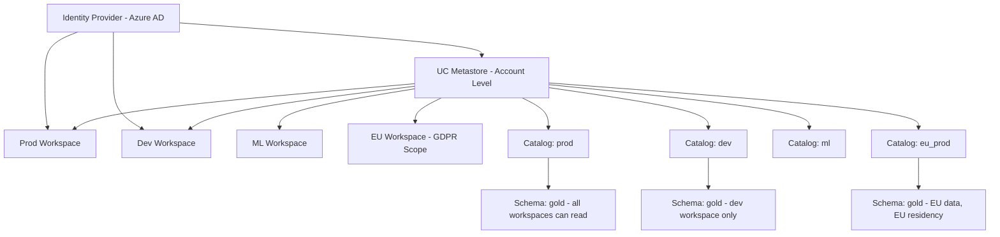

# Unity Catalog Governance — Senior Deep Dive

## Designing a Multi-Workspace UC Architecture

For enterprises with multiple Databricks workspaces (prod, dev, ML, regional):



---

## Terraform-Managed Unity Catalog

Manage the entire UC hierarchy as infrastructure-as-code:

```hcl
# terraform/unity_catalog.tf

terraform {
  required_providers {
    databricks = {
      source  = "databricks/databricks"
      version = "~> 1.30"
    }
  }
}

# Account-level provider
provider "databricks" {
  alias      = "account"
  host       = "https://accounts.azuredatabricks.net"
  account_id = var.databricks_account_id
}

# Workspace-level provider
provider "databricks" {
  alias = "workspace"
  host  = var.workspace_url
}

# Create catalogs
resource "databricks_catalog" "prod" {
  provider = databricks.workspace
  name     = "prod"
  comment  = "Production data catalog — governed by Data Platform team"
  
  properties = {
    purpose = "production"
    team    = "data-platform"
  }
}

resource "databricks_catalog" "dev" {
  provider = databricks.workspace
  name     = "dev"
  comment  = "Development catalog — no PII, masked data only"
}

# Create schemas
resource "databricks_schema" "gold" {
  provider     = databricks.workspace
  catalog_name = databricks_catalog.prod.name
  name         = "gold"
  comment      = "Curated gold layer — source of truth for reporting"
}

# Grants — managed as code
resource "databricks_grants" "gold_schema_analysts" {
  schema = "${databricks_catalog.prod.name}.${databricks_schema.gold.name}"
  
  grant {
    principal  = "data-analysts"
    privileges = ["USE SCHEMA", "SELECT"]
  }
  
  grant {
    principal  = "data-engineers"
    privileges = ["USE SCHEMA", "SELECT", "CREATE TABLE", "CREATE VIEW"]
  }
}

resource "databricks_grants" "orders_table" {
  table = "prod.gold.orders"
  
  grant {
    principal  = "data-analysts"
    privileges = ["SELECT"]
  }
  
  grant {
    principal  = "data-scientists"
    privileges = ["SELECT"]
  }
}

# Column masking function
resource "databricks_sql_query" "email_mask_function" {
  provider = databricks.workspace
  name     = "Create email masking function"
  query    = <<-SQL
    CREATE OR REPLACE FUNCTION prod.gold.mask_email(email STRING)
    RETURNS STRING
    RETURN CASE
      WHEN is_member('data-pii-approved') THEN email
      ELSE sha2(lower(coalesce(email, '')), 256)
    END
  SQL
}
```

---

## Advanced Column Masking Patterns

```sql
-- Pattern 1: Multi-level masking (partial reveal for some roles)
CREATE OR REPLACE FUNCTION prod.gold.mask_phone(phone STRING)
RETURNS STRING
RETURN CASE
  WHEN is_member('data-pii-approved') THEN phone           -- See full number
  WHEN is_member('support-agents') THEN 
    CONCAT('***-***-', RIGHT(phone, 4))                    -- See last 4 digits
  ELSE sha2(phone, 256)                                    -- Hash for everyone else
END;

-- Pattern 2: Dynamic masking based on data attribute (not user role)
-- EU users' data is only visible to EU-approved roles
CREATE OR REPLACE FUNCTION prod.gold.mask_eu_pii(val STRING, user_region STRING)
RETURNS STRING
RETURN CASE
  WHEN user_region != 'EU' THEN val          -- Non-EU data: show freely
  WHEN is_member('eu-data-team') THEN val    -- EU team: see EU data
  ELSE CONCAT(LEFT(val, 2), '***')           -- Others: partially masked
END;

-- Apply with column argument (passes other column as context)
ALTER TABLE prod.gold.customers
  ALTER COLUMN email
  SET MASK prod.gold.mask_eu_pii USING COLUMNS (user_region);
```

---

## Unity Catalog System Tables for Governance

UC provides system tables for auditing and governance analytics:

```sql
-- 1. Who accessed what in the last 7 days
SELECT
  DATE(event_time) AS access_date,
  user_identity.email AS user_email,
  event_name,
  request_params.full_name_arg AS table_name,
  response.status_code
FROM system.access.audit
WHERE event_time >= current_date() - 7
  AND event_name IN ('getTable', 'runCommand', 'commandSubmit')
  AND request_params.full_name_arg IS NOT NULL
ORDER BY event_time DESC
LIMIT 1000;

-- 2. Find sensitive tables with excessive access
SELECT
  request_params.full_name_arg AS table_name,
  COUNT(DISTINCT user_identity.email) AS unique_users,
  COUNT(*) AS total_accesses
FROM system.access.audit a
JOIN (
  SELECT full_name FROM system.information_schema.tables
  WHERE table_name IN (
    SELECT object_name FROM system.information_schema.tags
    WHERE tag_name = 'sensitivity' AND tag_value = 'restricted'
  )
) sensitive ON a.request_params.full_name_arg = sensitive.full_name
WHERE a.event_time >= current_date() - 30
GROUP BY table_name
HAVING unique_users > 20  -- Alert if >20 users accessing restricted table
ORDER BY unique_users DESC;

-- 3. Billing anomaly: unexpected compute on sensitive tables
SELECT
  u.user_identity.email AS user,
  SUM(c.dbu_cost) AS total_dbu_cost,
  COUNT(DISTINCT c.cluster_id) AS clusters_used
FROM system.access.audit u
JOIN system.billing.usage c ON u.source_ip_address = c.tags['source_ip']
WHERE u.request_params.full_name_arg LIKE 'prod.gold.%'
  AND u.event_time >= current_date() - 7
GROUP BY user
ORDER BY total_dbu_cost DESC;
```

---

## External Metastore vs. Unity Catalog

When migrating from Hive Metastore to Unity Catalog:

```python
# Migration script: upgrade Hive tables to UC Delta tables
from databricks.sdk import WorkspaceClient
from databricks.sdk.service.sql import StatementState

w = WorkspaceClient()

def migrate_hive_table_to_uc(
    hive_schema: str,
    table_name: str,
    uc_catalog: str,
    uc_schema: str,
):
    """
    Upgrade a Hive table to Unity Catalog using SYNC.
    This creates a managed UC table from the Hive-managed table.
    """
    
    # Step 1: Create the target schema in UC if it doesn't exist
    w.schemas.create(catalog_name=uc_catalog, name=uc_schema)
    
    # Step 2: Deep clone (or SYNC for external tables)
    migration_sql = f"""
        CREATE OR REPLACE TABLE {uc_catalog}.{uc_schema}.{table_name}
        DEEP CLONE hive_metastore.{hive_schema}.{table_name}
    """
    
    result = w.statement_execution.execute_statement(
        warehouse_id="abc123",
        statement=migration_sql,
        wait_timeout="30m",
    )
    
    if result.status.state != StatementState.SUCCEEDED:
        raise ValueError(f"Migration failed: {result.status.error}")
    
    # Step 3: Apply governance tags from Hive (if available)
    # Step 4: Verify row counts match
    hive_count = w.statement_execution.execute_statement(
        warehouse_id="abc123",
        statement=f"SELECT COUNT(*) FROM hive_metastore.{hive_schema}.{table_name}",
    ).result.row_count
    
    uc_count = w.statement_execution.execute_statement(
        warehouse_id="abc123",
        statement=f"SELECT COUNT(*) FROM {uc_catalog}.{uc_schema}.{table_name}",
    ).result.row_count
    
    if hive_count != uc_count:
        raise ValueError(f"Row count mismatch: Hive={hive_count}, UC={uc_count}")
    
    print(f"Migrated {hive_schema}.{table_name} → {uc_catalog}.{uc_schema}.{table_name} ({uc_count:,} rows)")
```

---

## Interview Tips

> **Tip 1:** "How do you migrate from Hive Metastore to Unity Catalog?" — Use `DEEP CLONE` for managed Delta tables, `CREATE TABLE USING DELTA LOCATION` for external tables. Migrate in phases: start with new tables in UC, then migrate high-priority existing tables, finally decommission Hive. Key: UC uses three-level namespace (catalog.schema.table), so all SQL references must be updated.

> **Tip 2:** "What are UC system tables and why are they useful?" — System tables (system.access.audit, system.billing.usage, system.information_schema.*) provide governance analytics. Access audit log: every query, who ran it, on what table. Usage: correlate access with compute cost. Information schema: current grants, table metadata. All queryable via standard SQL — no separate tool needed.

> **Tip 3:** "How do you handle column masking for complex data types (structs, arrays)?" — UC column masking operates on the top-level column. For structs, you need to either (a) create a view that extracts and masks specific nested fields, or (b) write a masking function that returns the entire struct with sensitive fields nulled/hashed. Arrays of structs: same challenge — mask via a view using `TRANSFORM(array_col, x -> struct(x.id, sha2(x.email, 256)))`.
