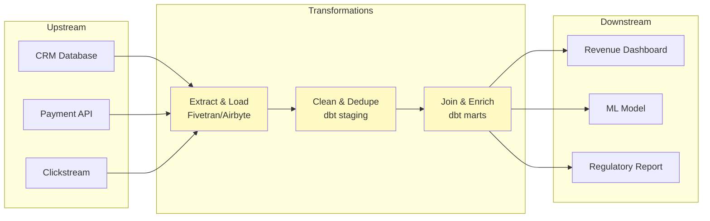
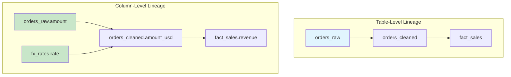
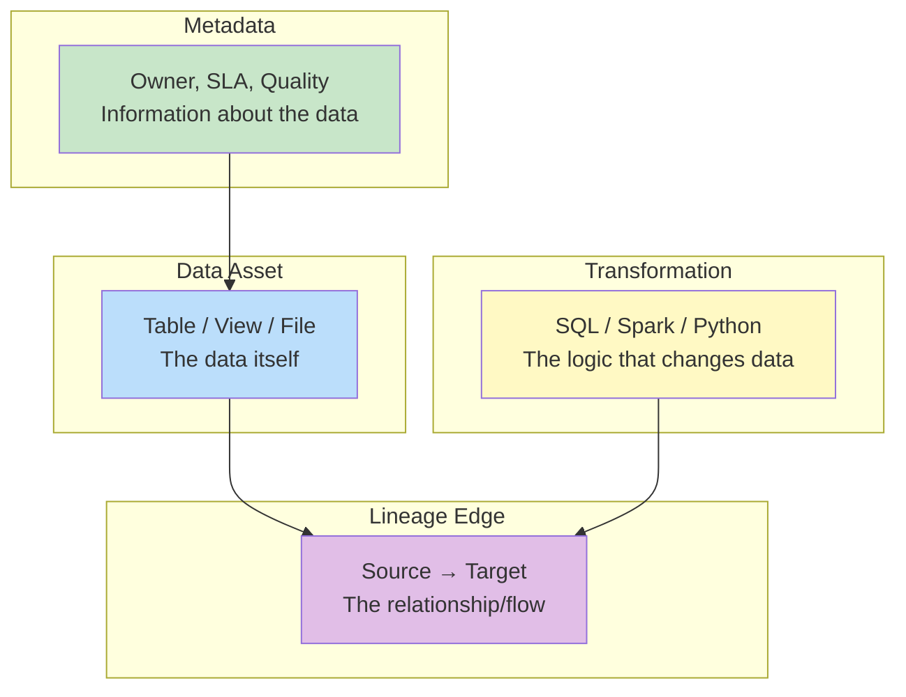

# Data Lineage — Fundamentals

## What is Data Lineage?

Data lineage is the **complete record of where data comes from, how it moves, and how it transforms** through a data system. It answers three fundamental questions:

1. **Where did this data come from?** (upstream sources)
2. **What happened to it?** (transformations)
3. **Where does it go?** (downstream consumers)



## Why Data Lineage Matters

| Use Case | How Lineage Helps |
|----------|------------------|
| **Impact analysis** | "If I change this source column, what breaks downstream?" |
| **Root cause analysis** | "Why is this dashboard showing wrong numbers?" → trace back to source |
| **Regulatory compliance** | "Prove where this customer data came from" (GDPR, HIPAA) |
| **Data quality** | "Where did the NULLs get introduced in the pipeline?" |
| **Trust** | "Can I trust this number? What logic produced it?" |
| **Migration planning** | "What depends on this table? What must I migrate first?" |

## Types of Data Lineage



| Level | What it Tracks | Example |
|-------|---------------|---------|
| **Table-level** | Which tables feed which tables | `orders_raw → orders_cleaned → fact_sales` |
| **Column-level** | Which columns feed which columns | `orders.amount × fx.rate → fact_sales.revenue_usd` |
| **Row-level** | Which specific rows contributed | "Row 5001 in fact_sales came from rows 12, 13 in orders" |
| **Value-level** | How specific values were computed | "$150 = $100 USD × 1.5 EUR rate" |

## How Lineage is Captured

### 1. Automatic Parsing (SQL-based tools)

```sql
-- dbt, Atlan, Collibra can parse SQL to extract lineage:
-- This SQL automatically reveals lineage:
CREATE TABLE gold.fact_sales AS
SELECT
    o.order_id,
    c.customer_name,
    o.amount * fx.rate AS revenue_usd    -- Column lineage: amount + rate → revenue_usd
FROM silver.orders o
JOIN silver.customers c ON o.customer_id = c.customer_id
JOIN silver.fx_rates fx ON o.currency = fx.currency AND o.date = fx.date;

-- Parsed lineage:
-- Table: silver.orders → gold.fact_sales
-- Table: silver.customers → gold.fact_sales
-- Table: silver.fx_rates → gold.fact_sales
-- Column: orders.amount + fx_rates.rate → fact_sales.revenue_usd
-- Column: customers.customer_name → fact_sales.customer_name
```

### 2. dbt Lineage (Built-in)

```yaml
# dbt automatically generates lineage from ref() and source() calls:
# models/marts/fact_sales.sql uses:
#   {{ ref('stg_orders') }}
#   {{ ref('stg_customers') }}
#   {{ source('payments', 'transactions') }}

# dbt docs generate → creates lineage graph automatically!
```

### 3. Operational Metadata

```python
# Airflow/Spark/etc. emit operational lineage:
# "Job X read from table A and wrote to table B at timestamp T"

# OpenLineage standard captures this:
{
    "eventType": "COMPLETE",
    "job": {"name": "daily_etl_orders"},
    "inputs": [
        {"namespace": "postgres", "name": "raw.orders"},
        {"namespace": "postgres", "name": "raw.customers"}
    ],
    "outputs": [
        {"namespace": "snowflake", "name": "silver.orders_enriched"}
    ]
}
```

## Lineage Components



## Common Lineage Tools

| Tool | Type | How it Works |
|------|------|-------------|
| **dbt** | SQL-based | Parses `ref()` and `source()` → lineage DAG |
| **Apache Atlas** | Metadata catalog | Hooks into Hive/Spark for automatic lineage |
| **DataHub** | Data catalog | Ingests lineage from multiple sources |
| **Atlan** | Governance platform | SQL parsing + API integrations |
| **OpenLineage** | Standard/protocol | Unified lineage events from any system |
| **Unity Catalog** | Databricks-native | Automatic lineage for Spark/SQL |
| **Snowflake ACCESS_HISTORY** | Built-in | Query-level lineage tracking |

## Basic Lineage Querying

```sql
-- Snowflake: Query who accessed what (operational lineage)
SELECT 
    query_id,
    user_name,
    base_objects_accessed,     -- Source tables
    objects_modified           -- Target tables
FROM snowflake.account_usage.access_history
WHERE query_start_time > DATEADD('day', -7, CURRENT_TIMESTAMP);

-- Databricks Unity Catalog: Table lineage
-- Automatically captured for all SQL/Spark operations
-- Visible in the Unity Catalog UI: table → "Lineage" tab
```

## Interview Tips

> **Tip 1:** "What is data lineage?" — The end-to-end tracking of data from source to consumption — where it came from, what transformations happened, and where it goes. It enables impact analysis (what breaks if I change X), root cause analysis (why is this number wrong), and regulatory compliance (prove data provenance).

> **Tip 2:** "How do you implement lineage?" — Multiple approaches: (1) SQL parsing (dbt, Atlan automatically extract from queries), (2) Operational metadata (Airflow/Spark emit input/output events via OpenLineage), (3) Platform-native (Snowflake ACCESS_HISTORY, Databricks Unity Catalog). Best practice: combine automated capture with manual documentation for business context.

> **Tip 3:** "Table-level vs. column-level lineage?" — Table-level: which tables feed which tables (easier to capture, most tools support). Column-level: which specific columns feed which columns including transformations (harder, but critical for impact analysis — "will this dashboard break if I rename that column?").
