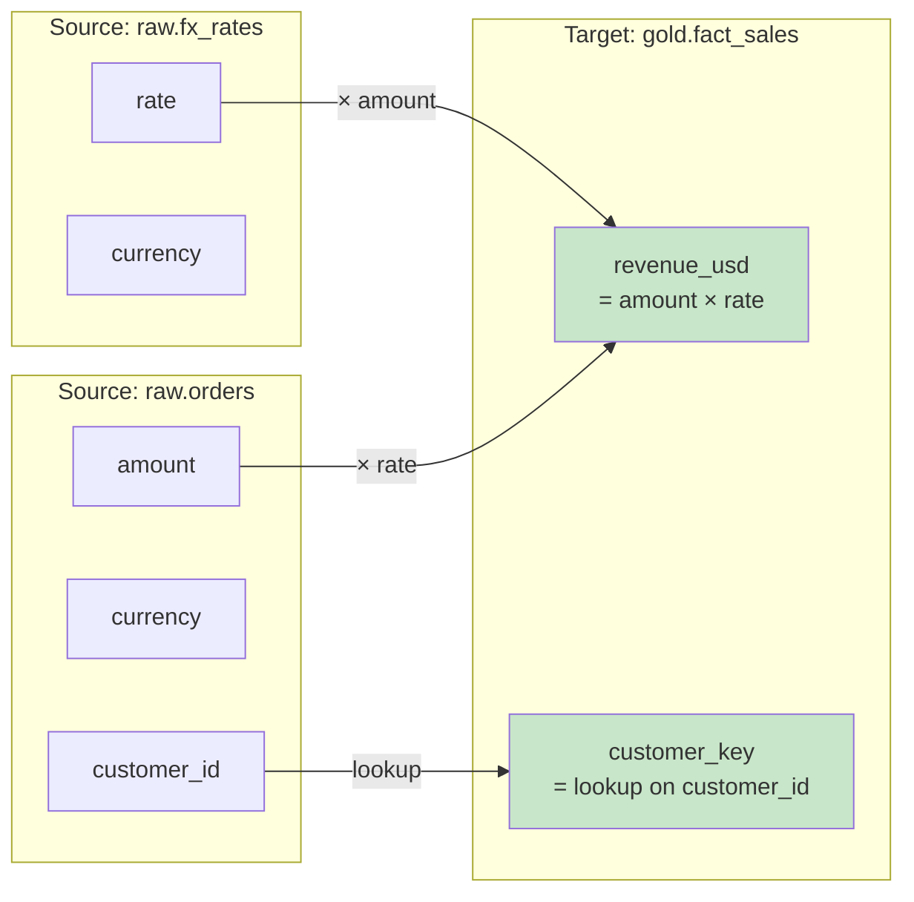
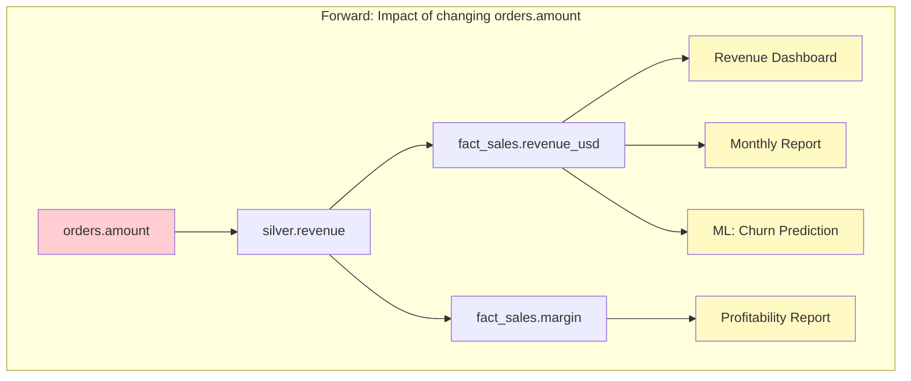

# Data Lineage — Intermediate Concepts

## Column-Level Lineage

Column-level lineage tracks exactly which source columns contribute to each target column, including transformations.



```sql
-- SQL that creates column lineage:
SELECT
    o.order_id,                              -- direct pass-through
    o.amount * fx.rate AS revenue_usd,       -- computation: amount + rate
    UPPER(c.name) AS customer_name,          -- transformation: UPPER
    COALESCE(o.region, 'Unknown') AS region, -- transformation: COALESCE
    CASE 
        WHEN o.amount > 1000 THEN 'high'
        ELSE 'standard'
    END AS order_tier                        -- derived: amount → tier
FROM orders o
JOIN fx_rates fx ON o.currency = fx.currency
JOIN customers c ON o.customer_id = c.customer_id;

-- Column lineage extracted:
-- orders.order_id → fact_sales.order_id (direct)
-- orders.amount + fx_rates.rate → fact_sales.revenue_usd (computation)
-- customers.name → fact_sales.customer_name (transformation: UPPER)
-- orders.region → fact_sales.region (transformation: COALESCE)
-- orders.amount → fact_sales.order_tier (derivation: CASE)
```

## Impact Analysis with Lineage

**Forward lineage (impact):** "If I change column X, what downstream is affected?"

**Backward lineage (root cause):** "Where does this suspicious value come from?"



```sql
-- Practical impact analysis query (using lineage metadata table):
-- "What reports break if I rename raw.orders.amount?"

SELECT DISTINCT
    downstream_table,
    downstream_column,
    downstream_type,        -- 'dashboard', 'ml_model', 'report', 'api'
    downstream_owner,
    transformation_type     -- 'direct', 'computed', 'filtered'
FROM lineage_metadata
WHERE upstream_table = 'raw.orders'
  AND upstream_column = 'amount'
ORDER BY downstream_type;

-- Result:
-- silver.orders_cleaned | amount_usd    | table     | data-eng | computed
-- gold.fact_sales       | revenue_usd   | table     | data-eng | computed
-- gold.fact_sales       | margin         | table     | data-eng | computed
-- Revenue Dashboard     | total_revenue | dashboard | analytics| aggregated
-- Monthly P&L           | revenue_line  | report    | finance  | aggregated
-- churn_model_v2        | revenue_feature| ml_model | data-sci | direct
```

## OpenLineage Standard

OpenLineage is an open standard for lineage event collection across heterogeneous systems.

```python
# OpenLineage event structure:
{
    "eventType": "COMPLETE",      # START, RUNNING, COMPLETE, FAIL
    "eventTime": "2024-03-15T10:30:00Z",
    "run": {
        "runId": "run-uuid-123",
        "facets": {
            "processing_engine": {"name": "spark", "version": "3.5.0"}
        }
    },
    "job": {
        "namespace": "production-etl",
        "name": "daily_orders_transform",
        "facets": {
            "sql": {"query": "INSERT INTO silver.orders SELECT ..."},
            "ownership": {"owner": "data-engineering-team"}
        }
    },
    "inputs": [
        {
            "namespace": "postgres://prod-db",
            "name": "raw.orders",
            "facets": {
                "schema": {
                    "fields": [
                        {"name": "order_id", "type": "INTEGER"},
                        {"name": "amount", "type": "DECIMAL"}
                    ]
                },
                "dataQuality": {
                    "rowCount": 50000,
                    "nullCount": {"amount": 12}
                }
            }
        }
    ],
    "outputs": [
        {
            "namespace": "snowflake://warehouse",
            "name": "silver.orders_cleaned",
            "facets": {
                "schema": {"fields": [...]},
                "outputStatistics": {"rowCount": 49988}
            }
        }
    ]
}
```

### Integrating OpenLineage with Airflow

```python
# airflow/dags/daily_etl.py
from airflow import DAG
from airflow.providers.openlineage.plugins.adapter import OpenLineageAdapter

# When using OpenLineage-enabled Airflow, lineage is captured automatically:
# Each task emits: START → RUNNING → COMPLETE/FAIL events
# Input/output datasets extracted from operator parameters

with DAG('daily_etl', ...):
    extract = PostgresOperator(
        task_id='extract_orders',
        sql='SELECT * FROM raw.orders WHERE date = {{ ds }}',
        # OpenLineage captures: input=postgres.raw.orders
    )
    
    load = SnowflakeOperator(
        task_id='load_orders',
        sql='INSERT INTO silver.orders_staging ...',
        # OpenLineage captures: output=snowflake.silver.orders_staging
    )
    
    extract >> load
    # Lineage: postgres.raw.orders → [extract_orders] → snowflake.silver.orders_staging
```

## dbt Lineage Features

```yaml
# dbt automatically captures lineage through ref() and source()

# models/staging/stg_orders.sql
# SELECT * FROM {{ source('postgres', 'raw_orders') }}
# Lineage: source.postgres.raw_orders → stg_orders

# models/marts/fact_sales.sql
# SELECT ... FROM {{ ref('stg_orders') }} JOIN {{ ref('stg_customers') }}
# Lineage: stg_orders + stg_customers → fact_sales

# Column lineage (dbt Cloud feature):
# Automatically parsed from SQL transformations
# Visible in dbt Cloud UI: column → "Upstream/Downstream" tabs
```

### Exposures (Documenting Downstream Consumers)

```yaml
# models/exposures.yml — Document what depends on your models
exposures:
  - name: revenue_dashboard
    type: dashboard
    maturity: high
    url: https://looker.company.com/dashboards/42
    description: "Executive revenue dashboard updated hourly"
    depends_on:
      - ref('fact_sales')
      - ref('dim_customer')
    owner:
      name: "Analytics Team"
      email: analytics@company.com

  - name: churn_ml_model
    type: ml
    maturity: medium
    description: "Customer churn prediction model"
    depends_on:
      - ref('fact_user_activity')
      - ref('dim_customer')
    owner:
      name: "Data Science Team"
      email: datascience@company.com
```

## Lineage Metadata Storage

```sql
-- Custom lineage metadata table (if using a custom solution):
CREATE TABLE data_governance.lineage_edges (
    edge_id             INT PRIMARY KEY,
    -- Source:
    upstream_database   VARCHAR(100),
    upstream_schema     VARCHAR(100),
    upstream_table      VARCHAR(200),
    upstream_column     VARCHAR(200),
    -- Target:
    downstream_database VARCHAR(100),
    downstream_schema   VARCHAR(100),
    downstream_table    VARCHAR(200),
    downstream_column   VARCHAR(200),
    -- Relationship:
    transformation_type VARCHAR(50),    -- 'direct', 'aggregation', 'filter', 'join', 'computation'
    transformation_sql  TEXT,           -- The actual SQL logic
    -- Metadata:
    job_name            VARCHAR(200),   -- ETL job that creates this edge
    last_verified       TIMESTAMP,      -- When lineage was last confirmed
    is_active           BOOLEAN DEFAULT TRUE
);

-- Query: "Show me everything upstream of fact_sales.revenue"
WITH RECURSIVE upstream_trace AS (
    -- Base: start from target
    SELECT upstream_table, upstream_column, downstream_table, downstream_column, 1 AS depth
    FROM data_governance.lineage_edges
    WHERE downstream_table = 'fact_sales' AND downstream_column = 'revenue'
    
    UNION ALL
    
    -- Recurse upstream:
    SELECT e.upstream_table, e.upstream_column, e.downstream_table, e.downstream_column, t.depth + 1
    FROM data_governance.lineage_edges e
    JOIN upstream_trace t ON e.downstream_table = t.upstream_table 
                         AND e.downstream_column = t.upstream_column
    WHERE t.depth < 10  -- Prevent infinite loops
)
SELECT * FROM upstream_trace ORDER BY depth DESC;
```

## Interview Tips

> **Tip 1:** "How do you perform impact analysis?" — Use forward lineage: trace from the column/table being changed to all downstream dependencies. Tools like dbt (ref graph), DataHub, or custom lineage tables provide this. Before any schema change, run impact analysis to identify affected dashboards, models, and reports. Notify owners of downstream assets.

> **Tip 2:** "What is OpenLineage?" — An open standard for collecting lineage events across different tools (Airflow, Spark, dbt, etc.). It defines a common event format (job, inputs, outputs, facets) that any system can emit. Enables cross-platform lineage in heterogeneous environments.

> **Tip 3:** "How does dbt provide lineage?" — Through the `ref()` function. Every model that references another via `{{ ref('model_name') }}` creates a lineage edge. `dbt docs generate` creates an interactive DAG. Exposures document downstream consumers (dashboards, ML models). dbt Cloud adds automatic column-level lineage via SQL parsing.
