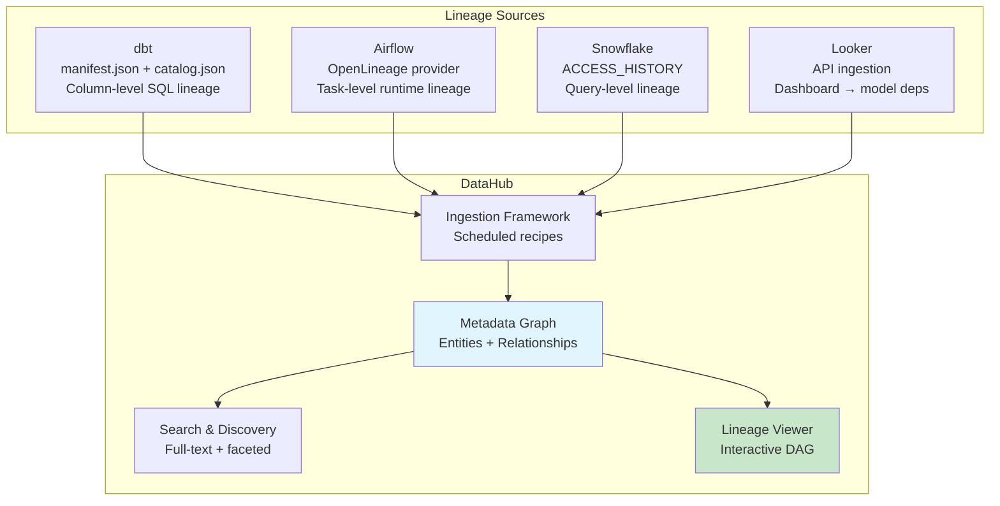

# Data Lineage — Real-World Production Examples

## Example 1: DataHub + dbt + Airflow Integration



### DataHub Ingestion Configuration

```yaml
# datahub-ingestion/recipes/dbt_recipe.yml
source:
  type: dbt
  config:
    manifest_path: "s3://data-platform-artifacts/dbt/manifest.json"
    catalog_path: "s3://data-platform-artifacts/dbt/catalog.json"
    run_results_path: "s3://data-platform-artifacts/dbt/run_results.json"
    target_platform: snowflake
    # Enable column-level lineage:
    enable_meta_mapping: true
    node_name_pattern:
      allow: [".*"]

sink:
  type: datahub-rest
  config:
    server: "https://datahub.company.com/gms"

---
# datahub-ingestion/recipes/snowflake_lineage.yml
source:
  type: snowflake-usage
  config:
    account_id: "company-account"
    username: "${SNOWFLAKE_USER}"
    password: "${SNOWFLAKE_PASS}"
    warehouse: "ANALYTICS_WH"
    # Extract lineage from query logs:
    include_operational_stats: true
    start_time: "-7d"  # Last 7 days of query history

sink:
  type: datahub-rest
  config:
    server: "https://datahub.company.com/gms"
```

### Airflow + OpenLineage Setup

```python
# airflow/dags/config.py
# Airflow 2.7+ with OpenLineage provider:
# pip install apache-airflow-providers-openlineage

# airflow.cfg or env vars:
# OPENLINEAGE_URL=https://datahub.company.com/openlineage
# OPENLINEAGE_NAMESPACE=production-airflow

# Every task automatically emits lineage events!
# No code changes needed — just install the provider.

# For custom operators, add lineage explicitly:
from airflow.lineage import AUTO

class CustomETLOperator(BaseOperator):
    # Declare inputs/outputs for lineage:
    inlets = [Dataset("snowflake://prod/raw.orders")]
    outlets = [Dataset("snowflake://prod/silver.orders_cleaned")]
    
    def execute(self, context):
        # ... transformation logic ...
        pass
```

---

## Example 2: Custom Lineage System (Financial Services)

A bank building its own lineage for SOX/BCBS239 compliance:

```sql
-- ═══════════════════════════════════════
-- Lineage metadata schema
-- ═══════════════════════════════════════

CREATE SCHEMA governance;

-- Table-level lineage:
CREATE TABLE governance.lineage_table_edges (
    edge_id             INT IDENTITY PRIMARY KEY,
    source_database     VARCHAR(100),
    source_schema       VARCHAR(100),
    source_table        VARCHAR(200),
    target_database     VARCHAR(100),
    target_schema       VARCHAR(100),
    target_table        VARCHAR(200),
    -- Relationship metadata:
    etl_job_name        VARCHAR(200),
    etl_tool            VARCHAR(50),      -- 'dbt', 'airflow', 'spark'
    transformation_type VARCHAR(50),      -- 'direct_copy', 'aggregation', 'filter', 'join'
    -- Freshness:
    last_run_time       TIMESTAMP,
    avg_duration_sec    INT,
    -- Governance:
    data_owner          VARCHAR(200),
    data_steward        VARCHAR(200),
    is_certified        BOOLEAN DEFAULT FALSE,
    certification_date  DATE,
    created_at          TIMESTAMP DEFAULT CURRENT_TIMESTAMP()
);

-- Column-level lineage:
CREATE TABLE governance.lineage_column_edges (
    edge_id             INT IDENTITY PRIMARY KEY,
    source_table        VARCHAR(300),     -- schema.table
    source_column       VARCHAR(200),
    target_table        VARCHAR(300),
    target_column       VARCHAR(200),
    transformation_sql  TEXT,             -- Exact SQL expression
    is_pii_propagation  BOOLEAN DEFAULT FALSE,  -- PII tracking!
    is_aggregation      BOOLEAN DEFAULT FALSE
);

-- Data classification (for PII tracking through lineage):
CREATE TABLE governance.column_classifications (
    table_name          VARCHAR(300),
    column_name         VARCHAR(200),
    classification      VARCHAR(50),      -- 'PII', 'SENSITIVE', 'PUBLIC', 'INTERNAL'
    pii_type            VARCHAR(50),      -- 'email', 'ssn', 'name', 'phone', 'address'
    encryption_required BOOLEAN DEFAULT FALSE,
    masking_rule        VARCHAR(100),     -- 'full_mask', 'partial_mask', 'hash', 'none'
    PRIMARY KEY (table_name, column_name)
);
```

### Automated Lineage Extraction from dbt

```python
# scripts/extract_dbt_lineage.py
import json
from pathlib import Path

def extract_lineage_from_manifest(manifest_path):
    """Parse dbt manifest.json to extract table + column lineage."""
    with open(manifest_path) as f:
        manifest = json.load(f)
    
    edges = []
    
    for node_id, node in manifest['nodes'].items():
        if node['resource_type'] != 'model':
            continue
        
        target_table = f"{node['schema']}.{node['name']}"
        
        # Table-level lineage (from depends_on):
        for dep in node.get('depends_on', {}).get('nodes', []):
            dep_node = manifest['nodes'].get(dep) or manifest['sources'].get(dep)
            if dep_node:
                source_table = f"{dep_node['schema']}.{dep_node['name']}"
                edges.append({
                    'source_table': source_table,
                    'target_table': target_table,
                    'etl_job_name': f"dbt_run_{node['name']}",
                    'etl_tool': 'dbt'
                })
        
        # Column-level lineage (from compiled SQL parsing):
        if 'compiled_code' in node:
            col_lineage = parse_sql_column_lineage(node['compiled_code'])
            edges.extend(col_lineage)
    
    return edges

def load_lineage_to_snowflake(edges):
    """Load extracted lineage into governance tables."""
    # Use Snowflake connector to INSERT lineage edges
    for edge in edges:
        execute_sql(f"""
            MERGE INTO governance.lineage_table_edges target
            USING (SELECT '{edge['source_table']}' AS source_table,
                          '{edge['target_table']}' AS target_table) source
            ON target.source_table = source.source_table 
               AND target.target_table = source.target_table
            WHEN MATCHED THEN UPDATE SET last_run_time = CURRENT_TIMESTAMP()
            WHEN NOT MATCHED THEN INSERT (source_table, target_table, etl_job_name, etl_tool)
                VALUES (source.source_table, source.target_table, 
                        '{edge["etl_job_name"]}', '{edge["etl_tool"]}')
        """)
```

---

## Example 3: GDPR Data Subject Erasure with Lineage

```sql
-- ═══════════════════════════════════════
-- Process: Customer requests data deletion (GDPR Article 17)
-- Lineage helps identify ALL tables with their data
-- ═══════════════════════════════════════

-- Step 1: Find all PII columns and their propagation
CREATE OR REPLACE PROCEDURE governance.trace_pii_for_customer(customer_id VARCHAR)
RETURNS TABLE (table_name VARCHAR, column_name VARCHAR, contains_direct_pii BOOLEAN)
AS
$$
WITH RECURSIVE pii_trace AS (
    -- Base: tables with direct customer PII
    SELECT 
        cc.table_name,
        cc.column_name,
        TRUE AS contains_direct_pii,
        1 AS hop
    FROM governance.column_classifications cc
    WHERE cc.classification = 'PII'
      AND EXISTS (
          SELECT 1 FROM information_schema.columns ic
          WHERE ic.table_schema || '.' || ic.table_name = cc.table_name
      )
    
    UNION ALL
    
    -- Downstream: tables that receive PII through transformations
    SELECT 
        le.target_table,
        le.target_column,
        FALSE AS contains_direct_pii,
        pt.hop + 1
    FROM pii_trace pt
    JOIN governance.lineage_column_edges le 
        ON le.source_table = pt.table_name 
        AND le.source_column = pt.column_name
        AND le.is_pii_propagation = TRUE
    WHERE pt.hop < 10
)
SELECT DISTINCT table_name, column_name, contains_direct_pii
FROM pii_trace
ORDER BY contains_direct_pii DESC, table_name;
$$;

-- Step 2: Execute erasure across all identified tables
-- CALL governance.trace_pii_for_customer('CUST-12345');
-- Result:
-- | silver.customers       | email          | TRUE  | → DELETE/ANONYMIZE
-- | silver.customers       | name           | TRUE  | → DELETE/ANONYMIZE
-- | gold.dim_customer      | customer_name  | FALSE | → UPDATE (derived)
-- | gold.fact_sales        | customer_email | FALSE | → SET NULL
-- | analytics.user_report  | user_name      | FALSE | → REGENERATE
```

---

## Example 4: Lineage-Driven Data Quality Alerts

```python
# When a data quality issue is detected, use lineage to:
# 1. Identify root cause (trace upstream)
# 2. Assess blast radius (trace downstream)
# 3. Notify all affected stakeholders

from lineage_client import LineageAPI

def handle_dq_alert(table, column, issue_type, severity):
    """Use lineage to contextualize and route DQ alerts."""
    lineage = LineageAPI()
    
    # 1. Trace upstream to find root cause:
    upstream = lineage.get_upstream(table, column, max_hops=5)
    root_candidates = [
        node for node in upstream 
        if node.layer == 'bronze'  # Problem likely originated at source
    ]
    
    # 2. Trace downstream to assess impact:
    downstream = lineage.get_downstream(table, column, max_hops=10)
    affected_dashboards = [n for n in downstream if n.type == 'dashboard']
    affected_ml_models = [n for n in downstream if n.type == 'ml_model']
    affected_reports = [n for n in downstream if n.type == 'report']
    
    # 3. Build alert with full context:
    alert = {
        'issue': f"DQ issue in {table}.{column}: {issue_type}",
        'severity': severity,
        'root_cause_candidates': root_candidates,
        'blast_radius': {
            'tables_affected': len(downstream),
            'dashboards_affected': [d.name for d in affected_dashboards],
            'ml_models_affected': [m.name for m in affected_ml_models],
            'reports_affected': [r.name for r in affected_reports]
        },
        'stakeholders': list(set(
            [n.owner for n in downstream if n.owner]
        ))
    }
    
    # 4. Route to appropriate teams:
    for owner in alert['stakeholders']:
        send_notification(owner, alert)
    
    return alert
```

---

## Interview Tips

> **Tip 1:** "How would you build an enterprise lineage system?" — (1) Collect from multiple sources: dbt manifest (SQL lineage), Airflow+OpenLineage (runtime), Snowflake ACCESS_HISTORY (query-based), BI tool APIs (consumption). (2) Normalize into a unified graph (Neo4j or lineage tables). (3) Expose via API + UI for impact analysis, compliance, and data discovery. (4) Integrate into CI/CD for pre-merge impact checks.

> **Tip 2:** "How do you use lineage for GDPR compliance?" — Tag PII columns in your catalog. Use forward lineage to trace where PII propagates (which downstream tables contain copies/derivations of that PII). When a deletion request arrives, lineage gives you the complete list of tables to erase from — no manual audit needed. Automated erasure scripts use lineage metadata to find all locations.

> **Tip 3:** "How does lineage improve data quality?" — When a DQ issue is detected: backward lineage finds the root cause (which upstream step introduced the problem). Forward lineage assesses blast radius (which dashboards/models are now showing wrong data). Combined: you can automatically notify all affected stakeholders with the full context, not just "something's broken."
