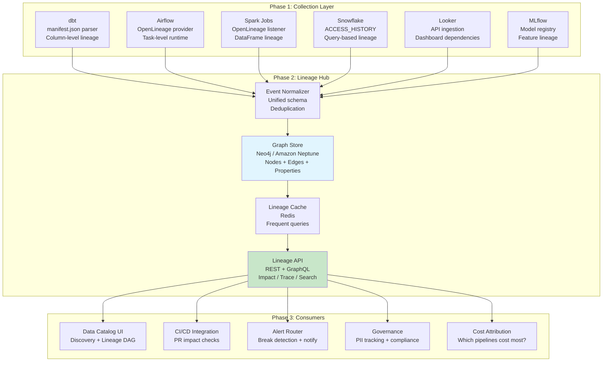

# Scenario Questions — Data Lineage

<article data-difficulty="junior">

## 🟢 Junior: Tracing a Data Issue

**Scenario:** The finance team reports that yesterday's revenue dashboard is showing $0 for the "Enterprise" segment. The dashboard reads from `gold.fact_revenue`. Using the lineage below, trace backward to identify where the problem might originate and explain your debugging approach.

Lineage path:
```
crm_database.accounts → bronze.raw_accounts → silver.dim_customer (segment column) →
                         gold.fact_revenue (joined on customer_key, filtered by segment)

payments_api.transactions → bronze.raw_payments → silver.stg_payments →
                            gold.fact_revenue (revenue amounts)
```

<details>
<summary>💡 Hint</summary>
Start from the symptom (gold.fact_revenue shows $0 for Enterprise) and trace backward. The issue is either: (1) no data flowing from payments (revenue = 0), OR (2) segment mapping is wrong (Enterprise customers exist but segment label is different). Check each layer from gold backward to source.
</details>

<details>
<summary>✅ Solution</summary>

**Debugging approach using backward lineage:**

```sql
-- Step 1: Check the gold layer directly
SELECT segment, SUM(revenue), COUNT(*)
FROM gold.fact_revenue
WHERE date_key = 20240314
GROUP BY segment;
-- Expected: 'Enterprise' row with revenue > 0
-- If missing entirely: segment mapping issue
-- If present with $0: revenue data issue

-- Step 2: Check silver.dim_customer (segment source)
SELECT segment, COUNT(*) 
FROM silver.dim_customer 
WHERE is_current = TRUE
GROUP BY segment;
-- Check: Does 'Enterprise' exist? Was it renamed to 'enterprise' or 'ENTERPRISE'?
-- Common bug: case sensitivity in segment values!

-- Step 3: Check silver.stg_payments (revenue source)
SELECT COUNT(*), SUM(amount)
FROM silver.stg_payments
WHERE payment_date = '2024-03-14';
-- If count = 0: data didn't flow from source
-- If count > 0: joining/filtering is the problem

-- Step 4: Check bronze.raw_payments (did data arrive?)
SELECT COUNT(*)
FROM bronze.raw_payments
WHERE _loaded_at::DATE = '2024-03-14';
-- If 0: the payments_api extraction failed!

-- Step 5: Check bronze.raw_accounts (did segment change?)
SELECT account_type, COUNT(*)
FROM bronze.raw_accounts
GROUP BY account_type;
-- Maybe CRM renamed 'Enterprise' to 'Enterprise (Legacy)' and ETL
-- doesn't map the new value to the expected segment
```

**Most likely root causes (ordered by probability):**
1. **Source extraction failed** — payments API was down, no data in bronze
2. **Segment value changed** — CRM team renamed "Enterprise" to something else
3. **ETL timing** — silver.dim_customer refreshed before payments loaded (join mismatch)
4. **Schema change** — source column renamed, ETL silently produces NULLs

**How lineage helps:**
- Without lineage: you'd spend hours guessing which of 50 tables might be involved
- With lineage: you follow the exact path backward, checking each node
- Each layer (gold → silver → bronze → source) narrows the problem by 50%
- You find the root cause in minutes, not hours

</details>

</article>

<article data-difficulty="mid-level">

## 🟡 Mid-Level: Impact Analysis for Schema Change

**Scenario:** The product team wants to rename the column `raw.orders.total_amount` to `raw.orders.gross_amount` and add a new column `raw.orders.net_amount`. As the data engineer, use lineage to: (1) identify all downstream impacts, (2) create a migration plan that avoids breaking anything, and (3) define tests to validate the change. The current lineage shows 12 downstream tables, 3 dashboards, and 1 ML model depending on `total_amount`.

<details>
<summary>💡 Hint</summary>
Run forward lineage from `raw.orders.total_amount`. Categorize impacts by layer (bronze→silver→gold→consumers). Plan: add new column first (non-breaking), update all downstream to use new column, then deprecate old column. Test: row-count parity, value comparison between old and new paths.
</details>

<details>
<summary>✅ Solution</summary>

```sql
-- ═══════════════════════════════════════
-- STEP 1: Full Impact Analysis
-- ═══════════════════════════════════════

-- Run forward lineage from the affected column:
SELECT 
    downstream_table,
    downstream_column,
    transformation_type,
    layer,
    owner
FROM governance.lineage_column_edges
WHERE upstream_table = 'raw.orders' AND upstream_column = 'total_amount'
ORDER BY layer, downstream_table;
```

**Impact Assessment:**

| Layer | Table | Column | Owner | Risk |
|-------|-------|--------|-------|------|
| Bronze | bronze.raw_orders | total_amount | data-eng | Direct copy |
| Silver | silver.stg_orders | order_amount | data-eng | Renamed |
| Silver | silver.orders_validated | amount_usd | data-eng | Transformed (× fx rate) |
| Gold | gold.fact_sales | revenue | data-eng | Aggregated |
| Gold | gold.fact_returns | original_amount | data-eng | Direct |
| Gold | gold.customer_ltv | lifetime_value | data-eng | SUM aggregation |
| Dashboard | Revenue Dashboard | - | analytics | Via fact_sales |
| Dashboard | Executive KPIs | - | executive | Via customer_ltv |
| Dashboard | Returns Analysis | - | ops | Via fact_returns |
| ML Model | churn_predictor_v2 | revenue_feature | data-sci | Direct feature |

```sql
-- ═══════════════════════════════════════
-- STEP 2: Migration Plan (Zero-Downtime)
-- ═══════════════════════════════════════

-- PHASE 1: Add new column (non-breaking, backward compatible)
-- Source team adds: raw.orders.net_amount (new)
-- Source team keeps: raw.orders.total_amount (renamed to gross_amount LATER)
-- At this point: nothing breaks, new column just exists alongside old

-- PHASE 2: Update downstream to use new column names
-- Update in order: bronze → silver → gold (bottom-up through lineage)
```

```python
# Migration execution plan:
migration_phases = {
    "Phase 1 - Source (Week 1)": {
        "action": "Add net_amount column, keep total_amount unchanged",
        "risk": "NONE (additive change)",
        "rollback": "Drop new column"
    },
    "Phase 2 - Bronze/Silver (Week 2)": {
        "action": "Update stg_orders to read both gross_amount and net_amount",
        "sql_change": """
            -- OLD:
            SELECT total_amount AS order_amount FROM raw.orders
            -- NEW (backward compatible):
            SELECT 
                COALESCE(gross_amount, total_amount) AS gross_amount,
                net_amount,
                COALESCE(net_amount, total_amount) AS order_amount  -- Fallback!
            FROM raw.orders
        """,
        "risk": "LOW (COALESCE provides fallback)",
        "test": "Compare SUM(order_amount) before vs after"
    },
    "Phase 3 - Gold (Week 3)": {
        "action": "Update fact_sales to use net_amount for revenue",
        "sql_change": """
            -- OLD: revenue = order_amount (was total_amount)
            -- NEW: revenue = net_amount (true net revenue)
            SELECT COALESCE(net_amount, gross_amount) AS revenue ...
        """,
        "risk": "MEDIUM (revenue number changes meaning!)",
        "requires": "Finance team sign-off on new revenue definition"
    },
    "Phase 4 - Consumers (Week 4)": {
        "action": "Notify dashboard/ML owners of semantic change",
        "stakeholders": ["analytics", "executive", "ops", "data-sci"],
        "communication": "Revenue now means NET (was GROSS). Dashboards auto-update."
    },
    "Phase 5 - Cleanup (Week 6)": {
        "action": "Source drops total_amount column",
        "prerequisite": "All downstream confirmed working with new columns",
        "risk": "LOW (already migrated)"
    }
}
```

```sql
-- ═══════════════════════════════════════
-- STEP 3: Validation Tests
-- ═══════════════════════════════════════

-- Test 1: Row count parity (no data loss during migration)
SELECT 'PASS' AS result
WHERE (SELECT COUNT(*) FROM gold.fact_sales_v2) = 
      (SELECT COUNT(*) FROM gold.fact_sales_v1);

-- Test 2: Value comparison (gross_amount = old total_amount)
SELECT 
    CASE WHEN diff_count = 0 THEN 'PASS' ELSE 'FAIL: ' || diff_count || ' mismatches' END
FROM (
    SELECT COUNT(*) AS diff_count
    FROM silver.stg_orders_v2 new
    JOIN silver.stg_orders_v1 old ON new.order_id = old.order_id
    WHERE new.gross_amount != old.order_amount
);

-- Test 3: Net amount relationship check
SELECT 'PASS' AS result
WHERE NOT EXISTS (
    SELECT 1 FROM silver.stg_orders_v2
    WHERE net_amount > gross_amount  -- Net should never exceed gross!
);

-- Test 4: Dashboard data freshness (consumers still receiving data)
SELECT dashboard_name, last_refresh, 
       CASE WHEN last_refresh > DATEADD('hour', -2, CURRENT_TIMESTAMP) 
            THEN 'HEALTHY' ELSE 'STALE' END AS status
FROM governance.dashboard_metadata
WHERE dashboard_name IN ('Revenue Dashboard', 'Executive KPIs', 'Returns Analysis');

-- Test 5: ML model feature drift
-- Compare feature distributions before/after:
SELECT 
    AVG(revenue_feature) AS avg_after,
    (SELECT AVG(revenue_feature) FROM churn_features_v1) AS avg_before,
    ABS(AVG(revenue_feature) - (SELECT AVG(revenue_feature) FROM churn_features_v1)) 
        / NULLIF((SELECT AVG(revenue_feature) FROM churn_features_v1), 0) * 100 AS pct_drift
FROM churn_features_v2;
-- Alert if drift > 10%: ML model may need retraining
```

**Key Points:**
- **Lineage-first approach**: Identify ALL impacts before touching anything
- **Bottom-up migration**: Update upstream layers first, downstream follows
- **Backward compatibility**: Use COALESCE/fallbacks during transition
- **Zero-downtime**: Old and new coexist during migration window
- **Stakeholder communication**: Lineage identifies exactly WHO to notify
- **Validation at every layer**: Tests ensure each step is safe before proceeding

</details>

</article>

<article data-difficulty="senior">

## 🔴 Senior: Building an Automated Lineage Platform

**Scenario:** You're tasked with building an automated data lineage platform for a company with: 500+ dbt models, 200+ Airflow DAGs, 50+ Spark jobs, 30 Looker dashboards, 10 ML models. Current state: no lineage documentation, teams frequently break each other's pipelines. Design the architecture, implementation plan, and automation strategy. Include how you'd handle cross-platform lineage (e.g., Airflow triggers dbt which writes to Snowflake which feeds Looker).

<details>
<summary>💡 Hint</summary>
Architecture: unified lineage collector → graph store → API → consumers (catalog UI, CI/CD, alerts). Sources: dbt manifest (SQL), Airflow OpenLineage (runtime), Spark OpenLineage (runtime), Looker API (content), Snowflake ACCOUNT_USAGE (query-level). Cross-platform: use a common namespace convention. Implementation: phased rollout (dbt first, then Airflow, then Spark, etc.).
</details>

<details>
<summary>✅ Solution</summary>



**Implementation Plan:**

```python
# ═══════════════════════════════════════
# PHASE 1: Unified Event Schema
# ═══════════════════════════════════════

from dataclasses import dataclass
from typing import List, Optional
from enum import Enum

class AssetType(Enum):
    TABLE = "table"
    VIEW = "view"
    DASHBOARD = "dashboard"
    ML_MODEL = "ml_model"
    FILE = "file"

class EdgeType(Enum):
    DIRECT = "direct"           # Column pass-through
    COMPUTATION = "computation" # Mathematical operation
    AGGREGATION = "aggregation" # SUM, AVG, COUNT
    FILTER = "filter"          # WHERE clause
    JOIN = "join"              # JOIN relationship

@dataclass
class LineageNode:
    """Unified representation of any data asset."""
    platform: str          # 'snowflake', 'looker', 'mlflow'
    database: str
    schema: str
    name: str              # Table/dashboard/model name
    asset_type: AssetType
    owner: Optional[str]
    tags: List[str]
    
    @property
    def fully_qualified_name(self) -> str:
        return f"{self.platform}://{self.database}.{self.schema}.{self.name}"

@dataclass
class LineageEdge:
    """A relationship between two nodes."""
    source: LineageNode
    target: LineageNode
    edge_type: EdgeType
    source_columns: List[str]
    target_columns: List[str]
    transformation_sql: Optional[str]
    job_name: str
    last_observed: str     # ISO timestamp
    is_pii_flow: bool = False

# ═══════════════════════════════════════
# PHASE 2: Collectors
# ═══════════════════════════════════════

class DbtLineageCollector:
    """Extract lineage from dbt manifest.json."""
    
    def collect(self, manifest_path: str) -> List[LineageEdge]:
        manifest = json.load(open(manifest_path))
        edges = []
        
        for node_id, node in manifest['nodes'].items():
            if node['resource_type'] != 'model':
                continue
            
            target = LineageNode(
                platform='snowflake',
                database=node['database'],
                schema=node['schema'],
                name=node['name'],
                asset_type=AssetType.TABLE,
                owner=node.get('meta', {}).get('owner'),
                tags=node.get('tags', [])
            )
            
            # Table-level lineage from depends_on:
            for dep_id in node['depends_on']['nodes']:
                dep = manifest['nodes'].get(dep_id) or manifest['sources'].get(dep_id)
                if dep:
                    source = LineageNode(
                        platform='snowflake',
                        database=dep.get('database', ''),
                        schema=dep['schema'],
                        name=dep['name'],
                        asset_type=AssetType.TABLE,
                        owner=dep.get('meta', {}).get('owner'),
                        tags=dep.get('tags', [])
                    )
                    edges.append(LineageEdge(
                        source=source, target=target,
                        edge_type=EdgeType.COMPUTATION,
                        source_columns=[], target_columns=[],
                        transformation_sql=node.get('compiled_code'),
                        job_name=f"dbt_run_{node['name']}",
                        last_observed=datetime.now().isoformat()
                    ))
            
            # Column-level: parse SQL with sqlglot
            if 'compiled_code' in node:
                col_edges = self._parse_column_lineage(node['compiled_code'], target)
                edges.extend(col_edges)
        
        return edges

class AirflowLineageCollector:
    """Receive OpenLineage events from Airflow."""
    
    def handle_event(self, event: dict) -> List[LineageEdge]:
        edges = []
        job_name = event['job']['name']
        
        for input_ds in event.get('inputs', []):
            source = self._dataset_to_node(input_ds)
            for output_ds in event.get('outputs', []):
                target = self._dataset_to_node(output_ds)
                edges.append(LineageEdge(
                    source=source, target=target,
                    edge_type=EdgeType.COMPUTATION,
                    source_columns=[], target_columns=[],
                    transformation_sql=None,
                    job_name=job_name,
                    last_observed=event['eventTime']
                ))
        return edges

# ═══════════════════════════════════════
# PHASE 3: Graph Storage (Neo4j)
# ═══════════════════════════════════════

class LineageGraphStore:
    """Store and query lineage in Neo4j."""
    
    def upsert_edge(self, edge: LineageEdge):
        query = """
        MERGE (s:DataAsset {fqn: $source_fqn})
        SET s.platform = $source_platform, s.owner = $source_owner
        MERGE (t:DataAsset {fqn: $target_fqn})
        SET t.platform = $target_platform, t.owner = $target_owner
        MERGE (s)-[r:FEEDS]->(t)
        SET r.edge_type = $edge_type,
            r.job_name = $job_name,
            r.last_observed = $last_observed,
            r.is_pii = $is_pii
        """
        self.driver.execute(query, params={...})
    
    def get_forward_lineage(self, fqn: str, max_hops: int = 10):
        """Impact analysis: what depends on this asset?"""
        query = """
        MATCH path = (start:DataAsset {fqn: $fqn})-[:FEEDS*1..$max_hops]->(downstream)
        RETURN downstream.fqn, downstream.platform, downstream.owner,
               length(path) AS distance
        ORDER BY distance
        """
        return self.driver.execute(query, params={'fqn': fqn, 'max_hops': max_hops})
    
    def get_backward_lineage(self, fqn: str, max_hops: int = 10):
        """Root cause: where does this data come from?"""
        query = """
        MATCH path = (upstream)-[:FEEDS*1..$max_hops]->(target:DataAsset {fqn: $fqn})
        RETURN upstream.fqn, upstream.platform, upstream.owner,
               length(path) AS distance
        ORDER BY distance DESC
        """
        return self.driver.execute(query, params={'fqn': fqn, 'max_hops': max_hops})

# ═══════════════════════════════════════
# PHASE 4: CI/CD Integration
# ═══════════════════════════════════════

class LineageCICheck:
    """Run as part of PR checks."""
    
    def analyze_pr_impact(self, changed_models: List[str]) -> dict:
        impact = {
            'changed': changed_models,
            'downstream_tables': [],
            'affected_dashboards': [],
            'affected_ml_models': [],
            'stakeholders_to_notify': set(),
            'breaking_changes': []
        }
        
        for model in changed_models:
            fqn = self.model_to_fqn(model)
            downstream = self.graph.get_forward_lineage(fqn)
            
            for node in downstream:
                if node['platform'] == 'looker':
                    impact['affected_dashboards'].append(node['fqn'])
                elif node['platform'] == 'mlflow':
                    impact['affected_ml_models'].append(node['fqn'])
                else:
                    impact['downstream_tables'].append(node['fqn'])
                
                if node['owner']:
                    impact['stakeholders_to_notify'].add(node['owner'])
        
        # Check for breaking changes (column removals/renames):
        for model in changed_models:
            schema_diff = self.compare_schema(model, 'main', 'pr-branch')
            if schema_diff.removed_columns:
                impact['breaking_changes'].extend([
                    f"{model}.{col} REMOVED" for col in schema_diff.removed_columns
                ])
        
        return impact
```

**Rollout Plan:**

| Phase | Week | Action | Value |
|-------|------|--------|-------|
| 1 | 1-2 | dbt lineage (manifest parser) | 500 models mapped instantly |
| 2 | 3-4 | Airflow OpenLineage provider | 200 DAGs emit runtime lineage |
| 3 | 5-6 | Snowflake ACCESS_HISTORY ingest | Query-level lineage captured |
| 4 | 7-8 | Looker API integration | Dashboard dependencies mapped |
| 5 | 9-10 | CI/CD integration (PR checks) | Breaking changes caught pre-merge |
| 6 | 11-12 | Alert routing + stakeholder notification | Auto-notify on lineage breaks |

**Key Points:**
- **Unified schema**: All platforms normalized to same node/edge format
- **Cross-platform**: Airflow task writes to Snowflake table → dbt reads it → Looker visualizes it. Full path visible because all share the same namespace (snowflake://db.schema.table)
- **Automated collection**: No manual documentation needed. dbt manifest + OpenLineage + ACCESS_HISTORY covers 95% automatically
- **Value delivery**: Start with dbt (highest ROI: 500 models, zero effort). Add platforms incrementally.
- **CI/CD integration**: The killer feature. PRs show impact BEFORE merge. Prevents accidental breakage.

</details>

</article>

</content>
