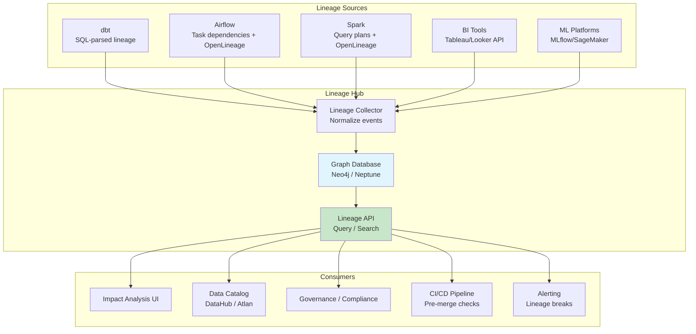

# Data Lineage — Senior Deep Dive

## Enterprise Lineage Architecture



## Automated Lineage Collection

### SQL Parsing for Column-Level Lineage

```python
# Using sqllineage or sqlglot for automated SQL parsing:
import sqlglot
from sqlglot.lineage import lineage

# Parse SQL to extract column-level lineage:
sql = """
INSERT INTO gold.fact_sales
SELECT
    o.order_id,
    o.amount * fx.rate AS revenue_usd,
    c.customer_name,
    CASE WHEN o.amount > 1000 THEN 'high' ELSE 'standard' END AS tier
FROM silver.orders o
JOIN silver.fx_rates fx ON o.currency = fx.currency
JOIN silver.customers c ON o.customer_id = c.customer_id
"""

# Extract lineage for each output column:
for col in ['revenue_usd', 'customer_name', 'tier']:
    result = lineage(col, sql, dialect="snowflake")
    print(f"\n{col} depends on:")
    for source in result:
        print(f"  ← {source.source.table}.{source.source.name}")

# Output:
# revenue_usd depends on:
#   ← silver.orders.amount
#   ← silver.fx_rates.rate
# customer_name depends on:
#   ← silver.customers.customer_name
# tier depends on:
#   ← silver.orders.amount
```

### Spark Query Plan Extraction

```python
# Extract lineage from Spark logical plans:
from pyspark.sql import SparkSession

spark = SparkSession.builder.getOrCreate()

# Run transformation:
df = spark.sql("""
    SELECT customer_id, SUM(amount) as total_spend
    FROM silver.orders
    WHERE order_date >= '2024-01-01'
    GROUP BY customer_id
""")

# Extract logical plan (contains lineage info):
plan = df._jdf.queryExecution().analyzed().toString()
# Parse plan to identify: 
# Input: silver.orders (columns: customer_id, amount, order_date)
# Output: result (columns: customer_id, total_spend)
# Transformations: filter (order_date), aggregate (SUM amount)

# With OpenLineage Spark integration — automatic:
# SparkListener emits lineage events for every action (read/write)
```

## Graph-Based Lineage Storage

Using a graph database for efficient lineage traversal:

```cypher
// Neo4j lineage model:

// Create nodes:
CREATE (t:Table {name: 'silver.orders', database: 'snowflake', schema: 'silver'})
CREATE (c:Column {name: 'amount', table: 'silver.orders', type: 'DECIMAL'})
CREATE (j:Job {name: 'daily_etl', owner: 'data-eng', schedule: '0 6 * * *'})

// Create lineage edges:
CREATE (source_col)-[:FEEDS {transformation: 'amount * rate', job: 'daily_etl'}]->(target_col)
CREATE (source_table)-[:UPSTREAM_OF]->(target_table)
CREATE (job)-[:PRODUCES]->(target_table)
CREATE (job)-[:CONSUMES]->(source_table)

// Forward impact: "What breaks if silver.orders.amount changes?"
MATCH path = (start:Column {name: 'amount', table: 'silver.orders'})
              -[:FEEDS*1..5]->(downstream)
RETURN downstream.table, downstream.name, length(path) AS distance
ORDER BY distance;

// Backward trace: "Where does fact_sales.revenue come from?"
MATCH path = (target:Column {name: 'revenue', table: 'gold.fact_sales'})
              <-[:FEEDS*1..5]-(upstream)
RETURN upstream.table, upstream.name, length(path) AS distance
ORDER BY distance DESC;

// Find all dashboards affected by a source table change:
MATCH (source:Table {name: 'raw.orders'})
      -[:UPSTREAM_OF*1..10]->(intermediate)
      -[:UPSTREAM_OF]->(dashboard:Dashboard)
RETURN DISTINCT dashboard.name, dashboard.owner;
```

## Lineage in CI/CD Pipelines

### Pre-Merge Impact Check

```yaml
# .github/workflows/dbt-ci.yml
name: dbt CI with Lineage Check

on: pull_request

jobs:
  lineage-impact:
    runs-on: ubuntu-latest
    steps:
      - uses: actions/checkout@v4
      
      - name: Detect changed models
        id: changes
        run: |
          changed=$(git diff --name-only origin/main | grep "models/" | sed 's|.*/||;s|\.sql||')
          echo "changed_models=$changed" >> $GITHUB_OUTPUT
      
      - name: Run impact analysis
        run: |
          # Find all downstream models affected by changes
          dbt ls --select "+${changed_models}+" --resource-type model > impacted.txt
          
          # Find affected exposures (dashboards, ML models)
          dbt ls --select "+${changed_models}+" --resource-type exposure > affected_exposures.txt
          
          # Post comment on PR with impact report
          echo "## Impact Analysis" > impact_report.md
          echo "### Changed Models" >> impact_report.md
          echo "$changed_models" >> impact_report.md
          echo "### Affected Downstream" >> impact_report.md
          cat impacted.txt >> impact_report.md
          echo "### Affected Dashboards/ML Models" >> impact_report.md
          cat affected_exposures.txt >> impact_report.md
      
      - name: Run affected tests
        run: |
          # Only test models in the impact zone
          dbt test --select "+${changed_models}+"
```

### Breaking Change Detection

```python
# Automated detection of lineage-breaking schema changes:
def detect_breaking_changes(pr_diff):
    """Compare schema before/after PR to detect breaks."""
    breaking_changes = []
    
    for file in pr_diff.modified_files:
        if file.endswith('.sql'):
            old_schema = get_output_schema(file, branch='main')
            new_schema = get_output_schema(file, branch='pr')
            
            # Check for removed/renamed columns:
            removed_cols = set(old_schema.columns) - set(new_schema.columns)
            
            if removed_cols:
                # Check if any downstream depends on these columns:
                for col in removed_cols:
                    dependents = get_downstream_dependents(file, col)
                    if dependents:
                        breaking_changes.append({
                            'column': col,
                            'model': file,
                            'affected': dependents,
                            'severity': 'BREAKING'
                        })
    
    return breaking_changes
```

## Regulatory Compliance Lineage

### GDPR Right to Erasure (Data Subject Tracing)

```sql
-- "Show me every table that contains Customer X's personal data"
-- Uses lineage to trace PII flow:

-- 1. Identify PII source columns
WITH pii_sources AS (
    SELECT table_name, column_name
    FROM data_catalog.column_tags
    WHERE tag = 'PII' AND pii_type IN ('email', 'name', 'phone', 'address')
),

-- 2. Trace forward through lineage to find ALL tables with this PII
pii_propagation AS (
    SELECT DISTINCT
        le.downstream_table,
        le.downstream_column,
        ps.table_name AS pii_origin
    FROM pii_sources ps
    JOIN lineage_edges le 
        ON le.upstream_table = ps.table_name 
        AND le.upstream_column = ps.column_name
    -- Recursive: trace through multiple hops
    UNION ALL
    SELECT le2.downstream_table, le2.downstream_column, pp.pii_origin
    FROM pii_propagation pp
    JOIN lineage_edges le2 
        ON le2.upstream_table = pp.downstream_table
        AND le2.upstream_column = pp.downstream_column
)

-- 3. Result: All tables containing PII for erasure request
SELECT DISTINCT downstream_table, downstream_column
FROM pii_propagation
ORDER BY downstream_table;

-- Output: Every table where customer data exists (for GDPR deletion)
```

### Audit Trail for Financial Reporting

```sql
-- SOX compliance: "Prove the revenue number on the P&L report"
-- Backward lineage from report → source:

WITH RECURSIVE revenue_trace AS (
    -- Start from the P&L report revenue line
    SELECT 
        'PL_Report' AS layer,
        'gold.fact_revenue' AS table_name,
        'total_revenue' AS column_name,
        'SUM(net_amount)' AS transformation,
        1 AS hop
    
    UNION ALL
    
    -- Trace backward through each transformation:
    SELECT
        CASE 
            WHEN le.upstream_schema = 'gold' THEN 'Gold'
            WHEN le.upstream_schema = 'silver' THEN 'Silver'
            WHEN le.upstream_schema = 'bronze' THEN 'Bronze'
            ELSE 'Source'
        END AS layer,
        le.upstream_table,
        le.upstream_column,
        le.transformation_sql,
        rt.hop + 1
    FROM revenue_trace rt
    JOIN lineage_edges le 
        ON le.downstream_table = rt.table_name
        AND le.downstream_column = rt.column_name
    WHERE rt.hop < 10
)
SELECT * FROM revenue_trace ORDER BY hop;

-- Result: Complete chain from report → gold → silver → bronze → source
-- Auditor can verify every transformation step
```

## Lineage Quality and Maintenance

### Detecting Stale/Broken Lineage

```sql
-- Find lineage edges that reference tables that no longer exist:
SELECT le.*
FROM lineage_edges le
LEFT JOIN information_schema.tables t 
    ON le.downstream_table = t.table_schema || '.' || t.table_name
WHERE t.table_name IS NULL
  AND le.is_active = TRUE;
-- These edges are orphaned — table was dropped but lineage not updated!

-- Find tables with NO lineage (undocumented):
SELECT t.table_schema, t.table_name
FROM information_schema.tables t
LEFT JOIN lineage_edges le ON t.table_schema || '.' || t.table_name = le.downstream_table
WHERE le.edge_id IS NULL
  AND t.table_schema IN ('silver', 'gold');
-- These tables have no documented upstream — lineage gap!
```

## Interview Tips

> **Tip 1:** "How would you implement lineage at enterprise scale?" — Multi-source collection: dbt (SQL lineage), Airflow (operational via OpenLineage), Spark (query plans). Store in a graph database (Neo4j/Neptune) for efficient traversal. Expose via API for: CI/CD impact checks, data catalog integration, compliance queries. Automate: SQL parsing for column-level, OpenLineage for runtime.

> **Tip 2:** "How does lineage support GDPR?" — Tag PII columns in the data catalog. Use forward lineage to trace PII propagation through all transformations. When a deletion request arrives, lineage shows EVERY table containing that person's data. Without lineage, you'd have to manually audit hundreds of tables.

> **Tip 3:** "How do you prevent lineage-breaking changes?" — Integrate lineage into CI/CD: (1) PR opened → detect changed models → run impact analysis → post affected downstream to PR. (2) If removed/renamed columns have downstream dependents → mark as BREAKING → require owner approval. (3) Run downstream tests in CI before merge. Treat lineage as infrastructure, not documentation.

## ⚡ Cheat Sheet

**Dimensional modeling building blocks**
```
Fact table:       measures/metrics (order_amount, quantity, duration)
Dimension table:  descriptive attributes (customer, product, date, geography)
Grain:            one row = one business event at lowest detail level
Surrogate key:    system-generated integer PK (never use natural keys in dim)
Natural key:      source system business key (stored alongside surrogate key)
```

**Star schema vs Snowflake schema**
```
Star:       fact → dimension (denormalized, faster queries, more storage)
Snowflake:  fact → dimension → sub-dimension (normalized, saves storage, more joins)
Rule:       prefer star for BI; snowflake only when storage cost is critical
```

**SCD (Slowly Changing Dimensions)**
| Type | Strategy | When |
|---|---|---|
| SCD1 | Overwrite old value | History irrelevant |
| SCD2 | New row (add effective_from, effective_to, is_current) | Need full history |
| SCD3 | Add prev_value column | Only need one prior value |
| SCD4 | Separate history table | Large dimension, rare changes |
| SCD6 | SCD1 + SCD2 + SCD3 hybrid | Best of all worlds |

**SCD2 implementation**
```sql
-- Insert new version, expire old
UPDATE dim_customer SET effective_to = CURRENT_DATE - 1, is_current = FALSE
WHERE customer_id = 123 AND is_current = TRUE;

INSERT INTO dim_customer (customer_id, name, city, effective_from, effective_to, is_current)
VALUES (123, 'Jane Doe', 'Chicago', CURRENT_DATE, '9999-12-31', TRUE);
```

**Data Vault pattern**
```
Hub:   business keys (stable identifiers — customer_id, order_id)
Link:  relationships between hubs (many-to-many)
Sat:   descriptive attributes + context (with load timestamp — full history)
```

**Fact table types**
```
Transaction:    one row per event (orders, clicks, payments)
Snapshot:       one row per period per entity (daily account balance)
Accumulating:   one row per lifecycle, updated as process stages complete
```

**Key interview points**
- Grain: define before designing any fact table — drives every design decision
- Degenerate dimensions: order number on fact table with no corresponding dimension
- Factless facts: events with no measures (student enrolled in course — just the relationship)
- Role-playing dimensions: same dimension used multiple times (order_date, ship_date, return_date)
- Conformed dimensions: shared across multiple fact tables (same dim_date in sales and returns facts)
