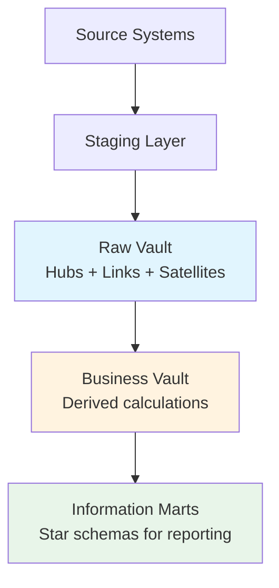
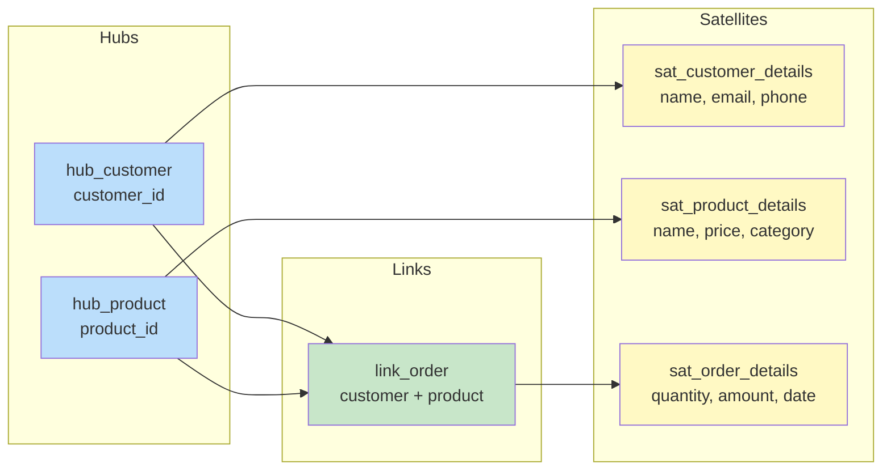
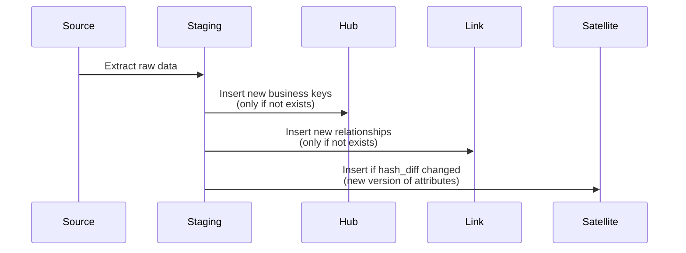

# Data Vault Modeling — Fundamentals

## What is Data Vault?

Data Vault is a **database modeling methodology** designed for enterprise data warehouses. It was created by Dan Linstedt in the 1990s to address the limitations of 3NF and dimensional modeling when dealing with:

- Multiple source systems
- Rapidly changing business requirements
- Full auditability and traceability
- Parallel loading (scalability)



## Core Components

Data Vault has three primary building blocks:

### 1. Hubs — Business Keys

Hubs store **unique business identifiers** — the core entities of your business.

| Column | Purpose |
|--------|---------|
| Hash Key (PK) | MD5/SHA hash of business key |
| Business Key | Natural key from source (e.g., customer_id) |
| Load Date | When first seen |
| Record Source | Which system provided it |

```sql
CREATE TABLE hub_customer (
    hub_customer_hk    BINARY(16) PRIMARY KEY,  -- MD5 hash
    customer_id        VARCHAR(50) NOT NULL,     -- Business key
    load_date          TIMESTAMP NOT NULL,
    record_source      VARCHAR(100) NOT NULL
);
```

### 2. Links — Relationships

Links capture **relationships between hubs** (many-to-many associations).

| Column | Purpose |
|--------|---------|
| Hash Key (PK) | MD5/SHA hash of combined business keys |
| Hub HK (FK) | Reference to each related hub |
| Load Date | When relationship first seen |
| Record Source | Which system provided it |

```sql
CREATE TABLE link_order (
    link_order_hk       BINARY(16) PRIMARY KEY,
    hub_customer_hk     BINARY(16) NOT NULL,    -- FK to hub_customer
    hub_product_hk      BINARY(16) NOT NULL,    -- FK to hub_product
    hub_store_hk        BINARY(16) NOT NULL,    -- FK to hub_store
    load_date           TIMESTAMP NOT NULL,
    record_source       VARCHAR(100) NOT NULL
);
```

### 3. Satellites — Descriptive Context

Satellites store **descriptive attributes** and their history (all changes over time).

| Column | Purpose |
|--------|---------|
| Hub/Link HK (PK) | Parent hub or link hash key |
| Load Date (PK) | When this version became effective |
| Load End Date | When superseded (or 9999-12-31 for current) |
| Hash Diff | Hash of all descriptive columns (change detection) |
| Attributes | Actual descriptive data |
| Record Source | Which system provided it |

```sql
CREATE TABLE sat_customer_details (
    hub_customer_hk    BINARY(16) NOT NULL,
    load_date          TIMESTAMP NOT NULL,
    load_end_date      TIMESTAMP DEFAULT '9999-12-31',
    hash_diff          BINARY(16) NOT NULL,
    customer_name      VARCHAR(200),
    email              VARCHAR(200),
    phone              VARCHAR(50),
    address            VARCHAR(500),
    record_source      VARCHAR(100) NOT NULL,
    PRIMARY KEY (hub_customer_hk, load_date)
);
```

## How the Pieces Fit Together



## Key Principles

| Principle | Explanation |
|-----------|-------------|
| **Insert-only** | Never update or delete — only insert new rows |
| **Hash keys** | Use hash-based surrogate keys for performance |
| **Full history** | Satellites track every change with timestamps |
| **Source-agnostic** | One hub per business concept, regardless of source count |
| **Parallel loading** | Hubs, links, satellites load independently |

## Data Vault vs. Other Approaches

| Aspect | 3NF | Star Schema | Data Vault |
|--------|-----|-------------|------------|
| Purpose | OLTP / integration | Reporting | Enterprise DWH |
| History | Overwrite | SCD types | All history by default |
| Flexibility | Medium | Low (schema changes hard) | High |
| Query speed | Slow (many joins) | Fast | Slow (needs marts) |
| Loading | Complex | Complex (ordering) | Parallel, simple |
| Auditing | Limited | Limited | Full traceability |

## Loading Pattern



**Loading rules:**
1. Load **Hubs** first (insert new business keys only)
2. Load **Links** second (insert new relationships only)
3. Load **Satellites** last (insert when attributes change)

## When to Use Data Vault

✅ **Good fit:**
- Enterprise data warehouse with 10+ source systems
- Regulatory requirements (full audit trail)
- Agile development (add sources without redesign)
- Historical tracking is mandatory

❌ **Not ideal:**
- Small projects (< 5 tables)
- Direct reporting (need star schema on top)
- Real-time/streaming (better suited for batch)

## Interview Tips

> **Tip 1:** "What is Data Vault?" — A modeling method with 3 building blocks: Hubs (business keys), Links (relationships), Satellites (descriptive history). Designed for auditability, agility, and parallel loading in enterprise data warehouses.

> **Tip 2:** "Why use hash keys?" — They enable parallel loading (no sequence dependencies), deterministic computation (same input → same key everywhere), and fast equality comparisons (binary vs. string).

> **Tip 3:** "How is Data Vault different from Star Schema?" — Data Vault is for the integration/raw layer (flexibility, auditability). Star Schema is for the presentation layer (query performance). In practice, you build Data Vault underneath and star schemas on top for reporting.
