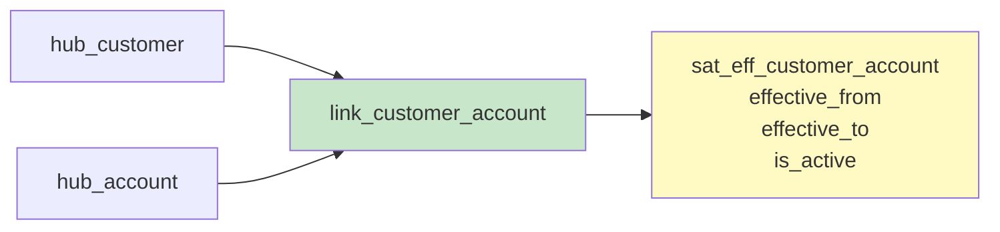
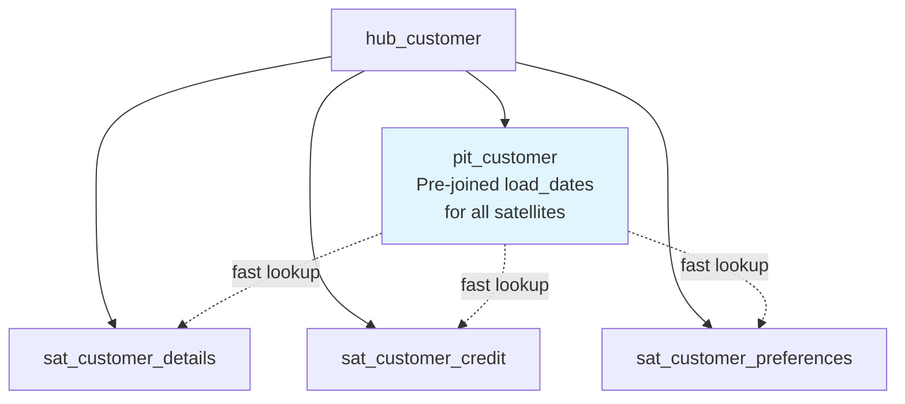

# Data Vault Modeling — Intermediate Concepts

## Hash Key Generation

Hash keys are the backbone of Data Vault. They must be generated consistently across all processes.

```sql
-- Standard hash key pattern (MD5 for speed, SHA-256 for collision resistance)
-- Always: UPPER → TRIM → COALESCE → CONCAT with delimiter → HASH

-- Hub hash key (single business key):
SELECT MD5(UPPER(TRIM(COALESCE(customer_id, '')))) AS hub_customer_hk

-- Link hash key (multiple business keys):
SELECT MD5(
    CONCAT(
        UPPER(TRIM(COALESCE(customer_id, ''))), '||',
        UPPER(TRIM(COALESCE(product_id, ''))), '||',
        UPPER(TRIM(COALESCE(order_date, '')))
    )
) AS link_order_hk

-- Hash diff (change detection for satellites):
SELECT MD5(
    CONCAT(
        COALESCE(customer_name, ''), '||',
        COALESCE(email, ''), '||',
        COALESCE(phone, ''), '||',
        COALESCE(address, '')
    )
) AS hash_diff
```

**Rules for consistent hashing:**
1. Always UPPER (case-insensitive matching)
2. Always TRIM (remove leading/trailing whitespace)
3. Always COALESCE nulls to empty string
4. Use a consistent delimiter (`||`) between fields
5. Same column order everywhere

## Effectivity Satellites

Track **when a relationship was active or inactive** (temporal validity of links).

```sql
CREATE TABLE sat_eff_customer_account (
    link_customer_account_hk  BINARY(16) NOT NULL,
    load_date                 TIMESTAMP NOT NULL,
    effective_from            DATE NOT NULL,
    effective_to              DATE DEFAULT '9999-12-31',
    is_active                 BOOLEAN DEFAULT TRUE,
    record_source             VARCHAR(100),
    PRIMARY KEY (link_customer_account_hk, load_date)
);

-- Example: Customer switches bank accounts
-- Row 1: account_A active from 2020-01-01 to 2023-06-30
-- Row 2: account_B active from 2023-07-01 to 9999-12-31
```



## Multi-Active Satellites

When a hub can have **multiple active records simultaneously** (e.g., a customer with multiple phone numbers).

```sql
CREATE TABLE sat_customer_phones (
    hub_customer_hk    BINARY(16) NOT NULL,
    load_date          TIMESTAMP NOT NULL,
    phone_type         VARCHAR(20) NOT NULL,    -- 'mobile', 'home', 'work'
    phone_number       VARCHAR(50),
    is_primary         BOOLEAN,
    hash_diff          BINARY(16),
    record_source      VARCHAR(100),
    PRIMARY KEY (hub_customer_hk, load_date, phone_type)  -- Multi-active key!
);
```

**Key difference:** The PK includes a "multi-active key" (phone_type) — allowing multiple concurrent records per hub per load_date.

## Point-In-Time (PIT) Tables

PIT tables solve the **performance problem** of joining multiple satellites at a specific point in time.



```sql
-- PIT table: pre-computes which satellite row is valid for each snapshot date
CREATE TABLE pit_customer (
    hub_customer_hk           BINARY(16) NOT NULL,
    snapshot_date             DATE NOT NULL,
    sat_details_load_date     TIMESTAMP,    -- Correct row in sat_customer_details
    sat_credit_load_date      TIMESTAMP,    -- Correct row in sat_customer_credit
    sat_prefs_load_date       TIMESTAMP,    -- Correct row in sat_customer_preferences
    PRIMARY KEY (hub_customer_hk, snapshot_date)
);

-- Query WITH PIT (fast — single join per satellite):
SELECT h.customer_id, sd.customer_name, sc.credit_score, sp.language
FROM pit_customer p
JOIN hub_customer h ON h.hub_customer_hk = p.hub_customer_hk
JOIN sat_customer_details sd 
    ON sd.hub_customer_hk = p.hub_customer_hk 
    AND sd.load_date = p.sat_details_load_date
JOIN sat_customer_credit sc 
    ON sc.hub_customer_hk = p.hub_customer_hk 
    AND sc.load_date = p.sat_credit_load_date
JOIN sat_customer_preferences sp 
    ON sp.hub_customer_hk = p.hub_customer_hk 
    AND sp.load_date = p.sat_prefs_load_date
WHERE p.snapshot_date = '2024-03-15';
```

**Without PIT:** Each satellite join requires a subquery with `MAX(load_date) WHERE load_date <= snapshot_date` — O(n) per satellite. With PIT, it's a direct equality join.

## Bridge Tables

Bridge tables pre-join **link traversal paths** for complex queries spanning multiple hubs.

```sql
-- Bridge: Customer → Orders → Products (pre-resolved path)
CREATE TABLE bridge_customer_products (
    hub_customer_hk    BINARY(16) NOT NULL,
    link_order_hk      BINARY(16) NOT NULL,
    hub_product_hk     BINARY(16) NOT NULL,
    snapshot_date      DATE NOT NULL
);

-- Fast query: "All products ordered by customer X"
SELECT p.product_name
FROM bridge_customer_products b
JOIN hub_product hp ON hp.hub_product_hk = b.hub_product_hk
JOIN sat_product_details p ON p.hub_product_hk = hp.hub_product_hk
WHERE b.hub_customer_hk = 0x... AND b.snapshot_date = CURRENT_DATE;
```

## Same-As Links

Handle **synonyms or duplicate business keys** that represent the same real-world entity.

```sql
-- Customer appears in CRM as "C001" and in ERP as "CUST-001"
CREATE TABLE link_same_as_customer (
    link_same_as_hk    BINARY(16) PRIMARY KEY,
    hub_customer_hk_1  BINARY(16) NOT NULL,  -- Master
    hub_customer_hk_2  BINARY(16) NOT NULL,  -- Duplicate/synonym
    load_date          TIMESTAMP NOT NULL,
    record_source      VARCHAR(100)
);
```

## Hierarchical Links

Model **recursive/hierarchical relationships** (e.g., employee→manager, category→parent).

```sql
CREATE TABLE link_employee_hierarchy (
    link_hierarchy_hk      BINARY(16) PRIMARY KEY,
    hub_employee_hk_child  BINARY(16) NOT NULL,
    hub_employee_hk_parent BINARY(16) NOT NULL,
    load_date              TIMESTAMP NOT NULL,
    record_source          VARCHAR(100)
);
```

## Loading Patterns in Detail

```sql
-- Pattern 1: Hub loading (insert only new business keys)
INSERT INTO hub_customer (hub_customer_hk, customer_id, load_date, record_source)
SELECT DISTINCT
    MD5(UPPER(TRIM(stg.customer_id)))  AS hub_customer_hk,
    stg.customer_id,
    CURRENT_TIMESTAMP                   AS load_date,
    'CRM_SYSTEM'                        AS record_source
FROM staging_customers stg
WHERE NOT EXISTS (
    SELECT 1 FROM hub_customer h
    WHERE h.hub_customer_hk = MD5(UPPER(TRIM(stg.customer_id)))
);

-- Pattern 2: Satellite loading (insert only when data changes)
INSERT INTO sat_customer_details (hub_customer_hk, load_date, hash_diff, 
                                   customer_name, email, phone, record_source)
SELECT
    MD5(UPPER(TRIM(stg.customer_id)))     AS hub_customer_hk,
    CURRENT_TIMESTAMP                      AS load_date,
    MD5(CONCAT(COALESCE(stg.name,''), '||', COALESCE(stg.email,''), '||', COALESCE(stg.phone,''))) AS hash_diff,
    stg.name, stg.email, stg.phone,
    'CRM_SYSTEM'
FROM staging_customers stg
LEFT JOIN sat_customer_details sat
    ON sat.hub_customer_hk = MD5(UPPER(TRIM(stg.customer_id)))
    AND sat.load_end_date = '9999-12-31'  -- Current record
WHERE sat.hash_diff IS NULL               -- No existing record
   OR sat.hash_diff != MD5(CONCAT(COALESCE(stg.name,''), '||', COALESCE(stg.email,''), '||', COALESCE(stg.phone,'')));
   -- OR data has changed
```

## Interview Tips

> **Tip 1:** "What are PIT tables?" — Performance optimization that pre-joins the correct satellite row (by load_date) for each snapshot date. Eliminates expensive `MAX(load_date) WHERE ...` subqueries. Essential for querying Data Vault with 3+ satellites per hub.

> **Tip 2:** "How do you handle duplicate business keys across sources?" — Use Same-As Links. Both keys get their own hub record, then a same-as link connects them. Allows independent satellite tracking per source while enabling unified queries through the same-as relationship.

> **Tip 3:** "How does satellite loading detect changes?" — Hash diff: compute MD5/SHA of all descriptive columns. Compare incoming hash_diff with current record's hash_diff. If different → insert new row (close old row's load_end_date). This is faster than comparing every column individually.
