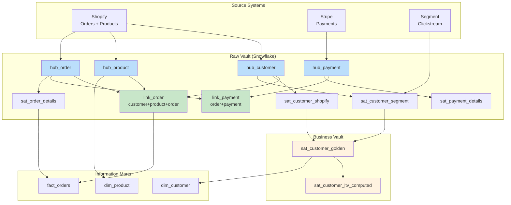
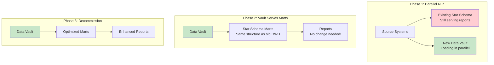

# Data Vault Modeling — Real-World Production Examples

## Example 1: E-Commerce Data Vault on Snowflake



### dbt Implementation

```sql
-- models/staging/stg_shopify_orders.sql
WITH source AS (
    SELECT * FROM {{ source('shopify', 'orders') }}
),
transformed AS (
    SELECT
        order_id::VARCHAR                                    AS order_id,
        customer_id::VARCHAR                                AS customer_id,
        MD5(UPPER(TRIM(order_id::VARCHAR)))                 AS hub_order_hk,
        MD5(UPPER(TRIM(customer_id::VARCHAR)))              AS hub_customer_hk,
        MD5(CONCAT(
            UPPER(TRIM(order_id::VARCHAR)), '||',
            UPPER(TRIM(customer_id::VARCHAR))
        ))                                                  AS link_order_hk,
        MD5(CONCAT_WS('||',
            COALESCE(status, ''),
            COALESCE(total_amount::VARCHAR, ''),
            COALESCE(shipping_method, '')
        ))                                                  AS hash_diff,
        status,
        total_amount,
        shipping_method,
        order_date,
        CURRENT_TIMESTAMP()                                 AS load_date,
        'SHOPIFY'                                           AS record_source
    FROM source
)
SELECT * FROM transformed
```

```sql
-- models/raw_vault/hubs/hub_order.sql
{{ config(materialized='incremental', unique_key='hub_order_hk') }}

WITH new_keys AS (
    SELECT DISTINCT
        hub_order_hk,
        order_id,
        load_date,
        record_source
    FROM {{ ref('stg_shopify_orders') }}
    
    WHERE hub_order_hk NOT IN (SELECT hub_order_hk FROM {{ this }})
    
)
SELECT * FROM new_keys
```

```sql
-- models/raw_vault/satellites/sat_order_details.sql
{{ config(materialized='incremental') }}

WITH source AS (
    SELECT * FROM {{ ref('stg_shopify_orders') }}
),
latest_sat AS (
    
    SELECT hub_order_hk, hash_diff
    FROM {{ this }}
    WHERE load_end_date = '9999-12-31'
    
    SELECT NULL::BINARY AS hub_order_hk, NULL::BINARY AS hash_diff
    WHERE FALSE
    
)
SELECT
    s.hub_order_hk,
    s.load_date,
    '9999-12-31'::TIMESTAMP AS load_end_date,
    s.hash_diff,
    s.status,
    s.total_amount,
    s.shipping_method,
    s.order_date,
    s.record_source
FROM source s
LEFT JOIN latest_sat l ON s.hub_order_hk = l.hub_order_hk
WHERE l.hub_order_hk IS NULL           -- New entity
   OR l.hash_diff != s.hash_diff       -- Changed data
```

---

## Example 2: Banking — Regulatory Compliance Vault

A bank needs full audit trail for regulatory reporting (BCBS 239 compliance):

```sql
-- Every customer interaction logged with full lineage
CREATE TABLE hub_account (
    hub_account_hk    BINARY(32) PRIMARY KEY,    -- SHA-256 for banking
    account_number    VARCHAR(20) NOT NULL,
    load_date         TIMESTAMP_TZ NOT NULL,
    record_source     VARCHAR(100) NOT NULL
);

-- Separate satellites per source (audit requirement!)
CREATE TABLE sat_account_core_banking (
    hub_account_hk    BINARY(32),
    load_date         TIMESTAMP_TZ,
    balance           DECIMAL(18,2),
    account_type      VARCHAR(20),
    branch_code       VARCHAR(10),
    hash_diff         BINARY(32),
    record_source     VARCHAR(100) DEFAULT 'CORE_BANKING_T24',
    PRIMARY KEY (hub_account_hk, load_date)
);

CREATE TABLE sat_account_risk_system (
    hub_account_hk    BINARY(32),
    load_date         TIMESTAMP_TZ,
    risk_rating       VARCHAR(5),
    exposure_amount   DECIMAL(18,2),
    last_review_date  DATE,
    hash_diff         BINARY(32),
    record_source     VARCHAR(100) DEFAULT 'RISK_ENGINE_V3',
    PRIMARY KEY (hub_account_hk, load_date)
);

-- Regulatory query: "Show account state at any point in time"
SELECT 
    h.account_number,
    cb.balance,
    cb.account_type,
    r.risk_rating,
    r.exposure_amount
FROM hub_account h
JOIN sat_account_core_banking cb 
    ON cb.hub_account_hk = h.hub_account_hk
    AND cb.load_date <= '2024-03-15 23:59:59'
    AND cb.load_end_date > '2024-03-15 23:59:59'
JOIN sat_account_risk_system r
    ON r.hub_account_hk = h.hub_account_hk
    AND r.load_date <= '2024-03-15 23:59:59'
    AND r.load_end_date > '2024-03-15 23:59:59'
WHERE h.account_number = 'ACC-12345';
```

---

## Example 3: Migration from Star Schema to Data Vault



**Migration steps:**
1. **Phase 1 (4-8 weeks):** Build vault, load in parallel with existing DWH. Validate data matches.
2. **Phase 2 (2-4 weeks):** Build star schema marts FROM vault. Point reports to new marts (same structure = zero report changes).
3. **Phase 3 (ongoing):** Decommission old DWH. Optimize marts now that vault is source of truth.

```sql
-- Information Mart: Build star schema view FROM Data Vault
CREATE VIEW mart.dim_customer AS
SELECT
    h.hub_customer_hk                    AS customer_key,
    h.customer_id,
    g.golden_name                        AS customer_name,
    g.golden_email                       AS email,
    ltv.ltv_segment                      AS customer_segment,
    ltv.total_revenue                    AS lifetime_value,
    h.load_date                          AS first_seen_date
FROM raw_vault.hub_customer h
JOIN business_vault.sat_customer_golden g
    ON g.hub_customer_hk = h.hub_customer_hk
    AND g.load_end_date = '9999-12-31'
LEFT JOIN business_vault.sat_customer_ltv_computed ltv
    ON ltv.hub_customer_hk = h.hub_customer_hk
    AND ltv.load_end_date = '9999-12-31';
```

---

## Example 4: Snowflake-Native Loading with Streams & Tasks

```sql
-- Snowflake Stream: captures CDC from staging
CREATE STREAM stg_customers_stream ON TABLE staging.raw_customers;

-- Task: Auto-load hub every 5 minutes
CREATE TASK load_hub_customer
    WAREHOUSE = 'ETL_WH'
    SCHEDULE = '5 MINUTE'
    WHEN SYSTEM$STREAM_HAS_DATA('stg_customers_stream')
AS
INSERT INTO raw_vault.hub_customer (hub_customer_hk, customer_id, load_date, record_source)
SELECT DISTINCT
    MD5(UPPER(TRIM(customer_id))),
    customer_id,
    CURRENT_TIMESTAMP(),
    metadata$filename
FROM stg_customers_stream s
WHERE NOT EXISTS (
    SELECT 1 FROM raw_vault.hub_customer h
    WHERE h.hub_customer_hk = MD5(UPPER(TRIM(s.customer_id)))
);

-- Task: Auto-load satellite (detect changes)
CREATE TASK load_sat_customer_details
    WAREHOUSE = 'ETL_WH'
    AFTER load_hub_customer    -- Dependency!
AS
MERGE INTO raw_vault.sat_customer_details tgt
USING (
    SELECT 
        MD5(UPPER(TRIM(customer_id))) AS hub_customer_hk,
        CURRENT_TIMESTAMP() AS load_date,
        MD5(CONCAT_WS('||', COALESCE(name,''), COALESCE(email,''), COALESCE(phone,''))) AS hash_diff,
        name, email, phone,
        metadata$filename AS record_source
    FROM stg_customers_stream
) src
ON tgt.hub_customer_hk = src.hub_customer_hk AND tgt.load_end_date = '9999-12-31'
WHEN MATCHED AND tgt.hash_diff != src.hash_diff THEN
    UPDATE SET load_end_date = src.load_date
WHEN NOT MATCHED THEN
    INSERT VALUES (src.hub_customer_hk, src.load_date, '9999-12-31', src.hash_diff, 
                   src.name, src.email, src.phone, src.record_source);
```

---

## Interview Tips

> **Tip 1:** "How would you implement Data Vault in production?" — Use dbt (or dbt-vault package) for declarative modeling. Staging layer computes all hash keys. Raw vault uses incremental models with NOT EXISTS (hubs) and hash_diff comparison (satellites). Business vault for derived logic. Information marts as views or materialized tables for reporting.

> **Tip 2:** "How do you migrate from Star Schema to Data Vault?" — Three-phase approach: (1) Build vault in parallel with existing DWH, (2) Create mart views from vault that match existing star schema structure (zero report changes), (3) Decommission old DWH. Key: reports never break because mart structure stays the same.

> **Tip 3:** "How do you handle Data Vault on cloud platforms?" — Leverage native capabilities. Snowflake: Streams + Tasks for CDC loading, zero-copy clones for testing. Databricks: Delta Lake MERGE for satellite upserts, Unity Catalog for metadata. Both: dbt-vault for automation.
