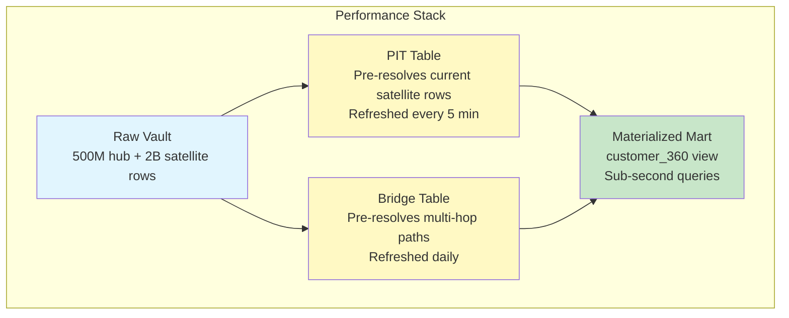

# Scenario Questions — Data Vault Modeling

<article data-difficulty="junior">

## 🟢 Junior: Identifying Hubs, Links, and Satellites

**Scenario:** You're building a Data Vault for an online bookstore. The source system has an `orders` table with columns: `order_id`, `customer_id`, `book_id`, `order_date`, `quantity`, `price`, `customer_name`, `customer_email`, `book_title`, `book_author`. Identify the Hubs, Links, and Satellites you would create, and specify which columns go where.

<details>
<summary>💡 Hint</summary>
Hubs = unique business entities (identify by business keys). Links = relationships between entities. Satellites = descriptive attributes that can change over time. Ask: "What are the core business concepts here?" (customers, books, orders).
</details>

<details>
<summary>✅ Solution</summary>

```sql
-- HUBS (business keys — unique identifiers of core entities)
CREATE TABLE hub_customer (
    hub_customer_hk   BINARY(16) PRIMARY KEY,   -- MD5(customer_id)
    customer_id       VARCHAR(50) NOT NULL,
    load_date         TIMESTAMP NOT NULL,
    record_source     VARCHAR(100) NOT NULL
);

CREATE TABLE hub_book (
    hub_book_hk       BINARY(16) PRIMARY KEY,   -- MD5(book_id)
    book_id           VARCHAR(50) NOT NULL,
    load_date         TIMESTAMP NOT NULL,
    record_source     VARCHAR(100) NOT NULL
);

CREATE TABLE hub_order (
    hub_order_hk      BINARY(16) PRIMARY KEY,   -- MD5(order_id)
    order_id          VARCHAR(50) NOT NULL,
    load_date         TIMESTAMP NOT NULL,
    record_source     VARCHAR(100) NOT NULL
);

-- LINK (relationship: which customer ordered which book in which order)
CREATE TABLE link_order (
    link_order_hk     BINARY(16) PRIMARY KEY,   -- MD5(order_id||customer_id||book_id)
    hub_order_hk      BINARY(16) NOT NULL,
    hub_customer_hk   BINARY(16) NOT NULL,
    hub_book_hk       BINARY(16) NOT NULL,
    load_date         TIMESTAMP NOT NULL,
    record_source     VARCHAR(100) NOT NULL
);

-- SATELLITES (descriptive attributes attached to hubs/links)
CREATE TABLE sat_customer_details (
    hub_customer_hk   BINARY(16) NOT NULL,
    load_date         TIMESTAMP NOT NULL,
    load_end_date     TIMESTAMP DEFAULT '9999-12-31',
    hash_diff         BINARY(16),
    customer_name     VARCHAR(200),
    customer_email    VARCHAR(200),
    record_source     VARCHAR(100),
    PRIMARY KEY (hub_customer_hk, load_date)
);

CREATE TABLE sat_book_details (
    hub_book_hk       BINARY(16) NOT NULL,
    load_date         TIMESTAMP NOT NULL,
    load_end_date     TIMESTAMP DEFAULT '9999-12-31',
    hash_diff         BINARY(16),
    book_title        VARCHAR(300),
    book_author       VARCHAR(200),
    record_source     VARCHAR(100),
    PRIMARY KEY (hub_book_hk, load_date)
);

CREATE TABLE sat_order_details (
    link_order_hk     BINARY(16) NOT NULL,    -- Attached to the LINK!
    load_date         TIMESTAMP NOT NULL,
    load_end_date     TIMESTAMP DEFAULT '9999-12-31',
    hash_diff         BINARY(16),
    order_date        DATE,
    quantity          INT,
    price             DECIMAL(10,2),
    record_source     VARCHAR(100),
    PRIMARY KEY (link_order_hk, load_date)
);
```

**Key Points:**
- **3 Hubs**: customer, book, order — each identified by a unique business key
- **1 Link**: connects the three hubs (the order transaction)
- **3 Satellites**: customer details, book details, order details
- `order_date`, `quantity`, `price` go on the link satellite (they describe the relationship/transaction, not the entity)
- `customer_name`, `email` go on hub_customer's satellite (they describe the customer)
- Satellites track history — if a customer changes email, new row inserted (old row gets load_end_date)

</details>

</article>

<article data-difficulty="mid-level">

## 🟡 Mid-Level: Handling Multiple Sources with Conflicts

**Scenario:** Your company has customer data coming from 3 sources: CRM (Salesforce), Billing (Stripe), and Support (Zendesk). Each system has its own customer_id that maps to the same real person. The same customer may have different names and emails across systems (e.g., CRM says "John Smith" / john@work.com, Billing says "J. Smith" / jsmith@gmail.com). Design the Data Vault structure to: (1) store all versions without data loss, (2) enable queries that show a "golden record", and (3) handle cases where source mappings are discovered later.

<details>
<summary>💡 Hint</summary>
Use one hub per source OR a unified hub with Same-As Links to connect different source IDs. One satellite per source system (never mix sources in one satellite). Business Vault computes the golden record with priority rules. Consider: what happens when you discover two hub records are actually the same person?
</details>

<details>
<summary>✅ Solution</summary>

```sql
-- APPROACH: Single hub with all customer IDs + Same-As Links for identity resolution

-- Hub: unified customer (accepts IDs from all sources)
CREATE TABLE hub_customer (
    hub_customer_hk    BINARY(16) PRIMARY KEY,
    customer_id        VARCHAR(100) NOT NULL,     -- Source-qualified: "CRM:C001"
    load_date          TIMESTAMP NOT NULL,
    record_source      VARCHAR(100) NOT NULL
);

-- Same-As Link: connects records that represent the same person
CREATE TABLE link_same_as_customer (
    link_same_as_hk        BINARY(16) PRIMARY KEY,
    hub_customer_hk_master BINARY(16) NOT NULL,   -- Master record
    hub_customer_hk_dup    BINARY(16) NOT NULL,   -- Duplicate/linked record
    load_date              TIMESTAMP NOT NULL,
    record_source          VARCHAR(100) NOT NULL   -- 'IDENTITY_RESOLUTION'
);

-- Effectivity satellite on Same-As (relationships can be undone!)
CREATE TABLE sat_eff_same_as_customer (
    link_same_as_hk    BINARY(16) NOT NULL,
    load_date          TIMESTAMP NOT NULL,
    is_active          BOOLEAN DEFAULT TRUE,
    confidence_score   DECIMAL(3,2),              -- 0.95 = 95% match confidence
    match_method       VARCHAR(50),               -- 'email_match', 'manual_review'
    record_source      VARCHAR(100),
    PRIMARY KEY (link_same_as_hk, load_date)
);

-- Separate satellite PER SOURCE (never lose data!)
CREATE TABLE sat_customer_crm (
    hub_customer_hk    BINARY(16) NOT NULL,
    load_date          TIMESTAMP NOT NULL,
    load_end_date      TIMESTAMP DEFAULT '9999-12-31',
    hash_diff          BINARY(16),
    full_name          VARCHAR(200),
    email              VARCHAR(200),
    phone              VARCHAR(50),
    company            VARCHAR(200),
    record_source      VARCHAR(100) DEFAULT 'SALESFORCE_CRM',
    PRIMARY KEY (hub_customer_hk, load_date)
);

CREATE TABLE sat_customer_billing (
    hub_customer_hk    BINARY(16) NOT NULL,
    load_date          TIMESTAMP NOT NULL,
    load_end_date      TIMESTAMP DEFAULT '9999-12-31',
    hash_diff          BINARY(16),
    full_name          VARCHAR(200),
    email              VARCHAR(200),
    payment_method     VARCHAR(50),
    record_source      VARCHAR(100) DEFAULT 'STRIPE_BILLING',
    PRIMARY KEY (hub_customer_hk, load_date)
);

CREATE TABLE sat_customer_support (
    hub_customer_hk    BINARY(16) NOT NULL,
    load_date          TIMESTAMP NOT NULL,
    load_end_date      TIMESTAMP DEFAULT '9999-12-31',
    hash_diff          BINARY(16),
    full_name          VARCHAR(200),
    email              VARCHAR(200),
    preferred_language VARCHAR(10),
    record_source      VARCHAR(100) DEFAULT 'ZENDESK_SUPPORT',
    PRIMARY KEY (hub_customer_hk, load_date)
);

-- BUSINESS VAULT: Golden record with priority rules
CREATE TABLE sat_customer_golden (
    hub_customer_hk    BINARY(16) NOT NULL,
    load_date          TIMESTAMP NOT NULL,
    load_end_date      TIMESTAMP DEFAULT '9999-12-31',
    golden_name        VARCHAR(200),        -- Priority: CRM > Billing > Support
    golden_email       VARCHAR(200),        -- Priority: Billing > CRM > Support
    golden_phone       VARCHAR(50),         -- Priority: CRM > Support > Billing
    source_name        VARCHAR(50),         -- Which source won for name
    source_email       VARCHAR(50),         -- Which source won for email
    record_source      VARCHAR(100) DEFAULT 'BUSINESS_VAULT',
    PRIMARY KEY (hub_customer_hk, load_date)
);

-- Query: Golden record resolution
INSERT INTO sat_customer_golden
SELECT
    h.hub_customer_hk,
    CURRENT_TIMESTAMP AS load_date,
    '9999-12-31' AS load_end_date,
    -- Name priority: CRM > Billing > Support
    COALESCE(crm.full_name, bill.full_name, sup.full_name) AS golden_name,
    -- Email priority: Billing > CRM > Support (billing email = payment-verified)
    COALESCE(bill.email, crm.email, sup.email) AS golden_email,
    -- Phone priority: CRM > Support
    COALESCE(crm.phone, sup.phone) AS golden_phone,
    CASE WHEN crm.full_name IS NOT NULL THEN 'CRM'
         WHEN bill.full_name IS NOT NULL THEN 'BILLING' ELSE 'SUPPORT' END,
    CASE WHEN bill.email IS NOT NULL THEN 'BILLING'
         WHEN crm.email IS NOT NULL THEN 'CRM' ELSE 'SUPPORT' END,
    'BUSINESS_VAULT'
FROM hub_customer h
LEFT JOIN sat_customer_crm crm 
    ON crm.hub_customer_hk = h.hub_customer_hk AND crm.load_end_date = '9999-12-31'
LEFT JOIN sat_customer_billing bill 
    ON bill.hub_customer_hk = h.hub_customer_hk AND bill.load_end_date = '9999-12-31'
LEFT JOIN sat_customer_support sup 
    ON sup.hub_customer_hk = h.hub_customer_hk AND sup.load_end_date = '9999-12-31';
```

**Key Points:**
- **One satellite per source**: preserves ALL data from every system (nothing lost)
- **Same-As Links**: discovered later when identity resolution finds matches (non-destructive)
- **Effectivity satellite on Same-As**: relationships can be deactivated if match was wrong
- **Business Vault golden record**: applies priority rules, tracks which source "won" for each field
- **Late-arriving mappings**: just insert a new Same-As Link when discovered — no need to rewrite history
- Raw Vault never changes — all conflict resolution is in Business Vault (auditable, re-runnable)

</details>

</article>

<article data-difficulty="senior">

## 🔴 Senior: Data Vault Performance Optimization

**Scenario:** Your Data Vault has grown to 500M records in `hub_customer`, 2B records in `sat_customer_activity` (loaded every 5 minutes from clickstream), and queries joining 6 satellites take 45 seconds. Business needs sub-5-second response for a customer 360 dashboard. Design a performance optimization strategy using PIT tables, Bridge tables, and materialization without sacrificing the auditability of the vault.

<details>
<summary>💡 Hint</summary>
PIT tables pre-resolve "which satellite row is current at time X" for each hub. Bridge tables pre-resolve multi-hop link traversals. Consider: daily vs. real-time PIT refresh, partitioning satellites by load_date, query-specific bridges, and whether to virtualize marts or materialize them.
</details>

<details>
<summary>✅ Solution</summary>

```sql
-- PROBLEM: Query joining hub + 6 satellites with "get current record" logic
-- Current query (SLOW — 45 seconds):
SELECT h.customer_id, s1.name, s2.email, s3.segment, 
       s4.last_login, s5.subscription, s6.activity_score
FROM hub_customer h
JOIN sat_customer_profile s1 
    ON s1.hub_customer_hk = h.hub_customer_hk 
    AND s1.load_date = (SELECT MAX(load_date) FROM sat_customer_profile 
                        WHERE hub_customer_hk = h.hub_customer_hk)
-- ... repeated 5 more times (each is a correlated subquery = disaster!)

-- ═══════════════════════════════════════════════════════════════
-- SOLUTION 1: Point-In-Time (PIT) Table
-- ═══════════════════════════════════════════════════════════════

CREATE TABLE pit_customer (
    hub_customer_hk              BINARY(16) NOT NULL,
    snapshot_date                TIMESTAMP NOT NULL,
    sat_profile_load_date        TIMESTAMP,
    sat_contact_load_date        TIMESTAMP,
    sat_segment_load_date        TIMESTAMP,
    sat_login_load_date          TIMESTAMP,
    sat_subscription_load_date   TIMESTAMP,
    sat_activity_load_date       TIMESTAMP,
    PRIMARY KEY (hub_customer_hk, snapshot_date)
);

-- Refresh PIT (runs every 5 minutes, matching satellite load frequency)
INSERT INTO pit_customer
SELECT
    h.hub_customer_hk,
    CURRENT_TIMESTAMP() AS snapshot_date,
    (SELECT MAX(load_date) FROM sat_customer_profile 
     WHERE hub_customer_hk = h.hub_customer_hk) AS sat_profile_load_date,
    (SELECT MAX(load_date) FROM sat_customer_contact 
     WHERE hub_customer_hk = h.hub_customer_hk) AS sat_contact_load_date,
    (SELECT MAX(load_date) FROM sat_customer_segment 
     WHERE hub_customer_hk = h.hub_customer_hk) AS sat_segment_load_date,
    (SELECT MAX(load_date) FROM sat_customer_login 
     WHERE hub_customer_hk = h.hub_customer_hk) AS sat_login_load_date,
    (SELECT MAX(load_date) FROM sat_customer_subscription 
     WHERE hub_customer_hk = h.hub_customer_hk) AS sat_subscription_load_date,
    (SELECT MAX(load_date) FROM sat_customer_activity 
     WHERE hub_customer_hk = h.hub_customer_hk) AS sat_activity_load_date
FROM hub_customer h;

-- FAST QUERY using PIT (sub-second! equality joins only):
SELECT h.customer_id, s1.name, s2.email, s3.segment,
       s4.last_login, s5.subscription_tier, s6.activity_score
FROM pit_customer p
JOIN hub_customer h ON h.hub_customer_hk = p.hub_customer_hk
JOIN sat_customer_profile s1 
    ON s1.hub_customer_hk = p.hub_customer_hk 
    AND s1.load_date = p.sat_profile_load_date
JOIN sat_customer_contact s2 
    ON s2.hub_customer_hk = p.hub_customer_hk 
    AND s2.load_date = p.sat_contact_load_date
JOIN sat_customer_segment s3 
    ON s3.hub_customer_hk = p.hub_customer_hk 
    AND s3.load_date = p.sat_segment_load_date
JOIN sat_customer_login s4 
    ON s4.hub_customer_hk = p.hub_customer_hk 
    AND s4.load_date = p.sat_login_load_date
JOIN sat_customer_subscription s5 
    ON s5.hub_customer_hk = p.hub_customer_hk 
    AND s5.load_date = p.sat_subscription_load_date
JOIN sat_customer_activity s6 
    ON s6.hub_customer_hk = p.hub_customer_hk 
    AND s6.load_date = p.sat_activity_load_date
WHERE p.snapshot_date = (SELECT MAX(snapshot_date) FROM pit_customer)
  AND h.customer_id = 'CUST-12345';

-- ═══════════════════════════════════════════════════════════════
-- SOLUTION 2: Partitioning for the High-Volume Satellite
-- ═══════════════════════════════════════════════════════════════

-- 2B rows in sat_customer_activity — partition by load_date!
ALTER TABLE sat_customer_activity
    CLUSTER BY (hub_customer_hk, load_date);  -- Snowflake micro-partitions

-- Or on Databricks:
-- OPTIMIZE sat_customer_activity ZORDER BY (hub_customer_hk, load_date);

-- ═══════════════════════════════════════════════════════════════
-- SOLUTION 3: Bridge Table (multi-hop path pre-resolution)
-- ═══════════════════════════════════════════════════════════════

-- Dashboard needs: Customer → Orders → Products → Categories
-- Without bridge: 4 hub joins + 3 link joins = expensive
CREATE TABLE bridge_customer_product_categories (
    hub_customer_hk    BINARY(16),
    hub_product_hk     BINARY(16),
    hub_category_hk    BINARY(16),
    link_order_hk      BINARY(16),
    order_count        INT,            -- Pre-aggregated!
    total_spend        DECIMAL(18,2),  -- Pre-aggregated!
    snapshot_date      DATE,
    PRIMARY KEY (hub_customer_hk, hub_product_hk, hub_category_hk, snapshot_date)
);

-- ═══════════════════════════════════════════════════════════════
-- SOLUTION 4: Materialized Mart (for dashboard)
-- ═══════════════════════════════════════════════════════════════

-- Final: Materialized view for the Customer 360 dashboard
CREATE MATERIALIZED VIEW mart.customer_360 AS
SELECT
    h.customer_id,
    h.hub_customer_hk,
    s1.name              AS customer_name,
    s2.email,
    s3.segment,
    s4.last_login,
    s5.subscription_tier,
    s6.activity_score,
    s6.page_views_30d,
    b.total_orders,
    b.total_spend,
    CURRENT_TIMESTAMP()  AS refreshed_at
FROM pit_customer p
JOIN hub_customer h ON h.hub_customer_hk = p.hub_customer_hk
JOIN sat_customer_profile s1 ON s1.hub_customer_hk = p.hub_customer_hk 
    AND s1.load_date = p.sat_profile_load_date
JOIN sat_customer_contact s2 ON s2.hub_customer_hk = p.hub_customer_hk 
    AND s2.load_date = p.sat_contact_load_date
JOIN sat_customer_segment s3 ON s3.hub_customer_hk = p.hub_customer_hk 
    AND s3.load_date = p.sat_segment_load_date
JOIN sat_customer_login s4 ON s4.hub_customer_hk = p.hub_customer_hk 
    AND s4.load_date = p.sat_login_load_date
JOIN sat_customer_subscription s5 ON s5.hub_customer_hk = p.hub_customer_hk 
    AND s5.load_date = p.sat_subscription_load_date
JOIN sat_customer_activity s6 ON s6.hub_customer_hk = p.hub_customer_hk 
    AND s6.load_date = p.sat_activity_load_date
LEFT JOIN bridge_customer_product_categories b 
    ON b.hub_customer_hk = h.hub_customer_hk AND b.snapshot_date = CURRENT_DATE
WHERE p.snapshot_date = (SELECT MAX(snapshot_date) FROM pit_customer);

-- Dashboard query: instant!
SELECT * FROM mart.customer_360 WHERE customer_id = 'CUST-12345';
-- Result: < 100ms ✓
```



**Key Points:**
- **PIT tables**: Eliminate correlated subqueries (MAX load_date) — converts O(n) lookups to O(1) equality joins
- **Partitioning/clustering**: Critical for 2B-row satellites — cluster by hub_hk + load_date
- **Bridge tables**: Pre-join multi-hop paths AND pre-aggregate metrics (fewer joins at query time)
- **Materialized mart**: Final layer for dashboard — combines PIT + Bridge into a flat, fast structure
- **Auditability preserved**: Raw Vault is UNTOUCHED. PIT/Bridge/Mart are derived (can be rebuilt anytime)
- **Refresh strategy**: PIT matches satellite load frequency (5 min). Bridge refreshes daily (aggregated). Mart refreshes with PIT.
- **Result**: 45 seconds → sub-100ms for the same data, without sacrificing any Data Vault principles

</details>

</article>

</content>

---

## ⚡ Quick-fire Q&A

**Q: What are the three core components of Data Vault 2.0?**
A: Hubs (unique business keys), Links (relationships between hubs), and Satellites (descriptive attributes with history). This structure separates business keys from context and relationships from attributes, enabling parallel loading and auditability.

**Q: Why would you choose Data Vault over a traditional star schema?**
A: Data Vault excels when source systems change frequently, auditability is required, or data must be integrated from many heterogeneous sources. Star schemas are simpler for reporting but are brittle when sources evolve or compliance demands full history.

**Q: What is a hash key in Data Vault and why is it used?**
A: A hash key is a surrogate key derived by hashing the business key (and source system for Link hash keys). It enables parallel, source-system-independent loading without needing a central key registry, and makes join logic consistent across the vault.

**Q: What is the difference between a Satellite and a Link Satellite?**
A: A Satellite stores descriptive attributes for a Hub (e.g., customer name, address). A Link Satellite stores attributes that belong to the relationship itself (e.g., the quantity on an order-product link), not to either entity alone.

**Q: How does Data Vault handle late-arriving data?**
A: Because each record carries a load timestamp and records are insert-only, late-arriving data is simply appended with its actual load time. Business logic in the Information Mart layer can use effective dates to reconstruct point-in-time correct views.

**Q: What is a Point-in-Time (PIT) table in Data Vault?**
A: A PIT table pre-joins satellite snapshots at specific points in time for a given hub, dramatically improving query performance by avoiding complex multi-satellite joins in the Information Mart. It is a performance optimization, not a core vault construct.

**Q: What is the role of the Information Mart in Data Vault?**
A: The Information Mart is the consumption layer where Data Vault raw structures are transformed into business-friendly star schemas or flat tables. It is the only layer that contains business rules, keeping the raw vault clean and auditable.

**Q: What is a Reference Table in Data Vault?**
A: Reference Tables store static or slowly changing lookup data (e.g., country codes, status types) that does not fit neatly into hub/link/satellite structures. They are used directly in the Information Mart for decoding and classification.

---

## 💼 Interview Tips

- Always explain Data Vault in terms of the problem it solves — auditability, source system evolution, and parallel loading — not just its structure.
- Know when NOT to use Data Vault: for small teams, simple reporting needs, or when time-to-insight is more important than architectural rigor.
- Senior interviewers will probe whether you understand the Information Mart layer; Data Vault without a consumption layer has no business value.
- Demonstrate familiarity with hash key generation strategies and why MD5 vs SHA-256 matters for collision resistance and performance.
- Avoid memorizing buzzwords; be ready to sketch a simple hub-link-satellite model for a realistic scenario like orders and customers.
- Mention tooling (dbt, Roelant Vos's Data Vault framework, WhereScape) to show you understand how Data Vault is implemented in practice, not just theory.
