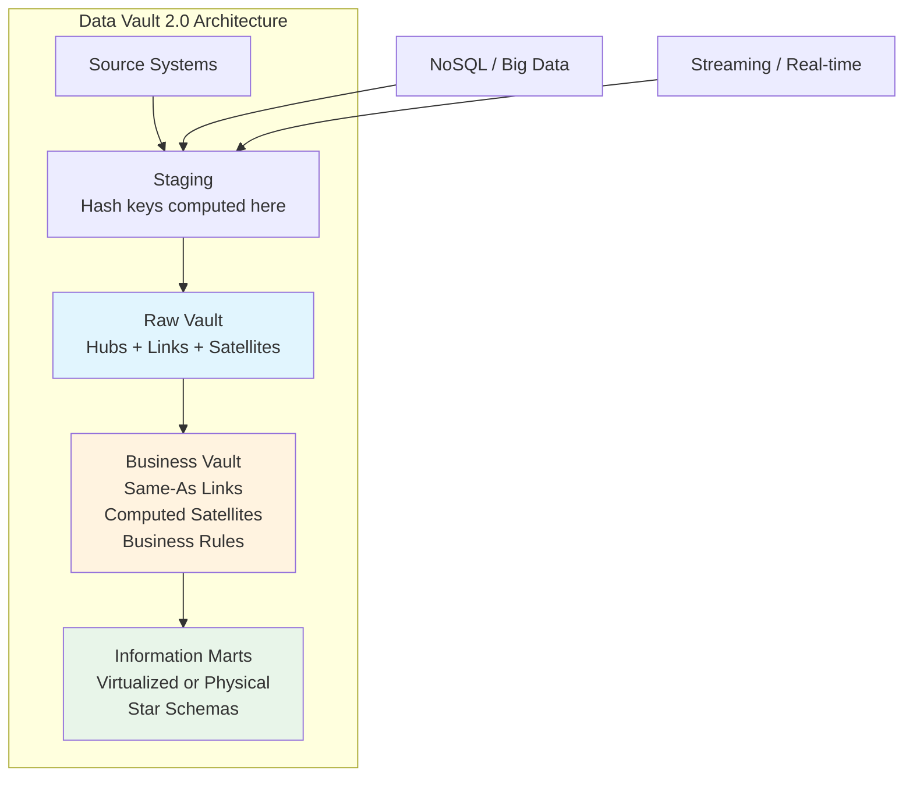
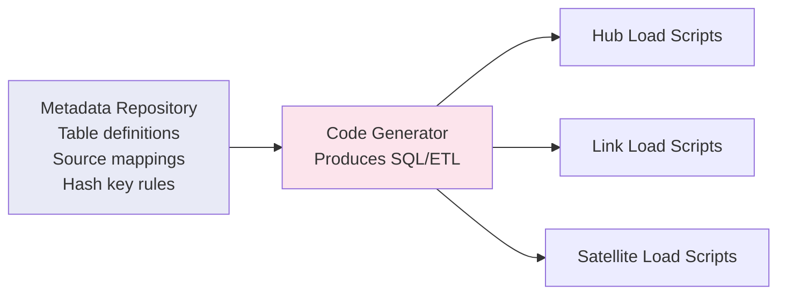
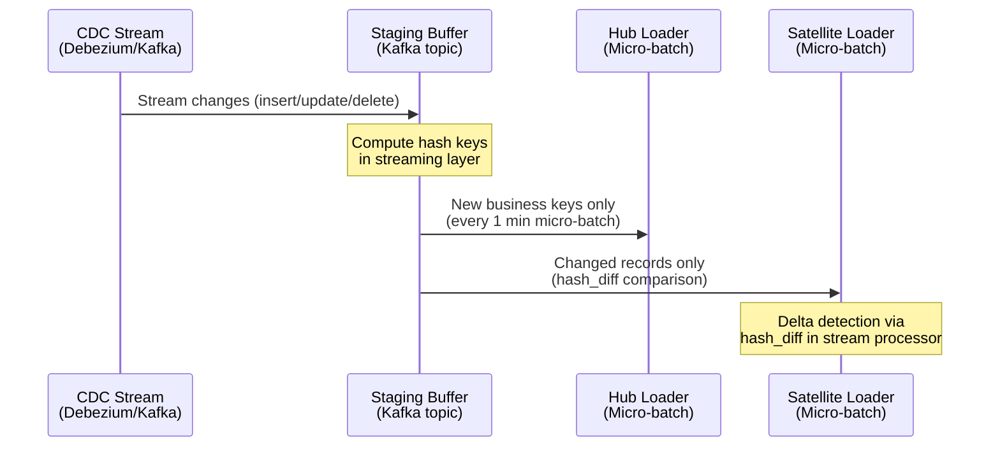
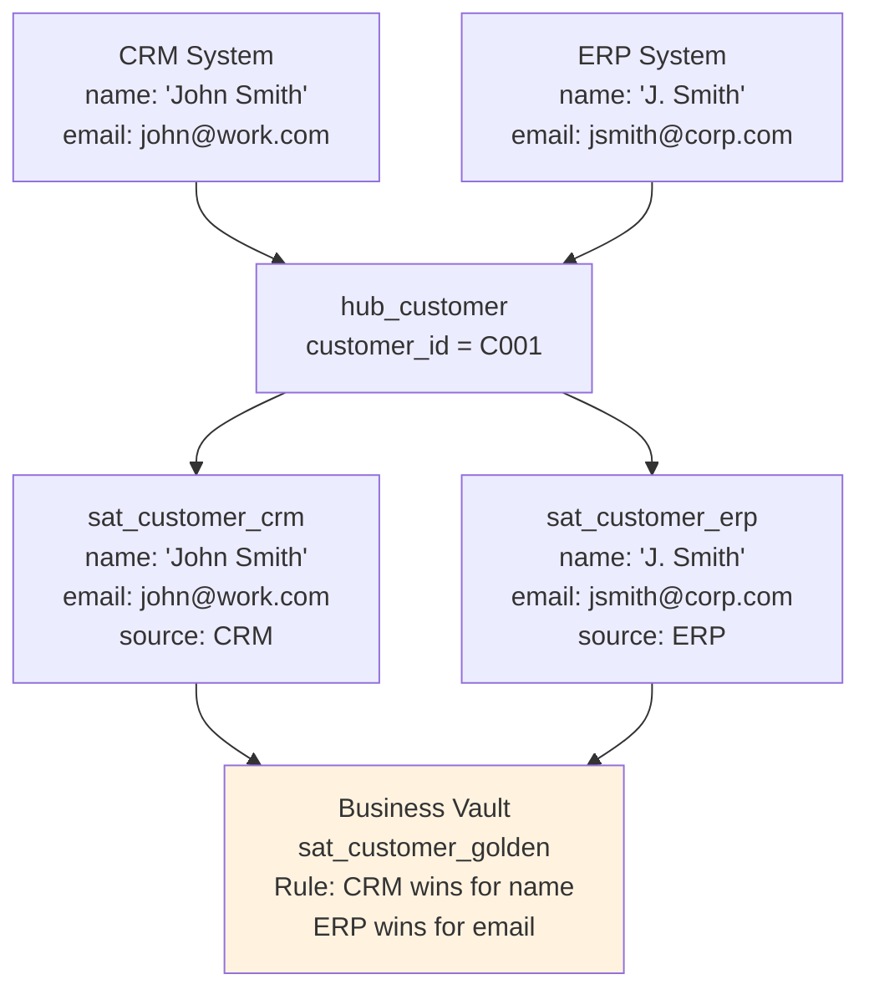

# Data Vault Modeling — Senior Deep Dive

## Data Vault 2.0 Enhancements

Data Vault 2.0 (DV2.0) introduces several improvements over the original methodology:



**Key DV2.0 differences:**
| Feature | DV 1.0 | DV 2.0 |
|---------|--------|--------|
| Hash keys | Optional | Mandatory (sequence keys eliminated) |
| Hash algorithm | MD5 | MD5 or SHA-1/SHA-256 |
| Staging | Transient | Persistent (replayable) |
| Business rules | In Raw Vault | Separated to Business Vault |
| Loading | Batch | Batch + Real-time (CDC) |
| Technology | RDBMS only | RDBMS + NoSQL + Hadoop |

## Business Vault

The Business Vault contains **derived/computed data** — anything not directly from source.

```sql
-- Computed Satellite: Customer lifetime value (not from source, calculated)
CREATE TABLE sat_customer_ltv_computed (
    hub_customer_hk    BINARY(16) NOT NULL,
    load_date          TIMESTAMP NOT NULL,
    total_orders       INT,
    total_revenue      DECIMAL(18,2),
    avg_order_value    DECIMAL(12,2),
    ltv_score          DECIMAL(8,2),
    ltv_segment        VARCHAR(20),    -- 'high', 'medium', 'low'
    calculation_logic  VARCHAR(200),   -- Tracks which formula version was used
    record_source      VARCHAR(100) DEFAULT 'BUSINESS_VAULT',
    PRIMARY KEY (hub_customer_hk, load_date)
);

-- Computed Link: Derived relationship (customer->segment) based on rules
CREATE TABLE link_customer_segment_computed (
    link_cust_seg_hk   BINARY(16) PRIMARY KEY,
    hub_customer_hk    BINARY(16) NOT NULL,
    hub_segment_hk     BINARY(16) NOT NULL,
    load_date          TIMESTAMP NOT NULL,
    record_source      VARCHAR(100) DEFAULT 'BUSINESS_VAULT'
);
```

**Key rule:** Business Vault objects are ALWAYS clearly labeled (suffix `_computed` or `_derived`) and have `record_source = 'BUSINESS_VAULT'`. This ensures traceability — you always know what came from source vs. what was calculated.

## Automation & Metadata-Driven Loading

Senior DV architects don't hand-code load scripts. They use **metadata-driven automation**.



```sql
-- Metadata table driving automation
CREATE TABLE dv_metadata (
    target_table       VARCHAR(100),
    target_type        VARCHAR(10),     -- 'HUB', 'LINK', 'SAT'
    source_table       VARCHAR(100),
    business_key_cols  VARCHAR(500),    -- Comma-separated
    hash_key_col       VARCHAR(100),
    descriptive_cols   VARCHAR(2000),   -- For satellites
    parent_hash_keys   VARCHAR(500),    -- For links/satellites
    record_source_val  VARCHAR(100)
);

-- Generator reads metadata and produces loading SQL dynamically
-- Example: generate hub load for any hub based on metadata row
```

```python
# Python-based DV automation (simplified)
def generate_hub_load(metadata_row):
    bk_cols = metadata_row['business_key_cols'].split(',')
    hash_expr = f"MD5(UPPER(TRIM(CONCAT({', '.join(bk_cols)}))))"
    
    return f"""
    INSERT INTO {metadata_row['target_table']} 
        ({metadata_row['hash_key_col']}, {', '.join(bk_cols)}, load_date, record_source)
    SELECT DISTINCT
        {hash_expr},
        {', '.join(bk_cols)},
        CURRENT_TIMESTAMP,
        '{metadata_row['record_source_val']}'
    FROM {metadata_row['source_table']} stg
    WHERE NOT EXISTS (
        SELECT 1 FROM {metadata_row['target_table']} h
        WHERE h.{metadata_row['hash_key_col']} = {hash_expr}
    );
    """
```

## Real-Time / Near-Real-Time Data Vault

DV2.0 supports CDC-driven real-time loading:



```python
# PySpark Structured Streaming → Data Vault
from pyspark.sql import functions as F

# Stream from Kafka
raw_stream = (spark.readStream
    .format("kafka")
    .option("kafka.bootstrap.servers", "broker:9092")
    .option("subscribe", "cdc.customers")
    .load())

# Compute hash keys in stream
processed = (raw_stream
    .withColumn("hub_customer_hk", 
        F.md5(F.upper(F.trim(F.col("customer_id")))))
    .withColumn("hash_diff",
        F.md5(F.concat_ws("||", 
            F.coalesce(F.col("name"), F.lit("")),
            F.coalesce(F.col("email"), F.lit("")))))
    .withColumn("load_date", F.current_timestamp())
    .withColumn("record_source", F.lit("CDC_KAFKA")))

# Write to hub (micro-batch, merge for dedup)
def write_hub(batch_df, batch_id):
    batch_df.createOrReplaceTempView("incoming")
    spark.sql("""
        MERGE INTO hub_customer h
        USING (SELECT DISTINCT hub_customer_hk, customer_id, load_date, record_source 
               FROM incoming) s
        ON h.hub_customer_hk = s.hub_customer_hk
        WHEN NOT MATCHED THEN INSERT *
    """)

processed.writeStream.foreachBatch(write_hub).start()
```

## Multi-System Conflict Resolution

When the same business entity arrives from multiple sources with conflicting data:



**Strategy: One satellite per source system.** Business Vault applies golden record rules.

```sql
-- Golden record computation (Business Vault)
INSERT INTO sat_customer_golden (hub_customer_hk, load_date, 
    golden_name, golden_email, source_priority, record_source)
SELECT 
    h.hub_customer_hk,
    CURRENT_TIMESTAMP,
    COALESCE(crm.customer_name, erp.customer_name)  AS golden_name,   -- CRM priority
    COALESCE(erp.email, crm.email)                   AS golden_email,  -- ERP priority
    CASE WHEN crm.customer_name IS NOT NULL THEN 'CRM' ELSE 'ERP' END,
    'BUSINESS_VAULT'
FROM hub_customer h
LEFT JOIN sat_customer_crm crm ON crm.hub_customer_hk = h.hub_customer_hk 
    AND crm.load_end_date = '9999-12-31'
LEFT JOIN sat_customer_erp erp ON erp.hub_customer_hk = h.hub_customer_hk 
    AND erp.load_end_date = '9999-12-31';
```

## Performance at Scale

### Partitioning Strategy

```sql
-- Satellites: partition by load_date (most queries filter by time)
CREATE TABLE sat_customer_details (
    hub_customer_hk BINARY(16),
    load_date       TIMESTAMP,
    ...
) PARTITION BY RANGE (load_date);

-- Hubs: partition by hash key prefix (distribute evenly)
-- For very large hubs (100M+ records)
CREATE TABLE hub_customer (
    hub_customer_hk BINARY(16),
    ...
) PARTITION BY HASH (hub_customer_hk) PARTITIONS 16;
```

### Ghost Records & Zero Keys

```sql
-- Ghost record: represents "unknown" (handle late-arriving dimensions)
INSERT INTO hub_customer VALUES (
    0x00000000000000000000000000000000,  -- Zero key
    'UNKNOWN',
    '1900-01-01',
    'SYSTEM'
);

-- Links can reference ghost hub when relationship source arrives
-- before the hub entity itself
```

## Data Vault on Modern Platforms

| Platform | Data Vault Approach |
|----------|-------------------|
| Snowflake | Streams + Tasks for loading; Zero-copy clones for PIT |
| Databricks | Delta Lake with MERGE; Unity Catalog for metadata |
| BigQuery | Partitioned tables; Scheduled queries for loading |
| dbt | dbt-vault / dbtvault package (metadata-driven) |

```sql
-- dbt-vault example (declarative Data Vault!)
-- models/raw_vault/hub_customer.sql
{{
    config(materialized='incremental')
}}



{{ dbtvault.hub(
    src_pk='hub_customer_hk',
    src_nk='customer_id',
    src_ldts='load_date',
    src_source='record_source',
    source_model=src
) }}
```

## Interview Tips

> **Tip 1:** "How do you handle Data Vault at scale?" — Three pillars: (1) Metadata-driven automation (don't hand-code loads), (2) PIT + Bridge tables for query performance, (3) Partitioning satellites by load_date. On cloud: leverage platform-native features (Snowflake streams, Delta MERGE, dbt-vault).

> **Tip 2:** "How do you reconcile conflicting source data?" — One satellite per source (never mix sources in one satellite). Business Vault applies golden record rules with explicit priority logic. Raw Vault preserves ALL versions from ALL sources — truth is never lost.

> **Tip 3:** "Data Vault 1.0 vs 2.0?" — Key differences: DV2.0 mandates hash keys (enables parallelism), separates business rules into Business Vault, supports real-time/CDC loading, and works on NoSQL/cloud platforms. DV1.0 was batch-only RDBMS.

## ⚡ Cheat Sheet

**Dimensional modeling building blocks**
```
Fact table:       measures/metrics (order_amount, quantity, duration)
Dimension table:  descriptive attributes (customer, product, date, geography)
Grain:            one row = one business event at lowest detail level
Surrogate key:    system-generated integer PK (never use natural keys in dim)
Natural key:      source system business key (stored alongside surrogate key)
```

**Star schema vs Snowflake schema**
```
Star:       fact → dimension (denormalized, faster queries, more storage)
Snowflake:  fact → dimension → sub-dimension (normalized, saves storage, more joins)
Rule:       prefer star for BI; snowflake only when storage cost is critical
```

**SCD (Slowly Changing Dimensions)**
| Type | Strategy | When |
|---|---|---|
| SCD1 | Overwrite old value | History irrelevant |
| SCD2 | New row (add effective_from, effective_to, is_current) | Need full history |
| SCD3 | Add prev_value column | Only need one prior value |
| SCD4 | Separate history table | Large dimension, rare changes |
| SCD6 | SCD1 + SCD2 + SCD3 hybrid | Best of all worlds |

**SCD2 implementation**
```sql
-- Insert new version, expire old
UPDATE dim_customer SET effective_to = CURRENT_DATE - 1, is_current = FALSE
WHERE customer_id = 123 AND is_current = TRUE;

INSERT INTO dim_customer (customer_id, name, city, effective_from, effective_to, is_current)
VALUES (123, 'Jane Doe', 'Chicago', CURRENT_DATE, '9999-12-31', TRUE);
```

**Data Vault pattern**
```
Hub:   business keys (stable identifiers — customer_id, order_id)
Link:  relationships between hubs (many-to-many)
Sat:   descriptive attributes + context (with load timestamp — full history)
```

**Fact table types**
```
Transaction:    one row per event (orders, clicks, payments)
Snapshot:       one row per period per entity (daily account balance)
Accumulating:   one row per lifecycle, updated as process stages complete
```

**Key interview points**
- Grain: define before designing any fact table — drives every design decision
- Degenerate dimensions: order number on fact table with no corresponding dimension
- Factless facts: events with no measures (student enrolled in course — just the relationship)
- Role-playing dimensions: same dimension used multiple times (order_date, ship_date, return_date)
- Conformed dimensions: shared across multiple fact tables (same dim_date in sales and returns facts)
