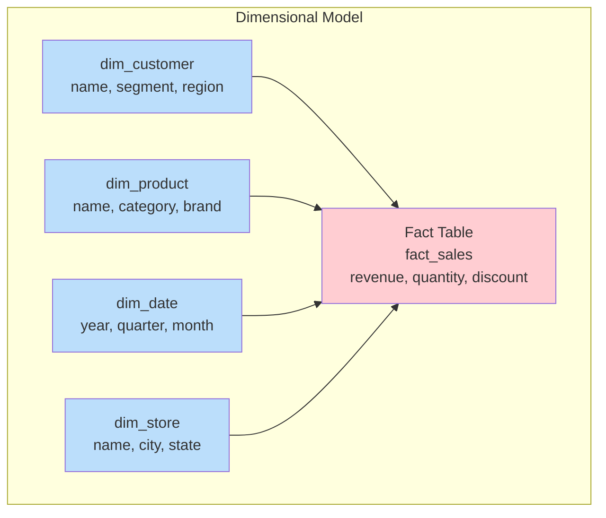
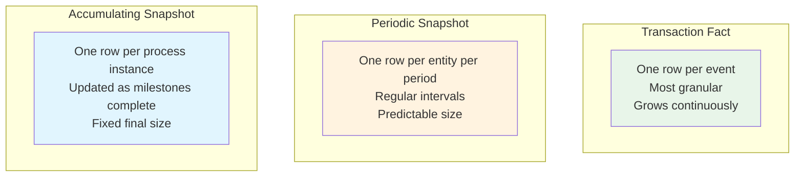
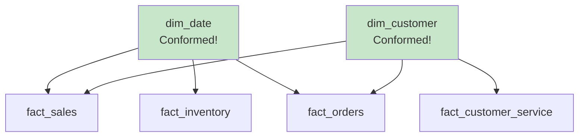

# Dimensional Modeling — Fundamentals

## What is Dimensional Modeling?

Dimensional modeling is a data warehouse design technique optimized for **query performance and user understandability**. Developed by Ralph Kimball, it organizes data into two types of tables:

- **Fact tables** — contain quantitative measurements (numbers you want to analyze)
- **Dimension tables** — contain descriptive context (how you want to slice/filter/group)



## The Four-Step Design Process

Kimball's methodology follows a structured approach:


### Step 1: Select the Business Process
Choose the operational process to model (e.g., sales transactions, order fulfillment, website clicks).

### Step 2: Declare the Grain
Define what **one row** in the fact table represents. This is the most critical decision.

| Grain Examples | One row = |
|---------------|-----------|
| Transaction grain | One line item in one order |
| Daily snapshot | One product's inventory level per day |
| Accumulating snapshot | One order's lifecycle from placement to delivery |

### Step 3: Identify Dimensions
Determine the "who, what, when, where, why, how" context for each fact row.

### Step 4: Identify Facts
Select the numeric measurements available at the declared grain.

## Fact Tables

### Types of Facts

| Fact Type | Description | Example |
|-----------|-------------|---------|
| **Additive** | Can be summed across ALL dimensions | revenue, quantity |
| **Semi-additive** | Can be summed across SOME dimensions | account balance (sum across customers, NOT across time) |
| **Non-additive** | Cannot be summed (use AVG, COUNT) | unit price, ratio, percentage |

### Types of Fact Tables



```sql
-- Transaction Fact (one row per sale event)
CREATE TABLE fact_sales (
    sale_key          BIGINT IDENTITY PRIMARY KEY,
    date_key          INT NOT NULL,          -- FK to dim_date
    customer_key      INT NOT NULL,          -- FK to dim_customer
    product_key       INT NOT NULL,          -- FK to dim_product
    store_key         INT NOT NULL,          -- FK to dim_store
    quantity          INT,                   -- Additive
    unit_price        DECIMAL(10,2),         -- Non-additive
    revenue           DECIMAL(12,2),         -- Additive
    discount_amount   DECIMAL(10,2),         -- Additive
    cost              DECIMAL(10,2)          -- Additive
);

-- Periodic Snapshot (one row per product per day)
CREATE TABLE fact_inventory_daily (
    date_key          INT NOT NULL,
    product_key       INT NOT NULL,
    warehouse_key     INT NOT NULL,
    quantity_on_hand  INT,                   -- Semi-additive (don't sum across dates!)
    quantity_reserved INT,                   -- Semi-additive
    days_of_supply    DECIMAL(5,1),          -- Non-additive
    PRIMARY KEY (date_key, product_key, warehouse_key)
);

-- Accumulating Snapshot (one row per order, updated over time)
CREATE TABLE fact_order_fulfillment (
    order_key             INT PRIMARY KEY,
    order_date_key        INT,
    payment_date_key      INT,       -- NULL until paid
    ship_date_key         INT,       -- NULL until shipped
    delivery_date_key     INT,       -- NULL until delivered
    customer_key          INT,
    order_amount          DECIMAL(12,2),
    days_to_payment       INT,       -- Calculated when paid
    days_to_ship          INT,       -- Calculated when shipped
    days_to_delivery      INT        -- Calculated when delivered
);
```

## Dimension Tables

Dimensions provide the **context** for analysis. They are typically:
- Wide (many columns — 50-100 is common)
- Shallow (fewer rows than facts)
- Denormalized (flat, no snowflaking for star schema)

```sql
-- Rich dimension with many attributes for slicing/filtering
CREATE TABLE dim_product (
    product_key       INT PRIMARY KEY,       -- Surrogate key
    product_id        VARCHAR(20),           -- Natural/business key
    product_name      VARCHAR(200),
    brand             VARCHAR(100),
    category          VARCHAR(100),
    subcategory       VARCHAR(100),
    department        VARCHAR(100),
    supplier_name     VARCHAR(200),
    package_type      VARCHAR(50),
    unit_of_measure   VARCHAR(20),
    is_active         BOOLEAN,
    effective_date    DATE,
    expiry_date       DATE
);

-- Date dimension (one row per calendar date)
CREATE TABLE dim_date (
    date_key          INT PRIMARY KEY,       -- YYYYMMDD format
    full_date         DATE,
    day_of_week       VARCHAR(10),
    day_of_month      INT,
    month_number      INT,
    month_name        VARCHAR(15),
    quarter           INT,
    year              INT,
    is_weekend        BOOLEAN,
    is_holiday        BOOLEAN,
    fiscal_year       INT,
    fiscal_quarter    INT
);
```

## Surrogate Keys vs. Natural Keys

| Aspect | Surrogate Key | Natural Key |
|--------|--------------|-------------|
| Definition | System-generated (1, 2, 3...) | Business identifier (CUST-001) |
| Use in DW | Always use in dimension PKs | Store as attribute for reference |
| Why | Insulates DW from source changes | Source systems may reuse/change keys |
| Performance | INT joins are faster | VARCHAR joins are slower |

```sql
-- Surrogate key is the PK, natural key is an attribute
CREATE TABLE dim_customer (
    customer_key      INT PRIMARY KEY,        -- Surrogate (DW-generated)
    customer_id       VARCHAR(50),            -- Natural key (from source)
    customer_name     VARCHAR(200),
    ...
);
```

## Conformed Dimensions

A **conformed dimension** is shared across multiple fact tables — ensuring consistent analysis.



**Rule:** Same dimension, same keys, same attributes = join any fact table and get consistent results.

## Interview Tips

> **Tip 1:** "What is dimensional modeling?" — A design technique for data warehouses. Organize data into fact tables (measurements/metrics) and dimension tables (descriptive context). Optimized for query performance and business user understanding. Created by Ralph Kimball.

> **Tip 2:** "What is grain?" — The grain defines what one row in the fact table represents. It's the single most important decision in dimensional design. Example: "one row per line item per order" or "one row per customer per day." Always declare grain BEFORE choosing dimensions and facts.

> **Tip 3:** "Additive vs semi-additive vs non-additive facts?" — Additive (revenue): sum across all dimensions. Semi-additive (balance): sum across some dimensions but not time (use snapshot/latest). Non-additive (price, ratio): can't sum — must average or recalculate.
