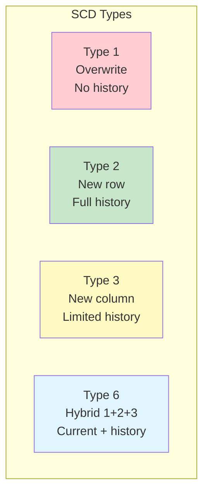
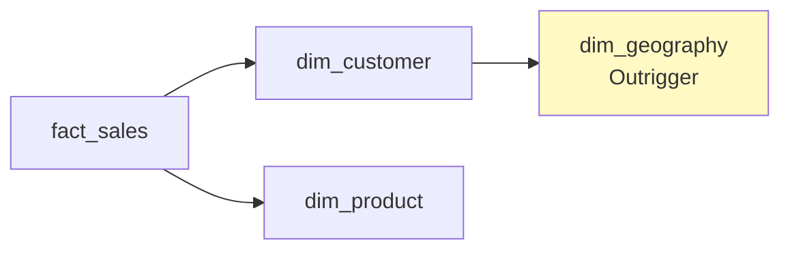

# Dimensional Modeling — Intermediate Concepts

## Slowly Changing Dimensions (SCD)

How do you handle dimension attribute changes over time?



### SCD Type 1 — Overwrite

```sql
-- Simply update the existing row (history lost)
UPDATE dim_customer
SET customer_name = 'Jane Smith',  -- Was 'Jane Doe'
    email = 'jane.smith@new.com'
WHERE customer_id = 'C001';

-- Use when: history doesn't matter (typo corrections, data cleanup)
```

### SCD Type 2 — New Row (Most Common in DW)

```sql
-- Customer moves from New York to Chicago:
-- Step 1: Close the current record
UPDATE dim_customer
SET effective_end_date = '2024-03-14',
    is_current = FALSE
WHERE customer_id = 'C001' AND is_current = TRUE;

-- Step 2: Insert new version
INSERT INTO dim_customer (customer_key, customer_id, customer_name, city, state,
                          effective_start_date, effective_end_date, is_current)
VALUES (next_key, 'C001', 'Jane Smith', 'Chicago', 'IL',
        '2024-03-15', '9999-12-31', TRUE);

-- Result:
-- key=100 | C001 | Jane Smith | New York | NY | 2020-01-01 | 2024-03-14 | FALSE
-- key=501 | C001 | Jane Smith | Chicago  | IL | 2024-03-15 | 9999-12-31 | TRUE
```

### SCD Type 3 — New Column

```sql
-- Add column for previous value (limited to one prior version)
ALTER TABLE dim_customer ADD previous_city VARCHAR(100);
ALTER TABLE dim_customer ADD city_change_date DATE;

UPDATE dim_customer
SET previous_city = city,           -- Save old value
    city = 'Chicago',               -- Update to new
    city_change_date = '2024-03-15'
WHERE customer_id = 'C001';
```

### SCD Type 6 — Hybrid (1 + 2 + 3)

```sql
-- Combines Type 2 rows with Type 1 current-value columns
CREATE TABLE dim_customer (
    customer_key        INT PRIMARY KEY,
    customer_id         VARCHAR(20),
    customer_name       VARCHAR(200),
    -- Type 2 columns (historical):
    city                VARCHAR(100),      -- City at that point in time
    effective_start     DATE,
    effective_end       DATE,
    is_current          BOOLEAN,
    -- Type 1 column (always current, on ALL rows):
    current_city        VARCHAR(100)       -- Updated on ALL rows when city changes
);

-- When customer moves to Chicago:
-- 1. Insert new row (Type 2)
-- 2. Update current_city on ALL rows for this customer (Type 1 on Type 3 column)
```

## Role-Playing Dimensions

The same dimension used multiple times in one fact table with different meanings.

```sql
-- dim_date is used 3 times with different roles:
CREATE TABLE fact_order_fulfillment (
    order_date_key      INT REFERENCES dim_date(date_key),     -- When ordered
    ship_date_key       INT REFERENCES dim_date(date_key),     -- When shipped
    delivery_date_key   INT REFERENCES dim_date(date_key),     -- When delivered
    customer_key        INT,
    order_amount        DECIMAL(12,2)
);

-- Query using role-playing dimension:
SELECT 
    order_dt.month_name    AS order_month,
    ship_dt.month_name     AS ship_month,
    AVG(f.order_amount)    AS avg_order_value
FROM fact_order_fulfillment f
JOIN dim_date order_dt ON f.order_date_key = order_dt.date_key
JOIN dim_date ship_dt  ON f.ship_date_key  = ship_dt.date_key
GROUP BY order_dt.month_name, ship_dt.month_name;
```

Implemented via **views** for clarity:

```sql
CREATE VIEW dim_order_date AS SELECT * FROM dim_date;
CREATE VIEW dim_ship_date  AS SELECT * FROM dim_date;
CREATE VIEW dim_delivery_date AS SELECT * FROM dim_date;
```

## Degenerate Dimensions

A dimension with **no attributes** — just the key lives in the fact table (no separate dimension table needed).

```sql
-- Order number is a "dimension" but has no descriptive attributes
-- It lives directly in the fact table as a degenerate dimension
CREATE TABLE fact_sales (
    sale_key          BIGINT PRIMARY KEY,
    order_number      VARCHAR(20),         -- Degenerate dimension!
    date_key          INT,
    customer_key      INT,
    product_key       INT,
    quantity          INT,
    revenue           DECIMAL(12,2)
);

-- Use cases: invoice number, transaction ID, PO number
-- These group fact rows together but don't need their own table
```

## Junk Dimensions

Combine **low-cardinality flags and indicators** into a single dimension instead of cluttering the fact table.

```sql
-- Instead of 5 boolean/flag columns in the fact table:
-- is_gift, is_returned, is_expedited, payment_type, order_channel

-- Create a junk dimension with all combinations:
CREATE TABLE dim_order_flags (
    order_flag_key    INT PRIMARY KEY,
    is_gift           BOOLEAN,
    is_returned       BOOLEAN,
    is_expedited      BOOLEAN,
    payment_type      VARCHAR(20),   -- 'credit_card', 'paypal', 'wire'
    order_channel     VARCHAR(20)    -- 'web', 'mobile', 'store', 'phone'
);

-- Pre-populate all valid combinations:
-- Row 1: FALSE, FALSE, FALSE, 'credit_card', 'web'
-- Row 2: FALSE, FALSE, FALSE, 'credit_card', 'mobile'
-- Row 3: TRUE, FALSE, TRUE, 'paypal', 'web'
-- ... (limited combinations, often < 1000 rows)

-- Fact table has single FK:
CREATE TABLE fact_sales (
    ...
    order_flag_key    INT REFERENCES dim_order_flags(order_flag_key),
    ...
);
```

## Bridge Tables (Multi-Valued Dimensions)

When a fact has a **many-to-many relationship** with a dimension.

```sql
-- Problem: One patient visit can have multiple diagnoses
-- Can't put multiple diagnosis_keys in the fact table

-- Solution: Bridge table
CREATE TABLE bridge_patient_diagnosis (
    patient_visit_key    INT,
    diagnosis_key        INT,
    weight_factor        DECIMAL(5,4),  -- Allocation factor (sums to 1.0)
    PRIMARY KEY (patient_visit_key, diagnosis_key)
);

-- Example: Visit with 2 diagnoses, each allocated 50%
-- visit_key=1, diagnosis_key=101, weight=0.50
-- visit_key=1, diagnosis_key=205, weight=0.50

-- Query (properly weighted):
SELECT d.diagnosis_name, SUM(f.cost * b.weight_factor) AS allocated_cost
FROM fact_patient_visit f
JOIN bridge_patient_diagnosis b ON f.patient_visit_key = b.patient_visit_key
JOIN dim_diagnosis d ON b.diagnosis_key = d.diagnosis_key
GROUP BY d.diagnosis_name;
```

## Factless Fact Tables

A fact table with **no measurements** — records events or coverage.

```sql
-- Event tracking: Student attended class (no numeric measurement)
CREATE TABLE fact_attendance (
    date_key          INT,
    student_key       INT,
    class_key         INT,
    instructor_key    INT
    -- No fact columns! The row's EXISTENCE is the fact.
);

-- Coverage: Which products were on promotion (even if not sold)
CREATE TABLE fact_promotion_coverage (
    date_key          INT,
    product_key       INT,
    promotion_key     INT,
    store_key         INT
    -- Enables: "Which promoted products had ZERO sales?"
    -- (LEFT JOIN fact_sales WHERE sale is NULL)
);
```

## Outrigger Dimensions

A dimension referenced by **another dimension** (not by the fact table).



```sql
-- dim_geography is an outrigger (referenced by dim_customer, not directly by fact)
CREATE TABLE dim_geography (
    geography_key     INT PRIMARY KEY,
    city              VARCHAR(100),
    state             VARCHAR(50),
    country           VARCHAR(50),
    region            VARCHAR(50),
    timezone          VARCHAR(50)
);

CREATE TABLE dim_customer (
    customer_key      INT PRIMARY KEY,
    customer_name     VARCHAR(200),
    geography_key     INT REFERENCES dim_geography(geography_key),  -- Outrigger FK
    ...
);
```

**Use sparingly** — outriggers add joins and break the pure star schema pattern.

## Interview Tips

> **Tip 1:** "When do you use SCD Type 2 vs Type 1?" — Type 2 when business needs to analyze historical context ("What region was the customer in when they made this purchase?"). Type 1 when only current value matters (corrections, non-analytical attributes). Type 2 is the DW default for important attributes.

> **Tip 2:** "What is a junk dimension?" — A single dimension table that combines multiple low-cardinality flags/indicators (boolean fields, status codes) into pre-built combinations. Keeps the fact table narrow and avoids adding 5-10 flag columns directly. Typical junk dimension has < 1000 rows.

> **Tip 3:** "How do you handle many-to-many in dimensional models?" — Bridge table between the fact and the dimension. Include a weighting factor that sums to 1.0 per fact row (for proper aggregation). Example: one hospital visit → multiple diagnoses with cost allocation.
