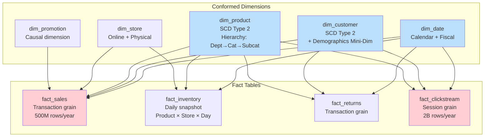
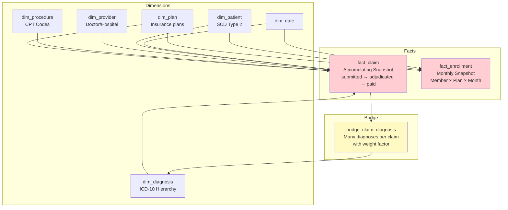

# Dimensional Modeling — Real-World Production Examples

## Example 1: E-Commerce Analytics Platform



### Complete Implementation

```sql
-- ═══════════════════════════════════════════════
-- DIMENSION: Product (SCD Type 2 + Hierarchy)
-- ═══════════════════════════════════════════════
CREATE TABLE dim_product (
    product_key           INT PRIMARY KEY,         -- Surrogate
    product_id            VARCHAR(20) NOT NULL,    -- Natural key
    product_name          VARCHAR(200),
    -- Hierarchy (denormalized for star schema):
    brand                 VARCHAR(100),
    subcategory           VARCHAR(100),
    category              VARCHAR(100),
    department            VARCHAR(100),
    -- Attributes:
    color                 VARCHAR(50),
    size                  VARCHAR(20),
    weight_kg             DECIMAL(8,2),
    unit_cost             DECIMAL(10,2),
    unit_retail_price     DECIMAL(10,2),
    supplier_name         VARCHAR(200),
    -- SCD Type 2 tracking:
    effective_start_date  DATE NOT NULL,
    effective_end_date    DATE DEFAULT '9999-12-31',
    is_current            BOOLEAN DEFAULT TRUE,
    -- Audit:
    created_at            TIMESTAMP DEFAULT CURRENT_TIMESTAMP,
    updated_at            TIMESTAMP
);

-- ═══════════════════════════════════════════════
-- FACT: Sales (transaction grain)
-- ═══════════════════════════════════════════════
CREATE TABLE fact_sales (
    sale_key              BIGINT PRIMARY KEY,
    -- Degenerate dimensions:
    order_number          VARCHAR(20),
    line_item_number      INT,
    -- Foreign keys:
    date_key              INT NOT NULL,
    customer_key          INT NOT NULL,
    product_key           INT NOT NULL,
    store_key             INT NOT NULL,
    promotion_key         INT DEFAULT 0,           -- 0 = "No promotion"
    order_flag_key        INT,                     -- Junk dimension
    customer_demo_key     INT,                     -- Mini-dimension
    -- Facts:
    quantity              INT,                     -- Additive
    unit_price            DECIMAL(10,2),           -- Non-additive
    unit_cost             DECIMAL(10,2),           -- Non-additive
    gross_revenue         DECIMAL(12,2),           -- Additive (qty × price)
    discount_amount       DECIMAL(10,2),           -- Additive
    net_revenue           DECIMAL(12,2),           -- Additive (gross - discount)
    gross_profit          DECIMAL(12,2),           -- Additive (net_revenue - cost)
    shipping_cost         DECIMAL(8,2),            -- Additive
    tax_amount            DECIMAL(8,2)             -- Additive
);

-- Indexes for common query patterns:
CREATE INDEX idx_fact_sales_date ON fact_sales(date_key);
CREATE INDEX idx_fact_sales_customer ON fact_sales(customer_key);
CREATE INDEX idx_fact_sales_product ON fact_sales(product_key);

-- ═══════════════════════════════════════════════
-- AGGREGATE: Monthly Product Category Summary
-- ═══════════════════════════════════════════════
CREATE TABLE fact_sales_monthly_category AS
SELECT
    d.year * 100 + d.month_number  AS month_key,
    p.category,
    p.department,
    SUM(f.quantity)                 AS total_quantity,
    SUM(f.net_revenue)             AS total_revenue,
    SUM(f.gross_profit)            AS total_profit,
    COUNT(DISTINCT f.order_number) AS order_count,
    COUNT(DISTINCT f.customer_key) AS unique_customers,
    SUM(f.net_revenue) / NULLIF(COUNT(DISTINCT f.customer_key), 0) AS revenue_per_customer
FROM fact_sales f
JOIN dim_date d ON f.date_key = d.date_key
JOIN dim_product p ON f.product_key = p.product_key
GROUP BY d.year * 100 + d.month_number, p.category, p.department;
```

---

## Example 2: Healthcare Claims Analytics



```sql
-- Accumulating Snapshot: Claim lifecycle
CREATE TABLE fact_claim (
    claim_key                INT PRIMARY KEY,
    claim_number             VARCHAR(20),           -- Degenerate dimension
    -- Role-playing date dimensions:
    service_date_key         INT,                   -- When service provided
    submit_date_key          INT,                   -- When claim submitted
    adjudicate_date_key      INT,                   -- When processed (NULL until done)
    payment_date_key         INT,                   -- When paid (NULL until paid)
    denial_date_key          INT,                   -- If denied (NULL if approved)
    -- Dimensions:
    patient_key              INT NOT NULL,
    provider_key             INT NOT NULL,
    primary_diagnosis_key    INT,
    procedure_key            INT,
    plan_key                 INT,
    -- Facts:
    billed_amount            DECIMAL(12,2),         -- Additive
    allowed_amount           DECIMAL(12,2),         -- Additive
    paid_amount              DECIMAL(12,2),         -- Additive (NULL until paid)
    patient_responsibility   DECIMAL(12,2),         -- Additive
    -- Lag metrics:
    days_to_adjudicate       INT,                   -- Computed when adjudicated
    days_to_pay              INT,                   -- Computed when paid
    -- Status:
    claim_status             VARCHAR(20)            -- 'submitted','processing','paid','denied'
);

-- Bridge: Multiple diagnoses per claim
CREATE TABLE bridge_claim_diagnosis (
    claim_key          INT,
    diagnosis_key      INT,
    diagnosis_rank     INT,           -- 1=primary, 2=secondary, etc.
    weight_factor      DECIMAL(5,4),  -- Cost allocation weight
    PRIMARY KEY (claim_key, diagnosis_key)
);

-- Analytics query: Cost by diagnosis category with proper allocation
SELECT 
    dx.diagnosis_category,
    dx.icd10_chapter,
    SUM(fc.paid_amount * b.weight_factor) AS allocated_cost,
    COUNT(DISTINCT fc.claim_key) AS claim_count,
    AVG(fc.days_to_pay) AS avg_days_to_pay
FROM fact_claim fc
JOIN bridge_claim_diagnosis b ON fc.claim_key = b.claim_key
JOIN dim_diagnosis dx ON b.diagnosis_key = dx.diagnosis_key
WHERE fc.claim_status = 'paid'
  AND fc.service_date_key BETWEEN 20240101 AND 20241231
GROUP BY dx.diagnosis_category, dx.icd10_chapter
ORDER BY allocated_cost DESC;
```

---

## Example 3: SaaS Product Analytics (Event-Based)

```sql
-- Modern approach: event-based fact + session aggregation

-- Base fact: every user action (transaction grain)
CREATE TABLE fact_product_event (
    event_key             BIGINT PRIMARY KEY,
    event_timestamp       TIMESTAMP,
    date_key              INT,
    user_key              INT,
    feature_key           INT,              -- What feature was used
    session_id            VARCHAR(50),      -- Degenerate dimension
    -- Facts:
    event_duration_ms     INT,
    is_error              BOOLEAN,
    page_load_time_ms     INT
);

-- Periodic snapshot: daily user engagement  
CREATE TABLE fact_user_engagement_daily (
    date_key              INT,
    user_key              INT,
    account_key           INT,
    -- Semi-additive facts (don't sum across dates!):
    sessions_count        INT,
    total_events          INT,
    unique_features_used  INT,
    total_duration_min    DECIMAL(8,1),
    error_count           INT,
    -- Derived metrics:
    engagement_score      DECIMAL(5,2),
    is_active             BOOLEAN,          -- TRUE if sessions > 0
    PRIMARY KEY (date_key, user_key)
);

-- Accumulating snapshot: user lifecycle
CREATE TABLE fact_user_lifecycle (
    user_key              INT PRIMARY KEY,
    account_key           INT,
    -- Milestones (date keys, NULL until reached):
    signup_date_key       INT NOT NULL,
    activation_date_key   INT,              -- First meaningful action
    first_payment_key     INT,              -- Converted to paid
    churn_date_key        INT,              -- If churned
    reactivation_date_key INT,              -- If came back
    -- Lifecycle metrics:
    days_to_activation    INT,
    days_to_conversion    INT,
    lifetime_revenue      DECIMAL(12,2),
    total_sessions        INT,
    current_plan_key      INT,
    current_status        VARCHAR(20)       -- 'trial','active','churned','reactivated'
);
```

---

## Example 4: ETL/dbt Implementation Pattern

```sql
-- dbt model: incremental fact_sales load
-- models/marts/fact_sales.sql
{{ config(
    materialized='incremental',
    unique_key='sale_key',
    partition_by={'field': 'order_date', 'data_type': 'date', 'granularity': 'month'},
    cluster_by=['customer_key', 'product_key']
) }}

WITH orders AS (
    SELECT * FROM {{ ref('stg_orders') }}
    
    WHERE order_date > (SELECT MAX(order_date) FROM {{ this }})
    
),

-- Lookup dimension keys (handle SCD Type 2 point-in-time)
enriched AS (
    SELECT
        o.order_id || '-' || o.line_number     AS sale_key,
        dd.date_key,
        -- SCD Type 2: get customer_key active at time of order
        dc.customer_key,
        dp.product_key,
        ds.store_key,
        COALESCE(dpr.promotion_key, 0)         AS promotion_key,
        o.quantity,
        o.unit_price,
        o.quantity * o.unit_price               AS gross_revenue,
        o.discount_amount,
        (o.quantity * o.unit_price) - o.discount_amount AS net_revenue,
        o.order_date
    FROM orders o
    JOIN {{ ref('dim_date') }} dd 
        ON o.order_date = dd.full_date
    JOIN {{ ref('dim_customer') }} dc 
        ON o.customer_id = dc.customer_id
        AND o.order_date BETWEEN dc.effective_start_date AND dc.effective_end_date
    JOIN {{ ref('dim_product') }} dp 
        ON o.product_id = dp.product_id AND dp.is_current = TRUE
    JOIN {{ ref('dim_store') }} ds 
        ON o.store_id = ds.store_id
    LEFT JOIN {{ ref('dim_promotion') }} dpr 
        ON o.promo_code = dpr.promo_code
        AND o.order_date BETWEEN dpr.start_date AND dpr.end_date
)

SELECT * FROM enriched
```

---

## Interview Tips

> **Tip 1:** "Walk me through designing a dimensional model for [X business]." — Follow the 4-step process: (1) Identify the business process (sales, claims, clicks), (2) Declare grain (one row = one line item/event), (3) Identify dimensions (who/what/when/where/how), (4) Identify facts (additive measurements at that grain). Draw the star schema. Mention conformed dimensions shared across fact tables.

> **Tip 2:** "How do you handle a healthcare claims model with multiple diagnoses?" — Bridge table pattern. Claims fact connects to a bridge_claim_diagnosis table with weight_factor. Each diagnosis gets allocated cost proportionally. Primary diagnosis has weight=1 for non-weighted queries. ICD-10 hierarchy lives in dim_diagnosis (denormalized: code → subcategory → category → chapter).

> **Tip 3:** "How do you implement dimensional models in production?" — dbt is the standard. Use incremental models for facts (partition by date), `is_incremental()` for delta loading. SCD Type 2 via dbt snapshots. Dimension key lookups happen in the fact model (JOIN on natural key + date range for Type 2). Star schema lives in `marts/` layer.
