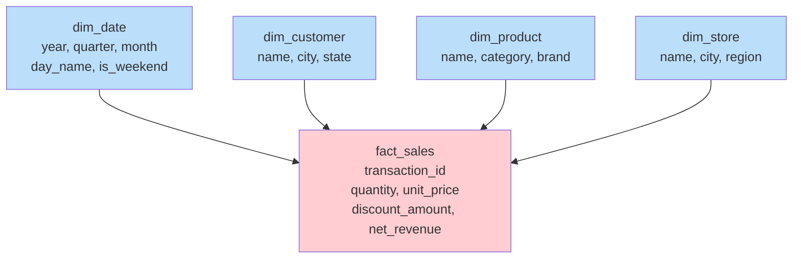
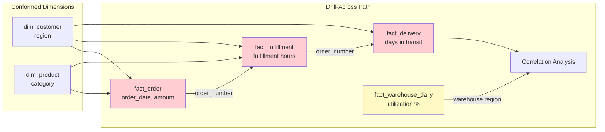

# Scenario Questions — Dimensional Modeling

<article data-difficulty="junior">

## 🟢 Junior: Designing a Basic Star Schema

**Scenario:** A retail company wants to analyze their sales data. The source system has a `transactions` table with: `transaction_id`, `transaction_date`, `customer_id`, `customer_name`, `customer_city`, `product_id`, `product_name`, `product_category`, `store_id`, `store_name`, `store_city`, `quantity`, `unit_price`, `discount_pct`. Design a star schema with appropriate fact and dimension tables, and explain what grain you chose.

<details>
<summary>💡 Hint</summary>
Follow Kimball's 4 steps: (1) Business process = retail sales, (2) Grain = one row per line item per transaction, (3) Dimensions = who bought, what product, when, where, (4) Facts = numeric measurements at that grain (quantity, price, revenue). Denormalize the dimensions (flatten hierarchies).
</details>

<details>
<summary>✅ Solution</summary>

```sql
-- GRAIN: One row per product per transaction (line-item level)

-- ═══════════════════════════════════════
-- DIMENSION TABLES
-- ═══════════════════════════════════════

CREATE TABLE dim_date (
    date_key          INT PRIMARY KEY,         -- YYYYMMDD
    full_date         DATE NOT NULL,
    day_name          VARCHAR(10),             -- Monday, Tuesday...
    day_of_month      INT,
    month_number      INT,
    month_name        VARCHAR(15),
    quarter           INT,
    year              INT,
    is_weekend        BOOLEAN,
    is_holiday        BOOLEAN
);

CREATE TABLE dim_customer (
    customer_key      INT PRIMARY KEY,         -- Surrogate key
    customer_id       VARCHAR(20) NOT NULL,    -- Natural key
    customer_name     VARCHAR(200),
    city              VARCHAR(100),
    state             VARCHAR(50),
    country           VARCHAR(50)
);

CREATE TABLE dim_product (
    product_key       INT PRIMARY KEY,         -- Surrogate key
    product_id        VARCHAR(20) NOT NULL,    -- Natural key
    product_name      VARCHAR(200),
    category          VARCHAR(100),            -- Denormalized hierarchy
    subcategory       VARCHAR(100),
    brand             VARCHAR(100)
);

CREATE TABLE dim_store (
    store_key         INT PRIMARY KEY,         -- Surrogate key
    store_id          VARCHAR(20) NOT NULL,    -- Natural key
    store_name        VARCHAR(200),
    city              VARCHAR(100),
    state             VARCHAR(50),
    region            VARCHAR(50)
);

-- ═══════════════════════════════════════
-- FACT TABLE
-- ═══════════════════════════════════════

CREATE TABLE fact_sales (
    sale_key          BIGINT PRIMARY KEY,
    -- Degenerate dimension:
    transaction_id    VARCHAR(20),
    -- Foreign keys to dimensions:
    date_key          INT NOT NULL REFERENCES dim_date,
    customer_key      INT NOT NULL REFERENCES dim_customer,
    product_key       INT NOT NULL REFERENCES dim_product,
    store_key         INT NOT NULL REFERENCES dim_store,
    -- Facts (measurements):
    quantity          INT,                     -- Additive
    unit_price        DECIMAL(10,2),           -- Non-additive
    discount_pct      DECIMAL(5,2),            -- Non-additive
    discount_amount   DECIMAL(10,2),           -- Additive (calculated)
    net_revenue       DECIMAL(12,2)            -- Additive (qty × price × (1-discount))
);
```



**Key Points:**
- **Grain**: One row per product per transaction (line-item level — most granular)
- **Surrogate keys**: INT keys in dimensions (faster joins than VARCHAR natural keys)
- **Degenerate dimension**: `transaction_id` lives in fact (groups line items, no separate table needed)
- **Calculated fact**: `net_revenue = quantity × unit_price × (1 - discount_pct)` stored for performance
- **Denormalized dimensions**: category lives directly in dim_product (no separate dim_category)
- Separating dim_date enables time-intelligence queries (fiscal year, holidays, weekends)

</details>

</article>

<article data-difficulty="mid-level">

## 🟡 Mid-Level: Handling SCD Type 2 in ETL

**Scenario:** Your `dim_customer` uses SCD Type 2 to track address changes. A customer (ID: C001, "Alice Brown") moved from "New York" to "Chicago" on March 15, 2024. Then on March 20, a late-arriving order from March 10 (when she was still in New York) needs to be loaded. How do you: (1) implement the SCD Type 2 change, (2) correctly load the late-arriving fact, and (3) handle the dimension lookup in your ETL?

<details>
<summary>💡 Hint</summary>
SCD Type 2: close current row (set end_date), insert new row. For late-arriving facts: look up the dimension key based on the FACT's event date (not today's date) — the key that was effective on March 10. Your ETL must JOIN on customer_id AND date range.
</details>

<details>
<summary>✅ Solution</summary>

```sql
-- ═══════════════════════════════════════
-- STEP 1: Before the address change (current state)
-- ═══════════════════════════════════════
-- dim_customer:
-- customer_key=100 | C001 | Alice Brown | New York | NY | 2020-01-01 | 9999-12-31 | TRUE

-- ═══════════════════════════════════════
-- STEP 2: Process address change (March 15, 2024)
-- ═══════════════════════════════════════

-- Close the current record:
UPDATE dim_customer
SET effective_end_date = '2024-03-14',    -- Day before new version
    is_current = FALSE,
    updated_at = CURRENT_TIMESTAMP
WHERE customer_id = 'C001' 
  AND is_current = TRUE;

-- Insert new version:
INSERT INTO dim_customer 
    (customer_key, customer_id, customer_name, city, state, 
     effective_start_date, effective_end_date, is_current)
VALUES 
    (501, 'C001', 'Alice Brown', 'Chicago', 'IL',
     '2024-03-15', '9999-12-31', TRUE);

-- RESULT:
-- customer_key=100 | C001 | Alice Brown | New York | NY | 2020-01-01 | 2024-03-14 | FALSE
-- customer_key=501 | C001 | Alice Brown | Chicago  | IL | 2024-03-15 | 9999-12-31 | TRUE

-- ═══════════════════════════════════════
-- STEP 3: Load late-arriving fact (order from March 10)
-- ═══════════════════════════════════════

-- WRONG approach (would assign Chicago key=501):
-- SELECT customer_key FROM dim_customer WHERE customer_id = 'C001' AND is_current = TRUE

-- CORRECT approach: lookup by EVENT DATE
INSERT INTO fact_sales (date_key, customer_key, product_key, quantity, net_revenue)
SELECT 
    20240310,                           -- March 10 order
    dc.customer_key,                    -- Will be 100 (New York version!)
    dp.product_key,
    stg.quantity,
    stg.net_revenue
FROM staging_late_orders stg
JOIN dim_customer dc 
    ON dc.customer_id = stg.customer_id
    AND stg.order_date >= dc.effective_start_date    -- March 10 >= 2020-01-01 ✓
    AND stg.order_date <= dc.effective_end_date      -- March 10 <= 2024-03-14 ✓
JOIN dim_product dp 
    ON dp.product_id = stg.product_id AND dp.is_current = TRUE;

-- RESULT: Order correctly assigned to customer_key=100 (New York version)
-- because Alice was in New York on March 10!

-- ═══════════════════════════════════════
-- STEP 4: ETL pattern for all fact loads (handles both cases)
-- ═══════════════════════════════════════

-- Always use date-range lookup for SCD Type 2 dimensions:
INSERT INTO fact_sales (date_key, customer_key, product_key, ...)
SELECT
    dd.date_key,
    dc.customer_key,
    dp.product_key,
    ...
FROM staging_orders stg
-- Date dimension (simple lookup):
JOIN dim_date dd ON stg.order_date = dd.full_date
-- SCD Type 2 dimension (date-range lookup!):
JOIN dim_customer dc 
    ON dc.customer_id = stg.customer_id
    AND stg.order_date BETWEEN dc.effective_start_date AND dc.effective_end_date
-- Type 1 dimension (current only):
JOIN dim_product dp 
    ON dp.product_id = stg.product_id AND dp.is_current = TRUE;
```

**Key Points:**
- SCD Type 2 change: close old row (set end_date) + insert new row
- `effective_end_date` of old row = day BEFORE new row's start date (no gaps or overlaps)
- **Late-arriving fact**: MUST look up customer_key based on the order's date, NOT today
- ETL pattern: `JOIN ON customer_id AND order_date BETWEEN start AND end`
- This ensures every fact row connects to the dimension version that was active when the event occurred
- If the date falls in a gap (shouldn't happen with correct ETL), use the most recent prior version

</details>

</article>

<article data-difficulty="senior">

## 🔴 Senior: Designing a Multi-Process Conformed Model

**Scenario:** A logistics company needs analytics across three business processes: (1) Order Placement (e-commerce), (2) Warehouse Fulfillment, (3) Last-Mile Delivery. Design a conformed dimensional model with shared dimensions, appropriate fact table types for each process, and show how a drill-across query answers: "What is the average time from order to delivery by product category and customer region, and how does warehouse capacity utilization correlate with delivery delays?"

<details>
<summary>💡 Hint</summary>
Bus Matrix first: identify conformed dimensions shared across all 3 processes. fact_orders = transaction grain, fact_fulfillment = accumulating snapshot (milestones), fact_delivery = accumulating snapshot. Fact_warehouse_capacity = periodic daily snapshot. Drill-across: aggregate each fact to common grain, then join via conformed dimensions.
</details>

<details>
<summary>✅ Solution</summary>

```sql
-- ═══════════════════════════════════════
-- BUS MATRIX
-- ═══════════════════════════════════════
-- Process             | dim_date | dim_customer | dim_product | dim_warehouse | dim_carrier | dim_geography
-- Order Placement     |    ✓     |      ✓       |      ✓      |               |             |      ✓
-- Warehouse Fulfill   |    ✓     |      ✓       |      ✓      |      ✓        |             |
-- Last-Mile Delivery  |    ✓     |      ✓       |             |      ✓        |     ✓       |      ✓
-- Warehouse Capacity  |    ✓     |              |      ✓      |      ✓        |             |

-- ═══════════════════════════════════════
-- CONFORMED DIMENSIONS (shared!)
-- ═══════════════════════════════════════

CREATE TABLE dim_customer (
    customer_key         INT PRIMARY KEY,
    customer_id          VARCHAR(20),
    customer_name        VARCHAR(200),
    region               VARCHAR(50),         -- For drill-across!
    city                 VARCHAR(100),
    customer_tier        VARCHAR(20),         -- 'standard','premium','vip'
    effective_start_date DATE,
    effective_end_date   DATE DEFAULT '9999-12-31',
    is_current           BOOLEAN DEFAULT TRUE
);

CREATE TABLE dim_product (
    product_key          INT PRIMARY KEY,
    product_id           VARCHAR(20),
    product_name         VARCHAR(200),
    category             VARCHAR(100),        -- For drill-across!
    subcategory          VARCHAR(100),
    weight_class         VARCHAR(20),         -- 'light','medium','heavy','oversized'
    is_fragile           BOOLEAN,
    is_current           BOOLEAN DEFAULT TRUE
);

CREATE TABLE dim_warehouse (
    warehouse_key        INT PRIMARY KEY,
    warehouse_id         VARCHAR(20),
    warehouse_name       VARCHAR(200),
    city                 VARCHAR(100),
    region               VARCHAR(50),
    capacity_sqft        INT,
    max_daily_orders     INT
);

CREATE TABLE dim_carrier (
    carrier_key          INT PRIMARY KEY,
    carrier_name         VARCHAR(100),
    service_level        VARCHAR(30),         -- 'ground','express','overnight'
    carrier_type         VARCHAR(30)          -- 'internal','3pl','usps'
);

-- ═══════════════════════════════════════
-- FACT 1: Order Placement (Transaction grain)
-- ═══════════════════════════════════════
CREATE TABLE fact_order (
    order_key            BIGINT PRIMARY KEY,
    order_number         VARCHAR(20),          -- Degenerate dimension
    order_date_key       INT NOT NULL,
    customer_key         INT NOT NULL,
    product_key          INT NOT NULL,
    ship_to_geo_key      INT NOT NULL,
    -- Facts:
    quantity             INT,
    order_amount         DECIMAL(12,2),
    promised_delivery_days INT                 -- SLA promise
);

-- ═══════════════════════════════════════
-- FACT 2: Fulfillment (Accumulating Snapshot)
-- ═══════════════════════════════════════
CREATE TABLE fact_fulfillment (
    fulfillment_key      INT PRIMARY KEY,
    order_number         VARCHAR(20),          -- Links to fact_order
    -- Role-playing dates (milestones):
    order_received_date_key   INT,            -- When order hit warehouse
    pick_start_date_key       INT,            -- When picking began
    pick_complete_date_key    INT,            -- When picking done
    pack_complete_date_key    INT,            -- When packed
    ship_date_key             INT,            -- When handed to carrier
    -- Dimensions:
    customer_key         INT,
    product_key          INT,
    warehouse_key        INT NOT NULL,
    -- Facts:
    units_picked         INT,
    -- Lag metrics (calculated as milestones complete):
    hours_queue_to_pick  DECIMAL(6,1),        -- Wait time
    hours_pick_to_pack   DECIMAL(6,1),
    hours_pack_to_ship   DECIMAL(6,1),
    total_fulfillment_hours DECIMAL(6,1),
    -- Status:
    fulfillment_status   VARCHAR(20)          -- 'queued','picking','packing','shipped'
);

-- ═══════════════════════════════════════
-- FACT 3: Delivery (Accumulating Snapshot)
-- ═══════════════════════════════════════
CREATE TABLE fact_delivery (
    delivery_key         INT PRIMARY KEY,
    tracking_number      VARCHAR(30),          -- Degenerate dimension
    order_number         VARCHAR(20),          -- Links to fact_order
    -- Milestones:
    ship_date_key        INT,
    first_scan_date_key  INT,
    out_for_delivery_date_key INT,
    delivered_date_key   INT,
    -- Dimensions:
    customer_key         INT,
    warehouse_key        INT,                  -- Origin warehouse
    carrier_key          INT NOT NULL,
    destination_geo_key  INT NOT NULL,
    -- Facts:
    distance_miles       DECIMAL(8,1),
    delivery_attempts    INT,
    days_in_transit      INT,                  -- Calculated on delivery
    is_on_time           BOOLEAN,              -- vs. promised_delivery_days
    is_damaged           BOOLEAN
);

-- ═══════════════════════════════════════
-- FACT 4: Warehouse Capacity (Periodic Snapshot)
-- ═══════════════════════════════════════
CREATE TABLE fact_warehouse_daily (
    date_key             INT,
    warehouse_key        INT,
    -- Semi-additive facts:
    orders_in_queue      INT,
    orders_processed     INT,
    capacity_utilization_pct DECIMAL(5,2),     -- orders_in_queue / max_daily_orders
    avg_fulfillment_hours DECIMAL(6,1),
    staff_count          INT,
    PRIMARY KEY (date_key, warehouse_key)
);

-- ═══════════════════════════════════════
-- DRILL-ACROSS QUERY: Order-to-Delivery Time
-- by Product Category and Customer Region
-- ═══════════════════════════════════════

WITH order_delivery AS (
    -- Join order → fulfillment → delivery via order_number
    SELECT
        fo.order_number,
        fo.customer_key,
        fo.product_key,
        fo.order_date_key,
        fd.delivered_date_key,
        fd.days_in_transit,
        ff.total_fulfillment_hours,
        fd.is_on_time
    FROM fact_order fo
    JOIN fact_fulfillment ff ON fo.order_number = ff.order_number
    JOIN fact_delivery fd ON fo.order_number = fd.order_number
    WHERE fd.delivered_date_key IS NOT NULL  -- Only completed deliveries
),
-- Aggregate to category × region grain:
category_region_metrics AS (
    SELECT
        dp.category                          AS product_category,
        dc.region                            AS customer_region,
        AVG(dd_del.full_date - dd_ord.full_date) AS avg_days_order_to_delivery,
        AVG(od.total_fulfillment_hours)      AS avg_fulfillment_hours,
        SUM(CASE WHEN od.is_on_time THEN 1 ELSE 0 END)::DECIMAL 
            / COUNT(*) * 100                 AS on_time_pct,
        COUNT(*)                             AS total_orders
    FROM order_delivery od
    JOIN dim_product dp ON od.product_key = dp.product_key
    JOIN dim_customer dc ON od.customer_key = dc.customer_key
    JOIN dim_date dd_ord ON od.order_date_key = dd_ord.date_key
    JOIN dim_date dd_del ON od.delivered_date_key = dd_del.date_key
    GROUP BY dp.category, dc.region
),
-- Warehouse utilization correlation:
warehouse_utilization AS (
    SELECT
        dw.region                           AS warehouse_region,
        AVG(fw.capacity_utilization_pct)    AS avg_utilization,
        AVG(fw.avg_fulfillment_hours)       AS avg_hours_at_utilization
    FROM fact_warehouse_daily fw
    JOIN dim_warehouse dw ON fw.warehouse_key = dw.warehouse_key
    JOIN dim_date dd ON fw.date_key = dd.date_key
    WHERE dd.year = 2024
    GROUP BY dw.region
)
-- Final: combine metrics with warehouse correlation
SELECT
    crm.product_category,
    crm.customer_region,
    crm.avg_days_order_to_delivery,
    crm.avg_fulfillment_hours,
    crm.on_time_pct,
    crm.total_orders,
    wu.avg_utilization AS warehouse_utilization_pct,
    -- Correlation indicator:
    CASE 
        WHEN wu.avg_utilization > 85 AND crm.on_time_pct < 90 
        THEN 'HIGH CORRELATION — capacity bottleneck likely'
        WHEN wu.avg_utilization < 70 AND crm.on_time_pct < 90 
        THEN 'LOW CORRELATION — issue is carrier/last-mile'
        ELSE 'Normal operations'
    END AS utilization_delivery_insight
FROM category_region_metrics crm
LEFT JOIN warehouse_utilization wu 
    ON crm.customer_region = wu.warehouse_region
ORDER BY crm.avg_days_order_to_delivery DESC;
```



**Key Points:**
- **Bus Matrix drives design**: Conformed dim_customer and dim_product span all processes
- **Three fact types**: Transaction (orders), Accumulating Snapshot (fulfillment + delivery lifecycle), Periodic Snapshot (warehouse capacity)
- **Drill-across via conformed dimensions**: product category and customer region exist identically in all fact tables
- **Degenerate dimension `order_number`**: links the three facts without a shared fact table
- **Accumulating snapshots update**: NULL dates fill in as milestones complete; lag metrics calculate automatically
- **Correlation insight**: Compare warehouse utilization (periodic snapshot) against delivery on-time rate (accumulating snapshot) to identify capacity vs. carrier issues
- This design answers operational AND strategic questions across the entire order lifecycle

</details>

</article>

</content>

---

## ⚡ Quick-fire Q&A

**Q: What is dimensional modeling and who popularized it?**
A: Dimensional modeling is a technique for structuring data warehouses around business processes using facts and dimensions. Ralph Kimball popularized it through the Kimball Group's Data Warehouse Toolkit, emphasizing query performance and business usability.

**Q: What is a fact table and what types of facts exist?**
A: A fact table stores measurable business events and their associated dimension keys. The three types of facts are additive (can be summed across all dimensions), semi-additive (can be summed across some dimensions, e.g., balances), and non-additive (cannot be summed, e.g., ratios).

**Q: What is a degenerate dimension?**
A: A degenerate dimension is a dimension attribute stored directly in the fact table rather than in a separate dimension table — typically a transaction ID or order number. It has no associated dimension table because it carries no additional descriptive attributes.

**Q: What is the bus architecture in dimensional modeling?**
A: The bus architecture is Kimball's approach to enterprise data warehouse integration where multiple fact tables share conformed dimensions, enabling cross-process analysis (e.g., comparing sales and inventory by the same date and product dimensions).

**Q: What is a conformed dimension?**
A: A conformed dimension has the same meaning and keys across multiple fact tables and subject areas. A Date dimension is the classic example — it allows joining sales facts to inventory facts by a shared date key.

**Q: When would you use a factless fact table?**
A: A factless fact table records events or conditions that have no natural numeric measure — such as student attendance, product promotions, or coverage events. It captures the occurrence of a relationship rather than a measurement.

**Q: What is grain in dimensional modeling and why is it important?**
A: Grain defines the level of detail each row in the fact table represents (e.g., one row per order line item). Declaring grain before designing is critical because it determines which dimensions are valid and prevents double-counting in aggregations.

**Q: How do you handle many-to-many relationships in dimensional models?**
A: Use a bridge table (also called a helper table) that sits between the dimension and the fact table, resolving the many-to-many relationship. Weighting factors are sometimes added to distribute measures correctly across multiple dimension members.

---

## 💼 Interview Tips

- Always declare the grain of a fact table before anything else — interviewers use this to test whether you understand foundational dimensional modeling discipline.
- Know the difference between Kimball (dimensional, bottom-up) and Inmon (normalized, top-down) approaches and be ready to argue tradeoffs.
- Avoid saying "just denormalize everything" — show that you understand when normalization in dimensions (snowflaking) is appropriate.
- Senior interviewers expect you to discuss conformed dimensions and the bus matrix as tools for enterprise-scale data warehouse design.
- Be prepared to handle edge cases: slowly changing dimensions, late-arriving facts, and null foreign keys in fact tables.
- Connect dimensional modeling to the analytics layer — explain how well-designed dimensional models make BI tools like Tableau or Power BI dramatically more performant and intuitive.
