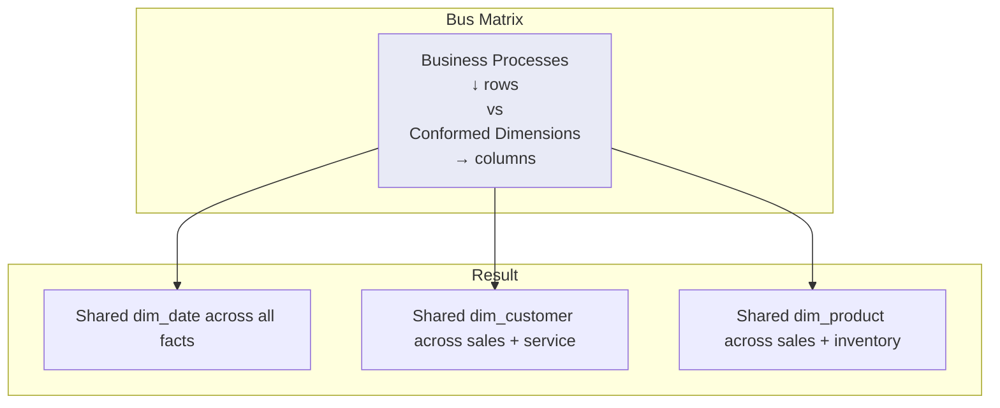
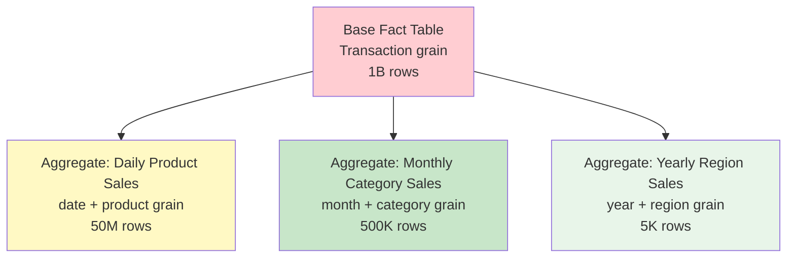

# Dimensional Modeling — Senior Deep Dive

## The Enterprise Data Warehouse Bus Matrix

The Bus Matrix is the strategic planning tool for dimensional DWH projects. It maps business processes to conformed dimensions.



| Business Process | dim_date | dim_customer | dim_product | dim_store | dim_employee |
|-----------------|:--------:|:------------:|:-----------:|:---------:|:------------:|
| Sales           | ✓ | ✓ | ✓ | ✓ | ✓ |
| Inventory       | ✓ |   | ✓ | ✓ |   |
| Customer Service| ✓ | ✓ |   |   | ✓ |
| HR/Payroll      | ✓ |   |   |   | ✓ |

**Strategic value:** Ensures consistency across star schemas. Drill-across queries work because shared dimensions have identical keys and grain.

## Late-Arriving Dimensions

Facts arrive before their dimension context (e.g., sale recorded before customer profile is loaded).

```sql
-- Step 1: Create an "inferred" dimension member (placeholder)
INSERT INTO dim_customer (customer_key, customer_id, customer_name, is_inferred)
VALUES (next_key, 'CUST-999', 'Unknown (Inferred)', TRUE);

-- Step 2: Fact references the inferred member
INSERT INTO fact_sales (date_key, customer_key, product_key, revenue)
VALUES (20240315, <inferred_key>, 501, 99.99);

-- Step 3: When real dimension data arrives later, UPDATE the inferred row
UPDATE dim_customer
SET customer_name = 'John Smith',
    email = 'john@example.com',
    city = 'Seattle',
    is_inferred = FALSE
WHERE customer_id = 'CUST-999' AND is_inferred = TRUE;
```

### Late-Arriving Facts

Facts that arrive after the dimension has already changed (SCD Type 2 complication):

```sql
-- Scenario: Sale happened on 2024-01-15, but data arrives on 2024-03-20
-- Customer moved from NY to CA on 2024-02-01 (SCD Type 2 created new row)
-- Which customer_key should the late fact use?

-- Answer: Look up the customer_key that was ACTIVE on the fact's date
SELECT customer_key
FROM dim_customer
WHERE customer_id = 'CUST-001'
  AND effective_start_date <= '2024-01-15'   -- Fact event date
  AND effective_end_date > '2024-01-15';     -- Must use the NY version!
```

## Aggregate Fact Tables

Pre-computed summaries for **query performance** on common access patterns.



```sql
-- Base fact: transaction grain (1 billion rows)
CREATE TABLE fact_sales (
    date_key INT, customer_key INT, product_key INT, store_key INT,
    quantity INT, revenue DECIMAL(12,2)
);

-- Aggregate: daily product sales (shrunken dimension)
CREATE TABLE fact_sales_daily_product (
    date_key       INT,
    product_key    INT,
    total_quantity INT,           -- SUM(quantity)
    total_revenue  DECIMAL(14,2), -- SUM(revenue)
    transaction_count INT,        -- COUNT(*)
    PRIMARY KEY (date_key, product_key)
);

-- Aggregate: monthly category sales (shrunken + rolled-up dimensions)
CREATE TABLE fact_sales_monthly_category (
    month_key      INT,            -- Shrunken dim_date to month grain
    category_key   INT,            -- Rolled-up dim_product to category level
    total_quantity INT,
    total_revenue  DECIMAL(14,2),
    avg_unit_price DECIMAL(10,2),  -- Pre-computed average
    PRIMARY KEY (month_key, category_key)
);
```

### Aggregate Navigation

BI tools use **aggregate awareness** to automatically route queries to the right aggregate:

```sql
-- Query: "Total revenue by product category for 2024"
-- Optimizer recognizes: can use fact_sales_monthly_category (500K rows)
-- instead of scanning fact_sales (1B rows) → 2000x faster!

-- If the tool doesn't support auto-navigation, use a UNION ALL view:
CREATE VIEW vw_sales_universal AS
SELECT date_key, product_key, quantity, revenue, 'base' AS agg_level
FROM fact_sales
UNION ALL
SELECT date_key, product_key, total_quantity, total_revenue, 'daily_product'
FROM fact_sales_daily_product;
```

## Heterogeneous Products (Variable-Depth Hierarchies)

Handling products with completely different attributes (e.g., insurance policies: auto vs. home vs. life).

```sql
-- Approach 1: Core + Extension tables
CREATE TABLE dim_product_core (
    product_key       INT PRIMARY KEY,
    product_id        VARCHAR(20),
    product_type      VARCHAR(20),    -- 'AUTO', 'HOME', 'LIFE'
    product_name      VARCHAR(200),
    effective_date    DATE
);

-- Type-specific extensions (only relevant attributes):
CREATE TABLE dim_product_auto (
    product_key       INT PRIMARY KEY REFERENCES dim_product_core,
    vehicle_type      VARCHAR(50),
    coverage_level    VARCHAR(20),
    deductible_amount DECIMAL(10,2)
);

CREATE TABLE dim_product_home (
    product_key       INT PRIMARY KEY REFERENCES dim_product_core,
    property_type     VARCHAR(50),
    coverage_amount   DECIMAL(12,2),
    flood_zone        BOOLEAN
);

-- Approach 2: "Supertype" with NULLable columns (simpler, worse for many types)
CREATE TABLE dim_product_flat (
    product_key       INT PRIMARY KEY,
    product_type      VARCHAR(20),
    product_name      VARCHAR(200),
    -- Auto-specific (NULL for non-auto):
    vehicle_type      VARCHAR(50),
    coverage_level    VARCHAR(20),
    -- Home-specific (NULL for non-home):
    property_type     VARCHAR(50),
    flood_zone        BOOLEAN
);
```

## Mini-Dimensions

Extract **frequently analyzed, rapidly changing attributes** into a separate small dimension.

```sql
-- Problem: dim_customer has 10M rows. Demographic attributes change often.
-- SCD Type 2 would create enormous history.

-- Solution: Mini-dimension for demographics
CREATE TABLE dim_customer_demographics (
    demo_key              INT PRIMARY KEY,
    age_band              VARCHAR(20),      -- '18-25', '26-35', '36-45'...
    income_band           VARCHAR(20),      -- 'low', 'medium', 'high', 'premium'
    education_level       VARCHAR(30),
    marital_status        VARCHAR(20),
    home_ownership        VARCHAR(20)
);
-- Only ~500 unique combinations! (small, fast table)

-- Fact references BOTH customer and demographics:
CREATE TABLE fact_sales (
    ...
    customer_key          INT,              -- Current customer (SCD Type 1)
    customer_demo_key     INT,              -- Demographics AT TIME OF SALE
    ...
);
-- Demographics captured at transaction time → no SCD Type 2 needed on customer!
```

## Kimball vs. Inmon Architecture


| Aspect | Kimball | Inmon |
|--------|---------|-------|
| Approach | Bottom-up (build marts first) | Top-down (build EDW first) |
| Central store | Conformed dimensions across stars | 3NF enterprise model |
| Time to value | Faster (one star at a time) | Slower (full model first) |
| Complexity | Lower | Higher |
| Scalability | Good (add stars) | Better (single source of truth) |
| Modern practice | Lakehouse / medallion | Data Vault + marts |

## Drill-Across Queries

Query multiple fact tables sharing conformed dimensions:

```sql
-- "Compare actual sales vs. sales quota by product and month"
-- fact_sales (transaction grain) + fact_sales_quota (monthly grain)

-- Must aggregate to common grain first:
WITH actual AS (
    SELECT d.month_key, p.product_key, SUM(f.revenue) AS actual_revenue
    FROM fact_sales f
    JOIN dim_date d ON f.date_key = d.date_key
    JOIN dim_product p ON f.product_key = p.product_key
    WHERE d.year = 2024
    GROUP BY d.month_key, p.product_key
),
quota AS (
    SELECT month_key, product_key, quota_amount
    FROM fact_sales_quota
    WHERE year = 2024
)
SELECT 
    a.month_key, a.product_key,
    a.actual_revenue,
    q.quota_amount,
    a.actual_revenue - q.quota_amount AS variance
FROM actual a
FULL OUTER JOIN quota q 
    ON a.month_key = q.month_key AND a.product_key = q.product_key;
```

## Interview Tips

> **Tip 1:** "How do you handle late-arriving dimensions?" — Insert an "inferred member" (placeholder with is_inferred=TRUE flag). Fact references the placeholder. When real data arrives, UPDATE the inferred row to fill in attributes. For SCD Type 2 + late-arriving facts: look up the dimension key that was effective on the fact's event date.

> **Tip 2:** "What is the Bus Matrix?" — A strategic planning tool that maps business processes (rows) to conformed dimensions (columns). Ensures cross-process consistency. Checkmarks show which dimensions participate in each process. It's the blueprint for the entire enterprise DWH.

> **Tip 3:** "Aggregate tables — when and how?" — When base fact is too large for common queries. Pre-compute at coarser grain (daily→monthly, product→category). Include transaction count for proper averaging. Use aggregate-aware BI tools or UNION ALL views for transparent routing. Always keep base fact as source of truth.
