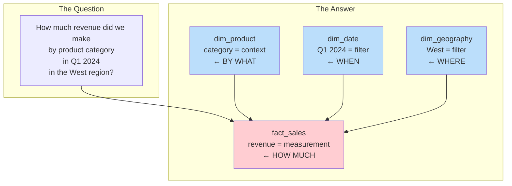
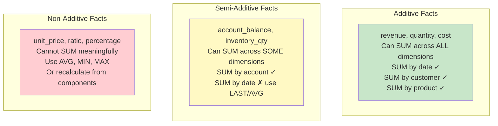
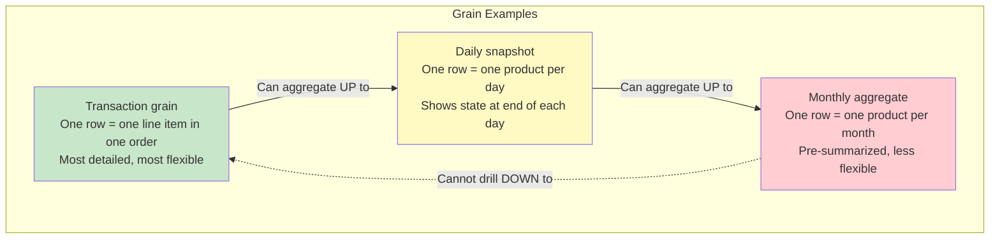

# Fact and Dimension Tables — Fundamentals

## The Core Concept

Every analytical data warehouse organizes data into two table types:

| | Fact Tables | Dimension Tables |
|--|-------------|-----------------|
| **Contains** | Measurements/metrics (numbers) | Descriptive context (text/attributes) |
| **Answers** | "How much?" "How many?" | "Who? What? When? Where? Why?" |
| **Rows** | Many (millions to billions) | Few (thousands to millions) |
| **Columns** | Few (FKs + measures) | Many (descriptive attributes) |
| **Changes** | Grows continuously (append) | Changes slowly (updates/inserts) |



## Fact Tables in Detail

### Anatomy of a Fact Table

```sql
CREATE TABLE fact_sales (
    -- Surrogate key (optional, useful for some tools):
    sale_key            BIGINT PRIMARY KEY,
    
    -- Foreign keys (point to dimensions — the "context"):
    date_key            INT NOT NULL,       -- → dim_date
    customer_key        INT NOT NULL,       -- → dim_customer
    product_key         INT NOT NULL,       -- → dim_product
    store_key           INT NOT NULL,       -- → dim_store
    
    -- Degenerate dimensions (identifiers with no table):
    order_number        VARCHAR(20),
    invoice_number      VARCHAR(20),
    
    -- Facts (measurements/metrics):
    quantity            INT,                -- Additive
    unit_price          DECIMAL(10,2),      -- Non-additive
    revenue             DECIMAL(12,2),      -- Additive
    cost                DECIMAL(10,2),      -- Additive
    discount_amount     DECIMAL(10,2)       -- Additive
);
```

### Fact Additivity



**Examples:**
```sql
-- Additive: SUM works across all dimensions
SELECT SUM(revenue) FROM fact_sales WHERE year = 2024;  -- ✓ Total annual revenue
SELECT SUM(revenue) FROM fact_sales GROUP BY customer;  -- ✓ Revenue per customer

-- Semi-additive: SUM works across some dimensions, NOT time
SELECT SUM(balance) FROM fact_account_snapshot 
WHERE date = CURRENT_DATE GROUP BY branch;               -- ✓ Total balance by branch today
-- But DON'T SUM balance across dates! (that's meaningless)

-- Non-additive: Can't SUM at all
SELECT AVG(unit_price) FROM fact_sales GROUP BY category; -- ✓ Average price per category
-- SUM(unit_price) is meaningless!
```

## Dimension Tables in Detail

### Anatomy of a Dimension Table

```sql
CREATE TABLE dim_customer (
    -- Surrogate key (DW-generated, integers for fast joins):
    customer_key        INT PRIMARY KEY,
    
    -- Natural key (from source system — for lookups during ETL):
    customer_id         VARCHAR(20) NOT NULL,
    
    -- Descriptive attributes (the "context"):
    first_name          VARCHAR(100),
    last_name           VARCHAR(100),
    full_name           VARCHAR(200),
    email               VARCHAR(200),
    phone               VARCHAR(50),
    
    -- Hierarchy levels (denormalized for star schema):
    city                VARCHAR(100),
    state               VARCHAR(50),
    country             VARCHAR(50),
    region              VARCHAR(50),
    
    -- Grouping/classification attributes:
    customer_segment    VARCHAR(20),     -- 'retail', 'wholesale', 'internal'
    loyalty_tier        VARCHAR(20),     -- 'bronze', 'silver', 'gold', 'platinum'
    acquisition_channel VARCHAR(50),     -- 'organic', 'paid', 'referral'
    
    -- SCD Type 2 metadata:
    effective_start     DATE,
    effective_end       DATE DEFAULT '9999-12-31',
    is_current          BOOLEAN DEFAULT TRUE,
    
    -- Audit:
    created_at          TIMESTAMP,
    updated_at          TIMESTAMP
);
```

### Dimension Best Practices

| Practice | Reason |
|----------|--------|
| Use surrogate INT keys | Faster joins than VARCHAR natural keys |
| Denormalize hierarchies | Avoid extra joins (city→state→country in one table) |
| Include "Unknown" member | Handle missing dimension references (key = -1 or 0) |
| Make attributes verbose | "Electronics > Computers > Laptops" not "E-C-L" |
| Add flags/indicators | is_active, is_premium — enables easy filtering |

## The Date Dimension

Every data warehouse needs a date dimension. It's pre-built for the entire date range.

```sql
CREATE TABLE dim_date (
    date_key            INT PRIMARY KEY,      -- YYYYMMDD (20240315)
    full_date           DATE UNIQUE,
    -- Standard calendar:
    day_of_week         INT,                  -- 1=Monday ... 7=Sunday
    day_name            VARCHAR(10),          -- 'Monday', 'Tuesday'...
    day_of_month        INT,                  -- 1-31
    day_of_year         INT,                  -- 1-366
    week_of_year        INT,                  -- 1-53
    month_number        INT,                  -- 1-12
    month_name          VARCHAR(15),          -- 'January', 'February'...
    quarter             INT,                  -- 1-4
    year                INT,                  -- 2024
    -- Business calendar:
    fiscal_year         INT,
    fiscal_quarter      INT,
    fiscal_month        INT,
    -- Flags:
    is_weekend          BOOLEAN,
    is_holiday          BOOLEAN,
    is_business_day     BOOLEAN,
    holiday_name        VARCHAR(50),          -- 'Christmas', NULL if not holiday
    -- Relative flags (updated daily or calculated):
    is_current_month    BOOLEAN,
    is_ytd              BOOLEAN
);

-- Pre-populate for 20 years (enough for any query):
-- 365 × 20 = 7,300 rows — trivially small!
```

## Connecting Facts to Dimensions

```sql
-- The star schema query pattern:
SELECT 
    d.month_name,                         -- From dim_date
    c.customer_segment,                   -- From dim_customer
    p.category,                           -- From dim_product
    SUM(f.revenue) AS total_revenue,      -- From fact_sales
    COUNT(*) AS transaction_count         -- From fact_sales
FROM fact_sales f
-- Join each dimension:
JOIN dim_date d ON f.date_key = d.date_key
JOIN dim_customer c ON f.customer_key = c.customer_key
JOIN dim_product p ON f.product_key = p.product_key
-- Filter using dimension attributes:
WHERE d.year = 2024
  AND c.customer_segment = 'retail'
-- Group by dimension attributes:
GROUP BY d.month_name, c.customer_segment, p.category
ORDER BY total_revenue DESC;
```

## Grain — The Most Important Decision

**Grain = what one row in the fact table represents.**



**Rule:** Start with the finest grain possible. You can always aggregate up, but you can never drill down below your stored grain.

## Interview Tips

> **Tip 1:** "What is the difference between fact and dimension tables?" — Fact tables store quantitative measurements (revenue, quantity — the numbers you aggregate). Dimension tables store descriptive context (customer name, product category — how you slice and filter). Facts are tall and narrow; dimensions are short and wide.

> **Tip 2:** "What is grain and why does it matter?" — Grain is what one row represents. It's the most important decision because it determines what questions you can answer. If grain = "one row per order" you can't see individual products. If grain = "one row per product per order" you can analyze at both levels. Always choose the finest grain your source data supports.

> **Tip 3:** "Why use surrogate keys instead of natural keys?" — (1) Performance: INT joins are faster than VARCHAR. (2) Stability: source systems may change/reuse natural keys. (3) SCD Type 2: same natural key needs multiple surrogate keys to track history. (4) Integration: different sources use different natural keys for the same entity.
