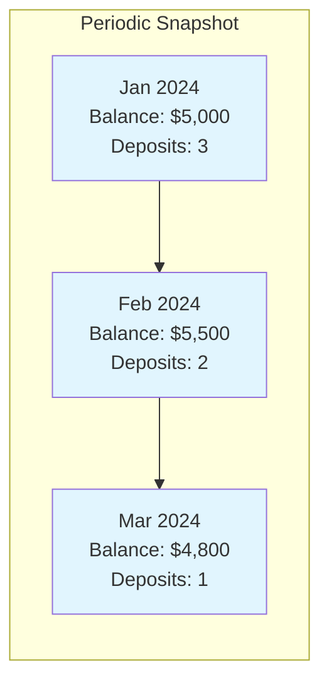
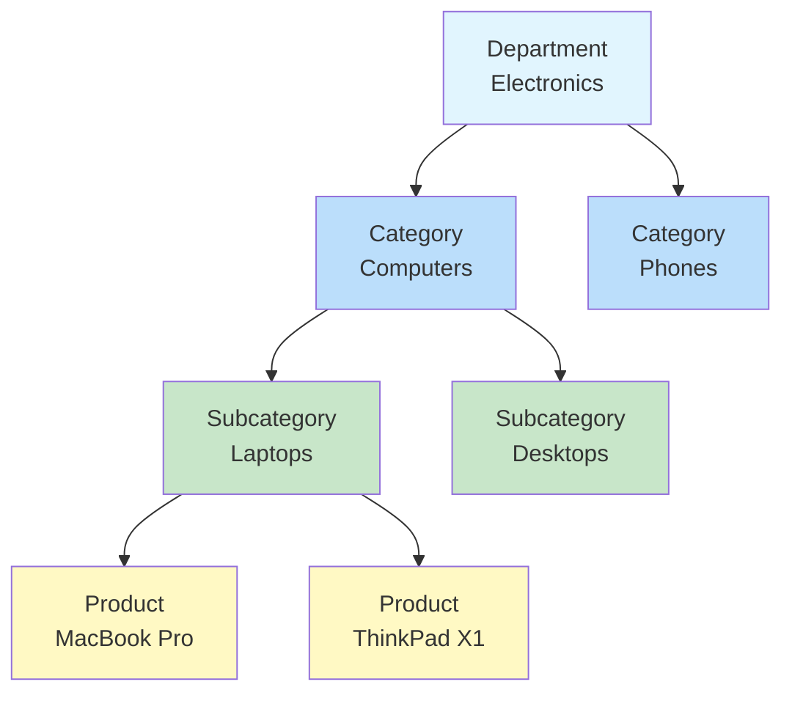

# Fact and Dimension Tables — Intermediate Concepts

## Three Types of Fact Tables (Deep Dive)

### 1. Transaction Fact Table

Records individual events at the finest grain. Grows continuously.

```sql
-- Each row = one purchase event
CREATE TABLE fact_purchases (
    purchase_key      BIGINT PRIMARY KEY,
    date_key          INT,
    time_key          INT,          -- For intraday granularity
    customer_key      INT,
    product_key       INT,
    store_key         INT,
    promotion_key     INT,
    -- Transaction ID (degenerate dimension):
    receipt_number    VARCHAR(20),
    -- Measures:
    quantity          INT,
    unit_price        DECIMAL(10,2),
    net_amount        DECIMAL(12,2),
    tax_amount        DECIMAL(10,2),
    total_amount      DECIMAL(12,2)
);

-- Characteristics:
-- ✓ One row per event occurrence
-- ✓ Grows unbounded (new rows every day)
-- ✓ Most flexible for analysis (finest grain)
-- ✗ Large — may need aggregates for performance
```

### 2. Periodic Snapshot Fact Table

Captures the state of a process at regular intervals.

```sql
-- Each row = one account's balance at end of month
CREATE TABLE fact_account_monthly (
    month_key         INT,
    account_key       INT,
    branch_key        INT,
    -- Snapshot facts (semi-additive!):
    balance           DECIMAL(14,2),    -- Balance at month end
    available_credit  DECIMAL(14,2),
    -- Period activity (additive):
    deposits_count    INT,
    deposits_amount   DECIMAL(14,2),
    withdrawals_count INT,
    withdrawals_amount DECIMAL(14,2),
    fees_charged      DECIMAL(10,2),
    interest_earned   DECIMAL(10,2),
    PRIMARY KEY (month_key, account_key)
);

-- Characteristics:
-- ✓ Predictable size (accounts × periods)
-- ✓ Shows trends over time (month-over-month)
-- ✓ Combines snapshot + activity measures
-- ✗ Loses intra-period detail (individual transactions)
```



### 3. Accumulating Snapshot Fact Table

Tracks a process with defined milestones. Rows are **updated** as milestones complete.

```sql
-- Each row = one order's lifecycle (updated over time!)
CREATE TABLE fact_order_lifecycle (
    order_key               INT PRIMARY KEY,
    order_number            VARCHAR(20),
    customer_key            INT,
    product_key             INT,
    -- Milestone date keys (NULL until reached):
    order_placed_date_key   INT NOT NULL,
    payment_received_date_key INT,
    picked_date_key         INT,
    shipped_date_key        INT,
    delivered_date_key      INT,
    returned_date_key       INT,
    -- Measures:
    order_amount            DECIMAL(12,2),
    -- Lag metrics (computed when milestone reached):
    days_to_payment         INT,         -- placed → paid
    days_to_ship            INT,         -- placed → shipped
    days_to_deliver         INT,         -- placed → delivered
    -- Current state:
    current_status          VARCHAR(20)  -- 'placed','paid','shipped','delivered','returned'
);

-- Characteristics:
-- ✓ Shows end-to-end process performance
-- ✓ Lag metrics reveal bottlenecks
-- ✓ Fixed final size (one row per process instance)
-- ✗ Requires UPDATES (unusual for fact tables!)
-- ✗ NULL date keys until milestones reached
```


## Conformed Dimensions

Dimensions shared across multiple fact tables with **identical structure and content**.

```sql
-- dim_date is used by EVERY fact table in the warehouse:
-- fact_sales.date_key         → dim_date.date_key
-- fact_inventory.date_key     → dim_date.date_key
-- fact_shipping.date_key      → dim_date.date_key
-- fact_hr_attendance.date_key → dim_date.date_key

-- dim_customer is used across marketing AND sales:
-- fact_sales.customer_key     → dim_customer.customer_key
-- fact_campaigns.customer_key → dim_customer.customer_key
-- fact_support.customer_key   → dim_customer.customer_key

-- BENEFIT: Query across fact tables consistently!
SELECT 
    d.month_name,
    SUM(s.revenue) AS sales_revenue,
    SUM(c.campaign_cost) AS marketing_spend
FROM dim_date d
JOIN fact_sales s ON s.date_key = d.date_key
JOIN fact_campaigns c ON c.date_key = d.date_key
WHERE d.year = 2024
GROUP BY d.month_name;
-- Works because both facts use the SAME dim_date!
```

## Dimension Hierarchies

Attributes in a dimension often form a hierarchy (drill-down path).

```sql
-- Product hierarchy (denormalized in star schema):
CREATE TABLE dim_product (
    product_key       INT PRIMARY KEY,
    product_name      VARCHAR(200),    -- Leaf level
    brand             VARCHAR(100),    -- Level 2
    subcategory       VARCHAR(100),    -- Level 3
    category          VARCHAR(100),    -- Level 4
    department        VARCHAR(100)     -- Top level
);

-- Queries can aggregate at any level:
-- SELECT department, SUM(revenue) ...       → Top level
-- SELECT category, SUM(revenue) ...         → Level 4
-- SELECT product_name, SUM(revenue) ...     → Leaf level
```



## Handling NULLs in Dimensions

Never use NULL foreign keys in fact tables — always reference a special "Unknown" dimension member.

```sql
-- Add a default "Unknown" row to every dimension:
INSERT INTO dim_customer (customer_key, customer_id, full_name, city)
VALUES (0, 'UNKNOWN', 'Unknown Customer', 'Unknown');

INSERT INTO dim_product (product_key, product_id, product_name, category)
VALUES (0, 'UNKNOWN', 'Unknown Product', 'Unknown');

-- In ETL, if customer is not found, use key=0 instead of NULL:
INSERT INTO fact_sales (date_key, customer_key, product_key, revenue)
SELECT 
    date_key,
    COALESCE(dc.customer_key, 0) AS customer_key,  -- Never NULL!
    COALESCE(dp.product_key, 0) AS product_key,
    stg.revenue
FROM staging stg
LEFT JOIN dim_customer dc ON stg.customer_id = dc.customer_id
LEFT JOIN dim_product dp ON stg.product_id = dp.product_id;
```

**Why not NULL?**
- `GROUP BY customer_key` won't exclude unknowns (NULLs might be dropped by some tools)
- FK constraints remain valid (0 exists in dimension)
- BI tools can display "Unknown" label instead of blank

## Slowly Changing Dimension Strategies (Summary)

| Type | Approach | History | Use Case |
|------|----------|---------|----------|
| Type 0 | Never change | Original only | Date dimension |
| Type 1 | Overwrite | None | Corrections, non-analytical attrs |
| Type 2 | New row | Full | Most dimension changes in DW |
| Type 3 | New column | One prior value | Current + previous only |
| Type 4 | Mini-dimension | Separate table | Rapidly changing attributes |
| Type 6 | Hybrid 1+2+3 | Full + current flag | Need both historical and current |

## Factless Fact Tables

Records events or relationships with **no numeric measures** — the row's existence IS the fact.

```sql
-- Student attendance (event tracking):
CREATE TABLE fact_class_attendance (
    date_key          INT,
    student_key       INT,
    class_key         INT,
    instructor_key    INT,
    room_key          INT
    -- NO measures! The row means "student was present"
);

-- Useful query: "Who was ABSENT?"
SELECT s.student_name
FROM dim_student s
CROSS JOIN dim_class c
LEFT JOIN fact_class_attendance f 
    ON f.student_key = s.student_key 
    AND f.class_key = c.class_key 
    AND f.date_key = 20240315
WHERE c.class_name = 'Data Engineering 101'
  AND f.student_key IS NULL;  -- Absent = no row!
```

## Interview Tips

> **Tip 1:** "When do you use each fact table type?" — Transaction: for individual events (sales, clicks, log entries). Periodic snapshot: when you need state at regular intervals (monthly balance, daily inventory). Accumulating snapshot: when tracking a process with milestones (order lifecycle, loan application stages). Each serves a different analytical need.

> **Tip 2:** "What are conformed dimensions and why do they matter?" — Shared dimensions used identically across multiple fact tables. They enable drill-across queries (compare sales and marketing in the same report using the same date and customer definitions). Without conformance, you can't cross-reference different business processes.

> **Tip 3:** "How do you handle missing dimension values in fact tables?" — Never use NULL foreign keys. Create a "key=0, Unknown" row in every dimension. ETL uses COALESCE to default to the unknown key. This ensures referential integrity, consistent aggregations, and meaningful labels in reports.
