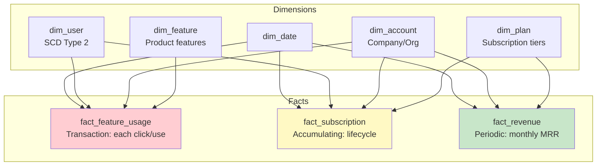

# Fact and Dimension Tables — Real-World Production Examples

## Example 1: SaaS Product Analytics

Complete star schema for a B2B SaaS platform tracking feature usage, subscriptions, and revenue.



```sql
-- ═══════════════════════════════════════
-- DIMENSION: Account (company-level)
-- ═══════════════════════════════════════
CREATE TABLE dim_account (
    account_key         INT PRIMARY KEY,
    account_id          VARCHAR(20),
    company_name        VARCHAR(200),
    industry            VARCHAR(100),
    company_size        VARCHAR(20),     -- 'startup', 'smb', 'enterprise'
    country             VARCHAR(50),
    region              VARCHAR(50),
    signup_date         DATE,
    account_manager     VARCHAR(200),
    is_active           BOOLEAN,
    effective_start     DATE,
    effective_end       DATE DEFAULT '9999-12-31',
    is_current          BOOLEAN DEFAULT TRUE
);

-- ═══════════════════════════════════════
-- FACT: Feature Usage (transaction grain)
-- ═══════════════════════════════════════
CREATE TABLE fact_feature_usage (
    usage_key           BIGINT PRIMARY KEY,
    date_key            INT NOT NULL,
    hour_of_day         INT,                -- 0-23
    user_key            INT NOT NULL,
    account_key         INT NOT NULL,
    feature_key         INT NOT NULL,
    -- Measures:
    usage_count         INT DEFAULT 1,      -- Times used in this event
    duration_seconds    INT,                -- How long feature was used
    api_calls           INT,                -- API calls generated
    data_processed_mb   DECIMAL(10,2)       -- Data processed
);

-- ═══════════════════════════════════════
-- FACT: Subscription Lifecycle (accumulating snapshot)
-- ═══════════════════════════════════════
CREATE TABLE fact_subscription (
    subscription_key        INT PRIMARY KEY,
    account_key             INT NOT NULL,
    user_key                INT,             -- Primary user
    plan_key                INT NOT NULL,
    -- Milestone dates:
    trial_start_date_key    INT NOT NULL,
    trial_end_date_key      INT,
    conversion_date_key     INT,             -- NULL if never converted
    upgrade_date_key        INT,             -- NULL if never upgraded
    downgrade_date_key      INT,
    churn_date_key          INT,             -- NULL if still active
    -- Measures:
    monthly_amount          DECIMAL(10,2),
    annual_contract_value   DECIMAL(12,2),
    -- Lifecycle metrics:
    days_trial_to_convert   INT,
    months_active           INT,
    lifetime_value          DECIMAL(12,2),
    -- Status:
    current_status          VARCHAR(20)      -- 'trial','active','churned','paused'
);

-- ═══════════════════════════════════════
-- FACT: Monthly Recurring Revenue (periodic snapshot)
-- ═══════════════════════════════════════
CREATE TABLE fact_mrr_monthly (
    month_key               INT,
    account_key             INT,
    plan_key                INT,
    -- Revenue metrics (semi-additive across accounts, not time):
    mrr                     DECIMAL(10,2),   -- Current MRR
    arr                     DECIMAL(12,2),   -- Annual run rate
    -- Movement analysis:
    new_mrr                 DECIMAL(10,2),   -- From new customers
    expansion_mrr           DECIMAL(10,2),   -- Upgrades
    contraction_mrr         DECIMAL(10,2),   -- Downgrades (negative)
    churn_mrr               DECIMAL(10,2),   -- Lost (negative)
    net_new_mrr             DECIMAL(10,2),   -- Sum of movements
    -- Counts:
    active_users            INT,
    seats_used              INT,
    PRIMARY KEY (month_key, account_key)
);
```

---

## Example 2: dbt Implementation (Incremental Fact Loading)

```sql
-- models/marts/core/fact_feature_usage.sql
{{ config(
    materialized='incremental',
    unique_key='usage_key',
    incremental_strategy='merge',
    partition_by={'field': 'event_date', 'data_type': 'date'},
    cluster_by=['account_key', 'feature_key']
) }}

WITH events AS (
    SELECT * FROM {{ ref('stg_product_events') }}
    
    WHERE event_timestamp > (SELECT MAX(event_timestamp) FROM {{ this }})
    
),

enriched AS (
    SELECT
        {{ dbt_utils.generate_surrogate_key(['e.event_id']) }} AS usage_key,
        dd.date_key,
        EXTRACT(HOUR FROM e.event_timestamp)                    AS hour_of_day,
        du.user_key,
        da.account_key,
        df.feature_key,
        e.usage_count,
        e.duration_seconds,
        e.api_calls,
        e.data_processed_mb,
        e.event_timestamp,
        e.event_timestamp::DATE                                 AS event_date
    FROM events e
    JOIN {{ ref('dim_date') }} dd ON e.event_timestamp::DATE = dd.full_date
    JOIN {{ ref('dim_user') }} du 
        ON e.user_id = du.user_id
        AND e.event_timestamp::DATE BETWEEN du.effective_start AND du.effective_end
    JOIN {{ ref('dim_account') }} da 
        ON e.account_id = da.account_id AND da.is_current = TRUE
    JOIN {{ ref('dim_feature') }} df 
        ON e.feature_name = df.feature_name
)

SELECT * FROM enriched
```

```sql
-- models/marts/core/dim_account.sql (SCD Type 2 via dbt snapshot)
-- snapshots/snap_accounts.sql

{{ config(
    target_schema='snapshots',
    unique_key='account_id',
    strategy='check',
    check_cols=['company_name', 'industry', 'company_size', 'plan_tier', 'is_active']
) }}

SELECT * FROM {{ source('app_db', 'accounts') }}



-- Then in dim_account model:
-- models/marts/core/dim_account.sql
{{ config(materialized='table') }}

SELECT
    {{ dbt_utils.generate_surrogate_key(['account_id', 'dbt_valid_from']) }} AS account_key,
    account_id,
    company_name,
    industry,
    company_size,
    country,
    signup_date,
    is_active,
    dbt_valid_from AS effective_start,
    COALESCE(dbt_valid_to, '9999-12-31'::DATE) AS effective_end,
    CASE WHEN dbt_valid_to IS NULL THEN TRUE ELSE FALSE END AS is_current
FROM {{ ref('snap_accounts') }}
```

---

## Example 3: Telecommunications — Multi-Fact Warehouse

```sql
-- ═══════════════════════════════════════
-- Complex model: CDR (Call Detail Records) warehouse
-- ═══════════════════════════════════════

-- Transaction fact: every call/SMS/data session
CREATE TABLE fact_usage (
    usage_key           BIGINT PRIMARY KEY,
    date_key            INT,
    time_key            INT,
    subscriber_key      INT,
    called_number_key   INT,            -- Who was called
    cell_tower_key      INT,            -- Location
    service_type        VARCHAR(10),    -- 'voice', 'sms', 'data'
    -- Voice measures:
    call_duration_sec   INT,
    -- SMS measures:
    message_count       INT,
    -- Data measures:
    data_usage_mb       DECIMAL(10,2),
    -- Common:
    charge_amount       DECIMAL(8,4),
    is_roaming          BOOLEAN,
    network_type        VARCHAR(5)      -- '4G', '5G'
);
-- ~5B rows/month for a national carrier!

-- Periodic snapshot: daily subscriber state
CREATE TABLE fact_subscriber_daily (
    date_key            INT,
    subscriber_key      INT,
    plan_key            INT,
    -- Balance (semi-additive):
    prepaid_balance     DECIMAL(10,2),
    data_remaining_gb   DECIMAL(8,2),
    -- Daily activity (additive):
    calls_made          INT,
    sms_sent            INT,
    data_used_mb        DECIMAL(10,2),
    total_charges       DECIMAL(10,2),
    -- Status:
    is_active           BOOLEAN,
    days_since_recharge INT,
    PRIMARY KEY (date_key, subscriber_key)
);

-- Revenue fact: monthly billing
CREATE TABLE fact_billing_monthly (
    month_key           INT,
    subscriber_key      INT,
    plan_key            INT,
    -- Revenue components:
    plan_fee            DECIMAL(10,2),
    usage_charges       DECIMAL(10,2),
    roaming_charges     DECIMAL(10,2),
    taxes               DECIMAL(10,2),
    total_bill          DECIMAL(10,2),
    -- Payment:
    amount_paid         DECIMAL(10,2),
    payment_date_key    INT,
    outstanding_balance DECIMAL(10,2),
    PRIMARY KEY (month_key, subscriber_key)
);
```

---

## Example 4: Fact Table Testing Strategy

```sql
-- ═══════════════════════════════════════
-- dbt tests for fact table quality
-- ═══════════════════════════════════════

-- schema.yml
-- models:
--   - name: fact_sales
--     tests:
--       - dbt_utils.recency:
--           datepart: day
--           field: event_date
--           interval: 1
--     columns:
--       - name: sale_key
--         tests:
--           - unique
--           - not_null
--       - name: customer_key
--         tests:
--           - not_null
--           - relationships:
--               to: ref('dim_customer')
--               field: customer_key
--       - name: revenue
--         tests:
--           - not_null
--           - dbt_utils.accepted_range:
--               min_value: 0
--               max_value: 100000

-- Custom test: verify fact-dimension referential integrity
-- tests/assert_no_orphan_keys.sql
SELECT f.customer_key, COUNT(*)
FROM {{ ref('fact_sales') }} f
LEFT JOIN {{ ref('dim_customer') }} d ON f.customer_key = d.customer_key
WHERE d.customer_key IS NULL
GROUP BY f.customer_key
HAVING COUNT(*) > 0;
-- Fails if ANY fact row has no matching dimension

-- Custom test: verify grain (no duplicates at declared grain)
-- tests/assert_fact_grain.sql
SELECT date_key, customer_key, product_key, order_number, COUNT(*)
FROM {{ ref('fact_sales') }}
GROUP BY date_key, customer_key, product_key, order_number
HAVING COUNT(*) > 1;
-- Fails if grain is violated
```

---

## Interview Tips

> **Tip 1:** "Design a data model for a SaaS company" — Three fact tables: (1) Feature usage (transaction grain: each user action), (2) Subscription lifecycle (accumulating snapshot: trial→convert→churn milestones), (3) MRR (periodic monthly: revenue movements — new, expansion, churn). Conformed dimensions: date, user (SCD2), account, plan, feature.

> **Tip 2:** "How do you load fact tables incrementally in production?" — dbt incremental model: filter staging to rows newer than `MAX(timestamp) FROM {{ this }}`. MERGE/INSERT for idempotency. Partition by date for efficient pruning. Cluster by commonly-joined dimension keys. Run dbt tests after each load (unique key, referential integrity, recency, value ranges).

> **Tip 3:** "How do you test fact and dimension tables?" — (1) Grain test: no duplicates at declared grain. (2) Referential integrity: every FK exists in its dimension. (3) Recency: latest data is within expected freshness. (4) Value ranges: revenue > 0, quantity > 0, no unreasonable values. (5) Row count: within expected bounds vs. prior loads. (6) Completeness: no unexpected NULLs in required columns.
