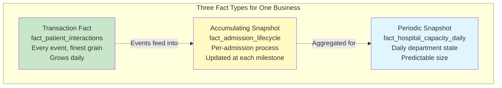
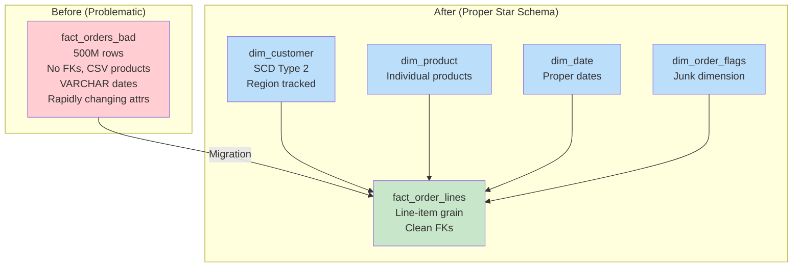

# Scenario Questions — Fact and Dimension Tables

<article data-difficulty="junior">

## 🟢 Junior: Identify Facts and Dimensions

**Scenario:** A food delivery app wants to analyze its orders. Source data includes: `order_id`, `order_timestamp`, `customer_name`, `customer_address`, `restaurant_name`, `restaurant_cuisine`, `restaurant_rating`, `driver_name`, `driver_vehicle_type`, `item_name`, `item_price`, `quantity`, `delivery_fee`, `tip_amount`, `delivery_time_minutes`, `distance_km`. Design the fact and dimension tables, specifying which columns are facts (measures) and which are dimensions (context). Declare the grain.

<details>
<summary>💡 Hint</summary>
Ask: "What numbers do I want to SUM/AVG/COUNT?" → Those are facts. "What do I want to GROUP BY/FILTER?" → Those are dimensions. The grain should be the most granular level: one item per order.
</details>

<details>
<summary>✅ Solution</summary>

```sql
-- GRAIN: One row per item per order (line-item level)

-- ═══════════════════════════════════════
-- DIMENSIONS (descriptive context)
-- ═══════════════════════════════════════

CREATE TABLE dim_date (
    date_key            INT PRIMARY KEY,    -- 20240315
    full_date           DATE,
    day_name            VARCHAR(10),
    month_name          VARCHAR(15),
    quarter             INT,
    year                INT,
    is_weekend          BOOLEAN,
    is_holiday          BOOLEAN
);

CREATE TABLE dim_customer (
    customer_key        INT PRIMARY KEY,
    customer_id         VARCHAR(20),
    customer_name       VARCHAR(200),
    address             VARCHAR(500),
    city                VARCHAR(100),
    neighborhood        VARCHAR(100)
);

CREATE TABLE dim_restaurant (
    restaurant_key      INT PRIMARY KEY,
    restaurant_id       VARCHAR(20),
    restaurant_name     VARCHAR(200),
    cuisine_type        VARCHAR(50),       -- 'Italian', 'Mexican', 'Asian'
    rating              DECIMAL(2,1),      -- 4.5 (non-additive, stored in dim!)
    price_range         VARCHAR(10)        -- '$', '$$', '$$$'
);

CREATE TABLE dim_driver (
    driver_key          INT PRIMARY KEY,
    driver_id           VARCHAR(20),
    driver_name         VARCHAR(200),
    vehicle_type        VARCHAR(50)        -- 'bicycle', 'car', 'scooter'
);

CREATE TABLE dim_menu_item (
    item_key            INT PRIMARY KEY,
    item_id             VARCHAR(20),
    item_name           VARCHAR(200),
    item_category       VARCHAR(50)        -- 'main', 'side', 'drink', 'dessert'
);

-- ═══════════════════════════════════════
-- FACT TABLE (measurements)
-- ═══════════════════════════════════════

CREATE TABLE fact_delivery_orders (
    order_item_key      BIGINT PRIMARY KEY,
    -- Degenerate dimension:
    order_id            VARCHAR(20),
    -- Foreign keys:
    date_key            INT REFERENCES dim_date,
    customer_key        INT REFERENCES dim_customer,
    restaurant_key      INT REFERENCES dim_restaurant,
    driver_key          INT REFERENCES dim_driver,
    item_key            INT REFERENCES dim_menu_item,
    -- Time dimension (could be separate dim or just stored):
    order_hour          INT,               -- 0-23
    -- FACTS (measurements):
    quantity            INT,               -- Additive
    item_price          DECIMAL(8,2),      -- Non-additive (per unit)
    line_total          DECIMAL(10,2),     -- Additive (qty × price)
    delivery_fee        DECIMAL(6,2),      -- Additive (per order, repeated on each item)
    tip_amount          DECIMAL(6,2),      -- Additive (per order, repeated)
    delivery_time_min   INT,               -- Non-additive (per order)
    distance_km         DECIMAL(6,2)       -- Non-additive (per order)
);
```

**Classification of each original column:**

| Column | Type | Why |
|--------|------|-----|
| order_id | Degenerate dimension | Groups items, no descriptive table needed |
| order_timestamp | Dimension (date_key + order_hour) | WHEN — used for filtering/grouping |
| customer_name, address | Dimension (dim_customer) | WHO ordered |
| restaurant_name, cuisine, rating | Dimension (dim_restaurant) | WHERE from |
| driver_name, vehicle_type | Dimension (dim_driver) | WHO delivered |
| item_name | Dimension (dim_menu_item) | WHAT was ordered |
| quantity | **Fact** (additive) | How many items |
| item_price | **Fact** (non-additive) | Per-unit price |
| delivery_fee | **Fact** (additive at order level) | How much delivery cost |
| tip_amount | **Fact** (additive at order level) | How much tipped |
| delivery_time_minutes | **Fact** (non-additive) | Performance metric |
| distance_km | **Fact** (non-additive) | Operational metric |

**Key Points:**
- `restaurant_rating` goes in the DIMENSION (it's a descriptive attribute, not something you SUM)
- `delivery_fee` and `tip_amount` are order-level facts — they repeat on each line item (alternative: create a separate fact_delivery_header)
- Grain is clearly declared: **one row per item per order**
- All dimensions get surrogate INT keys for fast joins

</details>

</article>

<article data-difficulty="mid-level">

## 🟡 Mid-Level: Choosing the Right Fact Table Type

**Scenario:** A hospital wants to track patient admissions through their entire journey: admission → triage → treatment → discharge → billing → payment. They need three views: (1) Individual event tracking (every nurse/doctor interaction), (2) End-to-end process performance (time at each stage), (3) Monthly capacity reporting (beds occupied, admissions/discharges counts). Design the appropriate fact table type for each need and explain why.

<details>
<summary>💡 Hint</summary>
Map each need to a fact type: (1) Individual events → transaction fact. (2) Process with milestones → accumulating snapshot. (3) Monthly metrics → periodic snapshot. Each captures different aspects of the same business process.
</details>

<details>
<summary>✅ Solution</summary>

```sql
-- ═══════════════════════════════════════════════════
-- NEED 1: Individual Event Tracking → TRANSACTION FACT
-- ═══════════════════════════════════════════════════
-- WHY: Each interaction is a discrete event. Grows continuously.
-- Analysts need: count of interactions, duration, by provider type

CREATE TABLE fact_patient_interactions (
    interaction_key       BIGINT PRIMARY KEY,
    -- Dimensions:
    date_key              INT NOT NULL,
    time_key              INT NOT NULL,         -- Specific time matters in hospital!
    patient_key           INT NOT NULL,
    provider_key          INT NOT NULL,         -- Doctor/nurse who interacted
    department_key        INT NOT NULL,
    interaction_type_key  INT NOT NULL,         -- 'vitals', 'medication', 'exam', 'procedure'
    -- Degenerate dimension:
    admission_id          VARCHAR(20),          -- Groups events to same admission
    -- Facts:
    duration_minutes      INT,                  -- How long interaction lasted
    interaction_count     INT DEFAULT 1,        -- Always 1 (for easy counting)
    medication_dose_mg    DECIMAL(8,2),         -- NULL if not medication event
    pain_score            INT                   -- 1-10, NULL if not assessed
);

-- Query: "Average interactions per patient per day by department"
SELECT dept.department_name, 
       AVG(daily_interactions) AS avg_interactions_per_patient
FROM (
    SELECT date_key, patient_key, department_key, 
           COUNT(*) AS daily_interactions
    FROM fact_patient_interactions
    GROUP BY date_key, patient_key, department_key
) sub
JOIN dim_department dept ON sub.department_key = dept.department_key
GROUP BY dept.department_name;

-- ═══════════════════════════════════════════════════
-- NEED 2: Process Performance → ACCUMULATING SNAPSHOT
-- ═══════════════════════════════════════════════════
-- WHY: Fixed lifecycle with defined milestones. Row gets UPDATED
-- as patient moves through stages. Shows bottlenecks.

CREATE TABLE fact_admission_lifecycle (
    admission_key              INT PRIMARY KEY,
    admission_id               VARCHAR(20),
    patient_key                INT NOT NULL,
    admitting_provider_key     INT,
    department_key             INT,
    diagnosis_key              INT,
    -- Milestone date keys (NULL until reached):
    admission_date_key         INT NOT NULL,
    triage_complete_date_key   INT,
    treatment_start_date_key   INT,
    treatment_end_date_key     INT,
    discharge_date_key         INT,
    billing_sent_date_key      INT,
    payment_received_date_key  INT,
    -- Lag metrics (calculated as each milestone completes):
    hours_admission_to_triage  DECIMAL(6,1),
    hours_triage_to_treatment  DECIMAL(6,1),
    hours_in_treatment         DECIMAL(6,1),
    hours_treatment_to_discharge DECIMAL(6,1),
    days_discharge_to_billing  INT,
    days_billing_to_payment    INT,
    total_hours_in_hospital    DECIMAL(8,1),
    -- Status:
    current_stage              VARCHAR(20),
    -- Financial:
    total_charges              DECIMAL(12,2),
    amount_paid                DECIMAL(12,2)
);

-- Query: "Average time at each stage, identify bottlenecks"
SELECT 
    AVG(hours_admission_to_triage)   AS avg_wait_triage,
    AVG(hours_triage_to_treatment)   AS avg_wait_treatment,
    AVG(hours_in_treatment)          AS avg_treatment_time,
    AVG(total_hours_in_hospital)     AS avg_total_stay,
    -- Bottleneck identification:
    CASE 
        WHEN AVG(hours_admission_to_triage) > 2 THEN 'Triage understaffed'
        WHEN AVG(hours_triage_to_treatment) > 4 THEN 'Treatment capacity issue'
        ELSE 'Within SLA'
    END AS bottleneck_assessment
FROM fact_admission_lifecycle
WHERE admission_date_key BETWEEN 20240301 AND 20240331;

-- ═══════════════════════════════════════════════════
-- NEED 3: Monthly Capacity → PERIODIC SNAPSHOT
-- ═══════════════════════════════════════════════════
-- WHY: Regular interval snapshots of facility state.
-- Semi-additive measures (can't sum beds occupied across months).

CREATE TABLE fact_hospital_capacity_daily (
    date_key                INT,
    department_key          INT,
    -- Snapshot measures (semi-additive — don't SUM across dates!):
    beds_total              INT,
    beds_occupied           INT,
    beds_available          INT,
    occupancy_rate_pct      DECIMAL(5,2),       -- Non-additive (ratio)
    patients_waiting        INT,                -- In queue for this dept
    -- Period activity (additive — CAN sum within a month):
    admissions_today        INT,
    discharges_today        INT,
    transfers_in_today      INT,
    transfers_out_today     INT,
    -- Staffing:
    nurses_on_shift         INT,
    doctors_on_shift        INT,
    patient_to_nurse_ratio  DECIMAL(4,1),       -- Non-additive
    PRIMARY KEY (date_key, department_key)
);

-- Query: "Monthly capacity utilization trend"
SELECT 
    dd.month_name,
    dept.department_name,
    AVG(f.occupancy_rate_pct)    AS avg_occupancy,    -- AVG not SUM!
    MAX(f.occupancy_rate_pct)    AS peak_occupancy,
    SUM(f.admissions_today)      AS total_admissions,  -- SUM is OK for activity
    SUM(f.discharges_today)      AS total_discharges
FROM fact_hospital_capacity_daily f
JOIN dim_date dd ON f.date_key = dd.date_key
JOIN dim_department dept ON f.department_key = dept.department_key
WHERE dd.year = 2024
GROUP BY dd.month_name, dept.department_name;
```



**Key Points:**
- **Transaction**: Use for individual events (nurse interactions, vital signs, medication doses). Finest grain, most flexible, largest table.
- **Accumulating Snapshot**: Use for process tracking (admission lifecycle). ONE row per admission, UPDATED as patient progresses. Milestone date keys start NULL, fill in over time. Lag metrics calculated automatically.
- **Periodic Snapshot**: Use for state-at-point-in-time (capacity). Regular intervals (daily/monthly). Semi-additive facts (AVG occupancy, not SUM). Shows trends.
- Same business (hospital admissions) → three complementary fact tables answering different questions!

</details>

</article>

<article data-difficulty="senior">

## 🔴 Senior: Redesigning a Problematic Fact Table

**Scenario:** Your team inherited a fact table with serious design flaws:

```sql
CREATE TABLE fact_orders_bad (
    order_id            INT PRIMARY KEY,
    customer_name       VARCHAR(200),       -- Denormalized, no FK!
    customer_email      VARCHAR(200),       -- Redundant
    product_names       TEXT,               -- Comma-separated list!
    order_date          VARCHAR(20),        -- String, not date!
    total_amount        DECIMAL(12,2),
    is_gift             BOOLEAN,
    is_express          BOOLEAN,
    is_business         BOOLEAN,
    shipping_type       VARCHAR(20),
    region              VARCHAR(50),
    last_customer_login TIMESTAMP,          -- Frequently changing!
    customer_lifetime_value DECIMAL(12,2),  -- Derived metric in fact!
    CONSTRAINT fk_none CHECK (TRUE)
);
-- 500M rows, no referential integrity, queries are slow
```

Identify ALL design flaws, then redesign into a proper star schema that handles: multiple products per order (line items), SCD Type 2 for customer region changes, proper date handling, and efficient querying.

<details>
<summary>💡 Hint</summary>
Flaws: no surrogate keys, denormalized customer without FK, comma-separated products (violates 1NF!), string dates, flags that should be junk dimension, rapidly changing attributes in fact (last_login), derived metrics that don't belong. Redesign: separate dimensions, line-item grain, junk dimension for flags.
</details>

<details>
<summary>✅ Solution</summary>

**Identified Flaws:**

| # | Flaw | Impact |
|---|------|--------|
| 1 | `customer_name/email` denormalized, no FK | Can't update customer info without touching 500M rows |
| 2 | `product_names` as comma-separated text | Violates 1NF! Can't query individual products |
| 3 | `order_date` as VARCHAR | Can't do date arithmetic, no joins to dim_date |
| 4 | No surrogate keys | Can't track history (SCD), poor join performance |
| 5 | `is_gift, is_express, is_business` flags | Should be junk dimension (clutter in fact) |
| 6 | `last_customer_login` in fact | Rapidly changing! Shouldn't be in fact at all |
| 7 | `customer_lifetime_value` in fact | Derived metric — belongs in separate table/dim |
| 8 | `region` denormalized | Should be in dim_customer (enables SCD Type 2) |
| 9 | `order_id` as only PK | Wrong grain — should be line-item level |
| 10 | No referential integrity | Orphan records, data quality issues |

**Redesigned Star Schema:**

```sql
-- ═══════════════════════════════════════
-- DIMENSIONS
-- ═══════════════════════════════════════

CREATE TABLE dim_date (
    date_key            INT PRIMARY KEY,
    full_date           DATE,
    day_name            VARCHAR(10),
    month_name          VARCHAR(15),
    quarter             INT,
    year                INT,
    is_weekend          BOOLEAN,
    is_holiday          BOOLEAN
);

CREATE TABLE dim_customer (
    customer_key        INT PRIMARY KEY,       -- Surrogate (enables SCD)
    customer_id         VARCHAR(20) NOT NULL,   -- Natural key
    customer_name       VARCHAR(200),
    email               VARCHAR(200),
    region              VARCHAR(50),            -- Now tracked via SCD Type 2!
    city                VARCHAR(100),
    segment             VARCHAR(20),
    -- SCD Type 2:
    effective_start     DATE NOT NULL,
    effective_end       DATE DEFAULT '9999-12-31',
    is_current          BOOLEAN DEFAULT TRUE
);
-- When region changes: new row, old row expired → full history!

CREATE TABLE dim_product (
    product_key         INT PRIMARY KEY,
    product_id          VARCHAR(20),
    product_name        VARCHAR(200),          -- Individual products, not comma-sep!
    category            VARCHAR(100),
    brand               VARCHAR(100),
    unit_cost           DECIMAL(10,2)
);

CREATE TABLE dim_order_flags (
    order_flag_key      INT PRIMARY KEY,
    is_gift             BOOLEAN,
    is_express          BOOLEAN,
    is_business         BOOLEAN,
    shipping_type       VARCHAR(20)
);
-- Junk dimension: ~50 combinations (2×2×2×5 shipping types)
-- Pre-populated with all valid combinations

-- ═══════════════════════════════════════
-- FACT TABLE (REDESIGNED)
-- ═══════════════════════════════════════

CREATE TABLE fact_order_lines (
    order_line_key      BIGINT PRIMARY KEY,     -- Surrogate key
    -- Degenerate dimension:
    order_id            INT NOT NULL,           -- Groups lines into orders
    line_number         INT NOT NULL,
    -- Foreign keys (referential integrity enforced!):
    date_key            INT NOT NULL REFERENCES dim_date,
    customer_key        INT NOT NULL REFERENCES dim_customer,
    product_key         INT NOT NULL REFERENCES dim_product,
    order_flag_key      INT NOT NULL REFERENCES dim_order_flags,
    -- Facts (measures at line-item grain):
    quantity            INT NOT NULL,           -- Additive
    unit_price          DECIMAL(10,2),          -- Non-additive
    line_amount         DECIMAL(12,2),          -- Additive (qty × unit_price)
    discount_amount     DECIMAL(10,2),          -- Additive
    net_amount          DECIMAL(12,2)           -- Additive
);

-- Grain: ONE ROW PER PRODUCT PER ORDER (line item)
-- Previous: ONE ROW PER ORDER (lost product detail!)

CREATE INDEX idx_fact_order_lines_date ON fact_order_lines(date_key);
CREATE INDEX idx_fact_order_lines_customer ON fact_order_lines(customer_key);
CREATE INDEX idx_fact_order_lines_product ON fact_order_lines(product_key);

-- ═══════════════════════════════════════
-- REMOVED FROM FACT (moved to proper locations)
-- ═══════════════════════════════════════
-- ✗ customer_name → now in dim_customer
-- ✗ customer_email → now in dim_customer
-- ✗ product_names (CSV) → now individual rows via dim_product
-- ✗ region → now in dim_customer (SCD Type 2)
-- ✗ last_customer_login → NOT in DW (operational metric only)
-- ✗ customer_lifetime_value → separate dim or computed view:

CREATE VIEW vw_customer_ltv AS
SELECT 
    customer_key,
    SUM(net_amount) AS lifetime_value,
    COUNT(DISTINCT order_id) AS total_orders,
    MIN(dd.full_date) AS first_order_date,
    MAX(dd.full_date) AS last_order_date
FROM fact_order_lines f
JOIN dim_date dd ON f.date_key = dd.date_key
GROUP BY customer_key;
-- LTV is DERIVED from facts, not stored redundantly!

-- ═══════════════════════════════════════
-- MIGRATION SCRIPT (old → new)
-- ═══════════════════════════════════════

-- Step 1: Parse products from CSV → individual rows
-- Step 2: Build dimensions from distinct values
-- Step 3: Create fact with proper FKs and grain
-- (This transforms 500M order rows into ~1.5B line-item rows)
```



**Key Improvements:**
1. **Proper grain** (line-item): Can now analyze at product level
2. **SCD Type 2 customer**: Region changes tracked historically
3. **Referential integrity**: Every FK points to a valid dimension row
4. **No 1NF violation**: Products are individual rows, not CSV
5. **Junk dimension**: Flags consolidated, fact stays lean
6. **No volatile data**: `last_login` removed (doesn't belong in DW)
7. **No derived metrics**: LTV computed from facts via view (always current, never stale)
8. **Proper date type**: Enables dim_date joins, date arithmetic, partitioning
9. **Performance**: Columnar storage + indexes + partitioning on proper schema

</details>

</article>

</content>
