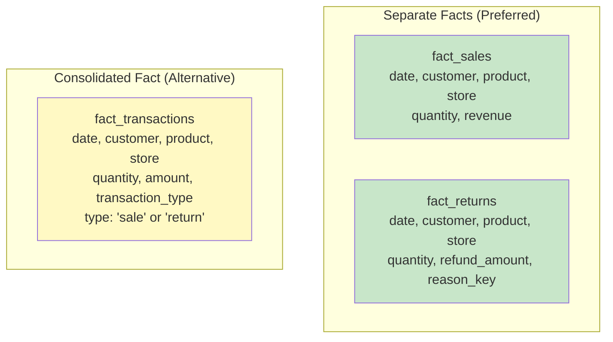
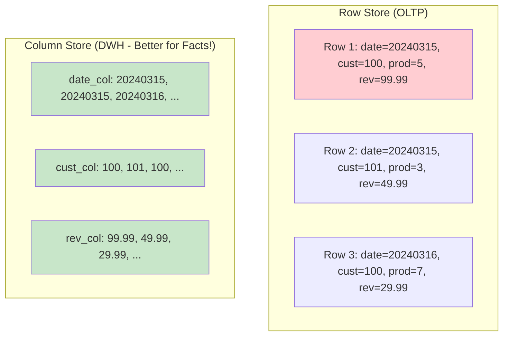

# Fact and Dimension Tables — Senior Deep Dive

## Fact Table Design Patterns for Scale

### Pattern 1: Fact Table Partitioning

```sql
-- Snowflake: Automatic micro-partitioning + clustering
CREATE TABLE fact_events (
    event_id        BIGINT,
    event_date      DATE,
    user_key        INT,
    event_type_key  INT,
    duration_ms     INT,
    value           DECIMAL(12,2)
) CLUSTER BY (event_date, user_key);
-- Queries filtering by date + user will prune 99%+ of data

-- BigQuery: Partitioned + clustered
CREATE TABLE fact_events
PARTITION BY event_date
CLUSTER BY user_key, event_type_key
AS SELECT ...;

-- Databricks/Delta Lake:
CREATE TABLE fact_events
USING DELTA
PARTITIONED BY (event_date)
TBLPROPERTIES ('delta.autoOptimize.optimizeWrite' = 'true');

-- OPTIMIZE fact_events ZORDER BY (user_key);
```

### Pattern 2: Late-Arriving Facts Handling

```sql
-- Problem: Facts arrive days/weeks after the event
-- Solution: Insert partition for the EVENT date, not arrival date

-- MERGE pattern for idempotent late-arriving fact loading:
MERGE INTO fact_sales target
USING staging_late_sales source
ON target.sale_key = source.sale_key
WHEN NOT MATCHED THEN
    INSERT (sale_key, date_key, customer_key, product_key, revenue)
    VALUES (source.sale_key, 
            source.event_date_key,  -- Use EVENT date, not today!
            -- Lookup correct SCD Type 2 key for that date:
            (SELECT customer_key FROM dim_customer 
             WHERE customer_id = source.customer_id
             AND source.event_date BETWEEN effective_start AND effective_end),
            source.product_key,
            source.revenue);
```

### Pattern 3: Fact Table Consolidation

When similar business processes share most dimensions, consider consolidated vs. separate facts:



```sql
-- Consolidated fact (use when processes are very similar):
CREATE TABLE fact_transactions (
    transaction_key    BIGINT PRIMARY KEY,
    transaction_type   VARCHAR(10),    -- 'SALE', 'RETURN', 'EXCHANGE'
    date_key          INT,
    customer_key      INT,
    product_key       INT,
    store_key         INT,
    quantity          INT,            -- Positive for sales, negative for returns
    amount            DECIMAL(12,2),  -- Positive for sales, negative for returns
    -- Type-specific (NULL when not applicable):
    return_reason_key INT             -- Only for returns
);

-- Pro: Single query spans sales + returns naturally
-- Con: NULLable columns, mixed grain may confuse users
```

## Advanced Dimension Patterns

### Pattern 1: Rapidly Changing Dimensions (Mini-Dimensions)

When certain attributes change too frequently for SCD Type 2:

```sql
-- dim_customer has 10M rows. "credit_score" changes monthly.
-- SCD Type 2 would create 120M rows over 12 months!

-- Solution: Mini-dimension for volatile attributes
CREATE TABLE dim_customer_credit_band (
    credit_band_key   INT PRIMARY KEY,
    credit_score_low  INT,
    credit_score_high INT,
    credit_label      VARCHAR(20),  -- 'excellent', 'good', 'fair', 'poor'
    income_band       VARCHAR(20),  -- 'low', 'medium', 'high'
    risk_category     VARCHAR(20)
);
-- ~100 rows total (all combinations of bands)

CREATE TABLE fact_sales (
    ...
    customer_key         INT,             -- Points to base dim (SCD Type 1)
    customer_credit_key  INT,             -- Points to mini-dim (AT TIME OF SALE)
    ...
);
-- Credit band at time of purchase is captured without bloating dim_customer
```

### Pattern 2: Multi-Currency Fact Tables

```sql
CREATE TABLE fact_international_sales (
    sale_key            BIGINT PRIMARY KEY,
    date_key            INT,
    customer_key        INT,
    product_key         INT,
    -- Local currency facts:
    local_currency_code VARCHAR(3),
    local_amount        DECIMAL(14,2),
    -- Converted facts (for global comparison):
    usd_amount          DECIMAL(14,2),
    exchange_rate       DECIMAL(10,6),   -- Rate used for conversion
    -- Reference to rate dimension:
    exchange_rate_key   INT              -- → dim_exchange_rate for audit
);

-- Exchange rate dimension (daily):
CREATE TABLE dim_exchange_rate (
    rate_key            INT PRIMARY KEY,
    date_key            INT,
    source_currency     VARCHAR(3),
    target_currency     VARCHAR(3),
    rate                DECIMAL(10,6),
    rate_source         VARCHAR(50)      -- 'ECB', 'Bloomberg', etc.
);
```

### Pattern 3: Heterogeneous Supertype/Subtype Facts

Handle different event types with different measures:

```sql
-- Supertype fact: common fields for ALL event types
CREATE TABLE fact_customer_events (
    event_key           BIGINT PRIMARY KEY,
    date_key            INT,
    customer_key        INT,
    event_type          VARCHAR(20),     -- 'purchase', 'return', 'support_call', 'page_view'
    -- Common measure (present for all types):
    event_count         INT DEFAULT 1,
    -- Type-specific measures (NULL when not applicable):
    revenue             DECIMAL(12,2),   -- Only for 'purchase'
    refund_amount       DECIMAL(12,2),   -- Only for 'return'
    call_duration_sec   INT,             -- Only for 'support_call'
    page_duration_ms    INT              -- Only for 'page_view'
);

-- Filter for clean analysis:
SELECT customer_key, SUM(revenue) 
FROM fact_customer_events 
WHERE event_type = 'purchase'
GROUP BY customer_key;
```

## Dimension Versioning Strategies

### Approach 1: Type 2 with Hash-Based Change Detection

```sql
-- Efficient change detection using hash comparison:
WITH incoming AS (
    SELECT 
        customer_id,
        customer_name,
        email,
        city,
        state,
        segment,
        -- Hash of all trackable attributes:
        MD5(CONCAT_WS('||', customer_name, email, city, state, segment)) AS attr_hash
    FROM staging_customers
),
current_dim AS (
    SELECT customer_id, 
           MD5(CONCAT_WS('||', customer_name, email, city, state, segment)) AS attr_hash
    FROM dim_customer
    WHERE is_current = TRUE
)
-- Only process rows where hash differs (changed data):
SELECT i.*
FROM incoming i
LEFT JOIN current_dim c ON i.customer_id = c.customer_id
WHERE c.customer_id IS NULL           -- New customer
   OR c.attr_hash != i.attr_hash;     -- Changed attributes
```

### Approach 2: Type 2 with Effective Date Ranges + Surrogate Keys

```sql
-- Full SCD Type 2 load pattern:
-- Step 1: Expire changed records
UPDATE dim_customer
SET effective_end = CURRENT_DATE - 1,
    is_current = FALSE
WHERE is_current = TRUE
  AND customer_id IN (
    SELECT customer_id FROM staging_customers s
    JOIN dim_customer d ON s.customer_id = d.customer_id AND d.is_current = TRUE
    WHERE MD5(CONCAT_WS('||', s.name, s.email, s.city)) 
       != MD5(CONCAT_WS('||', d.customer_name, d.email, d.city))
  );

-- Step 2: Insert new versions + new customers
INSERT INTO dim_customer (customer_key, customer_id, customer_name, email, city,
                          effective_start, effective_end, is_current)
SELECT 
    NEXT_SURROGATE_KEY(),
    s.customer_id,
    s.name,
    s.email,
    s.city,
    CURRENT_DATE,
    '9999-12-31',
    TRUE
FROM staging_customers s
WHERE NOT EXISTS (
    SELECT 1 FROM dim_customer d 
    WHERE d.customer_id = s.customer_id AND d.is_current = TRUE
);
```

## Performance Optimization Patterns

### Aggregate Fact Tables with Shrunken Dimensions

```sql
-- Base: 1B rows, daily product-level grain
-- Aggregate: 5M rows, monthly category-level grain

-- Shrunken dimension for aggregate:
CREATE TABLE dim_product_category (
    category_key      INT PRIMARY KEY,
    category_name     VARCHAR(100),
    department        VARCHAR(100)
);
-- Only contains the levels relevant to this aggregate

CREATE TABLE fact_sales_monthly_category (
    month_key         INT,
    category_key      INT REFERENCES dim_product_category,
    store_key         INT,
    -- Pre-aggregated facts:
    total_revenue     DECIMAL(14,2),
    total_quantity    INT,
    transaction_count INT,
    unique_customers  INT,
    -- Derived:
    avg_transaction   DECIMAL(10,2),
    PRIMARY KEY (month_key, category_key, store_key)
);
```

### Columnar Storage Optimization



**Column store benefits for fact tables:**
- `SUM(revenue)` only reads the revenue column (not all 15 columns)
- Better compression (similar values in same column)
- Vectorized processing (CPU-efficient)

### Fact Table Maintenance

```sql
-- Partition swapping for efficient data lifecycle:
-- 1. Load new data into staging partition
-- 2. Swap partition into fact table (instant!)

-- Snowflake: automatic partition management
-- BigQuery: partition expiration
ALTER TABLE fact_events SET OPTIONS (
    partition_expiration_days = 730  -- Auto-delete partitions older than 2 years
);

-- Delta Lake: vacuum old versions
VACUUM fact_events RETAIN 168 HOURS;  -- Keep 7 days of history
```

## Interview Tips

> **Tip 1:** "How do you handle fact tables at billion-row scale?" — (1) Partition by date (range queries prune 95%+ data). (2) Cluster/Z-order by commonly filtered columns. (3) Pre-build aggregate facts for frequent queries. (4) Use columnar format (Parquet/ORC). (5) Consider separate current-period vs. historical tables.

> **Tip 2:** "What is a mini-dimension and when do you use it?" — When a dimension attribute changes too frequently for SCD Type 2 (would create too many rows). Extract volatile attributes into a small "band" dimension (~100-1000 rows). Fact table gets two FKs: one to base dimension (identity), one to mini-dimension (state at time of event). Classic example: customer credit score → credit band mini-dim.

> **Tip 3:** "How do you decide between consolidated vs. separate fact tables?" — Separate when: processes have different grains, different dimensions, or different measures. Consolidated when: processes share 90%+ of dimensions and measures, and users commonly query them together (e.g., sales + returns as "net transactions"). Separate is safer default.
