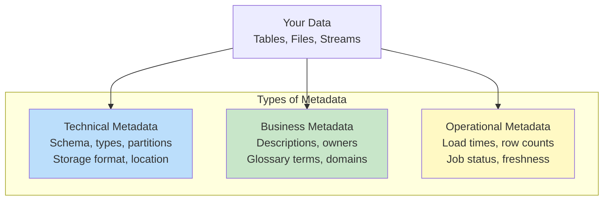
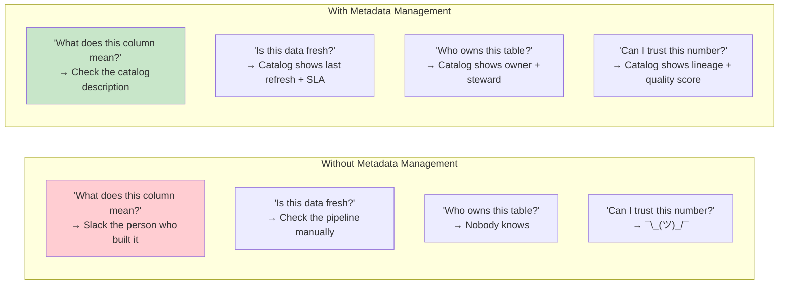
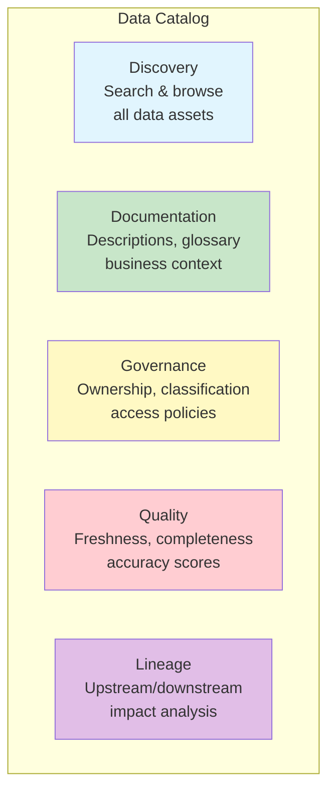

# Metadata Management — Fundamentals

## What is Metadata?

Metadata is **data about data**. It describes the structure, meaning, origin, quality, and usage of your data assets.



## Three Types of Metadata

### 1. Technical Metadata

Information about the **physical structure** of data.

| Example | What it tells you |
|---------|------------------|
| Column names & types | `revenue DECIMAL(12,2)` |
| Table DDL | How the table is created |
| Partitioning | `PARTITIONED BY (date)` |
| File format | Parquet, ORC, CSV |
| Storage location | `s3://bucket/path/` |
| Indexes/clustering | Which columns are optimized |
| Constraints | PKs, FKs, NOT NULL |

```sql
-- Technical metadata from information_schema:
SELECT table_name, column_name, data_type, is_nullable, column_default
FROM information_schema.columns
WHERE table_schema = 'gold';
```

### 2. Business Metadata

Information about the **meaning and context** of data.

| Example | What it tells you |
|---------|------------------|
| Table description | "Contains all completed sales transactions" |
| Column description | "Net revenue after discounts and returns" |
| Data owner | "Finance team, contact: finance@company.com" |
| Business glossary term | "Revenue" = net revenue after returns |
| Data classification | PII, Sensitive, Public, Internal |
| Domain | "Sales", "Marketing", "HR" |
| SLA | "Refreshed daily by 6 AM UTC" |

```yaml
# dbt schema.yml — business metadata:
models:
  - name: fact_sales
    description: "Transaction-level sales fact table. One row per line item."
    meta:
      owner: "data-engineering"
      domain: "sales"
      sla: "refreshed daily by 06:00 UTC"
      pii: false
    columns:
      - name: revenue
        description: "Net revenue in USD after discounts and returns"
        meta:
          business_term: "Net Revenue"
          calculation: "quantity × unit_price × (1 - discount_rate)"
```

### 3. Operational Metadata

Information about **how data is processed and its current state**.

| Example | What it tells you |
|---------|------------------|
| Last load time | "Table refreshed at 2024-03-15 06:05:23 UTC" |
| Row count | "Contains 45,231,890 rows" |
| Job status | "Last run: SUCCESS (duration: 3m 42s)" |
| Data freshness | "Most recent record: 2024-03-14" |
| Query frequency | "Queried 150 times/day by 12 users" |
| Storage size | "1.2 TB compressed" |

```sql
-- Operational metadata from Snowflake:
SELECT table_name, row_count, bytes, last_altered
FROM information_schema.tables
WHERE table_schema = 'GOLD';

-- Query usage metadata:
SELECT query_text, user_name, execution_time, rows_produced
FROM snowflake.account_usage.query_history
WHERE start_time > DATEADD('day', -7, CURRENT_TIMESTAMP);
```

## Why Metadata Management Matters



## Data Catalog — The Metadata Hub

A data catalog is a **centralized inventory** of all data assets with their metadata.



### Popular Data Catalog Tools

| Tool | Type | Best For |
|------|------|----------|
| **DataHub** | Open source | Flexible, metadata-first architecture |
| **Atlan** | Commercial | Modern UI, collaboration features |
| **Collibra** | Enterprise | Governance-heavy, large organizations |
| **Unity Catalog** | Databricks-native | Spark/Delta Lake environments |
| **AWS Glue Data Catalog** | AWS-native | AWS-centric data lakes |
| **dbt docs** | dbt-native | SQL-based transformation documentation |

## Business Glossary

A standardized dictionary of business terms ensuring everyone uses the same definitions.

```yaml
# Business glossary example:
glossary:
  - term: "Revenue"
    definition: "Net revenue from completed sales after discounts and returns"
    formula: "SUM(quantity × unit_price × (1 - discount_rate)) - returns"
    owner: "Finance"
    related_tables: ["gold.fact_sales", "gold.monthly_revenue"]
    NOT_to_be_confused_with: "Gross Revenue (before returns)"
    
  - term: "Active Customer"
    definition: "Customer with at least one purchase in the last 90 days"
    owner: "Marketing"
    related_tables: ["gold.dim_customer"]
    
  - term: "Churn"
    definition: "Customer with no purchase in 90+ days who previously had purchases"
    owner: "Customer Success"
    calculation_logic: "last_purchase_date < CURRENT_DATE - 90 AND total_orders > 0"
```

## Metadata in Practice — dbt Example

```yaml
# models/schema.yml — Complete metadata documentation
version: 2

models:
  - name: dim_customer
    description: |
      Customer dimension table (SCD Type 2). One row per customer per version.
      Tracks changes to name, email, address, and segment over time.
    meta:
      owner: "data-engineering-team"
      domain: "customer"
      tier: "gold"
      sla_freshness_hours: 6
      contains_pii: true
      pii_columns: ["customer_name", "email", "phone"]
    columns:
      - name: customer_key
        description: "Surrogate key (auto-generated integer)"
        tests: [unique, not_null]
      - name: customer_id
        description: "Natural key from source system (CRM)"
        tests: [not_null]
      - name: customer_name
        description: "Full name as entered in CRM"
        meta:
          pii_type: "name"
          masking_policy: "partial_mask"
      - name: segment
        description: "Business segment classification"
        tests:
          - accepted_values:
              values: ['enterprise', 'mid-market', 'smb', 'startup']
      - name: is_current
        description: "TRUE if this is the current version of the customer record"
        tests: [not_null]
```

## Interview Tips

> **Tip 1:** "What are the types of metadata?" — Three types: (1) Technical (schema, types, storage — the structure), (2) Business (descriptions, ownership, glossary — the meaning), (3) Operational (freshness, job status, usage — the state). All three are needed for a complete picture.

> **Tip 2:** "What is a data catalog?" — A centralized searchable inventory of all data assets with their metadata. It enables: discovery (find the right data), documentation (understand what it means), governance (who owns it, who can access it), and quality (is it fresh and reliable). Think of it as "Google for your data."

> **Tip 3:** "Why is a business glossary important?" — Without it, "revenue" means different things to different teams (gross vs. net vs. ARR). A glossary creates a single agreed-upon definition for each business term, mapped to specific columns/tables. Prevents conflicting reports and builds trust in data.
