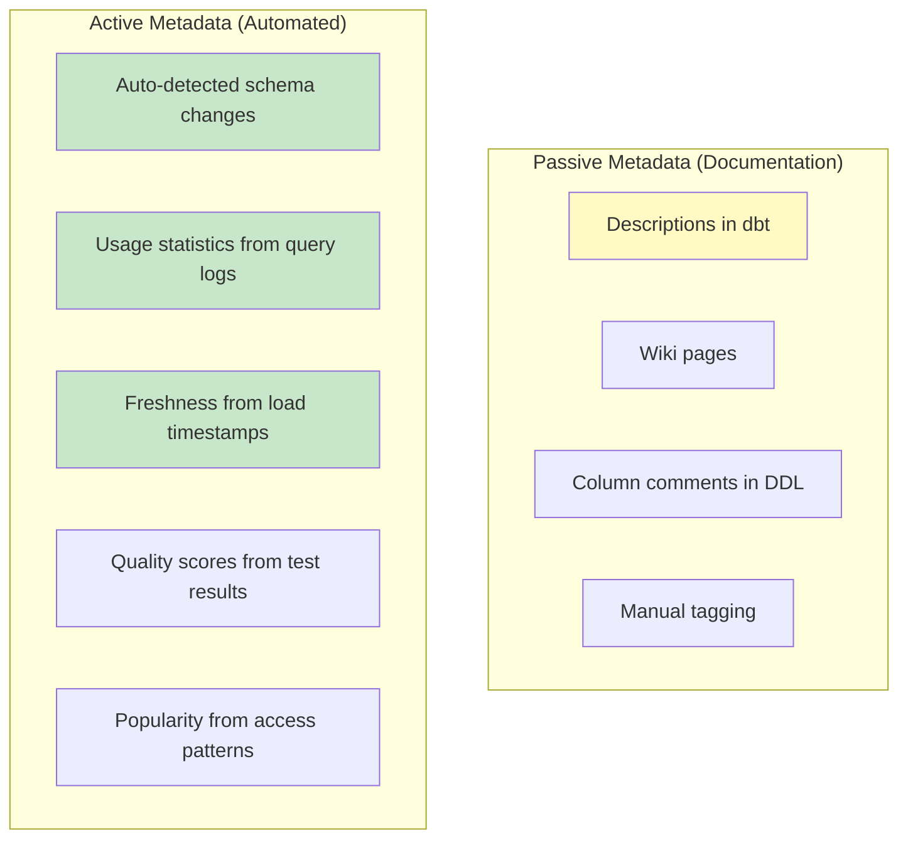

# Metadata Management — Intermediate Concepts

## Active vs. Passive Metadata



| Passive Metadata | Active Metadata |
|-----------------|-----------------|
| Manually maintained | Automatically collected |
| Often stale | Always current |
| Business context | Technical/operational facts |
| Requires discipline | Requires tooling |
| Example: descriptions | Example: query frequency |

**Best practice:** Use active metadata as the foundation, layer passive metadata on top for business context.

## Data Classification & Tagging

### Classification Levels

```sql
-- Tag columns with sensitivity levels:
-- Standard classification scheme:
CREATE TABLE governance.data_classification (
    table_name        VARCHAR(300),
    column_name       VARCHAR(200),
    -- Sensitivity:
    classification    VARCHAR(20),    -- 'public', 'internal', 'confidential', 'restricted'
    -- PII type (if applicable):
    pii_type          VARCHAR(30),    -- 'email', 'phone', 'ssn', 'name', 'address', 'dob'
    -- Regulatory:
    regulatory_scope  VARCHAR(50),    -- 'GDPR', 'HIPAA', 'SOX', 'PCI-DSS'
    -- Access control:
    access_policy     VARCHAR(100),   -- 'all_employees', 'finance_only', 'need_to_know'
    masking_rule      VARCHAR(50),    -- 'none', 'partial', 'full', 'hash', 'tokenize'
    -- Audit:
    classified_by     VARCHAR(100),
    classified_date   DATE,
    PRIMARY KEY (table_name, column_name)
);

-- Snowflake tag-based classification:
CREATE TAG pii_type ALLOWED_VALUES 'email', 'phone', 'ssn', 'name', 'address';
CREATE TAG sensitivity ALLOWED_VALUES 'public', 'internal', 'confidential', 'restricted';

ALTER TABLE silver.customers MODIFY COLUMN email SET TAG pii_type = 'email';
ALTER TABLE silver.customers MODIFY COLUMN email SET TAG sensitivity = 'confidential';

-- Dynamic masking based on tags:
CREATE MASKING POLICY mask_email AS (val VARCHAR) RETURNS VARCHAR ->
    CASE 
        WHEN CURRENT_ROLE() IN ('ADMIN', 'COMPLIANCE') THEN val
        ELSE REGEXP_REPLACE(val, '.+@', '***@')
    END;

ALTER TABLE silver.customers MODIFY COLUMN email SET MASKING POLICY mask_email;
```

## Data Contracts

Formal agreements between data producers and consumers about data structure and quality.

```yaml
# data-contracts/sales_contract.yml
dataContract:
  name: "fact_sales"
  version: "2.1.0"
  owner: "data-engineering-team"
  domain: "sales"
  
  # Schema guarantee:
  schema:
    type: "object"
    properties:
      sale_key:
        type: "integer"
        description: "Unique surrogate key"
        required: true
      revenue:
        type: "number"
        description: "Net revenue in USD"
        required: true
        minimum: 0
        maximum: 1000000
      customer_key:
        type: "integer"
        description: "FK to dim_customer"
        required: true
        referential_integrity: "dim_customer.customer_key"
  
  # Quality guarantees:
  quality:
    freshness:
      max_delay: "6 hours"
      check_column: "loaded_at"
    completeness:
      revenue: "99.9%"        # Max 0.1% NULLs allowed
      customer_key: "100%"    # No NULLs allowed
    uniqueness:
      sale_key: "100%"        # Must be unique
    accuracy:
      revenue_range: "[0, 1000000]"
  
  # SLA:
  sla:
    availability: "99.5%"
    refresh_schedule: "daily by 06:00 UTC"
    notification_channel: "#data-alerts"
  
  # Breaking change policy:
  evolution:
    breaking_changes: "major version bump required"
    notification_period: "2 weeks before deprecation"
    backward_compatible: "minor version, no notification needed"
```

### Contract Enforcement

```python
# Automated contract validation in CI/CD:
from data_contracts import ContractValidator

def validate_contract(table_name, contract_path):
    contract = load_contract(contract_path)
    validator = ContractValidator(contract)
    
    results = validator.validate(
        schema_check=True,      # Columns match contract?
        quality_check=True,     # Freshness, completeness, uniqueness pass?
        sla_check=True          # Loaded within SLA window?
    )
    
    if not results.passed:
        # Alert consumers:
        notify_slack(
            channel=contract['sla']['notification_channel'],
            message=f"⚠️ Contract violation: {table_name}\n{results.failures}"
        )
        raise ContractViolationError(results.failures)
```

## Metadata-Driven Automation

### Auto-Generated Documentation

```python
# Generate documentation from metadata automatically:
def generate_table_docs(table_name):
    """Combine all metadata types into comprehensive documentation."""
    
    # Technical metadata (from information_schema):
    schema = get_table_schema(table_name)  # columns, types, constraints
    
    # Operational metadata (from monitoring):
    ops = get_operational_stats(table_name)  # row_count, freshness, size
    
    # Business metadata (from catalog):
    business = get_business_metadata(table_name)  # description, owner, domain
    
    # Usage metadata (from query logs):
    usage = get_usage_stats(table_name)  # queries/day, top users
    
    # Lineage (from lineage graph):
    lineage = get_lineage(table_name)  # upstream, downstream
    
    return {
        'name': table_name,
        'description': business.description,
        'owner': business.owner,
        'domain': business.domain,
        'columns': schema.columns,
        'row_count': ops.row_count,
        'freshness': ops.last_loaded,
        'size_gb': ops.size_bytes / 1e9,
        'queries_per_day': usage.daily_queries,
        'top_consumers': usage.top_users,
        'upstream_tables': lineage.upstream,
        'downstream_tables': lineage.downstream,
        'quality_score': calculate_quality_score(table_name)
    }
```

### Schema Change Detection

```sql
-- Detect and log schema changes automatically:
CREATE TABLE governance.schema_change_log (
    change_id           INT IDENTITY PRIMARY KEY,
    table_name          VARCHAR(300),
    change_type         VARCHAR(20),    -- 'column_added', 'column_removed', 'type_changed'
    column_name         VARCHAR(200),
    old_value           VARCHAR(500),
    new_value           VARCHAR(500),
    detected_at         TIMESTAMP DEFAULT CURRENT_TIMESTAMP(),
    acknowledged_by     VARCHAR(200),   -- NULL until someone reviews
    is_breaking         BOOLEAN
);

-- Daily job: compare current schema to yesterday's snapshot
INSERT INTO governance.schema_change_log (table_name, change_type, column_name, new_value)
SELECT 
    today.table_schema || '.' || today.table_name,
    'column_added',
    today.column_name,
    today.data_type
FROM information_schema.columns today
LEFT JOIN governance.schema_snapshot_yesterday y
    ON today.table_schema = y.table_schema
    AND today.table_name = y.table_name
    AND today.column_name = y.column_name
WHERE y.column_name IS NULL;  -- New columns not in yesterday's snapshot
```

## Metadata Quality Score

```sql
-- Score tables on metadata completeness:
CREATE VIEW governance.metadata_quality_scores AS
SELECT 
    t.table_name,
    -- Technical completeness:
    CASE WHEN t.comment IS NOT NULL THEN 1 ELSE 0 END AS has_table_description,
    (SELECT COUNT(*) FROM information_schema.columns c 
     WHERE c.table_name = t.table_name AND c.comment IS NOT NULL)::FLOAT
    / (SELECT COUNT(*) FROM information_schema.columns c 
       WHERE c.table_name = t.table_name) AS column_description_pct,
    -- Business completeness:
    CASE WHEN o.owner IS NOT NULL THEN 1 ELSE 0 END AS has_owner,
    CASE WHEN o.domain IS NOT NULL THEN 1 ELSE 0 END AS has_domain,
    CASE WHEN o.sla IS NOT NULL THEN 1 ELSE 0 END AS has_sla,
    -- Operational completeness:
    CASE WHEN ops.last_loaded > DATEADD('day', -1, CURRENT_TIMESTAMP) THEN 1 ELSE 0 END AS is_fresh,
    -- Composite score (0-100):
    (has_table_description * 20 +
     column_description_pct * 30 +
     has_owner * 20 +
     has_domain * 10 +
     has_sla * 10 +
     is_fresh * 10) AS metadata_score
FROM information_schema.tables t
LEFT JOIN governance.table_ownership o ON t.table_name = o.table_name
LEFT JOIN governance.operational_stats ops ON t.table_name = ops.table_name;
```

## Interview Tips

> **Tip 1:** "What are data contracts?" — Formal agreements between data producers and consumers defining: schema (expected columns/types), quality guarantees (freshness, completeness, accuracy), and SLAs (when data will be available). Breaking changes require version bumps and advance notice. Enforced automatically in CI/CD.

> **Tip 2:** "Active vs. passive metadata?" — Passive = manually maintained (descriptions, tags, ownership docs) — often stale. Active = automatically collected (query frequency, freshness, schema changes, popularity) — always current. Build on active metadata foundation; add passive for business context.

> **Tip 3:** "How do you ensure metadata stays up to date?" — (1) Automate collection (query logs, schema introspection, dbt docs). (2) Integrate metadata into development workflow (dbt schema.yml required for PR approval). (3) Track metadata quality scores (% of tables with descriptions, owners). (4) Schema change detection alerts when structure changes unexpectedly.
