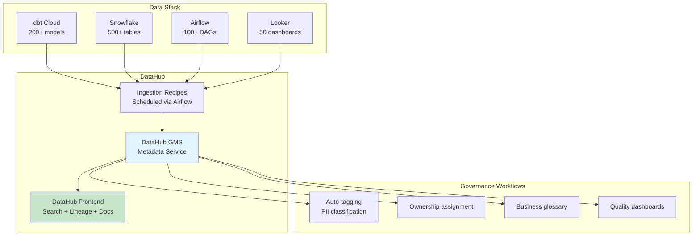

# Metadata Management — Real-World Production Examples

## Example 1: DataHub Implementation for a Mid-Size Company



### Ingestion Configuration

```yaml
# datahub/recipes/snowflake.yml
source:
  type: snowflake
  config:
    account_id: "company-prod"
    warehouse: "ANALYTICS_WH"
    username: "${DATAHUB_SNOWFLAKE_USER}"
    password: "${DATAHUB_SNOWFLAKE_PASSWORD}"
    # What to ingest:
    database_pattern:
      allow: ["ANALYTICS", "RAW", "STAGING"]
    schema_pattern:
      deny: ["INFORMATION_SCHEMA", "PUBLIC"]
    # Collect usage stats:
    include_table_lineage: true
    include_usage_stats: true
    usage_config:
      top_n_queries: 10
      include_top_n_queries: true
    # Profile tables (sample data for classification):
    profiling:
      enabled: true
      profile_table_level_only: false
      max_number_of_fields_to_profile: 50

sink:
  type: datahub-rest
  config:
    server: "https://datahub.company.internal/gms"
    token: "${DATAHUB_TOKEN}"

---
# datahub/recipes/dbt.yml
source:
  type: dbt
  config:
    manifest_path: "s3://artifacts/dbt/target/manifest.json"
    catalog_path: "s3://artifacts/dbt/target/catalog.json"
    run_results_path: "s3://artifacts/dbt/target/run_results.json"
    target_platform: snowflake
    # Map dbt metadata to DataHub:
    meta_mapping:
      owner:
        match: ".*"
        operation: "add_owner"
      domain:
        match: ".*"
        operation: "add_term"
    column_meta_mapping:
      pii_type:
        match: ".*"
        operation: "add_tag"

---
# datahub/recipes/looker.yml
source:
  type: looker
  config:
    base_url: "https://company.looker.com"
    client_id: "${LOOKER_CLIENT_ID}"
    client_secret: "${LOOKER_CLIENT_SECRET}"
    # Extract dashboard → model → table lineage:
    extract_usage_history: true

sink:
  type: datahub-rest
  config:
    server: "https://datahub.company.internal/gms"
```

### Orchestration (Airflow DAG for metadata ingestion)

```python
# airflow/dags/datahub_ingestion.py
from airflow import DAG
from airflow.operators.bash import BashOperator
from datetime import datetime, timedelta

with DAG(
    'datahub_metadata_ingestion',
    schedule_interval='0 7 * * *',  # Daily at 7 AM (after dbt completes at 6 AM)
    default_args={'retries': 2, 'retry_delay': timedelta(minutes=5)},
    catchup=False,
) as dag:
    
    ingest_snowflake = BashOperator(
        task_id='ingest_snowflake_metadata',
        bash_command='datahub ingest -c /opt/datahub/recipes/snowflake.yml'
    )
    
    ingest_dbt = BashOperator(
        task_id='ingest_dbt_metadata',
        bash_command='datahub ingest -c /opt/datahub/recipes/dbt.yml'
    )
    
    ingest_looker = BashOperator(
        task_id='ingest_looker_metadata',
        bash_command='datahub ingest -c /opt/datahub/recipes/looker.yml'
    )
    
    # Snowflake + dbt first (provides lineage), then Looker (adds consumption layer)
    [ingest_snowflake, ingest_dbt] >> ingest_looker
```

---

## Example 2: dbt-Centric Metadata Strategy

For teams where dbt IS the data catalog:

```yaml
# models/marts/sales/schema.yml — Complete metadata in dbt
version: 2

models:
  - name: fact_sales
    description: |
      **Transaction-level sales fact table.**
      
      Grain: One row per line item per order.
      Refresh: Daily by 06:00 UTC.
      Owner: Sales Data Team (#team-sales-data)
      
      ## Business Rules
      - Revenue = quantity × unit_price × (1 - discount_rate)
      - Only includes completed orders (status = 'completed')
      - Excludes internal test orders (customer_segment != 'test')
      
      ## Usage Notes
      - For total revenue: `SUM(revenue)` — already net of discounts
      - For order count: `COUNT(DISTINCT order_number)` — not COUNT(*)
      - Join to dim_customer ON customer_key for customer attributes
    
    meta:
      owner: "sales-data-team"
      domain: "sales"
      tier: "gold"
      sla_hours: 6
      pii: false
      data_contract_version: "2.1.0"
      downstream_consumers:
        - "Revenue Dashboard (Looker)"
        - "Monthly P&L Report"
        - "Churn ML Model"
    
    columns:
      - name: sale_key
        description: "Surrogate key (unique row identifier)"
        tests: [unique, not_null]
        meta: {primary_key: true}
      
      - name: revenue
        description: |
          Net revenue in USD after discounts.
          Formula: quantity × unit_price × (1 - discount_rate)
          Business term: "Net Revenue"
        tests:
          - not_null
          - dbt_utils.accepted_range:
              min_value: 0
              max_value: 500000
        meta:
          business_glossary_term: "Net Revenue"
          aggregation_method: "SUM"
      
      - name: customer_key
        description: "FK to dim_customer (SCD Type 2 — use for point-in-time lookup)"
        tests:
          - not_null
          - relationships:
              to: ref('dim_customer')
              field: customer_key
        meta: {foreign_key: "dim_customer.customer_key"}
      
      - name: order_number
        description: "Degenerate dimension — groups line items into orders"
        tests: [not_null]
        meta: {degenerate_dimension: true}

# Exposures — Document downstream consumers:
exposures:
  - name: revenue_dashboard
    type: dashboard
    maturity: high
    url: https://looker.company.com/dashboards/revenue
    description: "Executive revenue dashboard. Refreshed hourly from fact_sales."
    depends_on:
      - ref('fact_sales')
      - ref('dim_date')
      - ref('dim_customer')
    owner:
      name: "Analytics Team"
      email: "analytics@company.com"
    meta:
      sla: "Available by 07:00 UTC daily"
      stakeholders: ["CFO", "VP Sales", "Board"]
```

### Auto-Generate Catalog from dbt Metadata

```python
# scripts/generate_catalog_report.py
"""Generate metadata quality report from dbt manifest."""
import json

def audit_metadata_quality(manifest_path):
    manifest = json.load(open(manifest_path))
    report = {'models': [], 'summary': {}}
    
    total_models = 0
    has_description = 0
    has_owner = 0
    has_tests = 0
    
    for node_id, node in manifest['nodes'].items():
        if node['resource_type'] != 'model':
            continue
        
        total_models += 1
        model_score = 0
        
        # Check description:
        if node.get('description', '').strip():
            has_description += 1
            model_score += 25
        
        # Check owner:
        if node.get('meta', {}).get('owner'):
            has_owner += 1
            model_score += 25
        
        # Check tests:
        test_count = len([t for t in manifest['nodes'].values() 
                         if t['resource_type'] == 'test' 
                         and node_id in t.get('depends_on', {}).get('nodes', [])])
        if test_count > 0:
            has_tests += 1
            model_score += 25
        
        # Check column descriptions:
        cols = node.get('columns', {})
        cols_with_desc = sum(1 for c in cols.values() if c.get('description'))
        col_pct = cols_with_desc / max(len(cols), 1) * 25
        model_score += col_pct
        
        report['models'].append({
            'name': node['name'],
            'schema': node['schema'],
            'score': round(model_score),
            'has_description': bool(node.get('description')),
            'has_owner': bool(node.get('meta', {}).get('owner')),
            'has_tests': test_count > 0,
            'column_desc_pct': round(cols_with_desc / max(len(cols), 1) * 100)
        })
    
    report['summary'] = {
        'total_models': total_models,
        'description_coverage': f"{has_description/total_models*100:.0f}%",
        'owner_coverage': f"{has_owner/total_models*100:.0f}%",
        'test_coverage': f"{has_tests/total_models*100:.0f}%",
        'avg_score': round(sum(m['score'] for m in report['models'])/total_models)
    }
    
    return report
```

---

## Example 3: Automated PII Discovery and Classification

```python
# Production pipeline: scan all tables, classify columns, apply policies

from snowflake.connector import connect
import re

class PIIScanner:
    """Scan Snowflake tables for PII and auto-apply tags + masking."""
    
    PATTERNS = {
        'email': {
            'name_regex': r'(email|e_mail|mail_addr)',
            'value_regex': r'^[a-zA-Z0-9_.+-]+@[a-zA-Z0-9-]+\.[a-zA-Z0-9-.]+$',
            'masking_policy': 'mask_email',
            'tag_value': 'email'
        },
        'phone': {
            'name_regex': r'(phone|mobile|cell|fax|tel)',
            'value_regex': r'^\+?[\d\s\-\(\)]{7,15}$',
            'masking_policy': 'mask_phone',
            'tag_value': 'phone'
        },
        'ssn': {
            'name_regex': r'(ssn|social_sec|tax_id|sin)',
            'value_regex': r'^\d{3}-\d{2}-\d{4}$',
            'masking_policy': 'mask_full',
            'tag_value': 'ssn'
        }
    }
    
    def scan_and_classify(self, database, schema):
        """Scan all tables in schema, classify columns, apply policies."""
        conn = connect(account='...', user='...', password='...')
        
        # Get all columns:
        columns = conn.cursor().execute(f"""
            SELECT table_name, column_name, data_type
            FROM {database}.information_schema.columns
            WHERE table_schema = '{schema}'
        """).fetchall()
        
        classifications = []
        
        for table, column, dtype in columns:
            if dtype not in ('VARCHAR', 'TEXT', 'STRING'):
                continue
            
            for pii_type, config in self.PATTERNS.items():
                # Check column name:
                if re.search(config['name_regex'], column, re.IGNORECASE):
                    classifications.append({
                        'table': f"{database}.{schema}.{table}",
                        'column': column,
                        'pii_type': pii_type,
                        'confidence': 0.95,
                        'method': 'name_pattern'
                    })
                    break
            else:
                # If name didn't match, sample values:
                sample = conn.cursor().execute(f"""
                    SELECT "{column}" FROM {database}.{schema}.{table}
                    WHERE "{column}" IS NOT NULL LIMIT 100
                """).fetchall()
                
                for pii_type, config in self.PATTERNS.items():
                    match_rate = sum(
                        1 for row in sample 
                        if re.match(config['value_regex'], str(row[0]))
                    ) / max(len(sample), 1)
                    
                    if match_rate > 0.7:
                        classifications.append({
                            'table': f"{database}.{schema}.{table}",
                            'column': column,
                            'pii_type': pii_type,
                            'confidence': match_rate,
                            'method': 'value_sampling'
                        })
                        break
        
        # Apply tags and masking policies:
        for c in classifications:
            if c['confidence'] > 0.8:
                conn.cursor().execute(f"""
                    ALTER TABLE {c['table']} 
                    MODIFY COLUMN {c['column']} 
                    SET TAG pii_type = '{c['pii_type']}'
                """)
                policy = self.PATTERNS[c['pii_type']]['masking_policy']
                conn.cursor().execute(f"""
                    ALTER TABLE {c['table']} 
                    MODIFY COLUMN {c['column']} 
                    SET MASKING POLICY {policy}
                """)
        
        return classifications
```

---

## Interview Tips

> **Tip 1:** "How would you implement a data catalog from scratch?" — (1) Choose a tool (DataHub for flexibility, Atlan for UX, or dbt docs for SQL-centric teams). (2) Start with automated ingestion from your primary platform (Snowflake + dbt). (3) Add business context: descriptions in dbt schema.yml (required for PR approval). (4) Layer on governance: PII classification + ownership assignment. (5) Connect consumers: BI tool lineage for end-to-end visibility.

> **Tip 2:** "How do you ensure metadata adoption?" — Make it part of the workflow, not a separate task: (1) Require descriptions in dbt schema.yml for PR approval (CI check). (2) Auto-populate technical + operational metadata (no manual effort). (3) Show value immediately: "search for any table by keyword" + "see who owns it" + "see its quality." (4) Track metadata quality scores per team (gamification).

> **Tip 3:** "How do you handle PII classification at scale?" — Automated multi-layer approach: (1) Column name pattern matching (email, phone, ssn patterns — 80% accuracy). (2) Value sampling + regex on actual data (catches columns with non-obvious names). (3) ML classifier for edge cases. Apply tags + masking policies automatically. Human review for low-confidence classifications. Re-scan on schema changes.
