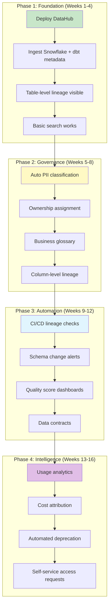

# Scenario Questions — Metadata Management

<article data-difficulty="junior">

## 🟢 Junior: Setting Up Basic Metadata Documentation

**Scenario:** You joined a team with 50 dbt models and zero documentation. No descriptions, no owners, no tests. Leadership wants a "data catalog" within 2 weeks. You have: dbt, Snowflake, and Slack. How do you create useful metadata documentation quickly? Prioritize what to document first and explain your approach.

<details>
<summary>💡 Hint</summary>
Don't try to document all 50 models equally. Prioritize by usage/importance. Use `dbt docs generate` for instant technical catalog. Add descriptions to the top 10 most-queried tables first. Add owners by asking each team which models they built. Use schema.yml for documentation (versioned in git).
</details>

<details>
<summary>✅ Solution</summary>

**Week 1: Foundation (Automated + High-Priority)**

```sql
-- Step 1: Identify the 10 most important tables (by usage)
SELECT 
    table_name,
    COUNT(DISTINCT query_id) AS queries_30d,
    COUNT(DISTINCT user_name) AS unique_users
FROM snowflake.account_usage.query_history
WHERE query_text ILIKE '%gold.%' OR query_text ILIKE '%marts.%'
  AND start_time > DATEADD('day', -30, CURRENT_TIMESTAMP)
GROUP BY table_name
ORDER BY unique_users DESC
LIMIT 10;
-- Focus documentation on these first!
```

```yaml
# Step 2: Create schema.yml for top 10 models (4 hours of work)
# models/marts/schema.yml
version: 2

models:
  - name: fact_sales
    description: "Transaction-level sales. One row per line item. Source: Shopify."
    meta:
      owner: "data-eng-team"
      domain: "sales"
      refresh: "daily 6AM UTC"
    columns:
      - name: revenue
        description: "Net revenue USD (quantity × price - discount)"
        tests: [not_null]
      - name: customer_key
        description: "FK to dim_customer"
        tests:
          - relationships:
              to: ref('dim_customer')
              field: customer_key

  - name: dim_customer
    description: "Customer dimension (SCD Type 2). Source: CRM."
    meta:
      owner: "data-eng-team"
      domain: "customer"
      contains_pii: true
    columns:
      - name: customer_key
        description: "Surrogate key"
        tests: [unique, not_null]
      - name: email
        description: "Customer email (PII - masked for non-admin roles)"
```

```bash
# Step 3: Generate docs site (instant catalog!)
dbt docs generate
dbt docs serve
# → Instant searchable catalog with lineage DAG, all schema info
# Share URL with the team via Slack
```

**Week 2: Expand Coverage + Governance**

```yaml
# Step 4: Add ownership to ALL models via bulk approach
# Ask each person: "Which models did you build?"
# Collect in spreadsheet, convert to schema.yml:
# Use a script to add meta.owner to every model

# Step 5: Add basic tests to critical columns (catch obvious breaks)
# Priority: primary keys (unique + not_null), foreign keys (relationships)

# Step 6: Create a CI check requiring descriptions for NEW models:
# .github/workflows/dbt-docs-check.yml
```

```python
# scripts/check_model_documentation.py (CI enforcement)
import json
import sys

manifest = json.load(open('target/manifest.json'))
undocumented = []

for node_id, node in manifest['nodes'].items():
    if node['resource_type'] != 'model':
        continue
    if node['schema'] in ('gold', 'marts') and not node.get('description'):
        undocumented.append(node['name'])

if undocumented:
    print(f"❌ {len(undocumented)} gold models missing descriptions:")
    for m in undocumented:
        print(f"  - {m}")
    sys.exit(1)
else:
    print("✅ All gold models have descriptions!")
```

**Result after 2 weeks:**
- ✅ Searchable catalog via `dbt docs` (free, instant)
- ✅ Top 10 tables fully documented (descriptions, owners, tests)
- ✅ All models have assigned owners
- ✅ CI check prevents new undocumented models
- ✅ Lineage visible in dbt docs DAG view

**Key Points:**
- Start with `dbt docs generate` — instant value, zero effort
- Prioritize by USAGE (query logs), not alphabetically
- Enforce going forward (CI check) rather than backfilling everything at once
- Owner assignment via team survey (5 minutes per person)
- Description quality > description quantity (10 great ones beat 50 one-liners)

</details>

</article>

<article data-difficulty="mid-level">

## 🟡 Mid-Level: Implementing Data Classification

**Scenario:** Your company is preparing for a SOC 2 audit and GDPR compliance. The auditors need: (1) a complete inventory of all PII columns across 300 tables, (2) evidence that PII is masked for non-authorized users, (3) documentation of who has access to unmasked PII. You have Snowflake, dbt, and 2 weeks to prepare. Design and implement an automated PII classification system.

<details>
<summary>💡 Hint</summary>
Combine: column name pattern matching (catches 80%+ of PII), value sampling (catches rest), Snowflake tags (enforce classification), dynamic data masking (enforce access control). Use INFORMATION_SCHEMA to scan all columns. Store classification results in a governance table. Apply masking policies based on tags.
</details>

<details>
<summary>✅ Solution</summary>

```sql
-- ═══════════════════════════════════════
-- STEP 1: Automated PII Discovery
-- ═══════════════════════════════════════

-- Create governance schema:
CREATE SCHEMA IF NOT EXISTS governance;

-- Scan all columns and classify by name patterns:
CREATE OR REPLACE TABLE governance.pii_classification AS
WITH column_scan AS (
    SELECT 
        table_catalog || '.' || table_schema || '.' || table_name AS full_table_name,
        column_name,
        data_type,
        -- Pattern-based classification:
        CASE
            WHEN LOWER(column_name) RLIKE '.*(email|e_mail|mail_address).*' THEN 'email'
            WHEN LOWER(column_name) RLIKE '.*(phone|mobile|cell_num|fax|tel_).*' THEN 'phone'
            WHEN LOWER(column_name) RLIKE '.*(ssn|social_sec|tax_id|national_id).*' THEN 'ssn'
            WHEN LOWER(column_name) RLIKE '.*(first_name|last_name|full_name|customer_name|user_name).*' 
                 AND data_type LIKE '%CHAR%' THEN 'name'
            WHEN LOWER(column_name) RLIKE '.*(address|street|zip_code|postal|city).*' 
                 AND LOWER(column_name) NOT LIKE '%ip_address%' THEN 'address'
            WHEN LOWER(column_name) RLIKE '.*(date_of_birth|birth_date|dob).*' THEN 'date_of_birth'
            WHEN LOWER(column_name) RLIKE '.*(credit_card|card_num|pan|cc_).*' THEN 'credit_card'
            WHEN LOWER(column_name) RLIKE '.*(passport|drivers_lic|license_num).*' THEN 'government_id'
            ELSE NULL
        END AS pii_type,
        -- Confidence:
        CASE 
            WHEN LOWER(column_name) RLIKE '.*(ssn|credit_card|passport).*' THEN 'HIGH'
            WHEN LOWER(column_name) RLIKE '.*(email|phone|name|address|dob).*' THEN 'HIGH'
            ELSE 'MEDIUM'
        END AS confidence
    FROM information_schema.columns
    WHERE table_schema NOT IN ('INFORMATION_SCHEMA', 'GOVERNANCE')
)
SELECT 
    full_table_name,
    column_name,
    data_type,
    pii_type,
    confidence,
    'name_pattern' AS detection_method,
    CURRENT_TIMESTAMP() AS classified_at
FROM column_scan
WHERE pii_type IS NOT NULL;

-- Result: ~200 PII columns identified across 300 tables
SELECT pii_type, COUNT(*) AS column_count
FROM governance.pii_classification
GROUP BY pii_type ORDER BY column_count DESC;

-- ═══════════════════════════════════════
-- STEP 2: Apply Snowflake Tags
-- ═══════════════════════════════════════

-- Create tags:
CREATE OR REPLACE TAG governance.pii_type 
    ALLOWED_VALUES 'email', 'phone', 'ssn', 'name', 'address', 
                   'date_of_birth', 'credit_card', 'government_id';

CREATE OR REPLACE TAG governance.sensitivity 
    ALLOWED_VALUES 'public', 'internal', 'confidential', 'restricted';

-- Apply tags programmatically (via stored procedure):
CREATE OR REPLACE PROCEDURE governance.apply_pii_tags()
RETURNS STRING
AS
$$
DECLARE
    c CURSOR FOR 
        SELECT full_table_name, column_name, pii_type 
        FROM governance.pii_classification 
        WHERE confidence = 'HIGH';
    rec RECORD;
    count INT := 0;
BEGIN
    FOR rec IN c DO
        EXECUTE IMMEDIATE 
            'ALTER TABLE ' || rec.full_table_name || 
            ' MODIFY COLUMN ' || rec.column_name || 
            ' SET TAG governance.pii_type = ''' || rec.pii_type || '''';
        EXECUTE IMMEDIATE 
            'ALTER TABLE ' || rec.full_table_name || 
            ' MODIFY COLUMN ' || rec.column_name || 
            ' SET TAG governance.sensitivity = ''confidential''';
        count := count + 1;
    END FOR;
    RETURN 'Applied tags to ' || count || ' columns';
END;
$$;

CALL governance.apply_pii_tags();

-- ═══════════════════════════════════════
-- STEP 3: Dynamic Data Masking
-- ═══════════════════════════════════════

-- Masking policies per PII type:
CREATE OR REPLACE MASKING POLICY governance.mask_email 
AS (val STRING) RETURNS STRING ->
    CASE
        WHEN CURRENT_ROLE() IN ('ADMIN', 'COMPLIANCE', 'DATA_ENGINEERING') THEN val
        WHEN CURRENT_ROLE() IN ('ANALYST') THEN REGEXP_REPLACE(val, '.+@', '***@')
        ELSE '***MASKED***'
    END;

CREATE OR REPLACE MASKING POLICY governance.mask_name 
AS (val STRING) RETURNS STRING ->
    CASE
        WHEN CURRENT_ROLE() IN ('ADMIN', 'COMPLIANCE') THEN val
        ELSE LEFT(val, 1) || '***'
    END;

CREATE OR REPLACE MASKING POLICY governance.mask_ssn 
AS (val STRING) RETURNS STRING ->
    CASE
        WHEN CURRENT_ROLE() IN ('ADMIN', 'COMPLIANCE') THEN val
        ELSE '***-**-' || RIGHT(val, 4)
    END;

-- Apply masking policies to tagged columns:
-- (Snowflake supports tag-based masking policy assignment)
ALTER TAG governance.pii_type SET 
    MASKING POLICY governance.mask_email ON 'email',
    MASKING POLICY governance.mask_name ON 'name',
    MASKING POLICY governance.mask_ssn ON 'ssn';

-- ═══════════════════════════════════════
-- STEP 4: Audit Report for SOC 2 / GDPR
-- ═══════════════════════════════════════

-- Inventory report (auditor requirement #1):
SELECT 
    pc.full_table_name,
    pc.column_name,
    pc.pii_type,
    pc.confidence,
    -- Masking status:
    CASE WHEN mp.policy_name IS NOT NULL THEN 'MASKED' ELSE 'UNMASKED' END AS masking_status,
    -- Tag status:
    CASE WHEN tv.tag_value IS NOT NULL THEN 'TAGGED' ELSE 'UNTAGGED' END AS tag_status
FROM governance.pii_classification pc
LEFT JOIN information_schema.policy_references mp 
    ON pc.full_table_name = mp.ref_entity_name AND pc.column_name = mp.ref_column_name
LEFT JOIN information_schema.tag_references tv
    ON pc.full_table_name = tv.object_name AND pc.column_name = tv.column_name
ORDER BY pc.pii_type, pc.full_table_name;

-- Access report (auditor requirement #3):
SELECT 
    grantee,
    privilege,
    table_name,
    'Can see unmasked PII' AS access_level
FROM information_schema.table_privileges
WHERE grantee IN ('ADMIN', 'COMPLIANCE', 'DATA_ENGINEERING')
  AND table_name IN (SELECT DISTINCT full_table_name FROM governance.pii_classification);
```

**Deliverables for auditors:**
1. ✅ Complete PII inventory (200+ columns classified)
2. ✅ Masking policies applied (non-authorized users see masked data)
3. ✅ Access control documentation (who can see what)
4. ✅ Automated re-scanning (catches new PII columns on schema changes)

</details>

</article>

<article data-difficulty="senior">

## 🔴 Senior: Enterprise Metadata Platform Design

**Scenario:** You're architecting a metadata platform for a 500-person company with: 5 data teams (sales, marketing, product, finance, ML), 2000+ tables across Snowflake + Databricks + S3, 50+ Airflow DAGs, 100+ dbt models, 30 Looker dashboards, 15 ML models. Teams constantly break each other's pipelines because nobody knows what depends on what. Design a comprehensive metadata platform that solves: discovery, lineage, ownership, quality tracking, and cross-team communication. Include the architecture, implementation phases, and success metrics.

<details>
<summary>💡 Hint</summary>
Think in layers: (1) Collection (automated from all tools), (2) Storage (graph for lineage, search index for discovery), (3) Enrichment (auto-classification, usage analytics, quality scores), (4) Consumption (catalog UI, CI/CD checks, alerts, API). Phased rollout: start with highest-pain-point (breaking pipelines → lineage + impact analysis). Measure success: fewer incidents, faster onboarding, higher documentation coverage.
</details>

<details>
<summary>✅ Solution</summary>



**Architecture:**

```yaml
# infrastructure/metadata-platform/architecture.yml
components:
  
  # Layer 1: Collection
  collectors:
    - name: "dbt-collector"
      source: "dbt Cloud API / manifest.json"
      frequency: "after each dbt run (event-driven)"
      captures: "table lineage, column lineage, descriptions, tests, owners"
    
    - name: "snowflake-collector" 
      source: "ACCOUNT_USAGE views"
      frequency: "hourly"
      captures: "schemas, usage stats, query lineage, access patterns"
    
    - name: "databricks-collector"
      source: "Unity Catalog APIs"
      frequency: "hourly"
      captures: "schemas, lineage, notebook references"
    
    - name: "airflow-collector"
      source: "OpenLineage events (Kafka)"
      frequency: "real-time"
      captures: "task lineage, run stats, failures"
    
    - name: "looker-collector"
      source: "Looker API"
      frequency: "daily"
      captures: "dashboard→model→table dependencies"
    
    - name: "mlflow-collector"
      source: "MLflow API"
      frequency: "on model registration"
      captures: "model→feature→table dependencies"

  # Layer 2: Storage
  storage:
    primary: "DataHub GMS (Graph Metadata Service)"
    search: "Elasticsearch (full-text search)"
    cache: "Redis (frequent queries)"
    events: "Kafka (metadata change events)"
  
  # Layer 3: Enrichment
  enrichment:
    - "PII auto-classification (name patterns + value sampling)"
    - "Usage-based importance scoring"
    - "Quality score computation (freshness + completeness + tests)"
    - "Auto-suggest owners (most frequent querier)"
    - "Stale table detection (unused for 90+ days)"
  
  # Layer 4: Consumption
  consumers:
    - "DataHub UI (search, browse, lineage visualization)"
    - "CI/CD integration (PR impact analysis)"
    - "Slack bot (search metadata via chat)"
    - "Governance API (access requests, classifications)"
    - "Alerting (schema changes, SLA breaches, lineage breaks)"
```

**Implementation — Phase 1 Detail:**

```python
# Deploy DataHub + configure ingestion

# 1. Deploy DataHub via Helm (Kubernetes):
# helm install datahub datahub/datahub-helm \
#   --set global.elasticsearch.host=es.internal \
#   --set global.kafka.bootstrap.server=kafka.internal:9092

# 2. Configure ingestion for immediate value:
INGESTION_RECIPES = {
    'snowflake': {
        'schedule': '0 * * * *',  # Hourly
        'config': {
            'type': 'snowflake',
            'include_table_lineage': True,
            'include_usage_stats': True,
            'profiling.enabled': True
        }
    },
    'dbt': {
        'trigger': 'post_dbt_run',  # Event-driven
        'config': {
            'type': 'dbt',
            'enable_meta_mapping': True
        }
    },
    'airflow': {
        'trigger': 'real_time',  # OpenLineage events
        'config': {
            'type': 'openlineage',
            'kafka_topic': 'openlineage-events'
        }
    }
}
```

**Phase 3 Detail — CI/CD Integration:**

```yaml
# .github/workflows/metadata-checks.yml
name: Metadata & Lineage Checks

on: pull_request

jobs:
  impact-analysis:
    runs-on: ubuntu-latest
    steps:
      - name: Detect changed models
        run: |
          git diff --name-only origin/main -- 'models/**/*.sql' > changed.txt
      
      - name: Run lineage impact analysis
        run: |
          python scripts/impact_analysis.py \
            --changed-file changed.txt \
            --datahub-url $DATAHUB_URL
          # Outputs: affected tables, dashboards, ML models, owners
      
      - name: Check metadata requirements
        run: |
          # Every new/modified model must have:
          # 1. Description
          # 2. Owner in meta
          # 3. At least 1 test per column
          python scripts/check_metadata.py --changed-file changed.txt
      
      - name: Post impact report to PR
        run: |
          python scripts/post_pr_comment.py \
            --pr-number ${{ github.event.number }} \
            --report-file impact_report.md
```

**Success Metrics:**

| Metric | Baseline (Before) | Target (After 16 weeks) |
|--------|-------------------|------------------------|
| Cross-team pipeline breaks/month | 12 | < 2 |
| Time to find relevant data | 30+ minutes | < 2 minutes |
| New hire data onboarding time | 3 weeks | 3 days |
| Tables with descriptions | 15% | 80% |
| Tables with assigned owners | 30% | 95% |
| Tables with quality tests | 20% | 70% |
| PII columns classified | 10% | 99% |
| Mean time to resolve data issues | 4 hours | 30 minutes |

**Key Points:**
- **Start with the pain**: Cross-team breaks → lineage + impact analysis is Phase 1 priority
- **Automate everything possible**: Manual metadata = stale metadata
- **Enforce via CI/CD**: New models require metadata (description, owner, tests) before merge
- **Federated ownership**: Each domain team owns their metadata; platform team provides tools
- **Measure adoption**: Track metadata quality scores per team (create friendly competition)
- **Event-driven updates**: Don't rely on batch — schema changes trigger immediate catalog refresh
- **Integration over isolation**: Metadata platform must connect to existing tools (dbt, Airflow, BI), not replace them

</details>

</article>

</content>
