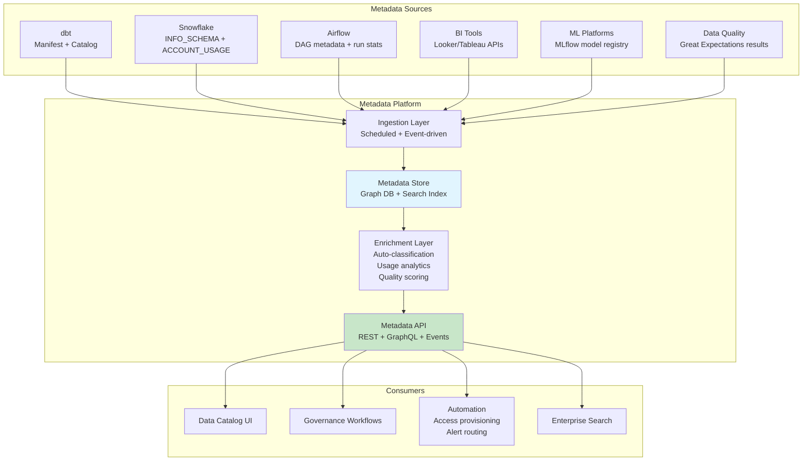
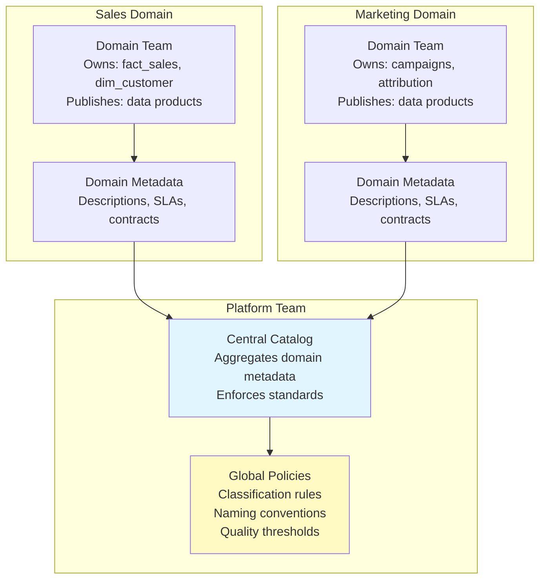

# Metadata Management — Senior Deep Dive

## Enterprise Metadata Architecture



## Data Mesh and Federated Metadata

In a Data Mesh architecture, metadata ownership is **federated** — each domain owns its own metadata.



### Federated Governance Model

```yaml
# Domain-level metadata contract (each team maintains their own):
# domains/sales/data-product.yml
domain:
  name: "sales"
  owner: "sales-data-team@company.com"
  
data_products:
  - name: "fact_sales"
    description: "Transaction-level sales data"
    sla:
      freshness: "< 6 hours"
      availability: "99.5%"
    schema_version: "3.2.1"
    consumers:
      - domain: "marketing"
        use_case: "attribution modeling"
      - domain: "finance"
        use_case: "revenue reporting"
    
    # Domain team owns quality:
    quality_checks:
      - type: "freshness"
        threshold: "6h"
      - type: "completeness"
        column: "revenue"
        threshold: "99.9%"
      - type: "uniqueness"
        column: "sale_key"

# Global standards (platform team enforces):
# platform/standards/naming.yml
naming_conventions:
  tables:
    facts: "fact_{subject}"
    dimensions: "dim_{subject}"
    staging: "stg_{source}_{subject}"
  columns:
    surrogate_keys: "{table}_key"
    foreign_keys: "{referenced_table}_key"
    timestamps: "{event}_at"
    flags: "is_{condition}"
```

## Automated Metadata Intelligence

### ML-Powered Classification

```python
# Automatically classify columns based on content and naming patterns:
import re
from typing import Optional

class MetadataClassifier:
    """Auto-classify columns using heuristics + ML."""
    
    PII_PATTERNS = {
        'email': [r'email', r'e_mail', r'mail_address'],
        'phone': [r'phone', r'mobile', r'cell', r'tel'],
        'ssn': [r'ssn', r'social_sec', r'tax_id'],
        'name': [r'first_name', r'last_name', r'full_name', r'customer_name'],
        'address': [r'address', r'street', r'zip_code', r'postal'],
        'dob': [r'date_of_birth', r'birth_date', r'dob'],
        'credit_card': [r'card_number', r'cc_num', r'pan']
    }
    
    def classify_column(self, column_name: str, sample_values: list) -> Optional[dict]:
        """Classify a column based on name patterns and value analysis."""
        
        # Pattern matching on column name:
        for pii_type, patterns in self.PII_PATTERNS.items():
            for pattern in patterns:
                if re.search(pattern, column_name, re.IGNORECASE):
                    return {
                        'classification': 'PII',
                        'pii_type': pii_type,
                        'confidence': 0.95,
                        'method': 'name_pattern'
                    }
        
        # Value analysis (regex on sample data):
        if sample_values:
            email_pattern = r'^[a-zA-Z0-9+_.-]+@[a-zA-Z0-9.-]+$'
            if sum(1 for v in sample_values if re.match(email_pattern, str(v))) > len(sample_values) * 0.8:
                return {
                    'classification': 'PII',
                    'pii_type': 'email',
                    'confidence': 0.9,
                    'method': 'value_analysis'
                }
        
        return None
    
    def classify_table(self, table_name: str, columns: list) -> dict:
        """Classify all columns in a table."""
        results = {}
        for col in columns:
            classification = self.classify_column(col['name'], col.get('samples', []))
            if classification:
                results[col['name']] = classification
        return results
```

### Usage-Based Metadata Enrichment

```sql
-- Auto-detect table importance from usage patterns:
CREATE VIEW governance.table_importance AS
SELECT 
    table_name,
    -- Query frequency (last 30 days):
    COUNT(DISTINCT query_id) AS queries_30d,
    COUNT(DISTINCT user_name) AS unique_users_30d,
    -- Freshness:
    MAX(query_start_time) AS last_queried,
    -- Compute importance tier:
    CASE 
        WHEN COUNT(DISTINCT user_name) > 20 THEN 'critical'
        WHEN COUNT(DISTINCT user_name) > 5 THEN 'important'
        WHEN COUNT(DISTINCT user_name) > 0 THEN 'standard'
        ELSE 'unused'
    END AS importance_tier,
    -- Auto-suggest owner (most frequent querier):
    MODE(user_name) AS suggested_owner
FROM snowflake.account_usage.access_history
WHERE query_start_time > DATEADD('day', -30, CURRENT_TIMESTAMP)
GROUP BY table_name;

-- Tables with no owner that ARE important:
SELECT ti.table_name, ti.importance_tier, ti.suggested_owner
FROM governance.table_importance ti
LEFT JOIN governance.table_ownership o ON ti.table_name = o.table_name
WHERE o.owner IS NULL 
  AND ti.importance_tier IN ('critical', 'important');
-- → Auto-assign or alert suggested_owner to claim ownership
```

## Metadata Events and Real-Time Catalog

```python
# Event-driven metadata updates (not just batch):
from kafka import KafkaConsumer, KafkaProducer

class MetadataEventProcessor:
    """Process real-time metadata events."""
    
    def __init__(self):
        self.consumer = KafkaConsumer('metadata-events')
        self.catalog_api = CatalogAPI()
    
    def process_events(self):
        for message in self.consumer:
            event = json.loads(message.value)
            
            match event['type']:
                case 'schema_change':
                    self.handle_schema_change(event)
                case 'quality_alert':
                    self.handle_quality_alert(event)
                case 'access_request':
                    self.handle_access_request(event)
                case 'sla_breach':
                    self.handle_sla_breach(event)
    
    def handle_schema_change(self, event):
        """React to schema changes in real-time."""
        table = event['table']
        change = event['change']  # 'column_added', 'column_removed', 'type_changed'
        
        # Update catalog:
        self.catalog_api.update_schema(table, event['new_schema'])
        
        # Check if breaking:
        if change in ('column_removed', 'type_changed'):
            # Get downstream consumers from lineage:
            consumers = self.catalog_api.get_downstream(table)
            # Notify affected teams:
            for consumer in consumers:
                self.notify(consumer['owner'], 
                    f"⚠️ Breaking change in {table}: {change} on {event['column']}")
    
    def handle_sla_breach(self, event):
        """Alert when data freshness SLA is breached."""
        table = event['table']
        metadata = self.catalog_api.get_metadata(table)
        
        self.notify(metadata['owner'],
            f"🚨 SLA breach: {table} not refreshed within {metadata['sla_hours']}h")
```

## Metadata as Code

Store metadata definitions alongside code (GitOps for metadata):

```yaml
# metadata/domains/sales/tables/fact_sales.yml
# Version-controlled metadata (reviewed via PR):
table:
  name: "gold.fact_sales"
  version: "3.2.1"
  
  documentation:
    description: |
      Transaction-level sales fact table containing all completed orders.
      Grain: one row per line item per order.
    business_context: |
      Primary source for revenue reporting. Used by finance for P&L,
      marketing for attribution, and exec team for KPIs.
  
  ownership:
    domain: "sales"
    owner: "sales-data-team"
    steward: "john.doe@company.com"
    escalation: "#data-sales-oncall"
  
  governance:
    classification: "internal"
    pii_columns: []
    retention_days: 2555  # 7 years (regulatory)
    access_policy: "all_analysts"
  
  quality:
    sla_freshness_hours: 6
    expected_row_growth: "50K-200K per day"
    critical_columns: ["revenue", "customer_key", "date_key"]
    
  evolution:
    changelog:
      - version: "3.2.1"
        date: "2024-03-01"
        change: "Added discount_type column"
        type: "backward_compatible"
      - version: "3.2.0"
        date: "2024-02-15"
        change: "Renamed total to revenue"
        type: "breaking"
        migration_guide: "docs/migrations/fact_sales_320.md"
```

## Interview Tips

> **Tip 1:** "How does metadata work in a Data Mesh?" — Federated ownership: each domain team manages their own data product metadata (descriptions, quality SLAs, contracts). Central platform team provides: the catalog infrastructure, global standards (naming conventions, classification rules), and cross-domain discovery. Balance between domain autonomy and enterprise consistency.

> **Tip 2:** "How do you automate metadata management?" — (1) Auto-collect technical metadata from INFORMATION_SCHEMA / APIs. (2) Auto-classify PII using column name patterns + value sampling. (3) Auto-detect importance from query usage logs. (4) Auto-assign owners based on most-frequent-querier heuristic. (5) Event-driven updates (schema changes trigger catalog refresh in real-time). (6) Metadata-as-code in Git for versioned documentation.

> **Tip 3:** "How do you measure metadata quality?" — Score each table on: (1) Has description? (2) % of columns with descriptions? (3) Has assigned owner? (4) Has assigned domain? (5) Has defined SLA? (6) Is data fresh (within SLA)? (7) Has quality tests? Composite score 0-100. Track scores over time. Set minimum thresholds for production tables.

## ⚡ Cheat Sheet

**Dimensional modeling building blocks**
```
Fact table:       measures/metrics (order_amount, quantity, duration)
Dimension table:  descriptive attributes (customer, product, date, geography)
Grain:            one row = one business event at lowest detail level
Surrogate key:    system-generated integer PK (never use natural keys in dim)
Natural key:      source system business key (stored alongside surrogate key)
```

**Star schema vs Snowflake schema**
```
Star:       fact → dimension (denormalized, faster queries, more storage)
Snowflake:  fact → dimension → sub-dimension (normalized, saves storage, more joins)
Rule:       prefer star for BI; snowflake only when storage cost is critical
```

**SCD (Slowly Changing Dimensions)**
| Type | Strategy | When |
|---|---|---|
| SCD1 | Overwrite old value | History irrelevant |
| SCD2 | New row (add effective_from, effective_to, is_current) | Need full history |
| SCD3 | Add prev_value column | Only need one prior value |
| SCD4 | Separate history table | Large dimension, rare changes |
| SCD6 | SCD1 + SCD2 + SCD3 hybrid | Best of all worlds |

**SCD2 implementation**
```sql
-- Insert new version, expire old
UPDATE dim_customer SET effective_to = CURRENT_DATE - 1, is_current = FALSE
WHERE customer_id = 123 AND is_current = TRUE;

INSERT INTO dim_customer (customer_id, name, city, effective_from, effective_to, is_current)
VALUES (123, 'Jane Doe', 'Chicago', CURRENT_DATE, '9999-12-31', TRUE);
```

**Data Vault pattern**
```
Hub:   business keys (stable identifiers — customer_id, order_id)
Link:  relationships between hubs (many-to-many)
Sat:   descriptive attributes + context (with load timestamp — full history)
```

**Fact table types**
```
Transaction:    one row per event (orders, clicks, payments)
Snapshot:       one row per period per entity (daily account balance)
Accumulating:   one row per lifecycle, updated as process stages complete
```

**Key interview points**
- Grain: define before designing any fact table — drives every design decision
- Degenerate dimensions: order number on fact table with no corresponding dimension
- Factless facts: events with no measures (student enrolled in course — just the relationship)
- Role-playing dimensions: same dimension used multiple times (order_date, ship_date, return_date)
- Conformed dimensions: shared across multiple fact tables (same dim_date in sales and returns facts)
