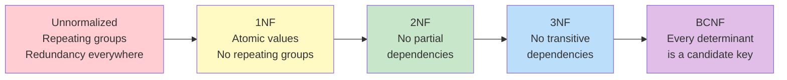
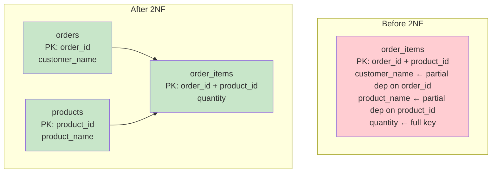
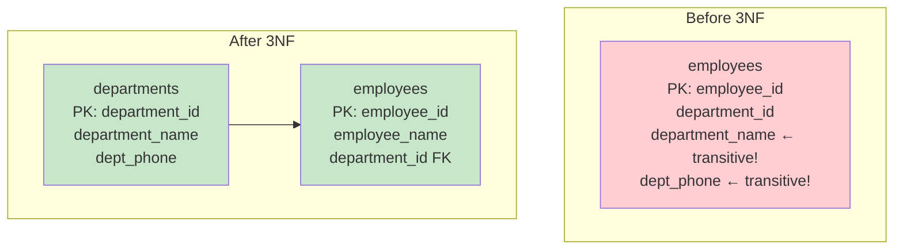

# Normalization — Fundamentals

## What is Normalization?

Normalization is the process of organizing database tables to **reduce data redundancy** and **eliminate update anomalies**. It follows a series of "normal forms" (rules) that progressively eliminate different types of redundancy.



## Why Normalize?

| Problem (Unnormalized) | Solution (Normalized) |
|----------------------|---------------------|
| **Insert anomaly**: Can't add a new course without a student | Separate tables: courses independent of students |
| **Update anomaly**: Change dept phone → must update 100 rows | Dept info in one row, referenced by FK |
| **Delete anomaly**: Delete last student → lose course info | Course exists independently |
| **Redundancy**: Same address stored 50 times | Address stored once, referenced by key |

## First Normal Form (1NF)

**Rule:** Every column must contain **atomic (indivisible) values**, and there must be no repeating groups.

```sql
-- ❌ VIOLATES 1NF (multi-valued column + repeating groups):
-- | order_id | customer | products              | quantities  |
-- | 1001     | Alice    | Widget, Gadget, Bolt  | 2, 1, 5    |

-- ✅ 1NF (atomic values, one fact per row):
CREATE TABLE order_items (
    order_id      INT,
    customer_name VARCHAR(100),
    product       VARCHAR(100),
    quantity      INT,
    PRIMARY KEY (order_id, product)
);

-- | order_id | customer_name | product | quantity |
-- | 1001     | Alice         | Widget  | 2        |
-- | 1001     | Alice         | Gadget  | 1        |
-- | 1001     | Alice         | Bolt    | 5        |
```

**1NF checklist:**
- ✅ Each column has a single value (no lists, no arrays)
- ✅ Each row is unique (has a primary key)
- ✅ No repeating groups of columns (product1, product2, product3...)

## Second Normal Form (2NF)

**Rule:** Must be in 1NF AND every non-key attribute must depend on the **entire** primary key (no partial dependencies).

Only applies when you have a **composite primary key**.

```sql
-- ❌ VIOLATES 2NF:
-- PK = (order_id, product_id)
-- | order_id | product_id | customer_name | product_name | quantity |
-- customer_name depends only on order_id (PARTIAL dependency!)
-- product_name depends only on product_id (PARTIAL dependency!)

-- ✅ 2NF (split into tables where each attribute depends on FULL key):
CREATE TABLE orders (
    order_id      INT PRIMARY KEY,
    customer_name VARCHAR(100)       -- Depends on order_id (full key)
);

CREATE TABLE products (
    product_id    INT PRIMARY KEY,
    product_name  VARCHAR(100)       -- Depends on product_id (full key)
);

CREATE TABLE order_items (
    order_id      INT REFERENCES orders,
    product_id    INT REFERENCES products,
    quantity      INT,               -- Depends on (order_id + product_id) = full key
    PRIMARY KEY (order_id, product_id)
);
```



## Third Normal Form (3NF)

**Rule:** Must be in 2NF AND no non-key attribute depends on another non-key attribute (no transitive dependencies).

```sql
-- ❌ VIOLATES 3NF:
-- | employee_id | department_id | department_name | dept_phone |
-- department_name and dept_phone depend on department_id (non-key!), NOT on employee_id
-- This is a TRANSITIVE dependency: employee_id → department_id → department_name

-- ✅ 3NF (remove transitive dependencies):
CREATE TABLE departments (
    department_id    INT PRIMARY KEY,
    department_name  VARCHAR(100),
    dept_phone       VARCHAR(20)
);

CREATE TABLE employees (
    employee_id      INT PRIMARY KEY,
    employee_name    VARCHAR(100),
    department_id    INT REFERENCES departments  -- FK only, no dept attributes here
);
```



## Boyce-Codd Normal Form (BCNF)

**Rule:** Must be in 3NF AND every determinant (column that determines another) must be a candidate key.

BCNF is stricter than 3NF. It matters when there are **multiple overlapping candidate keys**.

```sql
-- ❌ Violates BCNF:
-- Table: student_courses (student_id, course, professor)
-- Constraint: Each professor teaches exactly ONE course
-- Candidate keys: (student_id, course) and (student_id, professor)
-- Problem: professor → course (professor determines course, but professor alone is NOT a candidate key)

-- ✅ BCNF:
CREATE TABLE professor_courses (
    professor     VARCHAR(100) PRIMARY KEY,
    course        VARCHAR(100) NOT NULL
);

CREATE TABLE student_professors (
    student_id    INT,
    professor     VARCHAR(100) REFERENCES professor_courses,
    PRIMARY KEY (student_id, professor)
);
```

## Quick Reference: Normal Forms Summary

| Normal Form | Rule | Eliminates |
|-------------|------|-----------|
| **1NF** | Atomic values, no repeating groups | Multi-valued columns |
| **2NF** | No partial dependencies (on composite key) | Redundancy from partial key deps |
| **3NF** | No transitive dependencies | Redundancy from non-key → non-key |
| **BCNF** | Every determinant is a candidate key | Remaining anomalies from overlapping keys |

## Practical Rule: "The Key, the Whole Key, Nothing But the Key"

- **1NF**: The key (must have a key, atomic values)
- **2NF**: The whole key (every attribute depends on the FULL key)
- **3NF**: Nothing but the key (non-key attributes depend ONLY on the key, not on each other)

## When NOT to Normalize

| Scenario | Recommendation |
|----------|---------------|
| OLTP (transactional systems) | Normalize to 3NF ✓ |
| Data Warehouse (analytics) | Denormalize (star schema) |
| Reporting queries | Denormalize for speed |
| Data volume is small | Normalize (no performance concern) |
| Write-heavy workloads | Normalize (reduce update anomalies) |
| Read-heavy analytics | Denormalize (fewer JOINs) |

## Interview Tips

> **Tip 1:** "Explain normalization forms" — Use the mnemonic: "The key (1NF), the whole key (2NF), and nothing but the key (3NF), so help me Codd." 1NF=atomic values. 2NF=no partial deps on composite key. 3NF=no transitive deps through non-key columns.

> **Tip 2:** "When do you denormalize?" — Data warehouses and analytical workloads. Normalized = fewer anomalies but more JOINs. Denormalized = redundancy but faster reads. As a DE, you normalize OLTP sources and denormalize the DWH (star/snowflake schemas).

> **Tip 3:** "What's the difference between 3NF and BCNF?" — In 3NF, you can still have a non-candidate-key determinant if it's part of a candidate key. BCNF eliminates this edge case. In practice, most tables that satisfy 3NF also satisfy BCNF. The exception is when you have overlapping composite candidate keys.
